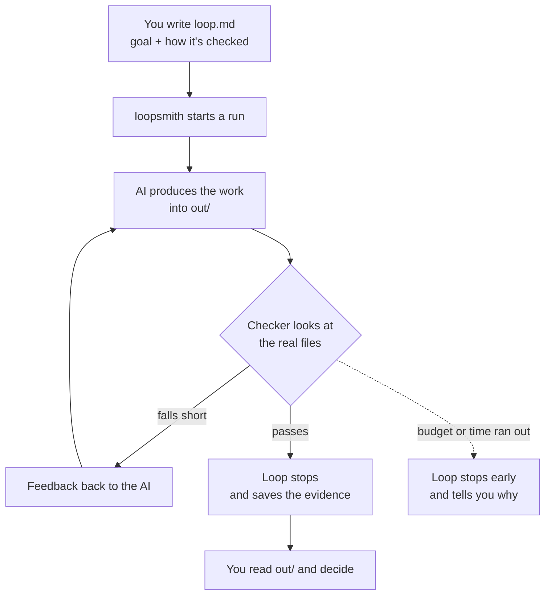
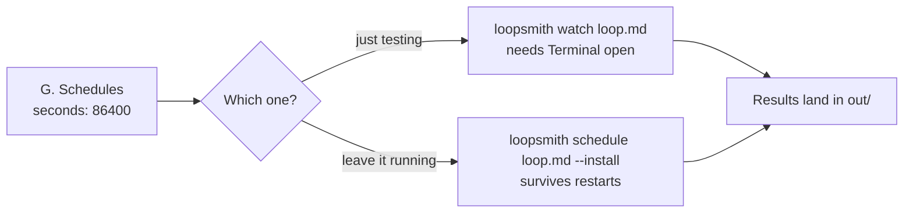

<div align="center">
  
  <h1>loopsmith, for people who don't code</h1>
  <p><em>Hand a repeating job to an AI. Let a checker — not the AI — decide when it's actually done.</em></p>
  <p><a href="#what-people-use-it-for">Uses</a> · <a href="#install-pick-one-line">Install</a> · <a href="#the-easy-way-do-it-all-in-a-browser">Browser</a> · <a href="#the-whole-idea-in-one-picture">The idea</a> · <a href="#your-first-loop-in-four-commands">First loop</a> · <a href="#the-six-things-you-edit">What to edit</a> · <a href="#put-it-on-a-schedule">Schedule</a></p>
</div>

---

You know a task that you redo every week and that you're fussy about. A weekly
competitor roundup. A lead list. A rewrite of the pricing page.

You write down two things in a plain text file: **what you want**, and **how
anyone would tell it's good**. loopsmith then puts an AI to work on it, checks
the result against your bar, sends it back if it falls short, and stops when it
passes. It can run for weeks without you.

The important part: **the AI never gets to say "done".** A separate checker
looks at the actual files and decides. That's why you can leave it alone.

You do not need to code. You edit one text file — or you don't even do that,
and use [the browser version](#the-easy-way-do-it-all-in-a-browser) instead.

---

## What people use it for

Thirteen ready-made loops you can copy. Click one and read it — it's the fastest
way to see what a loop actually looks like.

| Loop | What it's for |
|---|---|
| [research](config/examples/research-loop.md) | Answer a question, every claim cited |
| [trend-radar](config/examples/trend-radar-loop.md) | Track a topic across X, Instagram, TikTok |
| [idea-radar](config/examples/idea-radar-loop.md) | Find product ideas in real customer complaints |
| [account-watch](config/examples/account-watch-loop.md) | Watch accounts for topics about to spike |
| [blogger](config/examples/blogger-loop.md) | Write posts on trending topics, in your style |
| [traffic](config/examples/traffic-loop.md) | Post where your audience already gathers |
| [marketing-automation](config/examples/marketing-automation-loop.md) | Turn product docs into scheduled posts |
| [sales-leads](config/examples/sales-leads-loop.md) | Build a lead list from permitted sources |
| [cold-outreach](config/examples/cold-outreach-loop.md) | Personalised first contact, opt-outs enforced |
| [landing-page](config/examples/landing-page-loop.md) | Build a fast landing page that converts |
| [viral-game](config/examples/viral-game-loop.md) | Build a tiny playable game |
| [refactor](config/examples/refactor-loop.md) | Tidy up code without changing what it does |
| [x402-agent](config/examples/x402-agent-loop.md) | Let an agent pay for things, under a hard cap |

Pick the closest one to your job and start from it — it's much easier than
starting from a blank file. [Your first loop](#your-first-loop-in-four-commands)
below shows how.

---

## Install: pick one line

Open Terminal (Mac: press `⌘ + Space`, type *Terminal*). Paste **one** of these.

```bash
brew install bitphill/loopsmith/loopsmith     # Mac, easiest
```

<sub>If Homebrew answers *"Refusing to load formula … from untrusted tap"*, run
`brew trust bitphill/loopsmith` once and try again. It's Homebrew asking whether
you meant to install something that isn't from its own catalogue.</sub>

```bash
npm install -g @bitphill/loopsmith            # if you have Node
```

```bash
pip install loopsmith-cli                     # if you have Python
```

```bash
cargo install loopsmith                       # if you have Rust
```

Nothing above installed? Download the project and run the installer — it fetches
whatever it needs:

```bash
git clone https://github.com/bitphill/loopsmith.git
cd loopsmith
./install.sh          # Mac / Linux    (Windows: install.bat)
```

Check it worked:

```bash
loopsmith doctor
```

### Optional: teach Claude to do this for you

If you use Claude Code, copy the two skill folders in and Claude can build and
run loops on your behalf — you just describe what you want in English.

```bash
git clone https://github.com/bitphill/loopsmith.git
mkdir -p ~/.claude/skills
cp -r loopsmith/skills/loopsmith loopsmith/skills/loopsmith-reference ~/.claude/skills/
```

Then say to Claude: *"make me a loop that checks our competitors every morning."*

### You also need an AI to do the work

loopsmith is the manager, not the worker. It needs at least one AI it can call —
[Claude Code](https://claude.com/claude-code) is the easiest. This tells you what
you have:

```bash
loopsmith providers loop.md
```

Anything marked `available` is enough to start.

---

## The easy way: do it all in a browser

One command. It opens a tab and you fill in a form.

```bash
loopsmith --web
```

That's it. No text files, no YAML, nothing to memorise. What you get:

**It asks six short questions, not sixty.** The form is split into six steps in
the order you'd actually think about it: where it goes, what does the work, what
you want, how it's checked, how the work is arranged, and when it runs. One
screen at a time. If you ever want something that isn't in front of you, press
`Ctrl` and `K` together (`⌘K` on a Mac) and type a few letters of its name.

**It looks at your computer first.** Before you type anything, it finds the AI
tools you already have installed, the local models you've downloaded, and the
keys you've already set. Anything it finds becomes a button — click it and that
part is configured.

**You never type a folder path.** Click the small folder button and your normal
"choose a folder" window opens, the same one every other program on your
computer uses.

**Every single box is explained.** Under each one is a plain sentence saying what
it's for. Next to the ones where the honest advice isn't obvious, there's an ⓘ
that tells you *why the box exists* and what goes wrong if you get it wrong. You
are not expected to know any of this in advance.

**Thirteen finished loops, one click each.** Down the left is the same list from
[the table above](#what-people-use-it-for). Click **Load** on the closest one and
every box fills in with a real working answer. Change the bits that are about
your job. This is far easier than starting from nothing, and it's the fastest way
to understand what a loop actually is.

**It tells you what a run would cost — before you run it.** The panel on the
right updates as you type. It shows what's still wrong, what the job could cost
at the limits you've set, and says **unbounded** in plain language if you haven't
set any. Believe it when it does.

**Nothing happens until you press a button.** Filling in the form changes
nothing. There's a **Dry run** that walks through the entire job without calling
an AI or spending a penny — use it as much as you like. The buttons that do cost
money say so and ask first.

**Your API keys never go in a file.** Paste one in and it's saved to your
computer the way your other programs expect, or into your Mac's Keychain if you
prefer. The loop file only ever records the *name* of the key, never the key.

Two things worth knowing:

- It only listens on your own machine. Nobody else can reach it, not even on your
  own wifi.
- Leave the terminal window open while you use it. Closing it stops the server.
  Press `Ctrl` and `C` together when you're finished.

If port 3000 is already busy it quietly uses 3001, and tells you which one.

---

## The whole idea in one picture

```
  YOU                    loopsmith                   YOUR FOLDER
   │                         │                            │
   │  loop.md                │                            │
   │  · what I want          │                            │
   │  · how to check it      │                            │
   ├────────────────────────▶│                            │
   │                         │   AI does the work  ──────▶│  out/result.md
   │                         │                            │
   │                         │   checker reads the folder │
   │                         │◀───────────────────────────┤
   │                  ┌──────┴──────┐                     │
   │                  │  passes?    │                     │
   │                  └──┬───────┬──┘                     │
   │                 no  │       │  yes                   │
   │            ┌────────┘       └────────┐               │
   │            │ send it back            ▼               │
   │            └──────▶ try again      STOP              │
   │                                     │                │
   │◀────────────────────────────────────┘                │
   │   "done — here is the evidence"                      │
```

Same thing, as a flow:



The AI is only ever on the left of that diamond. It cannot mark its own homework.

---

## Your first loop in four commands

**1. Grab the ready-made loop closest to your job** (swap in any name from the
table above):

```bash
curl -O https://raw.githubusercontent.com/bitphill/loopsmith/main/config/examples/trend-radar-loop.md
```

**2. Make it yours, in a brand-new folder:**

```bash
loopsmith new --path ~/loops/my-radar --config-file trend-radar-loop.md
```

You now have `~/loops/my-radar/loop.md`. **That one file is everything you
edit.** Open it in any text editor — it's plain Markdown.

**3. Edit it** (the next section lists exactly what to change), then check your
work:

```bash
cd ~/loops/my-radar
loopsmith validate loop.md
```

**4. Run it:**

```bash
./run.sh
```

> `validate` will **refuse** until you've done the task by hand once and ticked
> it off. That refusal is on purpose. If you can't describe the job precisely,
> the loop will produce fast, confident garbage.

<details>
<summary>Starting from nothing instead of from an example</summary>

```bash
loopsmith new --path ~/loops/my-first-loop --purpose "weekly competitor roundup"
cd ~/loops/my-first-loop
loopsmith convert loop.yaml -o loop.md
```

The `convert` line turns the settings into the Markdown you'll edit. In this
case ignore `run.sh` and start the loop with `loopsmith run loop.md`.

</details>

---

## The six things you edit

Open `loop.md`. It has lettered sections. You only touch these six — leave the
rest exactly as it is.


### B. Pre-execution — prove you've done it once

Do the task manually, once. Then change every `false` to `true`:

```markdown
### Run this task manually end to end at least once
- done: true
- evidence: Notes in my-first-run.md
```

### C. Goals — what you actually want

```markdown
### primary
- description: A one-page roundup of what our three competitors shipped this week, with links.
```

Write it the way you'd brief a new hire. Specific beats short.

### D. Validations — how anyone would tell it's good

This is the part that makes loopsmith worth using. Two kinds you'll ever need:

**Does the file exist?**

```markdown
### artifact-exists
- target: primary
- mode: objective
- statement: The roundup exists and is not empty.
- detector:
  - type: file_exists
  - path: out/result.md
  - non_empty: true
- blocking: true
```

**Is it up to your standard?** A second AI checks the work against a standard
you name — and it is never the same AI that wrote it.

```markdown
### reads-well
- target: overall
- mode: subjective
- statement: Every competitor claim links to a source from the last seven days.
- detector:
  - type: judge
  - standard: "no claim without a dated link; no filler paragraphs"
- blocking: true
```

`blocking: true` means the loop is not allowed to finish until this passes.

> **Do this one thing.** Search `loop.md` for `type: script`. Every check with
> that line needs a programmer to write a script file first, and the file isn't
> there. **Delete each of those blocks** — from its `###` heading down to its
> `blocking:` line — and make sure at least one `judge` check is left with
> `- target: overall`. That's the whole difference between a loop that runs and
> one that fails on step one.

### F. Stop gates — your safety net

```markdown
- max_cost_usd: 5.0
- max_iterations: 8
- max_wall_clock_seconds: 3600
```

Money, attempts, time. Whichever runs out first stops the loop. **Always set
`max_cost_usd`.**

### G. Schedules — how often it should run

```markdown
### interval
- seconds: 86400
```

`3600` = hourly · `86400` = daily · `604800` = weekly.

### H. Constraints — what it must ask you about first

```markdown
- human_checkpoint: ["publishing anything","sending a message","deleting data"]
```

Anything on this list stops and waits for you. Keep publishing and sending on it
until you trust the output.

Save the file, then run `loopsmith validate loop.md` again. `ok: loop.md is valid`
means you're ready.

---

## Put it on a schedule

Set the interval in section **G**, then pick one:

```bash
loopsmith watch loop.md
```

Runs on your schedule while that Terminal window stays open. Good for trying it out.

```bash
loopsmith schedule loop.md --install
```

Hands the schedule to your computer. It keeps running after you close Terminal
and after you restart. This is the hands-off one.



---

## While it runs

| You want to know | Type this |
|---|---|
| Is it done? | `loopsmith status loop.md <run-id>` |
| What happened? | `loopsmith ledger loop.md <run-id>` |
| Why did it stop? | open the newest file in `logs/` |
| What does it want changed? | `loopsmith proposals loop.md <run-id>` |
| It died halfway | `loopsmith resume loop.md <run-id>` |

The run id is printed at the end of every run.

Results appear in **`out/`**. When a loop meets your bar, a `<name>-success/`
folder appears next to it holding the work and the proof it passed.

The loop can suggest changes to its own goals, but it can never apply them.
Those land in `proposals/` for you to read.

---

## When something goes wrong

| Message | What it means |
|---|---|
| `pre_execution: 2 step(s) not marked done` | Section **B** — do it by hand, set `done: true` |
| `no overall validation` | One check in **D** needs `- target: overall` |
| `unavailable  command not found` | That AI isn't installed. Run `loopsmith providers loop.md` and use one marked `available` |
| Loop stops with nothing in `out/` | Check `logs/` — usually a budget in **F** ran out |

Stuck? [Open an issue](https://github.com/bitphill/loopsmith/issues) and paste
what the terminal said.

---

## If you get curious later

Optional. None of it is needed to run a loop.

- [README.md](README.md) — the short version for developers
- [HOW-TO-USE.md](HOW-TO-USE.md) — every section explained, one by one
- [LOOP-TEMPLATE.md](LOOP-TEMPLATE.md) — a blank loop with notes in every slot
- [README-DETAIL.md](README-DETAIL.md) — how it's built, and why
- [Code wiki](https://bitphill.github.io/loopsmith/wiki/#overview) — an auto-generated tour of the code, for the
  developer you hand this to
- [CHANGELOG.md](CHANGELOG.md) — what changed in each release
- [loops-engineering-cheat-sheet.md](loops-engineering-cheat-sheet.md) — the thinking behind loops
- [config/loop.schema.json](config/loop.schema.json) — every setting that exists
- [skills/loopsmith/SKILL.md](skills/loopsmith/SKILL.md) — the Claude skill for running loops
- [skills/loopsmith-reference/SKILL.md](skills/loopsmith-reference/SKILL.md) — the Claude skill for designing them

MIT licensed. See [LICENSE](LICENSE).
