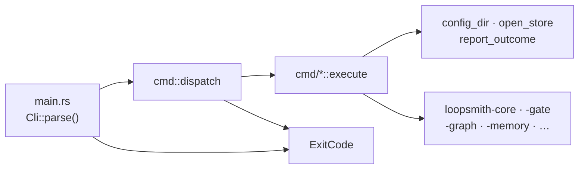
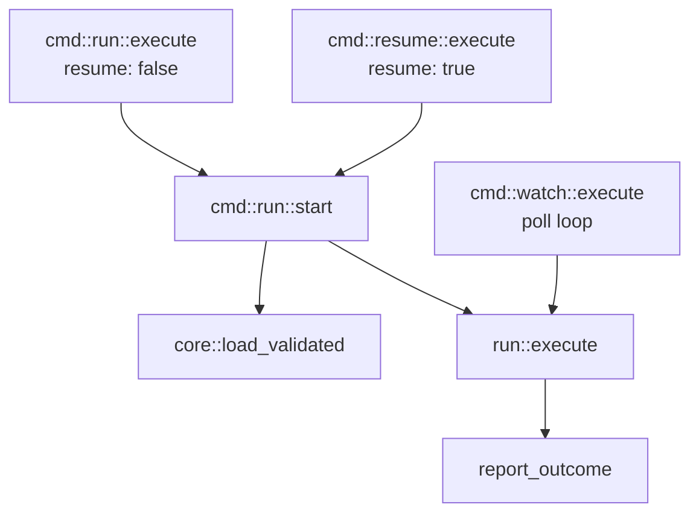

# CLI Command Surface

# CLI Command Surface

The `loopsmith` binary crate (`runtime/crates/loopsmith-cli`, package name **`loopsmith`**, not `loopsmith-cli` — so `cargo install loopsmith` matches the command it installs). Everything a user can type lives here; everything a user can't type lives in the eight workspace libraries this crate depends on.

The design rule for the whole module: **this crate parses, routes, prints, and decides exit codes. It does not decide anything else.** Config semantics live in `loopsmith-core`, scheduling math in `loopsmith-graph`, verdicts in `loopsmith-gate`. When a command body grows a decision that another crate should own, that's the smell to act on.

## Layout

| File | Responsibility |
|---|---|
| `src/main.rs` | Entry point. Parses, dispatches, prints `error: {e}` to stderr, returns an `ExitCode`. Nothing else. |
| `src/cli.rs` | The clap grammar — `Cli`, `Command`, `SkillsAction`. No command bodies. |
| `src/cmd/mod.rs` | `dispatch()` plus the four helpers every command shares. |
| `src/cmd/*.rs` | One module per subcommand, each exposing `execute(...)`. |
| `src/scaffold.rs` | `loopsmith new`'s file materialisation, path guards, and generated launchers. |
| `src/logging.rs` | The plain-text run log and the `Recorder` that keeps it in sync with the sled ledger. |
| `src/run/`, `src/schedule.rs`, `src/worktree.rs`, `src/permissions.rs`, `src/judgment.rs` | Supporting machinery the command bodies call into. |

The split between `main.rs` and `cli.rs` is deliberate and worth preserving: the argument grammar for sixteen commands is readable in one sitting only if no command bodies are interleaved with it.

## The three layers



`dispatch` is one flat `match` over `Command`. It destructures the clap variant and hands the fields to the module's `execute`; `Command::Skills` nests a second match over `SkillsAction`. There is no trait, no registry, and no dynamic dispatch — adding a command means adding a variant and a match arm, and the compiler tells you if you forgot the second one.

## The command contract

Every command body returns `Result<ExitCode, String>` and **never calls `std::process::exit`**. Two consequences:

- A command is callable from a test without tearing down the process.
- Exit codes are decided in exactly one place — the `match` in `main`, where `Err` becomes `ExitCode::FAILURE` after printing `error: {e}`.

Exit semantics differ per command and are load-bearing for anyone scripting around them:

| Command | Non-zero when |
|---|---|
| `run`, `resume` | `!out.stop.is_success()` — via `cmd::run::exit_code`, so a scheduler or CI step notices without parsing output |
| `gate` | the verdict is not satisfied |
| `validate` | `report.has_errors()`, or `--strict` and any warnings |
| `skills install` | any section-J spec failed to install |
| `doctor` | **never.** Advisory by design — reporting a constraint is not the same as the machine being unusable, and a non-zero exit here would fail a CI step that was working fine |
| everything else | only on `Err` |

## Shared helpers (`cmd/mod.rs`)

Four functions, each solving a problem that bit once:

- **`config_dir(config) -> PathBuf`** — the directory holding the config. `Path::parent()` returns `Some("")` for a bare `loop.yaml`, and an empty path isn't a usable working directory (spawning into it fails with ENOENT), so this normalises to `.`. This is the loop root for every purpose: state, logs, worktrees, detector resolution.
- **`config_file_name(config) -> String`** — just the file name, for the generated scripts. They `cd` into the loop directory first, so a relative name is what they want.
- **`open_store(config)`** — opens the sled store at `config_dir(config)/state`. Every command that reads persisted state goes through this rather than joining `state` by hand.
- **`report_outcome(&RunOutcome)`** — the end-of-run block: run id, iteration count, `stop.describe()`, spend (marked `(estimated: no provider reported usage)` when no provider reported), proposal count, a per-target `SATISFIED`/`not satisfied` table, the log path, the export path, and — when the run didn't meet its bar — the exact `loopsmith ledger <config> <run-id>` line to type next. Shared by `run`, `resume`, and `watch` so all three read identically.

## Command groups

### Scaffolding — `new`

`cmd/new.rs` is thin; `scaffold.rs` does the work. The flag surface exists to make the command scriptable: `--config-file`, `--config-stdin` (mutually exclusive, enforced by both clap's `conflicts_with` and `read_provided`), and `--markdown` to force the stdin grammar. **Nothing in this path blocks on a prompt** — a command that waits for a keypress cannot be run from a Makefile or from the agent setting the loop up for you.

`read_provided` picks the grammar from the file's own extension via `loopsmith_core::is_markdown`, never from content: a stray `#` heading silently reinterpreting someone's YAML is a worse failure than a wrong extension.

The success output branches on `Os::detect().is_windows()` twice — once for `set` vs `export` in the key-export hint, once to name `run.cmd`/`resume.cmd` rather than `run.sh`/`resume.sh`. Both branches are cheap and both are the difference between a first-run instruction that works and one that sends the reader to a file their shell can't execute. Paths are printed with `args.path.join(run).display()`, not interpolated with a `/`, so the separator is the host's.

### Inspection — `validate`, `convert`, `plan`, `providers`, `permissions`

Pure reads. `plan` loads the config, calls `loopsmith_graph::plan`, and prints waves, critical path, total cost, parallel fraction `p`, chosen concurrency, and predicted speedup against the infinite-worker ceiling — then calls `loopsmith_graph::unisolated_parallel_writers` and warns about builder nodes that may run concurrently without worktree isolation. `providers` maps each declared provider through `loopsmith_provider::availability` and prints either the command or `av.why_not()`.

### Execution — `run`, `resume`, `watch`

All three converge on `crate::run::execute` with a `RunOptions`:



`cmd::run::start` is the shared body — load *validated* (not just loaded), open the store, execute, report. `resume` is the same operation with a different starting checkpoint, which is why it is four lines. Run ids default to `run-{now_ms}`.

`watch` is the command that makes a loop live for weeks:

- It refuses up front if `schedules` is empty or entirely `Trigger::Manual` — that watcher would sleep forever, and saying so beats hanging.
- Poll cadence comes from `schedule::poll_interval(&cfg.schedules)`; cron is matched in UTC, and the banner says so.
- The `Watcher` is constructed with `Watcher::ignoring(vec![format!("{}-success", cfg.name)])`. Without that, a run meeting its bar writes the success export into the loop directory, a `file_change` trigger sees it, and the loop restarts itself forever.
- Goal state is re-read from the store on every poll rather than cached, so a `goal_satisfied` trigger notices a run started elsewhere.
- **A failed run must not kill the watcher** — the `Err` arm prints `run failed: {e}` and continues. That is the difference between a scheduler and a one-shot.

### Observation — `status`, `ledger`, `proposals`, `gate`

`status` prints the gate's current rulings plus the checkpoint iteration. `ledger` tails the append-only entries, `--limit` applied with `saturating_sub` so a short ledger doesn't panic.

`gate` evaluates once against a working tree using `run::collect_evidence(&cfg, workdir, Some(workdir.join("metrics.json")), vec![])` — the empty judgment vector is the point: a one-shot check has no judge run behind it, so subjective checks correctly report that no judgment was recorded rather than silently passing.

`proposals` reports staleness but **never deletes**. A proposal records what the loop wanted at a moment; the moment went stale, not the record, and the record is still the only account of why the loop asked. `age()` renders coarse buckets (`just now` / `Nm ago` / `Nh ago` / `Nd ago`) because nobody has ever wanted the exact millisecond.

### Environment — `doctor`, `prune`, `mcp`

`doctor` is the module's most opinionated command. It probes rather than infers: `Platform::detect()` for OS, userland, bash version, `/bin/sh` identity, and `scheduler()`; `loopsmith_util::which` for `git`, `sh`, `sed`, `awk`, `curl`. The `sed -i` flags are rendered with empty arguments shown as `''` — that empty argument *is* the difference between the GNU and BSD invocations, and a report that hides it claims the two are the same.

Given a config, `config_notes` additionally resolves every `Detector::Script` command: a name containing `/` is joined onto the loop root, a bare name goes through `which`. Missing, non-existent, and non-executable each get their own message (the last one hands you the `chmod +x` line). Catching this here beats discovering it as a detector error on the first gate evaluation.

`prune` walks `cfg.graph.nodes` filtered to `isolated`, and uses `worktree::create(&root, &node.id, "prune")` as a *probe* — if the result matches `Isolation::Worktree { .. }` there is something to remove, so it calls `worktree::remove`.

`mcp` opens a store at `--state` (default `state`) and serves `loopsmith_mcp::Server` over locked stdin/stdout.

### Ecosystem — `skills`

Five subcommands under one `SkillsAction`. `list` filters out `~/.claude/skills` unless `--all`, since the global directory is dozens of entries and drowns the loop's own. `search` queries claudemarketplaces.com and `npx skills find`, and each source degrades to `unavailable: {e}` independently — one being down doesn't cost you the other — then closes with "Nothing was installed" and the acquire line. `acquire` and `install` both end by telling you quarantined skills wait for a human, because a sub-agent runs with whatever your permission grant allowed. `scores` ranks by gate outcomes and closes with the config's own `min_trials`: fewer than that is not evidence.

## Scaffolding internals (`scaffold.rs`)

### `guard_path` — where a loop may not go

Called first in `scaffold()`, before any directory is created. It refuses an empty path, a filesystem root, the home directory itself, and — the load-bearing one — **anywhere inside the loopsmith installation**. `install_root()` walks up from `current_exe()` looking for a directory that has both `config/loop.schema.json` and `runtime/Cargo.toml`, which covers `cargo run`, an installed `target/release` binary, and a symlink into the repo. A loop edits files, clones sub-agents, and writes state; pointing one at the checkout that runs it lets a loop modify its own runtime. The refusal message includes a working alternative (`--path ~/loops/<name>`), and a test asserts that it does.

`absolutize()` handles paths that don't exist yet — `canonicalize` first, then absolute-as-is, then joined onto the cwd.

### `binary_path` — deliberately not canonicalized

The generated launchers pin an absolute path to the binary, because cron, launchd, and Task Scheduler inherit neither a shell's `PATH` nor its working directory. But an *already-absolute* `current_exe()` is written down **unresolved**. Package managers install behind a stable symlink into a versioned directory (Homebrew: `/usr/local/bin/loopsmith` → `/usr/local/Cellar/loopsmith/0.1.2/bin/loopsmith`); resolving it pins the version, and every loop created before an upgrade gets a dead launcher the moment that Cellar directory is replaced. A *relative* `current_exe` still gets canonicalized. Both scripts also carry a PATH fallback that says exactly what happened if the pin ever goes stale.

### Generated launchers

Both flavours are written **on every platform, unconditionally**. The premise of the portability design is that a loop directory outlives the machine that made it; `cmd.exe` cannot run a `#!` script and no POSIX shell will run a `.cmd`, so the pair is the only arrangement that survives a copy.

`script_header` emits `#!/bin/sh`, not bash — macOS still ships bash 3.2.57, so anything needing bash 4 syntax fails on the most common developer machine there is. It's built from a raw string literal, not an escaped one: `\` line continuations eat the next line's leading whitespace and the script reaching disk came out flat.

`cmd_header` carries the hardest-won comment in the crate. Batch exit codes under `setlocal` have two traps:

1. The implicit `endlocal` at end-of-file **restores the errorlevel `setlocal` saved**, so a bare `exit /b 127` reports 0.
2. `endlocal & exit /b 127` fixes that at top level but not inside a nested `if ( … )` block — which is where the failing one lived.

The resolution: exactly one `exit /b` per launcher, on the last line (`CMD_FOOTER`), reached by every path. Each branch sets `CODE` and falls through to `:loopsmith_done`. `enabledelayedexpansion` and `!ERRORLEVEL!` are used because a parenthesised block is parsed as a unit before it runs, so `%ERRORLEVEL%` inside one expands to the value from before the block.

`crlf()` converts line endings on the way out: older `cmd.exe` reads a trailing `\n` as part of the last token, turning `exit /b 2` into an unknown command with no useful message.

### Templates and ordering

The four harness files are `include_str!`-compiled from `templates/` — `mcp.template.json`, `permissions.template.json`, `compat.template.sh`, `marketplaces.json`. That makes a new loop self-contained and makes it impossible for `new` to touch the checkout it was launched from. They live inside the crate rather than the repo's `config/` for a packaging reason: a published tarball holds only its own directory, so an `include_str!` reaching above the crate root compiles locally and fails `cargo package --verify`. The same constraint shapes `Cargo.toml`'s anchored `include` list — and the leading slash on `/README.md` matters, since an unanchored `README.md` would also match `tests/README.md`.

A supplied config is **parsed before anything is written**. A loop directory holding an unparseable config is worse than no directory; `an_unparseable_supplied_config_writes_no_directory_contents` locks that in.

The starter config from `starter_config()` ships with `pre_execution` steps set `done: false`, so **it deliberately fails validation as generated**. That refusal is the feature — the manual run is the spec. Two tests guard the pair: it must have errors as shipped, and must have none once every step is flipped to `done: true`.

## Run logging (`logging.rs`)

The sled ledger is durable and queryable, but you can't `tail -f` a database, and after an unattended run finishes at 4am the first thing anyone wants is a file to scroll.

`RunLog::open(root, run_id, verbose)` opens `<root>/logs/<sanitized-run-id>.log` — `logs/`, deliberately **not** `state/`, because sled owns that directory and the watcher ignores everything inside it. On failure it degrades to a no-op with `path() == None`: a full disk is a reason to lose the log, not a reason to kill a run doing useful work.

`sanitize()` maps anything outside `[A-Za-z0-9_-]` to `-` and empty to `run`. Run ids come from a timestamp today, but `--run-id` reaches here unchecked, and a path separator in a filename is how a log ends up written somewhere nobody looks. `sanitize("../../etc/passwd") == "------etc-passwd"` is a test.

`format_utc` uses the same hand-rolled `civil_from_unix` the cron matcher uses — UTC throughout, because deriving a local offset in a multithreaded process is unsound on Unix, and a scheduler quietly an hour off twice a year is worse than one honestly in UTC.

`Recorder<'a, S: Store>` bundles store + run id + log, and exposes one method, `entry(iteration, kind, detail, node_id)`, which writes to both. That single choke point is what keeps the ledger and the log from disagreeing about what happened. Newlines in `detail` are replaced with spaces so one event is always one line — `grep` and eyeballs both work, and a test asserts a multi-line detail produces exactly one line.

Callers: `run::execute`, `run::install_default_skills`, and `run::dispatch::ensure_skills`.

## Dependency direction

```
loopsmith (this crate)
  ├── loopsmith-core       config model, load / load_validated / validate / parse_str / parse_md / is_markdown
  ├── loopsmith-memory     open, SledStore, Store trait, LedgerEntry, score_skills, now_ms
  ├── loopsmith-gate       evaluate
  ├── loopsmith-graph      plan, unisolated_parallel_writers
  ├── loopsmith-provider   availability, starter_providers
  ├── loopsmith-skills     list_installed, acquire, install_default, search_marketplace, marketplace::*
  ├── loopsmith-mcp        Server
  └── loopsmith-util       which, is_executable, now_ms, platform::{Platform, Os, Userland, home_dir}, testing::*
```

Arrows point one way only. No library depends on this crate; nothing here is re-exported as an API. `loopsmith-util` is pulled in twice — once normally, once with `features = ["testing"]` under `[dev-dependencies]` for `temp_dir`, `temp_path`, and `cleanup`.

## Adding a subcommand

1. Add a variant to `Command` in `cli.rs`, with doc comments — clap renders them as the help text, and they are the primary user-facing description of the command.
2. Create `src/cmd/<name>.rs` with `pub fn execute(...) -> Result<ExitCode, String>`, and a `//!` header stating what the command is for.
3. Add `pub mod <name>;` to `cmd/mod.rs` and a match arm in `dispatch`.
4. Use `config_dir` / `open_store` rather than joining `state` yourself.
5. Decide the exit code deliberately: is a "bad" result a script-visible failure (`gate`, `validate`) or advisory (`doctor`)? Both are defensible; pick one on purpose.

## Gotchas

- **Don't add a prompt.** Several commands are explicitly designed to be runnable from a script, a Makefile, or an agent. Interactivity would break that silently.
- **`load` vs `load_validated`.** Inspection commands (`plan`, `gate`, `providers`, `prune`, `skills *`, `doctor`) use `load`; anything that starts a run (`run`, `resume`, `watch`) uses `load_validated`. Don't cross the streams — validating in `doctor` would make a diagnostic command refuse to diagnose a broken config, which is when you need it most.
- **Path joins use components, not slash literals.** `Path::new(".claude").join("skills")`, not `".claude/skills"`. A forward slash inside a `join` is a path on Unix and a filename component that merely happens to work on Windows, and the two stop agreeing the moment the name goes anywhere but `create_dir_all`.
- **Secrets never enter this crate's data flow.** `requires_env` names variables that must *exist*; loopsmith never reads their values, so a key cannot reach a prompt, a log, or the ledger. Keep it that way — let the provider command expand them itself.
- **Section-count drift in help text.** `cli.rs`'s help for `validate` and `cmd/validate.rs`'s doc comment both say "the A–H model", while the README, `new`'s output, and the generated per-loop README say A–J. The model has ten sections; the two `validate` strings are stale and are what a user sees in `--help`.