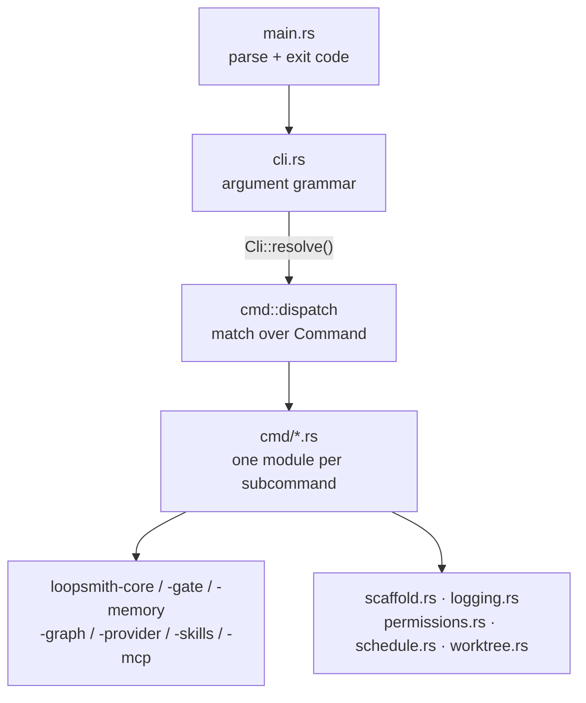

# CLI Command Surface

I'll write the documentation directly — no exploration needed, the source is in front of me.

# CLI Command Surface

The `loopsmith` binary. This crate is the only executable in the workspace; every other crate is a library it links. Its job is argument parsing, dispatch, and presentation — the actual work (validation, planning, gating, provider routing, memory) lives in the eight `loopsmith-*` libraries it depends on.

The package is named `loopsmith`, not `loopsmith-cli`, so `cargo install loopsmith` matches the command it installs. The directory keeps the older name; cargo does not care.

## The shape of the thing

Four layers, each with a single responsibility:



`main.rs` is three lines of logic:

```rust
let result = cli::Cli::parse().resolve().and_then(cmd::dispatch);
```

Everything that can fail returns `Result<ExitCode, String>` rather than calling `std::process::exit`. That is what makes a command testable, and it means the exit code is decided in exactly one place — the `match` at the bottom of `main`.

## `cli.rs` — the grammar, and nothing else

The argument grammar is deliberately separated from the command bodies so it can be read in one sitting. `Cli` carries two global flags and an optional subcommand:

| Field | Purpose |
|---|---|
| `web: bool` | `loopsmith --web` |
| `guided: bool` | `loopsmith --guided` |
| `command: Option<Command>` | everything else |

### `Cli::resolve` — collapsing two spellings into one

`--web` and the `web` subcommand mean the same thing; so do `--guided` and `guided`. Both spellings exist because a flag is what people reach for and a subcommand is what the rest of the grammar looks like. Rather than teaching `dispatch` about that, `resolve` normalises the pair into a single `Command` before dispatch ever sees it:

```rust
pub fn resolve(self) -> Result<Command, String>
```

It is a total match over `(web, guided, command)`, and every rejected combination gets its own message:

- `--web --guided` → two front ends for the same thing; picking one would guess wrong half the time.
- `--web run loop.yaml` → a contradiction, not a shorthand. Refused rather than silently resolved.
- nothing at all → names `--help`, `guided`, and `web` instead of clap's generic complaint.

Because `resolve` returns `Result<_, String>` and `dispatch` returns `Result<ExitCode, String>`, the two chain with `and_then` and share one error path.

## `cmd/mod.rs` — dispatch and the shared helpers

`dispatch(command: Command) -> Result<ExitCode, String>` is a pure match that destructures each variant and hands the fields to that command's `execute`. `Command::Skills` nests one level further into `SkillsAction`.

Four helpers are shared across command modules:

**`config_dir(config: &Path) -> PathBuf`** — the directory holding the config. `Path::parent()` returns `Some("")` for a bare `loop.yaml`, and an empty path is not a usable working directory (spawning into it fails with ENOENT), so this normalises to `.`. Nearly every command that touches the filesystem or spawns a process routes through it.

**`config_file_name(config: &Path) -> String`** — the config's own file name, for generated scripts that `cd` into the loop directory first and therefore want a relative name.

**`open_store(config: &Path)`** — opens the sled store at `<config_dir>/state`. Used by `status`, `ledger`, `proposals`, `watch`, and `skills scores`.

**`report_outcome(out: &RunOutcome)`** — the end-of-run summary shared by `run`, `resume`, and `watch`: run id, iteration count, stop reason, spend (flagged as estimated when no provider reported usage), proposal count, per-target verdicts, log path, and the export path when a run converged. When `out.stop.is_success()` is false it prints the `loopsmith ledger` invocation for that run id, because the ledger is where the failure is legible.

### The `web` feature

`web` is a default feature gating `axum` and `tokio` — the whole async tree. Dispatch handles its absence explicitly rather than dropping the variant:

```rust
#[cfg(not(feature = "web"))]
Command::Web { .. } => Err("this build has no web UI. Rebuild with the `web` feature: …")
```

A command that exists in `--help` but errors with build instructions beats one that vanishes.

## The commands

Each lives in `cmd/<name>.rs` with a single `execute`. Grouped by what they do:

### Authoring

| Command | Module | Notes |
|---|---|---|
| `new --path <dir>` | `new.rs` → `scaffold.rs` | `--path` is mandatory; a loop owns durable state |
| `guided` / `--guided` | `guided/` | terminal wizard, `--edit <file>` to walk an existing config |
| `web` / `--web` | `web/` (feature-gated) | localhost-only browser UI |
| `validate <config>` | `validate.rs` | `--strict` promotes warnings to errors |
| `convert <config>` | `convert.rs` | YAML ⇄ Markdown, same model either way |

`new` never blocks on a prompt. A command that waits for a keypress cannot be run from a script, a Makefile, or the agent setting the loop up for you — so a complete config arrives via `--config-file` or `--config-stdin`, parsed by `read_provided` before anything is written. With `--config-file`, the file's extension picks the grammar (`loopsmith_core::is_markdown`); guessing from content would let a stray `#` reinterpret someone's YAML.

### Inspection

`plan` prints waves, critical path cost, parallel fraction `p`, chosen concurrency, and the Amdahl speedup ceiling from `loopsmith_graph::plan`, then warns about `unisolated_parallel_writers` — builder nodes that may run in the same wave without worktree isolation.

`status` prints the gate's recorded rulings per target plus the checkpoint iteration. `ledger` tails the append-only entries (`--limit`, default 50, applied with `saturating_sub`). `proposals` prints what the loop wants changed about itself, with a coarse `age()` rendering — nobody asks which millisecond a proposal was written — and marks expired ones stale without deleting them; the record is still the only account of why the loop asked.

`gate` evaluates once against the working tree. It calls `run::collect_evidence` with an empty judgment vector, so subjective checks correctly report that no judgment was recorded. It exits non-zero when the target is not satisfied.

`providers` reports per-provider availability via `loopsmith_provider::availability`, showing the command when reachable and `why_not()` when not.

`doctor` is the environment probe, and the one command whose output is purely advisory — it always exits `SUCCESS`, because reporting a constraint is not the same as the machine being unusable and a non-zero exit would fail an otherwise-fine CI step. It reports OS, userland (with the literal `sed` in-place flags, rendering the empty BSD argument as `''` because that *is* the difference between the two), bash version, `/bin/sh`, the scheduler actually on `PATH`, and five tools. Given a config it also runs `config_notes`, which walks script detectors and checks each command exists and is executable — a detector runs with no shell, so `command` is argv[0] and a relative path resolves against the loop directory.

### Execution

`run` and `resume` are the same operation with a different starting checkpoint, and share `cmd::run::start`:

```rust
pub fn start(config: &Path, opts: RunOptions) -> Result<RunOutcome, String> {
    let cfg = loopsmith_core::load_validated(config)?;
    let store = open_store(config)?;
    let out = crate::run::execute(&cfg, &store, &opts)?;
    report_outcome(&out);
    Ok(out)
}
```

`resume` differs only in setting `resume: true` and forcing `dry_run: false`. `exit_code` maps a run that did not meet its bar to `ExitCode::FAILURE`, so a scheduler or CI step notices without parsing output. Run ids default to `run-<now_ms>`.

`watch` stays resident. It refuses upfront if every trigger is `Manual` — `watch` would otherwise sleep forever — then polls at `schedule::poll_interval`, reading goal state fresh each tick so a `goal_satisfied` trigger sees runs started elsewhere. Two details carry weight:

- The `Watcher` is constructed `ignoring` `<name>-success`, the success export directory. A `file_change` trigger on the loop root would otherwise see the export and start a run that writes it again.
- A failed run is printed to stderr and the loop continues. That is precisely the difference between a scheduler and a one-shot.

`schedule` writes the launchd agent or crontab line; installing it is a persistent change to the machine and stays the user's call.

### Skills

`cmd/skills.rs` holds five entry points rather than one `execute`: `list`, `search`, `acquire`, `install`, `scores`.

`list` defaults to loop-local skills, filtering out anything under `$HOME/.claude/skills` unless `--all` — the global directory is dozens of entries and drowns the signal. `search` queries both claudemarketplaces.com and `npx skills find`, treats either being unavailable as a printed note rather than an error, and installs nothing. `install` materialises section J on demand and returns `FAILURE` if any spec failed. `scores` ranks sub-agents by the gate outcomes that followed their use, and closes by naming `cfg.skills.min_trials` — one lucky run proves nothing.

Everything acquired lands quarantined. Both `acquire` and `install` say so explicitly: a sub-agent runs with whatever your permission grant allowed.

### Plumbing

`permissions` prints or merges the consolidated grant. `prune` removes the git worktrees the loop created, probing each `isolated` node through `worktree::create`/`remove`. `mcp` serves `loopsmith_mcp::Server` over stdio.

## `scaffold.rs` — what `loopsmith new` materialises

The largest local module, and the one with the most environmental reasoning baked in.

`scaffold(&NewLoopArgs) -> io::Result<Scaffold>` writes the config, `.gitignore`, README, MCP definition, `marketplaces.json`, the permission grant (via `crate::permissions::required` and `merge_into`), all four launchers, and `scripts/compat.sh`. It returns which files were written, which config file name was used, and `Option<Result<(), String>>` for git — `None` when not asked for, `Some(Err)` when asked for and impossible, never fatal.

**`guard_path`** runs first and refuses an empty path, a filesystem root, the home directory, and — the load-bearing one — anything inside the loopsmith installation. A loop edits files, installs sub-agents, and writes state; pointing one at the checkout that runs it lets a loop modify its own runtime. `install_root()` finds that checkout by walking up from `current_exe` looking for `config/loop.schema.json` and `runtime/Cargo.toml` together, which covers `cargo run`, an installed release binary, and a symlink into the repo. The refusal suggests a working alternative (`--path ~/loops/<name>`) rather than just saying no.

**A supplied config is parsed before it is written.** A new loop directory holding an unparseable config is worse than no directory, so `parse_str`/`parse_md` runs first and an error aborts before anything lands.

**`binary_path()` is deliberately not canonicalized when already absolute.** Package managers install behind a stable symlink into a versioned directory — Homebrew's `/usr/local/bin/loopsmith` points into `/usr/local/Cellar/loopsmith/<version>/`. Resolving the symlink pins the version, so every loop created before an upgrade gets a dead path in its launcher. The symlink is the durable answer. A *relative* `current_exe` still gets canonicalized, because cron and launchd inherit neither a working directory nor a `PATH`.

**Both launcher flavours are written on every platform.** `run.sh`/`resume.sh` are POSIX `sh` — not bash — because macOS still ships bash 3.2.57 and bash-4 syntax fails there. `run.cmd`/`resume.cmd` are written with CRLF (`crlf()`), because older `cmd.exe` reads a trailing `\n` as part of the last token, turning `exit /b 2` into an unknown command. A loop directory outlives the machine that made it, so a loop scaffolded on a Mac has to start on Windows without regeneration; `cmd.exe` cannot run a shebang and no POSIX shell will run a `.cmd`, so the pair is the only arrangement that survives the copy.

**The `.cmd` launchers have exactly one `exit /b`, on the last line.** This is worth understanding before editing them. `setlocal` saves the errorlevel and the implicit `endlocal` at end-of-file *restores* it, so a bare `exit /b 127` reports 0. `endlocal & exit /b 127` fixes that at top level but not inside a nested `if ( … )` block — which is where the failing path lived. So every path sets `CODE` and falls through to `:loopsmith_done`. Relatedly, the header uses `enabledelayedexpansion` and `!ERRORLEVEL!`: a parenthesised block is parsed as a unit, so `%ERRORLEVEL%` inside one expands to the value from before the block.

**Templates are compiled in** with `include_str!` from `templates/`, not read from the install directory. That is what makes a new loop self-contained and makes it impossible for `new` to depend on — or touch — the checkout it was launched from. They live inside the crate rather than the repo's `config/` for a packaging reason: a published tarball holds only its own directory, so an `include_str!` reaching above the crate root compiles locally and fails `cargo package --verify`. The same constraint drives the `include` list in `Cargo.toml`, including why the compiled web UI sits under `src/web/dist/`.

`init_git` runs last so the initial commit captures the whole scaffold. The commit is not optional: `git worktree add` resolves a start point and a repository with no HEAD has none, so an uncommitted repo fails as unhelpfully as no repo. Identity is passed inline with `-c user.email=…` rather than written to the repo config — a machine with no `user.email` would fail the commit, and silently editing someone's git identity to scaffold a loop is not a trade anyone agreed to. An existing `.git` is left alone.

## `logging.rs` — the run log

The sled ledger is the durable, queryable record, but it is a database: you cannot `tail -f` it, and after an unattended run finishes at 4am the first thing anyone wants is a file to scroll.

`Recorder<'a, S: Store>` bundles store, run id, and `RunLog`. Its single `entry()` method builds a `LedgerEntry` and writes it to *both* — one method that records an event means the log and the ledger cannot disagree about what happened. `crate::run::execute`, `run::dispatch::ensure_skills`, and `install_default_skills` all record through it.

Logs land in `<loop>/logs/`, deliberately not `<loop>/state/`: sled owns that directory, and the watcher ignores everything inside it. Three things are load-bearing:

- **Failures are swallowed.** `RunLog::open` degrades to a no-op when the directory cannot be created. A full disk is a reason to lose the log, not to kill a run doing useful work.
- **`sanitize()` on the run id.** Ids come from a timestamp today, but `--run-id` reaches this unchecked, and a path separator in a filename is how a log ends up somewhere nobody looks. `../../etc/passwd` becomes `------etc-passwd`.
- **Newlines are replaced with spaces** in `write`, so one entry is always one line — `grep` and eyeballs both work.

`format_utc` reuses `schedule::civil_from_unix`, the same hand-rolled civil-date arithmetic the cron matcher uses. UTC throughout, for the reason documented on the scheduler: deriving a local offset is unsound in a multithreaded process on Unix, and a scheduler quietly an hour off twice a year is worse than one honestly in UTC.

## Contributing

**Adding a subcommand** touches three places: a variant on `Command` in `cli.rs` (doc comment becomes the help text), a `pub mod` plus a `dispatch` arm in `cmd/mod.rs`, and a new `cmd/<name>.rs` exposing `execute(…) -> Result<ExitCode, String>`.

Conventions worth keeping:

- Return `Result<ExitCode, String>`; never `exit()`. One exit path, in `main`.
- Reach for `config_dir`, `config_file_name`, and `open_store` rather than re-deriving paths.
- Decide the exit code deliberately. `gate` and `validate` fail on a bad verdict; `run` fails when the bar was not met; `doctor` never fails.
- `load` vs `load_validated`: read-only inspection commands use `loopsmith_core::load`; anything that will *execute* the loop uses `load_validated` (`run`, `resume`, `watch`).
- Prose in output is part of the interface. Messages here say what to do next, not just what went wrong — the refusal in `guard_path` and the ledger hint in `report_outcome` are the pattern.

Tests live beside the code in `#[cfg(test)]` modules and use `loopsmith_util::testing::{temp_dir, temp_path, cleanup}` (`loopsmith-util` with the `testing` feature is a dev-dependency). Tests that need git return early when `loopsmith_util::which("git")` is `None`. Two in `scaffold.rs` are worth preserving verbatim: `creating_a_loop_leaves_the_loopsmith_installation_untouched` fingerprints `config/` and `skills/` before and after a scaffold, and `the_starter_config_validates_once_pre_execution_is_marked_done` asserts the starter config *fails* validation as shipped — the refusal to run before the manual pass is done is a feature, not a gap.