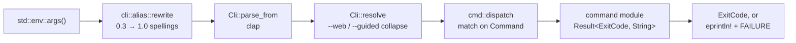

# CLI Command Surface

# CLI Command Surface (`loopsmith-cli`)

The crate that publishes as **`loopsmith`** and builds the `loopsmith` binary. Nothing here runs a loop, evaluates a gate, or decides a verdict — those live in `loopsmith-run`, `loopsmith-gate`, and `loopsmith-core`. This crate owns exactly three things:

1. **The argument grammar** — what you can type and what it means (`src/cli/`).
2. **The command bodies** — one module per action, each of which loads a config, calls into a library crate, and prints (`src/cmd/`).
3. **Loop scaffolding** — materialising a new loop directory, launchers and all (`src/scaffold.rs`, `src/guided.rs`).

A useful mental model: this crate is a *translator*. Argv comes in, a `Command` enum comes out, a library crate does the work, and an `ExitCode` goes back to the shell. Every design decision below follows from keeping those four stages separate.

## Layout

| Path | Job |
|---|---|
| `src/main.rs` | Entry point only — 38 lines, no command logic |
| `src/cli/mod.rs` | The clap grammar: `Cli`, `Command`, and the four action enums |
| `src/cli/alias.rs` | The 0.3 → 1.0 spelling table, applied before clap |
| `src/cmd/mod.rs` | `dispatch`, the two noun routers, and four shared helpers |
| `src/cmd/*.rs` | One module per leaf action |
| `src/scaffold.rs` | `loopsmith loop new`'s filesystem work, shared with the wizard |
| `src/guided.rs` | The terminal wizard front end |
| `templates/` | Files compiled in with `include_str!` |

## The four-stage pipeline

`main` is deliberately the whole control flow, and it is short enough to read as the spec:


```mermaid
flowchart LR
    A["std::env::args()"] --> B["cli::alias::rewrite<br/>0.3 → 1.0 spellings"]
    B --> C["Cli::parse_from<br/>clap"]
    C --> D["Cli::resolve<br/>--web / --guided collapse"]
    D --> E["cmd::dispatch<br/>match on Command"]
    E --> F["command module<br/>Result&lt;ExitCode, String&gt;"]
    F --> G["ExitCode, or<br/>eprintln! + FAILURE"]
```

Each boundary exists to keep the next stage simple:

- **`rewrite` runs before clap** so the grammar in `cli/mod.rs` holds only 1.0 spellings. The compatibility layer is one table in one file, deletable whole at 2.0 rather than unpicked from twenty-eight hidden subcommands.
- **`resolve` runs after clap** so `dispatch` is a pure match over `Command` with no knowledge that `--web` and `web` are the same thing.
- **Command bodies return `Result<ExitCode, String>`** and never call `process::exit`. That makes each one callable from a test — and from `guided::offer_run`, which invokes `cmd::run::execute` directly after scaffolding.
- **One error path.** `main` prints `error: {e}` and returns `FAILURE`. `resolve`'s errors are the same `String` shape as a command's, so both take that path.

## The grammar

1.0 groups actions under four nouns, with four machine-level commands left flat: eight top-level subcommands, twenty-eight leaf actions.

| Noun | Actions | Concern |
|---|---|---|
| `loop` | `new`, `guided`, `validate`, `plan`, `convert`, `migrate`, `permissions` | The config file itself |
| `run` | `start`, `resume`, `status`, `ledger`, `gate`, `watch`, `schedule`, `proposals`, `prune` | One run of a loop, and what it left behind |
| `memory` | `list`, `promote`, `forget` | What the loop remembers across runs |
| `skills` | `list`, `search`, `acquire`, `install`, `scores` | Sub-agent discovery and scoring |
| *(flat)* | `doctor`, `providers`, `web`, `mcp` | One thing about this machine, not about a loop |

`Cli` also carries four global flags — `--web`, `--guided`, and `--guided`'s two modifiers `--novice` / `--expert` plus `--ask`. `resolve` turns them into `Command::Web` or `Command::Loop { action: LoopAction::Guided { .. } }`, and refuses the contradictions explicitly rather than guessing:

- `--web` + `--guided` → "two front ends for the same thing — pick one"
- `--web` + a subcommand → "`--web` starts the browser UI and takes no subcommand"
- neither, and no subcommand → a message naming `loopsmith loop guided` and `loopsmith web`

`--novice`, `--expert`, and `--ask` are declared with `requires = "guided"`, so clap rejects them on their own; the `guided` subcommand declares the same three flags itself, so the short spelling is not a lesser one.

## The compatibility layer (`cli/alias.rs`)

Every 0.3 verb was flat (`loopsmith validate`, `loopsmith watch`). Those spellings are in shell histories, Makefiles, crontab lines written by `schedule --install`, and the `run.sh` / `run.cmd` launchers in every loop directory the binary has ever scaffolded. So `rewrite` fixes up argv and prints one note via `Moved::notice`.

Two tables do the work:

- **`MOVED`** — fifteen `(verb, noun)` pairs. A match inserts the noun at position 1.
- **`RUN_VERBS`** — the verbs under `run`, because `run` is the one collision: a noun in 1.0, a verb in 0.3.

The `run` disambiguation is the subtle part. `loopsmith run <config>` must keep running the loop:

```rust
if first == "run" {
    let verb_next = args.get(2).is_some_and(|n| RUN_VERBS.contains(&n.as_str()));
    let has_config = args[2..].iter().any(|a| !a.starts_with('-'));
    if verb_next || !has_config { return (args, None); }   // the 1.0 noun
    args.insert(2, "start".into());                        // the 0.3 verb
}
```

Reading the token *straight after* `run` rather than the first non-flag token anywhere is what keeps `--run-id start loop.yaml` from being misread as the `start` verb. Checking for any later non-flag token is what keeps 0.3's flags-before-positional form (`run --dry-run loop.yaml`) working. Only the first argument is ever inspected, so a config file literally named `validate` is safe.

Four tests in this file are load-bearing well beyond it, and are the reason a command rename is a single-commit change:

- `every_moved_verb_lands_on_a_noun_that_exists` and `every_run_verb_is_a_real_one` hold the tables against the clap grammar via `CommandFactory`. A verb missing from `RUN_VERBS` would be read as a config path.
- `the_browser_never_asks_for_a_spelling_that_moved` (feature-gated on `web`) walks `loopsmith_web::exec::all_actions()` and asserts both that clap accepts each argv *and* that `rewrite` has nothing to say about it. A 0.3 spelling in the web UI would still work — by coming through this table — and would land a deprecation notice in the console of someone who pressed a button and typed nothing.
- `no_document_tells_anyone_to_type_a_spelling_that_moved` walks every `.md`/`.sh`/`.cmd`/`.rb`/`.html` in the repository, scrapes invocations out of prose with `commands_in`, and runs each through `rewrite`. `CHANGELOG.md` and the migration wiki page are exempted by name. It asserts `seen > 100` so a scanner that silently stops reading fails too.

## Command bodies and their shared helpers

`cmd/mod.rs` holds four helpers every command reaches for, and they encode invariants worth knowing:

- **`config_dir(config)`** — the config's directory, normalised to `.` when `Path::parent()` yields `Some("")` for a bare `loop.yaml`. An empty path is not a usable working directory; spawning into one fails with ENOENT.
- **`config_file_name(config)`** — the bare file name, for scripts generated *inside* the loop directory that `cd` there first.
- **`open_store(config)`** — opens the sled store at `<config_dir>/state`. Every command that reads a run's history goes through this.
- **`report_outcome(&RunOutcome)`** — the one place a finished run is printed: run id, iterations, state, `stop.describe()`, spend (flagging estimates when no provider reported usage), alerts, baseline, proposal count, per-target verdicts, log path, export path. On failure it prints the `run ledger` command to type next. Shared by `run`, `resume`, and `watch` so all three read identically.

`dispatch` routes `Command::Loop` and `Command::Run` to `loop_noun` and `run_noun`; `Memory` and `Skills` are matched inline. Only `validate` is a private `mod`; every other command module is `pub` so the wizard and tests can call it.

### Exit codes carry meaning

`ExitCode` is part of the interface, because a scheduler or CI step should not have to parse output:

| Command | Non-zero when |
|---|---|
| `run start` / `run resume` | `!out.stop.is_success()` — via `run::exit_code` |
| `run gate` | the target is not satisfied |
| `loop validate` | `report.has_errors()`, or `--strict` and any warning |
| `loop migrate --check` | the file still uses 0.3 keys |
| `skills install` | any declared `default_skills` entry failed |
| `doctor` | **never** — advisory by design. Reporting a constraint is not the machine being unusable, and a non-zero exit would fail a CI step that was working fine |

### Notable bodies

- **`doctor`** probes rather than infers: `Platform::detect()` for OS, userland, bash version, `/bin/sh`, and installed scheduler; `which` for `git`/`sh`/`sed`/`awk`/`curl`; `loopsmith_run::container::probe()` for a container runtime. `sed`'s in-place flags are printed with the empty argument rendered as `''`, because that argument *is* the GNU/BSD difference. Given a config, `config_notes` additionally resolves every `Detector::Script` command — relative paths against the loop directory, bare names against `PATH` — and reports missing or non-executable detectors before the first gate evaluation discovers them.
- **`watch`** is the resident loop. It refuses up front when every trigger is `Trigger::Manual` (it would sleep forever), primes a `schedule::Watcher` that ignores the `<name>-success` export directory so a `file_change` trigger cannot fire on the loop's own output, and then polls. Several triggers firing in one poll start **one** run, at the shallowest depth any of them allows; `Decision::Duplicate` and `Decision::DepthCapped` are printed rather than silently dropped. A failed run logs and continues — that is the difference between a scheduler and a one-shot.
- **`schedule`** picks a scheduler by what is *installed*, not by `cfg!(target_os)`: `launchctl` → plist, `schtasks` → a printed command, anything else → a crontab line. Only launchd gets a real `--install`, because LaunchAgents is one file per job; for the other two, `nothing_to_install` explains why rather than accepting the flag as a no-op. Logs go to `logs/`, never `state/` — the watcher ignores everything under `state/`, which would have hidden the OS's own record of a failed start.
- **`migrate`** re-parses its own output and refuses to write a file that does not load: a migration producing an unloadable config has taken a working config away from someone. YAML is rewritten as a `serde_yaml::Value` document so unknown keys survive; Markdown round-trips through the model.
- **`proposals`** marks stale entries but never deletes them. A proposal records what the loop wanted at a moment; the moment went stale, not the record.
- **`mcp`** serves `loopsmith_mcp::Server` over stdin/stdout — the same server a scaffolded loop's `.mcp.json` points at.

## Three front ends, one config

`loop new`, `loop guided` (`--guided`), and `web` (`--web`) all produce the same `LoopConfig` and all end in `scaffold::scaffold`. They differ only in how the answers are collected:

- **`new`** never blocks on a prompt — a command that waits for a keypress cannot run from a Makefile or from the agent setting the loop up. Config can be handed over whole via `--config-file` or `--config-stdin`; `read_provided` rejects both together and an empty stdin. For a file, the *extension* decides the grammar (`loopsmith_core::is_markdown`), because guessing from content would let a stray `#` reinterpret someone's YAML.
- **`guided`** (`src/guided.rs`) has two paths, and the choice is remembered in `loopsmith_wizard::preferences`: **novice** walks every question via `loopsmith_wizard::interview` (the same question set the browser renders), **expert** hands a filled-in config to `$EDITOR` and validates what comes back, preserving the author's own formatting and comments. A flag overrides for one run; `--ask` forgets the preference. With `--edit`, the result is written back over the same file (`write_back`, which asks before overwriting); otherwise `create_loop` scaffolds a directory named after a `sanitize`d loop name and then `offer_run` optionally calls `cmd::run::execute`, defaulting the first pass to a dry run.
- **`web`** is behind the default-on `web` feature. When the feature is off, `dispatch` still matches `Command::Web` and returns an error naming the flag that brings it back, rather than pretending the command does not exist.

## Scaffolding (`src/scaffold.rs`)

`scaffold(&NewLoopArgs) -> io::Result<Scaffold>` creates the directory tree (`state`, `logs`, `out`, `proposals`, `generated-skills`, `.claude/skills`), writes the config, the harness, and both launcher flavours, then optionally initialises git.

**Guardrails, in order:**

1. `guard_path` refuses an empty path, a filesystem root, the user's home directory, and — the load-bearing one — anywhere inside the loopsmith installation. `install_root` finds that installation by walking up from `current_exe` looking for `config/loop.schema.json` **and** `runtime/Cargo.toml` together. A loop edits files, installs sub-agents, and writes state; pointed at its own runtime, it could modify the thing that runs it. The refusal suggests `--path ~/loops/<name>`.
2. A non-empty target directory is refused without `--force`.
3. A supplied config is parsed *before* anything is written. A loop directory holding an unparseable config is worse than no directory.

**Templates are compiled in.** `MCP_TEMPLATE`, `PERMISSIONS_TEMPLATE`, `COMPAT_TEMPLATE`, `MARKETPLACES`, `README_TEMPLATE`, and the four launcher templates are `include_str!`ed from `templates/`. That makes a new loop self-contained and makes it impossible for `loop new` to touch the checkout it was launched from. They live in the crate rather than the repository's `config/` for a packaging reason, not a stylistic one: an `include_str!` reaching above the crate root compiles locally and fails `cargo package --verify`. `Cargo.toml`'s `include` list is anchored with leading slashes for the same class of reason — unanchored `README.md` would also match `tests/README.md`.

`fill(template, values)` substitutes `{{key}}` in **one pass over the template, never over the values**, so a purpose containing `{{name}}` comes out verbatim. An unknown key is left as `{{key}}`, and `every_template_placeholder_is_filled` turns that into a test failure.

**Launchers.** Both `.sh` and `.cmd` are written on every host, unconditionally — a loop directory outlives the machine that made it, and `cmd.exe` cannot run a shebang script while no POSIX shell will run a `.cmd`. The shell scripts use `#!/bin/sh` and POSIX-only syntax because macOS still ships bash 3.2. The batch files are converted by `crlf` on the way out and have exactly one `exit /b` on the last line: an implicit `endlocal` restores the errorlevel `setlocal` saved, and `endlocal & exit /b` does not work inside a nested `if (…)` block, so every path sets `CODE` and falls through. `binary_path` pins an absolute path (cron and launchd inherit no `PATH`) but deliberately does *not* canonicalize an already-absolute one, because resolving Homebrew's symlink would pin a version number that dies on the next upgrade.

**`init_git`** is what makes `isolated: true` isolate anything. It runs `init`, `add -A`, and a commit — the commit is not optional, since `git worktree add` resolves a start point and a repository with no HEAD has none. Identity is passed inline with `-c` rather than written to the repo config, so a machine with no `user.email` still works and nobody's git identity is edited to scaffold a loop. Failure is reported, never fatal: `Scaffold::git` is `Some(Ok(()))`, `Some(Err(why))`, or `None`, and `cmd::new` prints the warning because a silent failure here surfaces much later as two builders overwriting each other.

**`starter_config`** builds the shipped starter: a two-node `build` → `judge` graph, `Environment::Dev`, every risky feature off, `enforce_judge_independence: true`, and `prerequisites` whose `done` flags are all `false`. It is asserted **not** to validate as shipped — `the_starter_config_validates_once_pre_execution_is_marked_done` — because a loop automating a process nobody has performed by hand produces fast, confident garbage.

## Connections outward

Every dependency is a one-way call into a library crate; nothing calls back into this one.

| Crate | Used for |
|---|---|
| `loopsmith-core` | `load`, `load_validated`, `validate`, `parse_str`/`parse_md`, `render_md`, `is_markdown`, `permissions::*`, `config::legacy::migrate`, and the whole config model |
| `loopsmith-run` | `execute`, `RunOptions`/`RunOutcome`/`RunState`, `collect_evidence`, `schedule::*`, `worktree::*`, `container::probe` |
| `loopsmith-gate` | `evaluate` for the one-shot `run gate` |
| `loopsmith-graph` | `plan`, `unisolated_parallel_writers` for `loop plan` |
| `loopsmith-memory` | `open`, `Store`, `score_skills`, `Checkpoint` |
| `loopsmith-provider` | `availability`, `starter_providers` |
| `loopsmith-skills` | `list_installed`, `acquire`, `install_default`, `search_marketplace` |
| `loopsmith-mcp` | `Server::serve` |
| `loopsmith-wizard` | `interview`, `Io`, `Grammar`, `Outcome`, `preferences` |
| `loopsmith-util` | `which`, `is_executable`, `now_ms`, `platform::*`, `testing::*` |
| `loopsmith-web` | Optional; `serve`, and `exec::argv_for` in tests |

## Adding a command

1. Add the variant to the right action enum in `cli/mod.rs` with its doc comment — clap uses it as the help text, so write it for the reader who types `--help`.
2. Add a module under `src/cmd/` exposing `pub fn execute(...) -> Result<ExitCode, String>`. Load the config with `loopsmith_core::load` (or `load_validated` if it will run something), use `open_store` when you need run history, print, return. Do not call `process::exit`.
3. Wire it into `loop_noun` / `run_noun` / `dispatch`.
4. If you add it under `run`, add its name to `RUN_VERBS` — otherwise `loopsmith run <yourverb>` is read as a config path. `every_run_verb_is_a_real_one` fails if you forget.
5. If you *rename* or move a command, add the old verb to `MOVED`, and expect `no_document_tells_anyone_to_type_a_spelling_that_moved` to tell you which documents need editing on the same commit.
6. If the web UI can trigger it, `the_browser_never_asks_for_a_spelling_that_moved` will hold `loopsmith_web::exec::argv_for` to the new spelling.