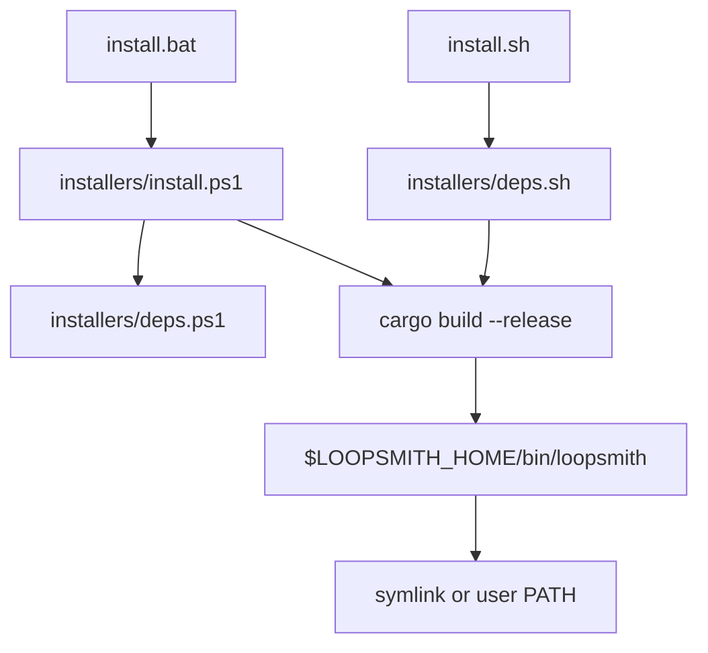
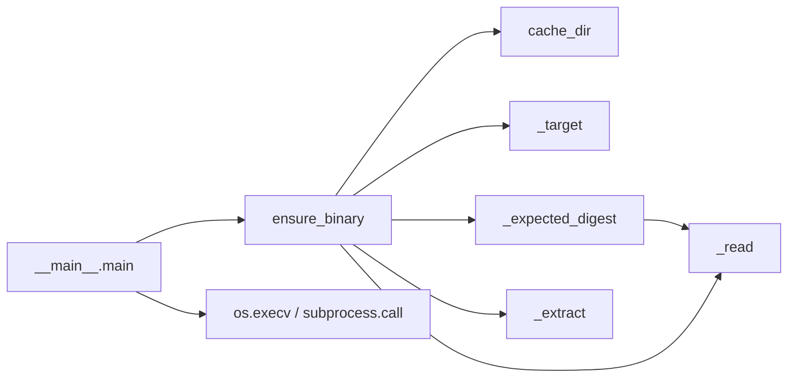

# Distribution & Installers

# Distribution & Installers

Everything that gets a `loopsmith` binary onto a machine that does not have one. Nothing in this module is part of the runtime — the Rust code under `runtime/` never imports any of it — but every user meets this module before they meet anything else, so its failure modes are the ones that get reported as "loopsmith doesn't work."

There are four independent ways in, and they split cleanly into two families:

| Path | Entry point | Where the binary comes from |
|---|---|---|
| Source install (Linux/macOS/BSD) | `install.sh` | `cargo build --release` on the user's machine |
| Source install (Windows) | `install.bat` → `installers/install.ps1` | same |
| npm | `npm i -g @bitphill/loopsmith` | prebuilt GitHub release asset, at `postinstall` |
| PyPI | `pip install loopsmith-cli` | prebuilt GitHub release asset, on **first run** |
| Homebrew | `brew install bitphill/loopsmith/loopsmith` | `cargo install` from the tagged source tarball |

crates.io (`cargo install loopsmith`) is the fallback named in every error message on this module's paths; it needs nothing from here.

## The two invariants

Read these before changing anything, because most of the odd-looking code exists to hold one of them up.

**1. A downloaded binary is verified before it is executed.** Both prebuilt paths fetch the release's `SHA256SUMS`, find the line ending in this host's asset name, and compare it to a SHA-256 of the bytes actually received. A mismatch or a missing line aborts. The release workflow publishes `SHA256SUMS` for exactly this reason — a postinstall script that pipes an unverified download onto disk is a supply-chain hole with a progress bar.

**2. The source installers never install a package manager.** `installers/deps.sh` and `installers/deps.ps1` will use apt/dnf/yum/pacman/apk/zypper/brew/pkg, or winget/choco, whichever is present — but a host with none of them gets a message naming the packages to install by hand, not a bootstrap. A machine without a package manager is a decision somebody made.

## Source installers

`install.sh` requires bash; the loop scripts it eventually helps you generate are POSIX `sh`. That asymmetry is deliberate — an installer runs once on a machine you are sitting at, a loop script runs unattended on a machine nobody chose.

Shared behaviour across `install.sh` and `install.ps1`:

- **Idempotent.** Re-running is how you upgrade. Both truncate `$LOOPSMITH_HOME/install.log` at the start and tee everything into it.
- **A checkout beside the script wins.** If `runtime/` exists next to the installer, it builds that; otherwise it shallow-clones `$LOOPSMITH_REPO_URL` at `$LOOPSMITH_BRANCH` into `$LOOPSMITH_HOME/src`. This is what makes `git clone && ./install.sh` install the code you just cloned rather than whatever `main` happens to be.
- **They re-export `~/.cargo/bin` into their own process.** rustup writes its PATH line to `~/.profile`, which zsh never reads, so a machine with cargo installed can still not see cargo. Both installers prepend it themselves and then hard-fail if `cargo` still is not resolvable.
- **They verify the build output exists** rather than trusting cargo's exit code alone (`install.ps1` checks `$LASTEXITCODE` explicitly, since PowerShell does not propagate a native command's failure through the pipeline).

Environment overrides: `LOOPSMITH_HOME`, `LOOPSMITH_REPO_URL`, `LOOPSMITH_BRANCH`, and on POSIX only `LOOPSMITH_BIN_DIR` (default `/usr/local/bin`).

Where they differ is the last step. `install.sh` symlinks into `$BIN_LINK_DIR` only when it is writable or the user is root, and otherwise prints the `export PATH=...` line to add by hand. `install.ps1` edits the **user** PATH via `[Environment]::SetEnvironmentVariable(..., 'User')` — no elevation, and a tool installed into a home directory has no business editing a machine-wide setting. It also patches `$env:PATH` for the current process so the closing "next steps" commands are runnable immediately.

`install.bat` is a five-line shim. It exists so the install is one word rather than an execution-policy incantation: it checks that `powershell` is on PATH (exit 127 if not) and invokes `install.ps1` with `-ExecutionPolicy Bypass` scoped to that one process, which changes nothing about the machine.

### The dependency scripts

Both `deps.sh` and `deps.ps1` are safe to run standalone and install nothing already present. They resolve `git` (and `curl` on POSIX), then rustup with the minimal profile, then check the toolchain version: below **1.75** — the declared `rust-version` — they warn and suggest `rustup update stable`, because an older toolchain fails deep inside a dependency with a message about a syntax feature, which is not a useful clue.

Two platform-specific notes worth keeping:

- `deps.sh` deliberately installs **nothing** for pkg-config or OpenSSL headers. loopsmith links no C libraries and never uses TLS in-process — providers are external commands — so the usual `libssl-dev` incantation would be cargo-culted weight.
- `deps.ps1` checks for `link.exe` at the end and, if absent, points at `Microsoft.VisualStudio.2022.BuildTools` with the "Desktop development with C++" workload. The MSVC Rust toolchain needs it, and a missing linker is a much worse failure to debug than a warning.

## Prebuilt-binary packages

Both the npm and PyPI packages are thin launchers around the same six release assets. Neither is a library — there is nothing to `require()` or `import`; the exit codes are the API.

### Target resolution

Six targets are published: `x86_64-unknown-linux-{gnu,musl}`, `aarch64-unknown-linux-gnu`, `{x86_64,aarch64}-apple-darwin`, `x86_64-pc-windows-msvc`. Both packages implement the same table independently, and both have to solve the same problem — telling glibc from musl, since a glibc build on musl dies with a bare `not found` that names no missing library.

- **npm** (`resolveTarget` → `isMusl` in `npm/scripts/install.js`): runs `ldd --version`. musl's `ldd` has no such flag — it prints usage plus "musl libc" to stderr and exits non-zero, where glibc answers and exits 0 — so `isMusl` returns true only when the thrown error's stderr matches `/musl/i`.
- **PyPI** (`_target` in `pypi/src/loopsmith_cli/__init__.py`): uses `platform.libc_ver()`, treating an empty result as musl, and `platform.machine()` rather than `platform.processor()` (the latter is empty on most Linux distributions and returns marketing strings on Windows).

An unrecognised host is not an error in npm — `main` warns and returns, leaving `bin/loopsmith.js` to report at run time — while Python raises `ResolveError`, which `__main__.main` turns into exit 127. Note that `win32`/`arm64` resolves to nothing in either implementation even though `package.json` declares `cpu: ["x64", "arm64"]`; those hosts fall through to the build-from-source message.

### npm: fetch at install, fail soft

`npm/scripts/install.js` runs as `postinstall`. `main` resolves the target, downloads the asset and `SHA256SUMS` concurrently via `fetchBuffer`, compares digests, then extracts the single expected member with the system `tar` (`tar.exe` has shipped with Windows 10 1803 and reads zips), renames it to `bin/loopsmith-bin` (`bin/loopsmith.exe` on Windows) and chmods it 0755. The temp archive is removed in a `finally`.

The `.catch` at the bottom sets `process.exitCode = 0` on purpose. A flaky download should not hard-fail an `npm install` that may be installing twenty other packages; `bin/loopsmith.js` — the declared `bin` entry — reports a clear error at run time if the binary never landed.

### PyPI: fetch at first run, cached

The wheel deliberately does **not** download at install time. A wheel that fetches during `pip install` breaks in every environment that installs without a network and runs with one — CI images, Docker build stages, locked-down build hosts — and surfaces as an install error for a package the user has not tried to use yet.

Instead `loopsmith = "loopsmith_cli.__main__:main"` is the console script, and the fetch happens on demand:

`cache_dir()` is `$LOOPSMITH_HOME/bin/<version>/` (default `~/.loopsmith`), versioned so an upgrade re-fetches rather than reusing a stale binary. `ensure_binary` returns early if that path already exists; otherwise it verifies, extracts to a `TemporaryDirectory`, and `shutil.move`s the result into place.

Three details in this file exist because of specific failure modes:

- **`_extract` pulls one named member**, and rejects it if the name does not match exactly or the entry is a symlink/hardlink. A checksum match proves provenance, not safety — a path-traversing entry only needs one careless `extractall`.
- **There is no "reuse a `loopsmith` already on PATH" shortcut.** pip installs *this package's* console script as `loopsmith`, so `shutil.which("loopsmith")` would find the very script that is running; `exec`ing it re-enters `ensure_binary` forever, presenting as a hang with no output. `main` keeps a belt-and-braces guard comparing the resolved binary against `sys.argv[0]` and refuses rather than looping.
- **POSIX uses `os.execv`, Windows uses `subprocess.call`.** loopsmith is long-running and interactive; replacing the process means the shell's Ctrl-C reaches the real binary and the exit code arrives unchanged. Windows has no process-replacing exec, so that branch wraps and translates `KeyboardInterrupt` to 130.

`pypi/build.sh` builds sdist + wheel (`--upload` publishes with `PYPI_TOKEN`). It creates a throwaway `.venv-build` rather than calling `python3 -m build` directly: the interpreter first on PATH is not a stable fact, Homebrew can put a fresh `python3` ahead of the one whose site-packages holds `build`, and Homebrew's Python is PEP 668 externally-managed so `pip install --user` into it is refused outright. `pick_python` scans an explicit candidate list so the choice does not depend on PATH order.

### Homebrew

`Formula/loopsmith.rb` is the source of truth; it is mirrored into the `bitphill/homebrew-loopsmith` tap at release time, which is what makes `brew install loopsmith` resolve by bare name after tapping. Nothing in it is tap-specific, so the same file can go to homebrew-core when that PR is worth filing.

It builds from source (`depends_on "rust" => :build`), `cd`s into `runtime` — the cargo workspace root is not the repository root — and installs the `crates/loopsmith-cli` package.

The `test do` block is the module's only real end-to-end assertion, and it is chosen carefully: `--version` must echo the formula's `version`; `doctor` must print `platform` and `userland` and must stay advisory so a constrained CI container cannot fail it; and `new` followed by `validate` must **exit 1** with `pre_execution` in the output. That refusal is the product, so a build where it stops happening is a broken build.

The `sha256` is the one value nothing can derive locally. The header comment documents the trap in detail: codeload rate-limits unauthenticated archive downloads, `curl -sL` reports success while writing the error body, and hashing that yields a checksum no install can ever match. Check the size and `gzip -t` before trusting a digest, and do not substitute `gh api .../tarball/<ref>` — it mangles binary output and returns a 199-byte fragment for every ref.

## Version propagation

`runtime/Cargo.toml`'s `[workspace.package] version` is the single source of truth. `tools/sync-version.sh` rewrites everything derived from it:

| Target | What is rewritten |
|---|---|
| `runtime/Cargo.toml` | workspace path-dep `version = "..."` pins |
| `npm/package.json` | `"version"` |
| `pypi/pyproject.toml` | `version` |
| `pypi/src/loopsmith_cli/__init__.py` | `__version__` (drives the release URL and cache dir) |
| `Formula/loopsmith.rb` | the tag in the `archive/refs/tags/v…` URL |
| `npm/README.md`, `pypi/README.md`, `runtime/crates/*/README.md` | tag-pinned logo URL and START-HERE link |

`--check` is the CI mode: it reports drift and exits 1 instead of writing. The script builds each edit in a temp file and `mv`s it, because `sed -i` spelling differs between GNU and BSD.

Two constraints it encodes: registry READMEs are immutable once published, so their asset URLs are pinned to the release tag rather than `main`; and the formula's `sha256` is explicitly *not* synced — it is the digest of a tarball GitHub generates after the tag exists, so it stays manual and the closing output reminds you with the exact commands.

The script lives in `tools/`, not `scripts/`: that name is reserved for a loop's own detector scripts, and the repository ships none on purpose so the `pre_execution` refusal keeps its teaching value.

## Working on this module

**Release order matters.** Bump `runtime/Cargo.toml` → run `tools/sync-version.sh` → tag and let the release workflow publish assets plus `SHA256SUMS` → compute and paste the formula `sha256` → publish npm and PyPI. Both prebuilt launchers derive their download URL from their own version string, so publishing a package before the matching release exists produces a 404 at install (npm, soft-fail) or first run (PyPI, exit 127).

**Adding a platform** means touching five places: the release workflow's build matrix, `resolveTarget` in `npm/scripts/install.js`, `_target` in `pypi/src/loopsmith_cli/__init__.py`, and the platform tables in both `npm/README.md` and `pypi/README.md`. The two resolvers are intentionally independent implementations of the same table — there is no shared spec file, so they drift silently unless changed together.

**Raising the Rust floor** means `runtime/Cargo.toml`'s `rust-version` plus the hardcoded `75` comparison in both `installers/deps.sh` and `installers/deps.ps1`.

**Testing an installer** is easiest with `LOOPSMITH_HOME=$(mktemp -d)` and, for the PyPI launcher, the same variable to force a cold fetch. To exercise the clone branch of `install.sh` rather than the checkout branch, run the script from a directory with no sibling `runtime/`.