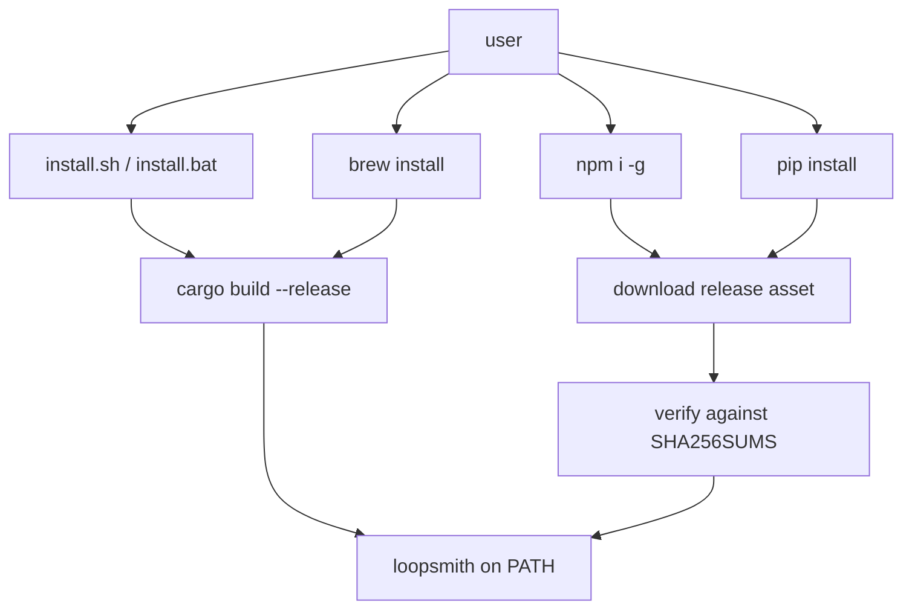

# Distribution & Installers

# Distribution & Installers

Everything outside `runtime/` that gets a `loopsmith` binary onto a machine. The Rust workspace produces one executable; this module is the five different stories told about how that executable arrives, plus the tooling that keeps those stories agreeing on a version number.

Nothing here is linked into the binary. It is shell, PowerShell, Ruby, JavaScript, and Python that runs on the user's machine before `loopsmith` ever executes.

## The channels

| Channel | Entry point | How the binary is obtained | When |
|---|---|---|---|
| Source install (POSIX) | `install.sh` | `cargo build --release` | at install |
| Source install (Windows) | `install.bat` → `installers/install.ps1` | `cargo build --release` | at install |
| Homebrew | `Formula/loopsmith.rb` | `cargo install` via `std_cargo_args` | at install |
| npm | `npm/scripts/install.js` (`postinstall`) | download + SHA256 verify | at install |
| PyPI | `pypi/src/loopsmith_cli/` | download + SHA256 verify | **first run** |
| crates.io | `cargo install loopsmith` | compiled by cargo | at install |

Three of these compile from source and two ship a prebuilt artifact. The split matters because it determines what can go wrong: the compiling channels fail on toolchain problems (no cargo, cargo too old, no MSVC linker), and the downloading channels fail on host-detection and integrity problems (wrong target triple, checksum mismatch, unlisted asset).



## Build-from-source installers

### `install.sh`

Bash, `set -euo pipefail`, re-runnable — running it a second time is the documented upgrade path. It is deliberately bash and not POSIX sh, in contrast to the loop scripts the tool *generates*: an installer runs once on a machine someone is sitting at.

The sequence:

1. `detect_os` normalizes `uname -s` to `linux`/`macos`/`bsd`/`windows`/`unknown`. `unknown` is fatal; `windows` (MSYS/Cygwin) warns and continues, since a POSIX layer is present.
2. Delegates to `installers/deps.sh` if it exists beside the script; otherwise falls back to an inline `rustup` install.
3. Prepends `$HOME/.cargo/bin` to `PATH` **for this process**. rustup writes its PATH line into `~/.profile`, which zsh never reads — so a machine that just installed cargo can still not see it.
4. Picks a source directory: a `runtime/` directory beside the script wins over cloning. This is what makes `git clone && ./install.sh` install the code you just cloned rather than whatever `main` happens to be. Otherwise `git clone --depth 1 --branch "$BRANCH"` into `$INSTALL_DIR/src`.
5. `cargo build --release --bin loopsmith` in `$SRC_DIR/runtime`, then `install -m 0755` the result into `$INSTALL_DIR/bin/loopsmith`.
6. Symlinks into `$BIN_LINK_DIR` **only if it is writable or we are root** — no implicit sudo. When it can't, it prints the `export PATH=...` line instead of failing.

Knobs, all environment variables with defaults:

| Variable | Default |
|---|---|
| `LOOPSMITH_REPO_URL` | `https://github.com/bitphill/loopsmith.git` |
| `LOOPSMITH_HOME` | `$HOME/.loopsmith` |
| `LOOPSMITH_BIN_DIR` | `/usr/local/bin` |
| `LOOPSMITH_BRANCH` | `main` |

Everything is teed to `$INSTALL_DIR/install.log`, truncated at the start of each run.

### `installers/deps.sh`

Callable on its own. Two rules shape it: **install nothing already present**, and **never install a package manager**. A host with no package manager is a decision someone made, and `pkg_install` reports it rather than working around it.

`pkg_install` dispatches on the *package manager*, not the OS — `apt-get`, `dnf`, `yum`, `pacman`, `apk`, `zypper`, `brew`, `pkg` — because a Debian container may have apt and no sudo, and a Mac may have brew or nothing. `sudo` is prefixed only when not root and `sudo` exists.

It installs `git` and `curl` when missing, then rustup with `--profile minimal` if `cargo` is absent. It deliberately installs **no** pkg-config or OpenSSL headers: loopsmith links no C libraries and never does TLS in-process, because every provider is an external command.

The last check parses `cargo --version` and warns if the minor version is below **1.75**, the declared `rust-version`. Without that warning, an older toolchain fails deep inside a dependency with a message about a syntax feature, which is not a useful clue.

### `install.bat` and `installers/install.ps1`

`install.bat` exists so the install is one word instead of an execution-policy incantation. It checks for `powershell` on `PATH` (exit `127` with a clear message if absent) and invokes `install.ps1` with `-NoProfile -ExecutionPolicy Bypass`, scoped to that one process — nothing about the machine changes.

`install.ps1` mirrors `install.sh` step for step: log file under `$InstallDir`, delegate to `deps.ps1`, prepend `%USERPROFILE%\.cargo\bin`, prefer a `runtime` directory beside the repo root over cloning, `cargo build --release --bin loopsmith`, copy `loopsmith.exe` into `$InstallDir\bin`.

The one structural difference: there is no symlink step. Instead it edits the **User** PATH via `[Environment]::SetEnvironmentVariable(..., 'User')` — no elevation needed, and a tool installed into a home directory has no business touching a machine-wide setting. It also updates `$env:PATH` in-process and tells the user to open a new shell.

`deps.ps1` follows `deps.sh`'s policy with `winget` and `choco` as the two managers, installs neither, and adds two Windows-specific concerns: `Rustup.Rustup` pulls the MSVC toolchain, so the script warns when `link.exe` is missing and names the Visual Studio C++ build tools package. Without winget it downloads `rustup-init.exe` from `https://win.rustup.rs/x86_64` and deletes it afterward.

## `Formula/loopsmith.rb`

This file is the **source of truth**; the release workflow renders `url` and `sha256` for the tag being released and pushes the result to `bitphill/homebrew-loopsmith`, which is what `brew install` actually reads. Edit the body here — those two lines get overwritten.

Two details a contributor will trip over:

- **The cargo workspace root is `runtime/`, not the repository root.** `install` does `cd "runtime"` and then `system "cargo", "install", *std_cargo_args(path: "crates/loopsmith-cli")`. Note the path is the *crate* here, where the shell installers use `--bin loopsmith` from the workspace root.
- **Getting the `sha256` right is the recurring failure.** codeload rate-limits unauthenticated archive downloads and `curl -sL` reports success while writing the error body; hashing that produces a digest no install can ever match. Check the size and gzip validity first — the file should be ~2 MB — and note that `gh api repos/.../tarball/<ref>` is not a substitute: it mangles binary output and returns a 199-byte fragment for every ref.

The `test do` block is a real smoke test, not a version print. It asserts `--version`, asserts `doctor` emits `platform` and `userland` (`doctor` must stay advisory so a constrained CI container can't make it fail), scaffolds a loop with `loopsmith new`, checks that `loop.yaml`, `run.sh`, and `run.cmd` all landed, and then asserts that `validate` **exits 1** mentioning `pre_execution`. That refusal is the product; a build where it stops happening is a broken build.

## Prebuilt-binary channels

Both the npm and PyPI packages are Rust binaries wearing a package manager's clothes. Neither exposes anything to `require()` or `import`; the installed command is `loopsmith` and its exit codes are its API.

### The shared contract

Every release publishes, per target triple, an archive named:

```
loopsmith-v<VERSION>-<TARGET>.tar.gz     # .zip on Windows
```

alongside a `SHA256SUMS` file listing all of them, at `https://github.com/bitphill/loopsmith/releases/download/v<VERSION>/`.

Six targets are prebuilt: `x86_64-unknown-linux-gnu`, `x86_64-unknown-linux-musl`, `aarch64-unknown-linux-gnu`, `x86_64-apple-darwin`, `aarch64-apple-darwin`, `x86_64-pc-windows-msvc`. Anything else falls back to `cargo install loopsmith`.

**The verification step is the point of both implementations.** A postinstall script that pipes a downloaded binary onto disk unverified is a supply-chain hole with a progress bar. Both fetch `SHA256SUMS`, find the line ending in the asset name, and refuse if the asset is unlisted or the digest doesn't match — before the file is made executable.

### npm — `npm/scripts/install.js`

Runs as `postinstall`. Flow: `main` → `resolveTarget` → `isMusl`, then two parallel `fetchBuffer` calls (asset and `SHA256SUMS`), digest comparison, and `tar` extraction of a single named member into `npm/bin/`, renamed to `loopsmith-bin` (`loopsmith.exe` on Windows). The wrapper `bin/loopsmith.js` — the `bin` entry in `package.json` — is what npm links onto PATH and what reports a clear error if the binary never landed.

`isMusl` is subtle enough to be worth reading before touching: musl's `ldd` has no `--version` flag, prints usage plus `musl libc` to **stderr**, and exits non-zero, where glibc's answers and exits 0. So the detection is "did `execFileSync` throw, and does the captured stderr match `/musl/i`". Getting this wrong yields a binary that dies with a bare `not found` on a perfectly good libc.

Extraction shells out to `tar` in both cases — `tar.exe` has shipped with Windows 10 1803 and later and reads zips.

The failure handler sets `process.exitCode = 0` **on purpose**. A flaky download should not hard-fail an `npm install` that may be installing twenty other packages; the launcher surfaces the problem at run time instead.

### PyPI — `pypi/src/loopsmith_cli/`

The important divergence from npm: **the binary is fetched on first run, not during `pip install`**, and cached under `~/.loopsmith/bin/<version>/` (`LOOPSMITH_HOME` overrides the root). A wheel that downloads at install time breaks in every environment that installs without a network and runs with one — CI images, Docker build stages, locked-down build hosts — and the failure surfaces as an install error for a package the user hasn't tried to use yet.

`__init__.py` holds the resolution logic:

- `_target()` maps `platform.system()` / `platform.machine()` to a triple, raising `ResolveError` for unsupported hosts. It uses `platform.machine()` rather than `platform.processor()`, which is empty on most Linux distributions and returns marketing strings on Windows. musl detection here is `platform.libc_ver()` returning empty — a different mechanism from the npm side, solving the same problem.
- `cache_dir()` is versioned, so an upgrade re-fetches rather than reusing a stale binary.
- `_expected_digest(asset)` reads `SHA256SUMS` over `_read` and returns the matching line's digest, or raises.
- `ensure_binary()` orchestrates: cache hit → return; otherwise `_target` → `_expected_digest` → `_read` → compare → `_extract` into a `TemporaryDirectory` → `shutil.move` into the cache → chmod +x.
- `_extract()` extracts **one named member**, never `extractall`, and rejects symlinks and hardlinks. An archive is untrusted input even when its checksum matched, and a path-traversing entry only needs one careless extraction.

`__main__.py` is the console entry point declared by `[project.scripts]`. Two hazards drive its shape:

1. **There is deliberately no "reuse a `loopsmith` already on PATH" shortcut.** pip installs *this package's* console script as `loopsmith`, so `shutil.which("loopsmith")` finds the very script that is running, and `execv`ing it re-enters `ensure_binary` — an infinite exec loop that presents as the command hanging with no output at all. `main()` additionally compares `Path(exe).resolve()` against `Path(sys.argv[0]).resolve()` and refuses, as belt-and-braces against the one failure mode with no useful symptom.
2. **On POSIX it `os.execv`s rather than wrapping.** loopsmith is long-running and interactive; a Python parent would have to forward signals correctly and would get it wrong at least once. `execv` makes the shell's Ctrl-C reach the real binary and its exit code arrive unchanged. Windows has no process-replacing exec, so it falls back to `subprocess.call` and maps `KeyboardInterrupt` to `130`.

Both `ResolveError` and `OSError` map to exit `127` with a `cargo install loopsmith` suggestion.

### `pypi/build.sh`

Builds sdist + wheel into `dist/` and runs `twine check`; `--upload` publishes using `PYPI_TOKEN`.

It creates a throwaway `.venv-build` rather than calling `python3 -m build` directly, because the interpreter first on `PATH` is not a stable fact: installing anything through Homebrew can put a new `python3` ahead of the one whose user site-packages holds `build` and `twine`, and the failure reads as `No module named build` on a machine where build is very much installed. Homebrew's Python is also PEP 668 externally-managed, so `pip install --user` into it is refused outright. `pick_python()` walks an explicit candidate list (`python3.13` … `/usr/bin/python3`) and requires `import venv` to succeed, so the choice doesn't depend on PATH order.

## Version synchronization — `tools/sync-version.sh`

`runtime/Cargo.toml`'s `[workspace.package] version` is the single source of truth. Everything else is derived:

- `runtime/Cargo.toml` workspace path-dependency versions
- `npm/package.json` `version`
- `pypi/pyproject.toml` `version`
- `pypi/src/loopsmith_cli/__init__.py` `__version__`
- `Formula/loopsmith.rb` — the tag inside the `url`
- The tag-pinned logo URL and START-HERE link in `npm/README.md`, `pypi/README.md`, and `runtime/crates/*/README.md`

```bash
./tools/sync-version.sh           # rewrite everything to match
./tools/sync-version.sh --check   # non-zero if anything drifted (CI uses this)
```

Hand-editing eight files per release is how one gets missed, and the one that gets missed is usually a URL — failing silently as a broken image on a registry page nobody looks at twice. The READMEs pin to a **tag**, not `main`, because a published README is immutable and an image URL that can move underneath it will eventually be wrong.

Two implementation notes:

- `apply()` writes through `mktemp` and `mv` rather than using `sed -i`, whose spelling differs between GNU and BSD.
- The formula's `sha256` is **not** synced. It's the digest of a tarball GitHub generates, so it can't be derived from anything local; the script prints the `curl | gzip -t | wc -c | shasum` recipe at the end as a reminder, and the release checklist owns it.

The script lives in `tools/`, not `scripts/` — `scripts/` is reserved for a loop's own detector scripts, and the repository deliberately ships none so the `pre_execution` refusal keeps its teaching value.

## Registry names

`loopsmith` was already taken on both npm and PyPI by unrelated projects, so the published names differ from the command:

| Registry | Package | Command |
|---|---|---|
| npm | `@bitphill/loopsmith` | `loopsmith` |
| PyPI | `loopsmith-cli` | `loopsmith` |
| crates.io | `loopsmith` | `loopsmith` |
| Homebrew | `bitphill/loopsmith` tap | `loopsmith` |

The Homebrew formula requires a `brew tap` step because it isn't in homebrew-core; the file carries nothing tap-specific, so it can be submitted unchanged when the project has enough history behind it.

`npm/README.md` and `pypi/README.md` are near-identical marketing copy maintained in parallel — they exist because registry pages render their own README and can't follow a relative link. They differ only in their install commands, badges, and the section describing that channel's install mechanism. Keeping them in sync is manual apart from the URL lines `sync-version.sh` owns.

## Adding a platform

1. Add the target to the release workflow's build matrix so an archive and a `SHA256SUMS` line exist.
2. Add the mapping to `resolveTarget()` in `npm/scripts/install.js` and to `_target()` in `pypi/src/loopsmith_cli/__init__.py`. These are independent implementations of the same table — changing one without the other means one ecosystem silently falls through to "build from source".
3. Add the row to the prebuilt tables in both READMEs.
4. If the platform needs a new libc or ABI discriminator, it needs a detection function in each language, and each one is its own hazard — see `isMusl` and `platform.libc_ver()` above.

Nothing in `install.sh`, `install.ps1`, or the formula needs touching: those compile for whatever host they run on.