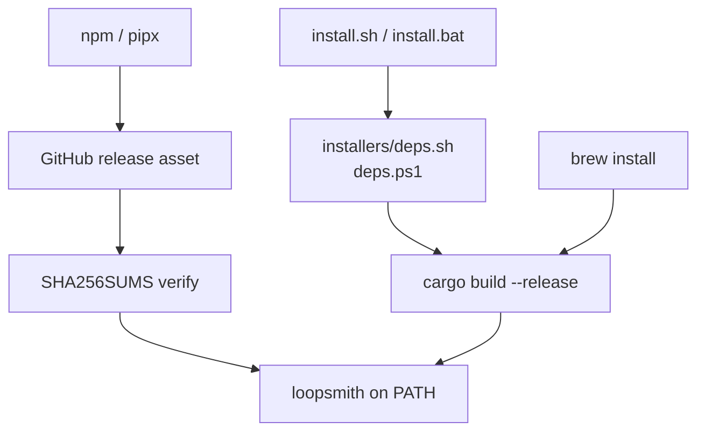

# Distribution & Installers

# Distribution & Installers

Everything that gets `loopsmith` onto a machine that does not have it. Five acquisition paths, two install strategies, and one script that keeps the version number the same in all of them.

## The two strategies

| Strategy | Paths | What lands on disk |
|---|---|---|
| **Build from source** | `install.sh`, `install.bat` → `install.ps1`, `brew install` | A binary compiled on the host by cargo |
| **Fetch a prebuilt release asset** | `npm install -g @bitphill/loopsmith`, `pipx install loopsmith-cli` | A binary downloaded from the GitHub release for this package's version, checksum-verified |

The split is deliberate: the shell installers exist for people who have cloned the repository or want a toolchain anyway, and the registry packages exist so a Node or Python user never installs Rust. Both npm and PyPI packages are *Rust binaries wearing a package manager's clothes* — there is nothing to `require()` and nothing to `import`.


```mermaid
flowchart TD
    A[install.sh / install.bat] --> D[installers/deps.sh<br/>deps.ps1]
    D --> E[cargo build --release]
    B[brew install] --> E
    C[npm / pipx] --> F[GitHub release asset]
    F --> G[SHA256SUMS verify]
    G --> H[loopsmith on PATH]
    E --> H
```

## Source installers

### `installers/manifest.json` is the single source of truth

`install.sh` and `install.ps1` read every shared fact — repository URL, branch, binary name, install directory name, cargo build arguments, the post-install next steps — out of one JSON file via the `manifest.sh` shell helpers:

```sh
BINARY="$(m_str binary)"                       # one scalar
m_list requires | while read -r tool; ...      # one value per line
```

`m_str` returns a scalar; `m_list` emits one element per line. `install.sh` feeds `m_list build_args` into `"$@"` one line at a time precisely so an argument containing a space survives as one argument:

```sh
set --
while IFS= read -r arg; do set -- "$@" "$arg"; done <<EOF
$(m_list build_args)
EOF
( cd "$SRC_DIR/$BUILD_DIR" && cargo "$@" )
```

That means `cargo build --release --bin loopsmith` is a manifest fact, not a shell fact. **When you change how the binary is built, edit the manifest, not the scripts.**

### `install.sh` (Linux, macOS, BSD)

Requires bash — unlike the loop scripts loopsmith *generates*, which are POSIX sh. The distinction is intentional and documented in the header: an installer runs once on a machine someone is sitting at; a generated loop script runs unattended on a machine nobody chose.

Flow:

1. `detect_os` normalizes `uname -s` to `linux`/`macos`/`bsd`/`windows`/`unknown`. `unknown` is fatal; `windows` (MSYS/Cygwin) warns and continues because a POSIX layer is present.
2. Delegates to `installers/deps.sh` when present; otherwise falls back to an inline `rustup` install.
3. Prepends `$HOME/.cargo/bin` to `PATH` for this process. rustup writes its PATH line to `~/.profile`, which zsh never reads, so a host with cargo installed can still not see it.
4. Verifies `m_list requires`. **Note the trap here:** that loop runs in a subshell, so its `err` cannot exit the installer. `cargo` and `git` are therefore re-checked outside the loop. If you add a hard requirement, add an explicit check alongside them rather than trusting the loop.
5. Picks a source tree: a checkout beside the script wins over cloning, which is what makes `git clone && ./install.sh` install the code you just cloned rather than whatever `main` happens to be.
6. `install -m 0755` the built binary into `$INSTALL_DIR/<bin_subdir>/`, then symlink into the link directory if it is writable (or root). If not, it prints the `export PATH=...` line instead of asking for a password.

Everything is `tee`'d to `$INSTALL_DIR/install.log`, truncated at the start of each run. Re-running is the upgrade path.

Environment overrides: `LOOPSMITH_REPO_URL`, `LOOPSMITH_HOME`, `LOOPSMITH_BIN_DIR`, `LOOPSMITH_BRANCH`.

### `install.bat` (Windows)

Eleven meaningful lines. It exists so the install is one word instead of an execution-policy incantation: it checks that `powershell` is on `PATH` (exit `127` with a message if not) and runs `install.ps1` with `-NoProfile -ExecutionPolicy Bypass` scoped to that one process, which changes nothing about the machine. Arguments and the exit code pass straight through.

### Dependency resolution

`installers/deps.sh` and `installers/deps.ps1` are callable on their own and are safe to re-run. Both hold the same two rules:

- **Install nothing already present.** `have()` / `Test-Have` gate every step.
- **Never install a package manager.** A host with none is a decision somebody made; the script reports it and stops rather than working around it.

`pkg_install` in `deps.sh` dispatches on the package manager, not the OS — a Debian container may have `apt` and no `sudo`, an Alpine one has `apk`, a Mac may have `brew` or nothing:

```
apt-get · dnf · yum · pacman · apk · zypper · brew · pkg
```

`sudo` is prefixed only when the effective UID is non-zero *and* `sudo` exists. On Windows, `Install-Pkg` tries `winget`, then `choco`, then dies with the package name to install by hand.

What gets installed: `git`, `curl`, and rustup (minimal profile, stable toolchain) — nothing else. The comment is load-bearing: loopsmith links no C libraries and never uses TLS from inside the process, because providers are external commands, so `pkg-config` and openssl headers are deliberately absent from the list.

Both scripts warn (not fail) when cargo is older than **1.75**, the declared `rust-version`. An older toolchain otherwise fails deep in a dependency with a message about a syntax feature, which is not a useful clue. `deps.ps1` additionally warns when `link.exe` is missing and names the Visual Studio C++ build tools, since `Rustup.Rustup` pulls the MSVC toolchain.

## Prebuilt-asset packages

Both registry packages consume the same release contract:

```
https://github.com/bitphill/loopsmith/releases/download/v<VERSION>/
  loopsmith-v<VERSION>-<target-triple>.tar.gz   # or .zip on Windows
  SHA256SUMS
```

`<VERSION>` comes from the package's own metadata, never from a "latest" lookup, so a pinned package resolves to a pinned asset.

**The checksum step is the reason these scripts exist at all.** A postinstall that pipes a downloaded binary onto disk unverified is a supply-chain hole with a progress bar; the release workflow publishes `SHA256SUMS` so the installers can refuse. In both implementations the asset's line is located in `SHA256SUMS` by suffix match, a missing line is an error, and a digest mismatch aborts before anything is made executable.

### npm — `npm/scripts/install.js`

Runs as `postinstall`. `main()` → `resolveTarget()` → `isMusl()`, then downloads asset and sums concurrently via `fetchBuffer()`.

`isMusl()` is worth reading before you touch it: musl's `ldd` has no `--version` flag — it prints usage plus `musl libc` to *stderr* and exits non-zero, where glibc's answers and exits 0. So the detector treats a throw whose stderr matches `/musl/i` as musl. Getting this wrong ships a glibc binary that dies with a bare "not found" on a perfectly good libc.

Extraction uses the system `tar`, including on Windows — `tar.exe` has shipped since Windows 10 1803 and reads zips — and pulls exactly one named member (`loopsmith` / `loopsmith.exe`), renaming it to `bin/loopsmith-bin` (`bin/loopsmith.exe` on Windows) with mode `0755`. The temp archive is removed in a `finally`.

**Failure is non-fatal on purpose:** the top-level `.catch` logs, suggests `cargo install loopsmith`, and sets `process.exitCode = 0`. A flaky download should not hard-fail an `npm install` that is also installing twenty other things; `bin/loopsmith.js` reports a clear error at run time if the binary never landed. The `bin` shim is what `package.json` maps the `loopsmith` command to.

`package.json` constrains where this is even attempted: `os: [linux, darwin, win32]`, `cpu: [x64, arm64]`, `engines.node >= 18` (the script uses global `fetch`).

### PyPI — `pypi/src/loopsmith_cli/`

The distribution is `loopsmith-cli` because `loopsmith` was already registered; the console script is `loopsmith`, wired through `[project.scripts]` to `loopsmith_cli.__main__:main`.

The timing differs from npm deliberately: **the binary is fetched on first run, not at install time.** A wheel that downloads during `pip install` breaks in every environment that installs without network and then runs with one — CI images, Docker build stages, locked-down build hosts — and surfaces as an install error for a package the user has not tried to use yet.

`ensure_binary()` is the whole story:

```
ensure_binary → cache_dir        # $LOOPSMITH_HOME or ~/.loopsmith, then bin/<version>
              → _target          # Rust triple from platform.system/machine
              → _expected_digest → _read   # SHA256SUMS
              → _read            # the asset
              → _extract         # one named member
```

`cache_dir()` is versioned, so an upgrade re-fetches instead of running a stale binary. `_target()` uses `platform.machine()` rather than `platform.processor()` (empty on most Linux distros, marketing strings on Windows) and decides musl vs glibc from `platform.libc_ver()`. `_extract()` refuses `extractall`: an archive is untrusted input even when its checksum matched, so it resolves one member by name and rejects it if the name differs or the entry is a symlink or hard link.

Two comments document the same hazard and both guard against it:

- `ensure_binary` has **no "reuse a `loopsmith` already on PATH" shortcut**. pip installs *this package's* console script as `loopsmith`, so `shutil.which("loopsmith")` finds the script that is currently running, and `execv`-ing it re-enters the function — an infinite exec loop that presents as a hang with no output.
- `main()` re-checks the same thing by comparing the resolved `exe` against resolved `sys.argv[0]` and returning `127` rather than exec'ing itself. An unresolvable `argv[0]` is caught and ignored — it is not a reason to refuse to run.

On POSIX, `main()` ends in `os.execv`, replacing the process so the shell's Ctrl-C reaches the real binary and its exit code arrives unchanged. Windows has no such exec, so it falls back to `subprocess.call` and maps `KeyboardInterrupt` to `130`. All resolution and download failures exit `127` with the `cargo install loopsmith` fallback.

`pypi/build.sh` builds and optionally uploads. It creates a throwaway `.venv-build` and installs `build` and `twine` there rather than calling a bare `python3 -m build`: the interpreter first on `PATH` is not a stable fact, a Homebrew install can put a `python3` ahead of the one whose user site-packages holds the tools, and Homebrew's Python is PEP 668 externally-managed so `pip install --user` into it is refused outright. `pick_python()` walks an explicit candidate list (3.13 → 3.9 → `python3` → `/usr/bin/python3`) requiring the `venv` module, so the choice does not depend on `PATH` order. `--upload` needs `PYPI_TOKEN`.

## Homebrew — `Formula/loopsmith.rb`

This copy is the source of truth and a **template**. The release workflow renders `url` and `sha256` for the tag being released and pushes the result to `bitphill/homebrew-loopsmith`, which is what `brew install` actually reads. Edit the body here; those two lines get overwritten. Nothing in the file is tap-specific, so the same formula can be submitted to homebrew-core when that is worth doing.

`install` builds with `std_cargo_args(path: "crates/loopsmith-cli")` from inside `cd "runtime"` — the cargo workspace root is `runtime/`, not the repository root.

`caveats` is the one place a tap can talk to someone who has just arrived, and it spends that space on `loopsmith --web` and `loopsmith --guided` rather than a config format.

The `test do` block is the interesting part, because it asserts product behavior rather than that the binary runs:

- `--version` matches the formula's `version`.
- `doctor` prints `platform` and `userland`, and must stay **advisory** so a constrained CI container cannot make it fail.
- `loop new` scaffolds `loop.yaml`, `run.sh`, `run.cmd`; then `loop validate` is expected to **exit 1** mentioning `intent.prerequisites`. That refusal is the product, so a build where it stops happening is a broken build. If you ever change prerequisite gating, this test is one of the things that will tell you.

The header comment also records a release-time trap: `codeload` rate-limits unauthenticated archive downloads, `curl -sL` reports success while writing the error body, and hashing that produces a checksum no install can match. Verify size and gzip integrity before trusting a digest, and do not substitute `gh api .../tarball/<ref>` — it mangles binary output and returns a 199-byte fragment for every ref.

## Version fan-out — `tools/sync-version.sh`

`runtime/Cargo.toml`'s `[workspace.package] version` is the single source of truth. Everything else is derived:

| Target | What is rewritten |
|---|---|
| `runtime/Cargo.toml` | workspace path-dep versions |
| `npm/package.json` | `"version"` |
| `pypi/pyproject.toml` | `version` |
| `pypi/src/loopsmith_cli/__init__.py` | `__version__` |
| `Formula/loopsmith.rb` | the `archive/refs/tags/vX.Y.Z` URL |
| `npm/README.md`, `pypi/README.md`, `runtime/crates/*/README.md` | tag-pinned logo URL and tag-pinned `README-FOR-DUMMIES.md` link |

Two modes: bare invocation rewrites; `--check` reports drift and exits 1, which is what CI runs. The `apply()` helper writes to a temp file and `mv`s it rather than using `sed -i`, whose spelling differs between GNU and BSD — the same reason generated detector scripts source a compat shim instead of branching.

READMEs pin the logo and START-HERE links to the release tag rather than `main` because a published registry README is immutable: an image URL that can move underneath it will eventually be wrong, and it fails silently as a broken image on a page nobody looks at twice.

The formula's `sha256` is the only thing not derivable locally — it is the digest of a tarball GitHub generates — so it stays manual, and the script prints the exact verification commands on exit.

The script deliberately lives in `tools/`, not `scripts/`: that name is reserved for a loop's own detector scripts, and the repository ships none so the `pre_execution` refusal keeps its teaching value.

## Contributing notes

- **Changing what gets built or where it goes** → `installers/manifest.json`. Three copies of a repository URL is three chances to move the repository and fix two of them, and the one nobody fixes is the script for the OS they are not on.
- **Changing the release asset naming or adding a target triple** → update `resolveTarget()` in `npm/scripts/install.js` *and* `_target()` in `pypi/src/loopsmith_cli/__init__.py`. They are independent implementations of the same contract and currently do not cover an identical set of triples (`aarch64-unknown-linux-gnu` is present in both; there is no arm64-musl target in either, and `resolveTarget` rejects non-x64 Windows).
- **Changing the version** → `runtime/Cargo.toml`, then `./tools/sync-version.sh`, then the formula `sha256` once the tag exists. Never hand-edit the derived files; CI's `--check` will catch it, but only after you have pushed.
- **Never** weaken the `SHA256SUMS` step in either downloader, and keep npm's postinstall failure non-fatal while PyPI's fetch stays lazy — both are answers to specific, unpleasant failure modes rather than stylistic choices.