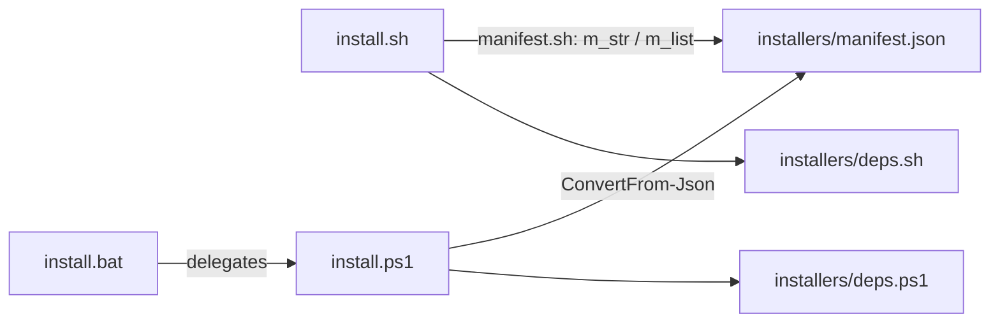
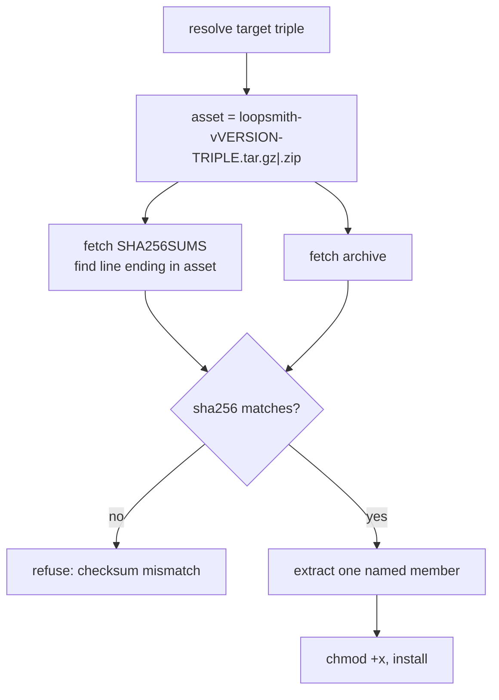

# Distribution & Installers

# Distribution & Installers

Everything in this module exists to get one compiled artifact — the `loopsmith` binary — onto a machine, and nothing else. No part of it links against the runtime crates or is called by them; the coupling runs the other way, through a version string and a release tag.

There are two families here, and confusing them is the fastest way to write a bug:

| Family | Entry points | What it does | Needs Rust? |
|---|---|---|---|
| **Build from source** | `install.sh`, `install.bat` → `install.ps1`, `installers/deps.*` | Installs a toolchain, clones or uses a checkout, runs `cargo build --release` | Yes, it installs one |
| **Fetch a prebuilt binary** | `npm/scripts/install.js`, `pypi/src/loopsmith_cli/` | Downloads a release asset, verifies it against `SHA256SUMS`, installs a launcher | No |
| **Package manager** | `Formula/loopsmith.rb` | Hands the build to Homebrew (`std_cargo_args`) | Homebrew provides it |

A third, smaller concern sits across all of them: `tools/sync-version.sh`, which keeps the version string identical in the eight places that have to repeat it.

---

## Part 1 — Building from source

### The manifest is the only shared fact

`install.sh` (bash), `install.ps1` (PowerShell) and `install.bat` (a five-line shim) all install the same thing on different operating systems. Every fact they share — repository URL, branch, install directory name, build command, the "next steps" text — lives in `installers/manifest.json` and nowhere else.


```mermaid
graph LR
  M[installers/manifest.json]
  SH[install.sh] -->|manifest.sh: m_str / m_list| M
  PS[install.ps1] -->|ConvertFrom-Json| M
  BAT[install.bat] -->|delegates| PS
  SH --> DSH[installers/deps.sh]
  PS --> DPS[installers/deps.ps1]
```

The manifest's shape is load-bearing, and the comment at the top of the file says so. `installers/manifest.sh` reads it with `sed` and `awk`, not `jq`:

```sh
. installers/manifest.sh
BINARY="$(m_str binary)"          # one string
m_list build_args                 # one element per line
```

The reasoning is worth internalising before editing it: a machine running `install.sh` has just been told it needs `cargo` and `git`. It is in no position to also need a JSON parser. That constraint produces two rules:

- **Keep the manifest flat.** Strings and arrays of strings only. `m_str` is a single `sed` substitution against `"key": "value"` on one line; `m_list` scans for `"key"` followed by `[` and pulls quoted items until `]`. Nest an object and both readers silently stop working.
- **One array element per line.** `m_list` depends on it.

`m_str` returns non-zero and prints `manifest: no key 'x'` for a missing key, deliberately. A missing key that returned empty would become `git clone ""`, which fails much later with a much worse message.

`install.sh` reads list values into `"$@"` through a `while IFS= read -r` loop rather than `$(...)` word-splitting, so a build argument containing a space stays one argument.

### install.sh

Linux, macOS, BSD. Ordered as: detect → deps → verify → source → build → install → link.

1. `detect_os()` maps `uname -s` to `linux`/`macos`/`bsd`/`windows`/`unknown`. `unknown` is fatal; MSYS/Cygwin prints a warning pointing at `install.bat` and continues, since a POSIX layer is present.
2. Delegates to `installers/deps.sh` if present, otherwise falls back to an inline `rustup` pipe. Everything is `tee`'d to `$INSTALL_DIR/install.log`.
3. Verifies `m_list requires` (`cargo`, `git`) is on `PATH`. **The `while read` loop that does this runs in a subshell**, so its `err` cannot exit the parent — the script therefore re-checks `cargo` and `git` explicitly afterwards. This is not redundancy; removing either check removes the guard.
4. A `runtime/` directory beside the script wins over a clone. That is what makes `git clone && ./install.sh` install the code you just cloned rather than whatever `main` happens to be.
5. Installs to `$INSTALL_DIR/bin/loopsmith` with `install -m 0755`, then symlinks into `/usr/local/bin` **only** if that directory is writable or the user is root. Otherwise it prints the `export PATH=...` line and exits successfully — an installer that cannot write to a system directory has not failed.

Overrides, all read before the manifest default:

| Variable | Default (from manifest) |
|---|---|
| `LOOPSMITH_HOME` | `$HOME/.loopsmith` |
| `LOOPSMITH_BIN_DIR` | `/usr/local/bin` |
| `LOOPSMITH_REPO_URL` | `https://github.com/bitphill/loopsmith.git` |
| `LOOPSMITH_BRANCH` | `main` |

`install.ps1` honours `LOOPSMITH_HOME`, `LOOPSMITH_REPO_URL` and `LOOPSMITH_BRANCH`; it has no `LOOPSMITH_BIN_DIR` equivalent because it edits the user `PATH` instead of linking.

### install.bat and install.ps1

`install.bat` exists so the install is one word rather than an execution-policy incantation. It `cd /d "%~dp0"`, checks `where powershell` (exiting `127` with an explanatory message if absent), then runs `install.ps1` with `-NoProfile -ExecutionPolicy Bypass` — scoped to that one process, changing nothing about the machine. It forwards `%*` and propagates `%errorlevel%`.

`install.ps1` mirrors `install.sh` step for step, but three Windows-specific details are each the fix for a real failure:

- **`Get-Content ... -Raw -Encoding UTF8`.** Windows PowerShell 5.1, which `install.bat` invokes, reads a BOM-less file in the ANSI code page. The manifest is UTF-8 without a BOM, so any non-ASCII character in it would arrive as mojibake.
- **`Invoke-Logged`.** Under `$ErrorActionPreference = 'Stop'` with stderr redirected, 5.1 turns every stderr line from a native command into a terminating error record. `cargo` and `git` both report progress on stderr, so a *successful* build died on cargo's own `Finished` line. `Invoke-Logged` drops to `'Continue'` for the length of the call, flattens each record back to text for the log, and treats `$LASTEXITCODE` as the verdict.
- **User `PATH`, not machine `PATH`.** No elevation needed, and a tool installed into a home directory has no business editing a system-wide setting. It also prepends to `$env:PATH` for the current process and says a new shell is needed.

### deps.sh and deps.ps1

Both are callable standalone, install nothing already present, and **never install a package manager** — a host with none is a decision somebody made, and these report it rather than working around it.

`deps.sh` dispatches on the *package manager*, not the OS, because a Debian container may have `apt` and no `sudo` while an Alpine one has `apk`: `pkg_install()` tries `apt-get`, `dnf`, `yum`, `pacman`, `apk`, `zypper`, `brew`, `pkg` in that order, prefixing `sudo` only when not already root and `sudo` exists (`brew` is never sudo'd). It installs `git` and `curl` if missing, then `rustup` with `--profile minimal --default-toolchain stable` if `cargo` is absent.

Two comments there record deliberate *non*-actions: loopsmith links no C libraries and never does TLS in-process (providers are external commands), so `pkg-config` and OpenSSL headers are installed on purpose-not-at-all.

`deps.ps1` uses `winget` then `choco`, and dies rather than bootstrapping either. Beyond the shared logic it warns when `link.exe` is absent, because `Rustup.Rustup` pulls the MSVC toolchain and needs the Visual Studio C++ build tools for the linker:

```
winget install --id Microsoft.VisualStudio.2022.BuildTools
```

Both scripts prepend `~/.cargo/bin` to `PATH` for the caller's process, because `rustup` writes its `PATH` line to `~/.profile`, which zsh never reads.

> **Known drift.** `runtime/Cargo.toml` declares `rust-version = "1.85"` and `manifest.json` carries `"min_rust": "1.85"`, but the toolchain-age warnings in `deps.sh` and `deps.ps1` still hardcode `1.75` and neither reads `min_rust`. The warning fires too late to be useful on a 1.75–1.84 toolchain. Wiring both checks to `m_str min_rust` / `$Manifest.min_rust` is the obvious fix and would make the manifest genuinely the single source.

---

## Part 2 — Fetching a prebuilt binary

npm and PyPI both ship a launcher, not a library. Neither has a Rust toolchain in the picture. Both do the same four steps — resolve a target triple, fetch `SHA256SUMS`, fetch the asset, refuse on mismatch — and differ on *when*.


```mermaid
graph TD
  T[resolve target triple] --> A["asset = loopsmith-vVERSION-TRIPLE.tar.gz|.zip"]
  A --> S["fetch SHA256SUMS<br/>find line ending in asset"]
  A --> D[fetch archive]
  S --> C{sha256 matches?}
  D --> C
  C -->|no| R[refuse: checksum mismatch]
  C -->|yes| X[extract one named member]
  X --> I[chmod +x, install]
```

The checksum step is the whole point, and both files say so in the same words: fetching a binary and running it unverified is a supply-chain hole with a progress bar. The release workflow publishes `SHA256SUMS` with bare filenames precisely so these two can match a line by its trailing asset name and refuse.

### Target triples

The mapping is identical in `resolveTarget()` (JS) and `_target()` (Python), and must stay identical to the `matrix.target` list in `.github/workflows/release.yml`:

| Platform | Triple |
|---|---|
| linux x64, glibc | `x86_64-unknown-linux-gnu` |
| linux x64, musl | `x86_64-unknown-linux-musl` |
| linux arm64 | `aarch64-unknown-linux-gnu` |
| macOS x64 / arm64 | `x86_64-apple-darwin` / `aarch64-apple-darwin` |
| Windows x64 | `x86_64-pc-windows-msvc` |

libc detection is the subtle part, and the two implementations differ because their languages offer different tools:

- **`isMusl()`** runs `ldd --version` and inspects the *failure*. musl's `ldd` has no `--version`: it prints usage plus `musl libc` to stderr and exits non-zero, where glibc's answers and exits 0. So a thrown exception whose stderr matches `/musl/i` means musl.
- **`platform.libc_ver()`** returns a non-empty string for glibc and empty otherwise, so Python treats empty as musl.

Getting this backwards yields a binary that dies with a bare `not found` naming no missing library.

Anything unmatched is not an error: `install.js` warns and returns, `_target()` raises `ResolveError`. Both point at `cargo install loopsmith`.

### npm — download at postinstall

`npm/package.json` declares `bin.loopsmith → bin/loopsmith.js`, `postinstall → node scripts/install.js`, `engines.node >= 18` (for global `fetch`), and `os`/`cpu` arrays.

`scripts/install.js` is one `main()` that `Promise.all`s the archive and `SHA256SUMS`, verifies, writes the archive to `os.tmpdir()`, and extracts exactly one member with the system `tar` (`tar xf` on Windows — `tar.exe` has shipped since Windows 10 1803 and reads zips; `tar xzf` elsewhere). The extracted file is renamed to `loopsmith-bin` (or kept as `loopsmith.exe`) and `chmod 0755`'d; the temp archive is removed in a `finally`.

**The failure path is deliberately non-fatal.** `main().catch()` logs and sets `process.exitCode = 0`, because a flaky download should not hard-fail an `npm install` that may be installing twenty other things. The error surfaces later, clearly, from the launcher.

`bin/loopsmith.js` is that launcher. It exits `127` with build-from-source advice if the binary never landed, `126` if spawning fails, and otherwise `spawnSync(..., { stdio: 'inherit' })`. `spawnSync`, not `execFileSync`, because loopsmith is interactive and long-running and its exit code is a verdict that has to arrive unchanged. A signalled child has a `null` status, so the launcher re-raises the signal on itself — that is what makes the shell see the same death the child had.

### PyPI — download on first run

The distribution is `loopsmith-cli` (the short name was taken); the console script is `loopsmith`, via `[project.scripts]` → `loopsmith_cli.__main__:main`.

The install-time/first-run split is the deliberate difference from npm. A wheel that downloads during `pip install` breaks in every environment that installs with no network and then runs with one — CI images, Docker build stages, locked-down build hosts — and it surfaces as an install error for a package the user has not tried to use yet.

`ensure_binary()` is the one public entry point:

```
ensure_binary() → cache_dir() → hit? return
               → _target()
               → _expected_digest(asset) → _read(SHA256SUMS)
               → _read(asset) → sha256 compare
               → _extract(archive, tmp, name) → shutil.move → chmod +x
```

Four details each encode a specific failure:

- **`cache_dir()` is versioned** — `$LOOPSMITH_HOME/bin/<version>` (default `~/.loopsmith/bin/<version>`) — so an upgrade re-fetches instead of running a stale binary.
- **`_TIMEOUT = 20`**, not 120. `urllib` tries a host's addresses one after another and spends the full timeout on each that does not answer. GitHub serves release assets from four anycast addresses; a network that could not reach one made the first run sit for two minutes per download, looking exactly like a hang. Twenty keeps a genuinely slow link working and makes a dead node a pause.
- **The "fetching…" line prints before the download**, for the same reason: a first run that prints nothing until it finishes is indistinguishable from a hang.
- **`_extract` takes one named member.** A checksum-matched archive is still untrusted input, so the tar path calls `getmember(member)` and rejects a name mismatch, a symlink or a hard link rather than calling `extractall`.

`__main__.main()` returns `127` for `ResolveError` and for `OSError` during fetch. Then it does the thing that looks paranoid and is not: it compares `Path(exe).resolve()` against `Path(sys.argv[0]).resolve()` and refuses if they match. There is deliberately **no** "reuse a `loopsmith` already on `PATH`" shortcut anywhere in this package, because pip installs *this package's* console script as `loopsmith`, so `shutil.which("loopsmith")` would find the running script and `execv` it — an infinite exec loop that presents as a command hanging with no output, no error and no traceback. Both the missing shortcut and this guard are there because that failure mode has no useful symptom.

On POSIX it then `os.execv`s, replacing the process so the shell's Ctrl-C reaches the real binary and the exit code arrives unchanged. Windows has no such exec, so it `subprocess.call`s and maps `KeyboardInterrupt` to `130`.

`pypi/build.sh` builds and optionally uploads (`--upload`, using `PYPI_TOKEN`) for local releases. It creates a throwaway `.venv-build` and pins `build`/`twine` into it, because the `python3` first on `PATH` is not a stable fact: a Homebrew install can put a new `python3` ahead of the one whose user site-packages holds `build`, producing `No module named build` on a machine where build is very much installed — and Homebrew's Python is PEP 668 externally-managed, so `pip install --user` into it is refused outright. `pick_python()` walks an explicit `python3.13 … python3.9, python3, /usr/bin/python3` list, testing `import venv` on each. CI does not use this script; the `pypi` job in `release.yml` publishes via Trusted Publishing.

---

## Part 3 — Homebrew

`Formula/loopsmith.rb` in this repo is the **template**, not what `brew` reads. `brew install` reads `github.com/bitphill/homebrew-loopsmith`; the `homebrew` job in `release.yml` renders `url` and `sha256` for the tag and pushes the result there with a deploy key. Edit the body here — those two lines will be overwritten. Updating this file alone leaves the tap pinning the previous release while the copy here looks correct, which is the one way a release can silently half-land.

The formula builds from source (`depends_on "rust" => :build`) and `cd "runtime"` first, because the cargo workspace root is `runtime/`, not the repository root, and the binary comes from `crates/loopsmith-cli`.

The `sha256` cannot be derived locally — it is the digest of a tarball GitHub generates — so it is the one field `sync-version.sh` leaves alone. Check the *size* before trusting a digest: codeload rate-limits unauthenticated archive downloads, `curl -sL` reports success while writing the error body, and hashing that yields a checksum no install can ever match. The release workflow encodes the same lesson as hard gates — valid gzip, ≥ 500 kB, non-empty listing, and a digest that differs from the previous release's (an identical digest is the rate-limit signature, not a coincidence).

`caveats` is the only place a tap can speak to someone who has just arrived, and it spends that space on `--web` and `--guided` rather than assuming knowledge of the config format.

The `test do` block is a real behavioural test, not a smoke test. Alongside `--version` and an advisory `doctor` probe, it scaffolds a loop and asserts that `loop validate` **exits 1** mentioning `intent.prerequisites`. That refusal is the product; a build where it stops happening is a broken build.

---

## Part 4 — Keeping versions in step

`runtime/Cargo.toml`'s `[workspace.package] version` is the single source of truth. Everything else is derived, and `tools/sync-version.sh` derives it:

```bash
./tools/sync-version.sh           # rewrite everything to match
./tools/sync-version.sh --check   # fail on drift (CI runs this)
```

It reads the version with `awk`, then calls `apply <file> <pattern> <replacement> <label>` per target: the workspace's own path-dependency versions, `npm/package.json`, `pypi/pyproject.toml`, `loopsmith_cli.__version__`, the Homebrew `url` tag, and — in every published README — the tag-pinned logo URL and the tag-pinned `README-FOR-DUMMIES.md` link. A published README is immutable, so an image or link URL pointing at `main` will eventually be wrong on a registry page nobody looks at twice.

`apply` writes to `mktemp` and `mv`s rather than using `sed -i`, because `-i`'s spelling differs between GNU and BSD. In `--check` mode it reports and increments `drift` instead of moving the file, then exits 1 with the count.

CI enforces this (`.github/workflows/ci.yml`, "Versions are in step"). If you bump the workspace version, run the script; if you add a new place that repeats the version, add an `apply` call for it.

The script also lives in `tools/`, not `scripts/` — `scripts/` is reserved for a loop's own detector scripts, and the repository deliberately ships none so the `pre_execution` refusal keeps its teaching value.

---

## How a release ties it together

```
tag v* → build (6 targets, --profile dist, --locked)
       → publish (collect archives, sha256sum * > SHA256SUMS, gh release create)
           ├─ pypi     (Trusted Publishing; needs the release to exist first)
           ├─ npm      (npm publish --provenance)
           └─ homebrew (render url+sha256, push to the tap)
       └─ crates      (independent; gated on vars.PUBLISH_CRATES)
```

`pypi`, `npm` and `homebrew` all `need: publish` rather than `build`, because the wheel and the npm package are launchers that download from the GitHub release — publishing either before that release exists ships something briefly broken. `crates` hangs off `build` and nothing depends on it, so skipping it skips crates.io and nothing else.

The release builds `--profile dist` (fat LTO, one codegen unit) while the source installers build `--release`. Same code; the dist profile trades build time nobody is waiting on for ~16% off the download.

## Invariants to preserve

1. **`manifest.json` stays flat, one array element per line.** `manifest.sh` is `sed` and `awk`, by necessity.
2. **Any new shared fact between `install.sh` and `install.ps1` goes in the manifest**, not into both scripts. Three copies of a URL is three chances to move the repository and fix two of them, and the one nobody fixes is the script for the OS they are not on.
3. **Never skip the checksum comparison** in `install.js` or `_read`/`_expected_digest`, and never widen `_extract` to `extractall`.
4. **Target-triple tables must match `release.yml`'s matrix** — in both downloaders, or one platform silently loses prebuilt binaries.
5. **Do not add a "`loopsmith` already on `PATH`" fast path** to the Python launcher, and do not remove the `argv[0]` guard in `__main__.main()`.
6. **A postinstall download failure must stay non-fatal** in npm; the launcher reports it.
7. **Run `./tools/sync-version.sh` after any version bump**, and add an `apply` call for any new file that repeats the version.
8. **Edit the formula body in `Formula/loopsmith.rb`**, never in the tap; expect `url` and `sha256` to be overwritten at release time.