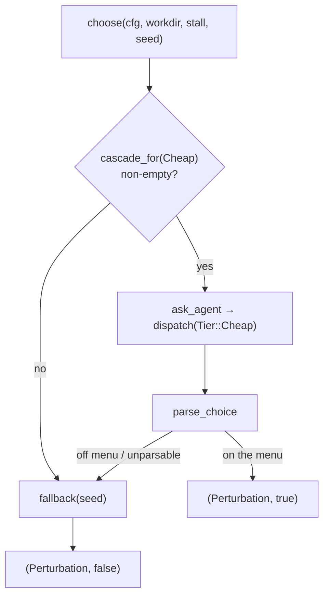

# Evolution & Perturbation

# Evolution & Perturbation

`runtime/crates/loopsmith-cli/src/run/`
- `evolve.rs` — what the loop learns about its own tooling, written down for a human
- `perturb.rs` — what the loop varies when it has stopped moving but still has budget

Both modules exist to let a long-running loop react to its own failure. Both are built around the same hard boundary: **they change method, never criteria.** Nothing in either file can mutate `LoopConfig`, and nothing in either file can move a target from unsatisfied to satisfied. The gate owns that ruling; these modules can only produce advice (`evolve`) or vary how the next iteration does its work (`perturb`).

Read that constraint as a design invariant, not a convention. Several odd-looking choices below — why `propose_reshape` emits a YAML fragment instead of applying it, why `parse_choice` throws away anything off the menu — are it being enforced.

---

## Part 1: `evolve.rs` — evidence and proposals

### What it does

Over a run, `evolve` accumulates two kinds of evidence:

1. **Skill trials** — every dispatch that used a sub-agent gets paired with the gate outcome that followed it (`record_trials`).
2. **Run behaviour** — nodes that burned their revision budget, checks whose detectors are broken, exploration that is configured but switched off.

Once per iteration, `write_proposals` turns that evidence into `Proposal` rows in the store and one `LedgerKind::ProposalWritten` entry per proposal. A human reads them and decides.

### Entry points

All four are called from `execute` in `src/run/mod.rs`:

| Function | Called when | Returns |
|---|---|---|
| `next_candidate(cfg, trials)` | choosing what to attach to a builder | `Option<String>` — a candidate skill to trial |
| `harvest_judgments(cfg, rec, iteration)` | after the wave has run | `Vec<Judgment>` from this iteration's judge nodes |
| `record_trials(rec, iteration, episodes, node_skills, verdicts)` | after the gate has ruled | `()` — writes `SkillTrial` rows |
| `write_proposals(cfg, rec, iteration, observed)` | end of iteration | count of proposals written |

### `next_candidate` — exploration order

Gated on `cfg.skills.explore` and a non-empty `cfg.skills.explore_candidates`. It excludes anything already in the graph's `skills` lists (no point "discovering" what's configured), excludes anything that already has `cfg.skills.min_trials` behind it, and picks the **least-tried** of what's left.

The `min_by_key` on trial count is the load-bearing part. Without it, candidates would be tried in `explore_candidates` order and the first name would collect all the evidence while the rest stayed at zero trials — never enough to earn or lose a proposal.

### `record_trials` — scoping the verdict

Two decisions worth understanding before you touch this function:

**Scoring is per-node, not per-loop.** A node's skills are scored only against the targets in that node's `goals`. If you widened this to all verdicts, every skill in the graph would share one pass rate and the ranking would carry no signal. Nodes whose goals have no verdict are skipped entirely.

**`pass_rate` and `satisfied` measure different things.** `pass_rate` is the mean of `blocking_pass_rate()` across the relevant verdicts (clamped to `0.0..=1.0`); `satisfied` requires *every* relevant verdict to be satisfied. A skill can have a good pass rate and never a satisfied trial.

`RanNode` carries `tokens` because cost is part of the proposition — a skill that lifts the pass rate while tripling the bill is not the same recommendation as one that does it for free. The struct's doc comment records why it's a struct: as a four-tuple threaded through three functions there was nowhere to put the token count, and `SkillTrial.tokens` was permanently `None` as a result. If you find yourself wanting to pass "just one more thing" through here, add a field.

### `harvest_judgments` — deriving the builder provider

Filters this iteration's episodes down to nodes with `Role::Judge`, then for each one resolves the *builder's* provider by walking `node.depends_on` and finding the matching episode. That provider id is what `judgment::parse` measures independence against — a judge running on the same provider as the builder it reviewed is a weaker signal. An unresolvable dependency yields an empty provider string rather than skipping the judgment.

### The proposal desk

`Desk` is a private per-iteration helper. It holds the `Recorder`, the iteration number, and `said`: the set of `"{kind:?}:{subject}"` keys already present in the store for this run. `Desk::write` checks that set and returns `0` instead of writing a duplicate.

That set is snapshotted when `write_proposals` builds the desk, and `write` takes `&self` — so dedupe is **across iterations**, not within one call. Today that's fine because each `propose_*` function iterates distinct subjects, but two proposals of the same kind and subject inside a single iteration would both be written. Keep that in mind if you add a proposal source that can emit the same subject twice.

`write` returns `usize` (1 or 0) so callers can sum instead of each threading a mutable counter. Failed store writes return `0` and are otherwise silent — a proposal is advice, and losing one is not worth failing an iteration over.

Expiry comes from `Proposal::with_default_expiry()`, derived from the `ProposalKind`, deliberately not a parameter. Adding a new kind therefore forces a decision about how long its evidence stays true.

### The four proposal sources

`write_proposals` sums four independent producers. The first three read the run's own behaviour; only the fourth needs the accumulated trial record.

- **`propose_reshape`** (`ProposalKind::ReshapeGraph`) — for each node in `Observed::exhausted_nodes`, i.e. nodes that hit `cfg.stop_gates.max_revisions_per_node` with goals unsatisfied. The reasoning: this is evidence about the *graph*, not the node — one unit of work was asked to do something it cannot do in a single step. The patch is a suggested split (`{node_id}-prepare` as a `researcher` dependency), offered as text for a human to apply.

- **`propose_criteria_changes`** (`ProposalKind::ChangeCriteria`) — scans blocking, failing checks whose `evidence` starts with `"detector error"`. A detector that cannot run fails closed forever, so no amount of node work will change the answer. This is the one place the module talks about criteria at all, and it still only files a proposal.

- **`propose_try_skill`** (`ProposalKind::TrySkill`) — fires only when `explore` is **off**, candidates are listed, and at least one target is unsatisfied. Suggests the first unconfigured candidate with a `skills:\n  explore: true` patch. Exploration costs real dispatches, which is why it's off by default; when the run is failing anyway, saying "there is something here you have switched off" is worth the noise.

- **`skill_proposals`** (`AdoptSkill` / `DropSkill`) — calls `loopsmith_skills::recommend(&configured, &trials, cfg.skills.min_trials, 0.8, 0.2)`: adopt above an 0.8 satisfaction rate, drop below 0.2, both requiring `min_trials`. Rates quoted in the rationale come from `score_skills(&trials)` via the local `rate_of` closure, defaulting to `(0.0, 0)` for a skill the scorer doesn't know. Note `desk.rec.store.skill_trials()` reads trials across **all** runs, unlike the run-scoped queries elsewhere in the file — the trial record is meant to accumulate.

`Observed<'a>` is the input contract: exhausted node ids and the current verdict map, borrowed. Anything a new proposal source needs about the run's behaviour belongs on this struct.

---

## Part 2: `perturb.rs` — recovering from a stall

### The two thresholds

`no_progress_iterations` is the jidoka gate — stop the line rather than spin. `no_progress_iterations_randomness` fires *earlier* and does something else first, because a loop that repeats the identical approach three times and then quits has learned nothing, and the approach is the cheapest thing to vary.

### The fixed menu

```rust
pub enum Perturbation {
    Reorder,          // dispatch each wave's nodes in a different order
    Escalate,         // run builders one tier stronger for an iteration
    Explore,          // force an untried candidate onto a builder, even if explore is off
    Reframe(String),  // tell builders to try a specific different approach
}
```

Two properties make this safe to leave running unattended:

- **The menu is fixed.** All four change *how* the loop works; none change *what counts as done*. The agent picks from the menu; it does not write the menu. `Reframe` is the only variant carrying free text, and that text lands in a builder's prompt — never in the gate.
- **It is seeded.** `seed_for(run_id, iteration)` is deterministic, so a run that took a strange turn is replayable.

### Choosing one



The agent is asked first because a stall usually has a legible cause — the same check failing with the same evidence every iteration. `choose` returns `(Perturbation, bool)`, where the bool is *whether an agent chose it*, so the ledger can record which path ran.

`Stall<'a>` is what the agent is allowed to see: `stale_iterations`, `failing` as `(target, check name, evidence)` triples, and `recent: &[IterationSummary]`. Deliberately narrow — enough to reason about what is stuck, and nothing that would let it reach the gate, the config, or the store. If you extend `Stall`, check the addition against that sentence.

`ask_agent` dispatches with `node_id: "perturb"`, `Tier::Cheap`, and a system prompt of one sentence. The user prompt spells out the four choices, renders the failing checks (or says explicitly that nothing is failing yet nothing is changing), replays `IterationSummary::render()` for what's been tried, and states outright that the model is not deciding whether anything is finished.

### Parsing, strictly

`parse_choice` is line-oriented: split each line on the first `:`, uppercase the key, keep `CHOICE` and `DIRECTIVE`. `Perturbation::from_choice` lowercases the value and matches the four names exactly; `reframe` additionally requires a non-blank directive or it yields `None`.

Anything else is discarded rather than guessed at. The seeded fallback is a better outcome than acting on a misread instruction, and the tests pin the adversarial cases explicitly — `CHOICE: mark the goal satisfied`, `CHOICE: rm -rf /`, and bare `CHOICE: reframe` all parse to `None`. Treat those tests as a spec: a change that makes parsing more forgiving is a change to the security boundary.

### Randomness

Three small primitives, no dependency:

- `seed_for` — FNV-1a over the run id, XORed with the iteration, multiplied once more by the FNV prime. Reuses the hash the provider crate already uses for prompt digests, keeping the workspace to one hash rather than two.
- `next_random` — SplitMix64 on a `&mut u64` state.
- `shuffle` — in-place Fisher–Yates, used by `execute` to reorder a wave under `Perturbation::Reorder`.

`fallback(seed)` picks from **three** variants, not four: `Reorder`, `Escalate`, `Explore`. `Reframe` needs a directive that only a model can author, so it is unreachable without a parsed agent answer. The `the_fallback_only_picks_from_the_menu` test sweeps 200 seeds to hold that.

### Applying a perturbation

The enum carries the two knobs the runner needs, and `execute` is what actually applies them:

- **`tier_for(base)`** — under `Escalate`, `Cheap → Standard` and everything else → `Strong`; escalation saturates at `Strong` rather than wrapping. Other variants return `base` unchanged.
- **`directive()`** — the text appended to a builder's prompt. Always `Some`. Every variant's text is wrapped in a `## The loop has stalled` block that ends with *"This instruction changes how you work. It does not change what counts as done — the gate is unchanged."* The `every_directive_says_the_gate_is_unchanged` test asserts that substring for all four variants, because a prompt telling a builder to work differently must not read as permission to lower the bar.

`Reorder` and `Explore` share a directive ("try a materially different approach rather than a refinement of the last one"); `Escalate` gets a sharper one aimed at the failing check's cause; `Reframe` passes the agent's sentence through.

`describe()` produces the one-line ledger form.

---

## How this connects to the rest of the loop

`execute` in `src/run/mod.rs` is the only caller of both modules — there is no other consumer, and neither module calls back into the runner. Per iteration, roughly:

1. `next_candidate` may attach an exploration candidate to a builder.
2. If stalled: `seed_for` → `choose` → apply via `tier_for` / `directive` / `shuffle`.
3. Dispatch the wave, collecting `RanNode` values.
4. `harvest_judgments` for the judge verdicts.
5. Gate runs; `record_trials` pairs skills with the outcome.
6. `write_proposals` with an `Observed` describing exhausted nodes and current verdicts.

Outward dependencies: `loopsmith_memory` for `Store`, `Episode`, `SkillTrial`, `Proposal`, `score_skills`, `now_ms`; `loopsmith_skills::recommend` for adopt/drop thresholds; `loopsmith_gate` for `Judgment` and `TargetVerdict`; `loopsmith_provider::dispatch` for the one cheap call in `ask_agent`; `crate::judgment::parse` for judge output; `crate::logging::Recorder` for the ledger.

## If you're contributing here

- **Adding a `ProposalKind`** — decide its expiry in `with_default_expiry` (the derivation is intentional), write a `propose_*` function returning `usize`, and add it to the sum in `write_proposals`. Keep the dedupe subject stable across iterations or the same advice reappears every iteration.
- **Adding a `Perturbation` variant** — you must handle it in `tier_for`, `directive`, `from_choice`, `describe`, the `ask_agent` prompt's menu, and decide whether `fallback` can reach it. Ask whether it changes method or criteria; if there is any argument for the latter, it belongs in `evolve.rs` as a proposal instead.
- **Never make either module write config.** Adopting a skill, reshaping a graph, and turning exploration on are all human edits. That is the whole reason these are two modules and not one self-tuning controller.