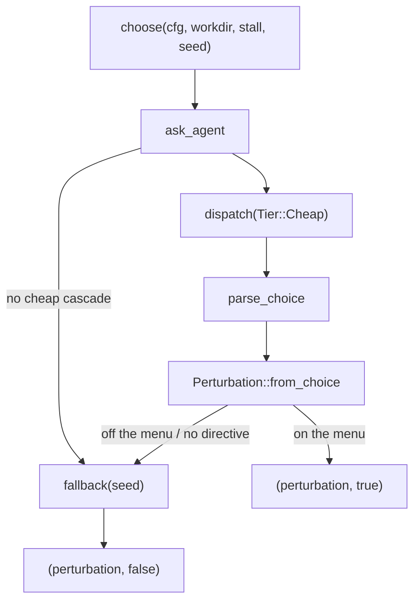

# Evolution & Perturbation

# Evolution & Perturbation

`runtime/crates/loopsmith-cli/src/run/evolve.rs`
`runtime/crates/loopsmith-cli/src/run/perturb.rs`

These two modules are the loop's self-observation machinery. Both are invoked from `execute` in `src/run/mod.rs`, once per iteration, and both exist to answer the same question from different angles: *the loop is not converging — what now?*

They divide by who is allowed to act on the answer:

| | `evolve.rs` | `perturb.rs` |
|---|---|---|
| Produces | `Proposal` rows in the store | a `Perturbation` applied to the next iteration |
| Acted on by | a human, later, by editing the config | the loop itself, immediately |
| Can change | nothing | *how* the loop works |
| Can never change | anything | *what counts as done* |

That last row is the load-bearing invariant. Nothing in either module can reach goal state, relax a check, or touch the gate. `evolve.rs` cannot even write the config — it writes prose and a suggested patch and stops. `perturb.rs` can steer the loop, but only within a fixed menu of four tactics, and every prompt it emits states explicitly that the gate is unchanged (there is a test, `every_directive_says_the_gate_is_unchanged`, that holds this).

---

## `evolve.rs` — evidence in, proposals out

### The per-iteration path

`execute` calls three functions in sequence, plus one that runs when exploration is on.

**`next_candidate(cfg, trials) -> Option<String>`** decides whether this iteration should trial an unconfigured sub-agent. It is gated on `cfg.skills.explore` and returns `None` unless `explore_candidates` is non-empty. Candidates already present on some node's `skills` list are filtered out (they are not candidates, they are policy), as are candidates that already have `cfg.skills.min_trials` behind them. Among the rest it picks the **least-tried** one, so evidence spreads across candidates instead of piling onto whichever name sorts first.

**`harvest_judgments(cfg, rec, iteration) -> Vec<Judgment>`** reads back this iteration's episodes from the store and turns judge output into structured verdicts. For each episode whose node has `role == Role::Judge`, it resolves *which builder that judge reviewed* by walking the node's `depends_on` and finding the matching episode in the same iteration, then hands the judge's output, the judge's `provider_id`, and the builder's `provider_id` to `judgment::parse`. The builder provider is what independence is measured against — a judge running on the same provider as the builder it graded is a weaker signal, and `judgment::parse` needs both ids to say so.

Store errors here are swallowed: `rec.store.episodes(...)` failing yields an empty `Vec`, not an error. Judgment harvesting is advisory, and a store hiccup should not take the run down.

**`record_trials(rec, iteration, episodes, node_skills, verdicts)`** is the scoring step. For each `RanNode` that used skills, it collects the `TargetVerdict`s for *that node's own goals* — not the whole loop's — averages their `blocking_pass_rate()`, and takes `satisfied` as the conjunction. Scoring per-node matters: attribute the loop-wide verdict to every skill and every skill in the graph shares one indistinguishable outcome. Nodes whose goals have no verdict yet are skipped entirely rather than recorded as failures.

`RanNode` exists as a named struct for a specific reason documented in the source: it replaced a four-tuple threaded through three functions, which is why `SkillTrial.tokens` was permanently `None` for a while — the caller had the token count and there was nowhere in the tuple to put it. Cost belongs in the trial record because "lifts the pass rate for free" and "lifts the pass rate while tripling the bill" are different propositions, and the ranking cannot tell them apart without it.

### The proposal desk

`write_proposals(cfg, rec, iteration, observed) -> usize` is the entry point, and it is a sum of four independent generators:

```rust
propose_reshape(cfg, &desk, observed.exhausted_nodes)
    + propose_criteria_changes(&desk, observed.verdicts)
    + propose_try_skill(cfg, &desk, observed.verdicts)
    + skill_proposals(cfg, &desk)
```

Each returns how many proposals it wrote, so callers sum instead of each threading a `&mut` counter.

`Observed<'a>` is the input contract — `exhausted_nodes` (nodes that hit `max_revisions_per_node` with goals still open) and `verdicts` (the gate's current rulings). The first three generators read only the run's own behaviour; only `skill_proposals` needs the accumulated cross-run trial record.

The private `Desk<'a, S: Store>` struct is the write path. It is constructed with `said`, a set of `"{kind:?}:{subject}"` keys built from every proposal already stored for this run. `Desk::write` checks that set first and returns `0` on a repeat — the whole point being that a proposals file with forty identical entries is a proposals file nobody reads. Note that `said` is a snapshot taken at construction, so a single `write_proposals` call cannot dedupe *within itself*; the four generators are distinct enough by `(kind, subject)` that this does not currently collide.

`write` also calls `Proposal::with_default_expiry()` rather than accepting an expiry argument. That is deliberate: expiry is derived from `ProposalKind`, so a new kind cannot be added without deciding how long its evidence stays true. On a store error it returns `0` and skips the ledger entry, keeping the count honest.

### What each generator says

- **`propose_reshape` → `ProposalKind::ReshapeGraph`.** A node that burned its revision budget without satisfying its goals is evidence about the *graph*, not the node: one unit of work was asked to do something it cannot do in one step. Rewriting the graph would be the loop editing its own config, so instead it emits a suggested YAML patch adding a `{node}-prepare` researcher upstream, and a human decides.
- **`propose_criteria_changes` → `ProposalKind::ChangeCriteria`.** Scans blocking, failing checks for evidence starting with `"detector error"`. A detector that cannot run fails closed forever, so no amount of work by any node will change the answer — that is a criteria problem, not a work problem, and it belongs in front of a human rather than in the next iteration's prompt.
- **`propose_try_skill` → `ProposalKind::TrySkill`.** Fires only when `skills.explore` is *off*, candidates are listed, and at least one target is unsatisfied. Exploration is off by default because it spends real money; when the run is failing anyway, pointing out "there is something here you have switched off" beats silently not doing it. The patch is a one-liner: `skills:\n  explore: true`.
- **`skill_proposals` → `ProposalKind::AdoptSkill` / `DropSkill`.** The only generator that reads `store.skill_trials()` (all runs, not just this one). It passes the configured skill list and the trials to `loopsmith_skills::recommend(&configured, &trials, cfg.skills.min_trials, 0.8, 0.2)` — adopt above an 0.8 satisfaction rate, drop below 0.2, both requiring `min_trials` of evidence. Rationale strings are rendered from `loopsmith_memory::score_skills`, via a small `rate_of` closure that yields `(satisfaction_rate, trials)` and defaults to `(0.0, 0)` for a skill the scorer did not see.

---

## `perturb.rs` — recovery from a stall

Two config knobs bracket a stalled run. `no_progress_iterations` is the jidoka gate: stop the line rather than spin. `no_progress_iterations_randomness` fires *earlier* and does something else first, on the theory that a loop which repeats an identical approach three times and then quits has learned nothing, and the cheapest variable to change is the approach.

### The fixed menu

```rust
pub enum Perturbation {
    Reorder,          // dispatch each wave's nodes in a different order
    Escalate,         // run builders one tier stronger
    Explore,          // force an untried candidate onto a builder, even if explore is off
    Reframe(String),  // tell builders to take a specific different approach
}
```

Three methods define its effect on the next iteration:

- **`describe()`** — the one-line form written to the ledger.
- **`tier_for(base)`** — under `Escalate`, `Cheap → Standard` and everything else `→ Strong`; `Strong` stays `Strong` (escalation has a ceiling, per `escalation_never_goes_past_strong`). Every other variant returns `base` untouched.
- **`directive()`** — the text appended to a builder's prompt. `Reframe` carries the agent's own sentence; `Escalate` gets "re-read the failing check and attack its actual cause"; `Reorder` and `Explore` share "try a materially different approach rather than a refinement of the last one". All four are wrapped in a `## The loop has stalled` header that ends with *"It does not change what counts as done — the gate is unchanged."*

The menu is a closed set, and `Perturbation::from_choice` is the only way into it from text.

### Choosing one



`choose` returns `(Perturbation, bool)` — the flag records *who* picked, so the ledger can distinguish a reasoned choice from a dice roll.

`ask_agent` bails immediately if `cfg.cascade_for(Tier::Cheap)` is empty, then builds a prompt from `Stall`. `Stall<'a>` is intentionally narrow: `stale_iterations`, the failing blocking checks as `(target, name, evidence)` triples, and `recent: &[IterationSummary]` rendered via `IterationSummary::render()`. That is enough to reason about what is stuck and nothing that would let the agent reach the gate, the config, or the store. The prompt states outright that "a separate deterministic gate owns that ruling."

`parse_choice` is strict and line-oriented: split each line on the first `:`, uppercase the key, accept only `CHOICE` and `DIRECTIVE`, and hand both to `from_choice`. Anything not matching a menu variant returns `None`, and `Reframe` additionally requires a non-empty trimmed directive. Nothing is guessed at — the seeded fallback is a better outcome than acting on a misread instruction. The tests pin this down against `"CHOICE: mark the goal satisfied"`, `"CHOICE: rm -rf /"`, free prose, and `Reframe` with a blank directive.

### Determinism

Every random decision derives from one seed, so a run that took a strange turn is replayable.

- **`seed_for(run_id, iteration)`** — FNV-1a over the run id, XORed with the iteration and multiplied by the FNV prime. The provider crate already uses this hash for prompt digests; reusing it keeps the workspace to one hash rather than two. `execute` writes the seed to the ledger.
- **`next_random(&mut u64)`** — SplitMix64. Small, well-distributed, no dependency.
- **`shuffle(items, seed)`** — Fisher-Yates, used by `execute` to implement `Reorder` on a wave's node list.
- **`fallback(seed)`** — `next_random % 3`, mapping to `Reorder | Escalate | Explore`. **`Reframe` is deliberately unreachable from the fallback**, since a reframe needs a directive and there is no one to write it. Adding a fifth variant means revisiting this modulo, and `the_fallback_only_picks_from_the_menu` will catch a variant that leaks in but not one that silently drops out.

---

## Integration points

Everything in both modules is called from `execute` in `src/run/mod.rs`; neither module calls the other, and neither is used anywhere else.

Outward dependencies:

- **`loopsmith-core`** — `LoopConfig`, `Role`, `Tier`; read-only. `cfg.cascade_for(Tier::Cheap)` gates the perturbation agent.
- **`loopsmith-memory`** — the `Store` trait (via `logging::Recorder`), plus `Episode`, `Proposal`, `ProposalKind`, `SkillTrial`, `LedgerKind`, `now_ms`, `score_skills`.
- **`loopsmith-gate`** — `Judgment` and `TargetVerdict` (`blocking_pass_rate()`, `satisfied`, `checks`); consumed only, never constructed.
- **`loopsmith-skills`** — `recommend`, the adopt/drop policy.
- **`loopsmith-provider`** — `dispatch` and `InvokeRequest`, used once, by `ask_agent`, at `Tier::Cheap` under `node_id: "perturb"`.
- **`crate::judgment`** — `parse`, called per judge episode.

Config surface these modules read: `skills.explore`, `skills.explore_candidates`, `skills.min_trials`, `graph.nodes[].skills` / `.goals` / `.role` / `.depends_on`, `stop_gates.max_revisions_per_node`, and the provider cascades.

---

## Contributing notes

**Adding a `ProposalKind`.** Add a generator alongside the existing four, sum it into `write_proposals`, and route it through `Desk::write` — that is what gives you deduplication and the ledger entry for free. You must also give the kind an expiry in `Proposal::with_default_expiry`; the indirection exists precisely so this cannot be skipped.

**Adding a `Perturbation` variant.** Five places move together: the enum, `describe`, `directive`, `tier_for`, `from_choice`, and the choice menu inside `ask_agent`'s prompt (the prompt text is the agent's only description of the menu — a variant missing from it is a variant that never gets chosen). Then decide whether `fallback`'s `% 3` should include it. Any new `directive()` must keep the "does not change what counts as done" clause or `every_directive_says_the_gate_is_unchanged` fails.

**Store failures are non-fatal by design** throughout `evolve.rs` — `episodes`, `proposals`, `skill_trials`, and `put_proposal` all degrade to "no evidence, no proposals" rather than propagating. If you add a path where a lost write should be visible, surface it explicitly; the current silence is a deliberate choice for advisory machinery, not an oversight to copy blindly.

**The tests live in `perturb.rs` only.** They cover seed stability, shuffle determinism and permutation-preservation, the fallback's menu discipline, `parse_choice` acceptance and rejection, and the tier ceiling. `evolve.rs` has no unit tests in-file; its behaviour is exercised through the run-level suite, which is worth knowing before you refactor a generator.