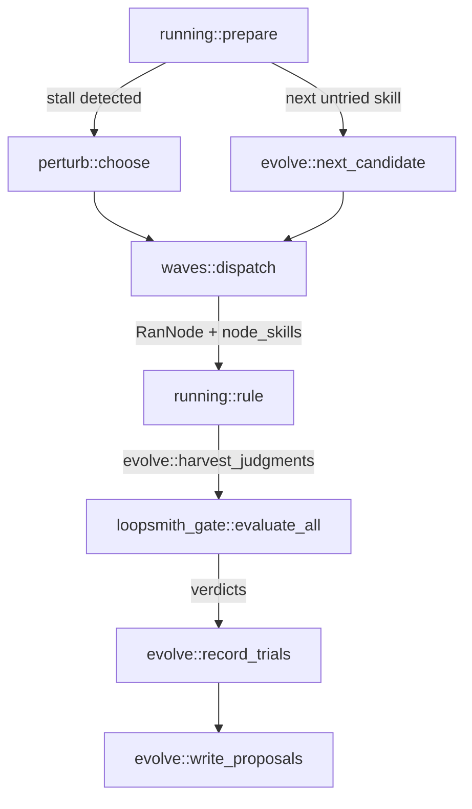

# Evolution & Perturbation

# Evolution & Perturbation

Two sibling modules in `loopsmith-run` that let a loop change how it works without ever changing what counts as done.

| Module | Question it answers | Effect |
|---|---|---|
| `crates/loopsmith-run/src/evolve.rs` | "What did this run learn about its own tooling and shape?" | Writes evidence and proposals. Never mutates config. |
| `crates/loopsmith-run/src/perturb.rs` | "The loop has stopped moving — what should it vary?" | Alters dispatch order, tier, sub-agent, and prompt for one iteration. |

Both are driven from `running.rs`, and both are bounded by the same invariant: **the gate owns the definition of done, and neither module can touch it.** Everything here is method, not criteria.

> Note on paths: these modules live in the `loopsmith-run` crate (`runtime/crates/loopsmith-run/src/`), not in `loopsmith-cli`. The CLI only surfaces their output.

---

## Where they sit in an iteration


```mermaid
flowchart TD
    prepare["running::prepare"] -->|stall detected| choose["perturb::choose"]
    prepare -->|next untried skill| cand["evolve::next_candidate"]
    choose --> disp["waves::dispatch"]
    cand --> disp
    disp -->|RanNode + node_skills| rule["running::rule"]
    rule -->|"evolve::harvest_judgments"| gate["loopsmith_gate::evaluate_all"]
    gate -->|verdicts| trials["evolve::record_trials"]
    trials --> props["evolve::write_proposals"]
```

`prepare` (`running.rs:371`) decides at the *top* of the iteration what to vary. `rule` (`running.rs:450`) and the block at `running.rs:246` read the *bottom* of the iteration and turn the outcome into evidence.

---

## `perturb` — the stall response

### Why it exists

`no_progress_iterations` is the halt: stop the line rather than spin. `no_progress_iterations_randomness` fires *earlier* and does something else first, because a loop that repeats the identical approach three times and then quits has learned nothing. It must be strictly less than the halt threshold or it never fires, and it is `Option<u32>` — unset means halt without ever varying, since perturbation costs a provider call.

### The fixed menu

```rust
pub enum Perturbation {
    Reorder,          // dispatch each wave's nodes in a different order
    Escalate,         // run builders one tier stronger
    Explore,          // force an untried sub-agent onto a builder
    Reframe(String),  // a specific different approach, in words
}
```

The agent *picks from* the menu; it does not *write* the menu. This is the module's central safety property. `Perturbation::from_choice` matches four lowercase literals and returns `None` for anything else, so an answer like `CHOICE: mark the goal satisfied` is discarded rather than interpreted. `Reframe` is the one variant carrying free text, and it is refused when the `DIRECTIVE` line is missing or blank.

Three methods define what a perturbation actually does:

- **`tier_for(base)`** — only `Escalate` moves anything: `Cheap → Standard`, everything else `→ Strong`. Escalation saturates at `Strong`; there is no runaway.
- **`directive()`** — the extra prompt text, always wrapped in a `## The loop has stalled` block that ends with "It does not change what counts as done — the gate is unchanged." A test (`every_directive_says_the_gate_is_unchanged`) asserts that sentence is present for every variant, because a stall directive must not read as permission to lower the bar.
- **`describe()`** — the one-line form written to the ledger.

### Determinism

`seed_for(run_id, iteration)` is FNV-1a over the run id mixed with the iteration — reusing the hash the provider crate already uses for prompt digests, so the workspace carries one hash rather than two. The seed is logged in hex alongside the choice (`running.rs:406`), so a run that took a strange turn can be replayed.

`shuffle` is Fisher-Yates over `next_random`, a SplitMix64 step. `fallback(seed)` draws from `Reorder | Escalate | Explore` only — never `Reframe`, which needs text a PRNG cannot supply.

### Asking the agent first

`choose` returns `(Perturbation, bool)`, the flag saying whether an agent or the seeded fallback decided, so the ledger can distinguish them.

`ask_agent` bails immediately when `cfg.cascade_for(Tier::Cheap)` is empty — no cheap provider, no question. Otherwise it dispatches a `Tier::Cheap` `InvokeRequest` under the synthetic node id `"perturb"` with a strict output contract:

```
CHOICE: <reorder|escalate|explore|reframe>
DIRECTIVE: <one sentence, required only when CHOICE is reframe>
```

`parse_choice` is line-oriented and unforgiving: split on the first `:`, uppercase the key, keep only `CHOICE` and `DIRECTIVE`, and hand the result to `from_choice`. Anything off-menu yields `None` and the caller falls back to the seed.

### What the agent is allowed to see

```rust
pub struct Stall<'a> {
    pub stale_iterations: u32,
    pub failing: &'a [(String, String, String)],  // (target, check name, evidence)
    pub recent: &'a [IterationSummary],
}
```

Deliberately narrow: failing blocking checks and the last two iteration summaries (`running.rs:394` takes the tail). No gate handle, no config, no store. The prompt states outright that a separate deterministic gate owns whether anything is finished.

### How a perturbation reaches the work

| Variant | Applied in | Mechanism |
|---|---|---|
| `Reorder` | `waves.rs:285` | `perturb::shuffle(&mut ids, inputs.seed)` before `eligible_nodes` |
| `Escalate` | `dispatch.rs:179` | `p.tier_for(node.tier)` — **skipped for `Role::Judge`** |
| `Explore` | `running.rs:427` | Fills `explore_now` from `explore_candidates.first()` even when `explore` is off |
| `Reframe` / all | `prompts.rs:100` | `p.directive()` appended — **skipped for `Role::Judge`** |

The two judge exclusions are the same argument twice. Escalating the checker alongside the worker changes the bar at the moment the work changes; telling the checker to "try a different approach" is how a stalled loop talks itself into a lower bar. Judges keep their configured tier and their fixed toolset (`resolve_skills`, `waves.rs:665`, attaches exploration candidates to `Role::Builder` only).

`Explore` is also the one case where a sub-agent trial happens without opting in — normally `skills.explore` gates it, but a stall makes the spend worth it unprompted. When `explore_candidates` is empty the loop records that it wanted to explore and could not, rather than failing silently.

---

## `evolve` — evidence and proposals

Nothing in this module changes the config, and nothing in it can reach goal state. The loop may discover that a sub-agent helps; adopting it is a human's edit.

### Exploration scheduling

`next_candidate(cfg, trials)` returns the candidate to trial this iteration, or `None`. It requires `skills.explore` to be on with a non-empty `explore_candidates`, filters out anything already configured on a graph node, drops candidates that already have `min_trials` behind them, and then picks the **least-tried** remaining one — so evidence accumulates evenly instead of piling onto whichever name sorts first.

### Recording what a skill was worth

```rust
pub struct RanNode {
    pub node_id: String,
    pub goals: Vec<String>,
    pub tokens: Option<u64>,
}
```

`RanNode` exists because this used to be a four-tuple threaded through three functions, which is how `SkillTrial.tokens` came to be permanently `None`. `waves.rs:876` constructs one per dispatch.

`record_trials` joins three things — the nodes that ran, `node_skills` (skill name plus its `source`, from `resolve_skills`), and the gate's `verdicts` — into one `SkillTrial` per (node, skill):

- `pass_rate` is the mean `blocking_pass_rate()` across **only the goals this node advances**, clamped to `0.0..=1.0`. Scoring against the whole loop would give every skill in the graph one shared verdict.
- `satisfied` requires every relevant verdict satisfied.
- `tokens` carries what the node cost, because a skill that lifts the pass rate while tripling the bill is not the same proposition as one that does it for free.

Nodes with no skills, or whose goals have no verdicts, are skipped rather than recorded as zeroes.

### Harvesting judge verdicts

`harvest_judgments(cfg, rec, iteration)` reads this iteration's episodes, keeps those whose node has `Role::Judge`, and hands each output to `judgment::parse(&ep.output, &ep.provider_id, &builder_provider)`.

The interesting part is `builder_provider`: it is resolved by walking the judge node's `depends_on` and finding the matching episode's `provider_id`. Independence is measured against the provider that actually produced the work, taken from the episode record — not from the judge's own claim about what it reviewed. A store read failure returns an empty vec, so a judgment can be lost but never invented.

### The proposal desk

`Desk` is the private writer that all four proposal producers share. It carries the set of `{kind:subject}` pairs already written *this run*, seeded from `store.proposals(run_id)` — a proposals file with forty identical entries is a proposals file nobody reads.

`Desk::write` returns `usize` (1 or 0) so callers can sum without each keeping a mutable counter. Its sequence:

1. **Dedupe** on `{kind:?}:{subject}`.
2. **Ask the gate.** `loopsmith_gate::admit_proposal(cfg, evolution_kind(kind), patch)` refuses a kind outside `evolution.allowed_kinds`, a patch that is not readable YAML, or a patch whose leaf paths touch `safety.protected`. A refusal is logged as `GateEvaluated` and nothing is written. The gate rules on a proposal before it is written, the same as on anything else that could change what the loop is held to.
3. **Stamp expiry** via `Proposal::with_default_expiry()`, derived from the kind rather than passed in by each caller — so a new kind cannot be added without deciding how long its evidence stays true. (`TrySkill` ages out in seven days; `ChangeCriteria` never expires.)
4. **Persist** and log `ProposalWritten`.

`evolution_kind` maps the desk's vocabulary (what the loop observed) onto the policy's (what part of the config would change), exhaustively:

| `memory::ProposalKind` | `core::ProposalKind` |
|---|---|
| `AdoptSkill`, `TrySkill` | `NewSkill` |
| `DropSkill` | `SkillUpdate` |
| `ReshapeGraph` | `GraphChange` |
| `ChangeCriteria` | `ValidationChange` |

### The four producers

`write_proposals` takes `Observed { exhausted_nodes, verdicts }` and sums four calls. The first three read the run's own behaviour; only the fourth needs the accumulated trial record.

**`propose_reshape`** — for each node that hit `max_revisions_per_node` with goals unsatisfied. A node that spends its whole revision budget is evidence about the *graph*, not the node: one unit of work was asked to do something it cannot do in one step. The proposal ships a suggested YAML patch adding a `{node}-prepare` researcher upstream. Rewriting the graph itself would be the loop editing its own config, which it may never do.

**`propose_criteria_changes`** — for every blocking, failed check whose `evidence` starts with `"detector error"`. A detector that cannot run is not a failing check, it is a broken one; it fails closed forever and no amount of work by any node changes the answer. No patch, because the fix is not mechanical.

**`propose_try_skill`** — fires only when `explore` is **off**, candidates are listed, and something is still unsatisfied. Exploration is off by default because it spends real money; when the run is failing anyway, saying "there is something here you have switched off" is worth more than silently not doing it. Patch: `execution.skills.explore: true`.

**`skill_proposals`** — delegates to `loopsmith_skills::recommend(&configured, &trials, min_trials, 0.8, 0.2)`. Skills below `min_trials` are ignored; at ≥80% satisfaction and not configured → `AdoptSkill`; at ≤20% and configured → `DropSkill`. `score_skills` supplies the rate and trial count quoted in each rationale.

---

## Contributing

**Adding a perturbation variant.** Extend the enum, then handle it in `from_choice`, `describe`, `tier_for`, and `directive` — and add its name to the menu inside `ask_agent`'s prompt, or the agent can never select it. Decide whether `fallback` should reach it (it must be text-free to qualify). Then wire the actual effect: order in `waves.rs`, tier in `dispatch.rs`, prompt in `prompts.rs`. Ask whether a judge should see it; the default answer is no. `every_directive_says_the_gate_is_unchanged` will fail until the directive carries the guarantee sentence.

**Adding a proposal kind.** Add the variant to `loopsmith_memory::ProposalKind`, give it a lifetime in `Proposal::default_lifetime_ms`, map it in `evolution_kind`, and add a producer that goes through `Desk::write` rather than `put_proposal` directly — the desk is where deduplication, the gate check, and expiry live.

**Changing the adopt/drop thresholds.** They are literals at the `recommend` call in `skill_proposals` (`evolve.rs:375`), not config. Moving them to config means deciding whether they belong under `safety.protected`.

**Invariants to preserve.** No path in either module may write a verdict, a goal state, or the config. A perturbation must survive the "could a stalled loop read this as permission to stop trying?" reading. And anything derived from a seed must stay reproducible from `(run_id, iteration)` alone.

**Tests.** `perturb.rs` carries its own `#[cfg(test)]` module covering seed stability, shuffle determinism and totality, fallback confinement to the menu, parse strictness, and tier saturation. Evolution is exercised end-to-end from `loopsmith-run/src/tests.rs` (`skill_trials_are_recorded_and_become_proposals`); the interaction between reordering and phase filtering is covered in `loopsmith-cli/tests/stress.rs:1202`.