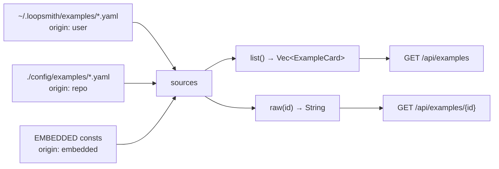

# Example Loops

# Example Loops

`config/examples/` is the loop library that ships with loopsmith: thirteen complete, non-toy configs covering research, refactoring, marketing, lead generation, and agent payments. They are simultaneously documentation, the web UI's starting-point gallery, and the broadest integration fixture in the repository — a config change that breaks the runtime fails a stress test over all thirteen before it reaches anyone.

Every example exists three times, and the three copies are kept identical by tests:

| Copy | Path | Why it exists |
|---|---|---|
| Source of truth | `config/examples/*.yaml` | Edited by hand; what the README links to |
| Markdown twin | `config/examples/*.md` | Same model, prose-shaped grammar |
| Embedded copy | `runtime/crates/loopsmith-cli/templates/examples/*.yaml` | `include_str!` cannot reach above the package root |

## The catalogue

Grouped the way `README.md` groups them:

**Build** — `refactor-loop` (behaviour-preserving refactor where `cargo test --workspace` is the gate and editing a test is a blocking failure), `landing-page-loop` (static site gated on Lighthouse ≥ 90/95 and page weight < 500 KB), `viral-game-loop` (a Godot game gated on build health, time-to-first-play, and a cold playtest).

**Find out** — `research-loop` (primary sources, every claim cited), `trend-radar-loop` (X/Instagram/TikTok, "rising" defined as 2× the trailing 7-day average), `idea-radar-loop` (product ideas that trace to ≥ 8 dated complaints across ≥ 2 venues), `account-watch-loop` (pre-viral signals, scored against what actually broke out by a *later* run).

**Reach people** — `traffic-loop` (measured in referred sessions, not posts made), `blogger-loop` (style budget plus an independent cold read), `cold-outreach-loop` (suppression list and opt-out as blocking checks, sending behind a human checkpoint), `sales-leads-loop` (`lawful-basis-recorded` is blocking), `marketing-automation-loop` (every claim traced to the business site).

**Spend money** — `x402-agent-loop` (real payments from a funded float, supervised by default; going autonomous means deleting one `human_checkpoint` line).

The set is deliberately uneven in shape. `refactor-loop` has no `schedules` beyond cron and file-change and no `default_skills`; `marketing-automation-loop` has a four-stage pipeline with an optional media phase. Reading two of them side by side is how the schema's optional halves become visible.

## Anatomy

Each `.yaml` is a `LoopConfig` and uses the same lettered spine, which `render_md` reproduces as sections A–J in the Markdown twin:

- **A `information`** — `key`/`value`/`note` triples. Configuration the nodes read, plus the rules a human is expected to replace (`Replace with who this page is for`). Numeric definitions live here: `prevalence_rule`, `rise_definition`, `pain_threshold`.
- **B `pre_execution`** — always ships with `done: false`. This is why an example cannot be run straight out of the box, and it is intentional: the loop refuses until a person confirms they have done the thing by hand once.
- **C `goals`** — named, `depends_on`-ordered, with a `priority`.
- **D `validations`** — the gate. Each has a `target` (a goal name or `overall`), a `mode` (`objective`, `subjective`, `percentage`), a `statement`, and a `Detector`: `file_exists`, `script`, `threshold`, `regex_match`, or `judge`.
- **E `success`** — usually one `percentage` entry at `threshold: 1.0` over `overall`.
- **F `stop_gates`** — `max_iterations`, `max_cost_usd`, `no_progress_iterations`, `stop_on_overall_success`, and friends.
- **G `schedules`** — `Trigger` variants: `manual`, `cron`, `interval`, `file_change`, `goal_satisfied`.
- **H `constraints.global`** — prose `rules`, `forbidden_paths`, `forbidden_commands`, `max_seconds`, and `human_checkpoint`. The checkpoints are where irreversible acts live: sending mail, publishing a post, authorising a payment.
- **I `execution_guidelines`** — named stages plus a `dependency` chain like `research -> draft -> revise`, mirrored by each node's `stage`.
- **J `default_skills`** — external skills (several examples pull `agent-reach` from GitHub).
- **`graph`** — `nodes` with `id`, `role` (`researcher`, `builder`, `judge`, `adversary`), `instruction`, `depends_on`, `goals`, `tier`, optional `provider`, `weight`, `isolated`; plus `concurrency` (`mode: auto`, a `cap`, and `min_marginal_gain`).
- **`providers`** — the same three-provider set almost everywhere (`ollama` cheap, `claude` standard, `openai` strong), a `cascade` per tier, and `enforce_judge_independence: true`.
- **`skills`**, **`context`** — acquisition policy and how many prior summaries carry forward.

### Conventions the set holds to

These are not enforced by the schema, but every example follows them and a new one should:

- **The writer never grades itself.** Builder nodes run on the `standard` tier via `claude`; judge and adversary nodes are pinned `tier: strong, provider: openai`. `enforce_judge_independence: true` backs this at runtime. `blogger-loop.yaml`'s header comment states the reasoning outright — "reads like a human" is exactly the claim a model will certify about its own output.
- **Subjective checks are paired with mechanical ones.** `blogger-loop` gates on `sentence_length_variance`, `stock_transitions_per_500w`, and `hedging_density` *and* on a `judge`. `landing-page-loop` pairs a taste review with Lighthouse numbers.
- **Builders that write files are `isolated: true`** so they get a worktree; researchers and judges are not.
- **Irreversible or public acts sit behind `human_checkpoint`**, never behind a model's judgement.
- **Anti-self-grading structure where the loop scores its own past output.** `account-watch-loop` runs its `score-past` stage *before* `watch` and `detect`, and adds `no-retroactive-predictions` (a script detector on timestamps) as a blocking `overall` check.
- **Detector scripts are named but not shipped.** `scripts/check-suppression.sh`, `scripts/assert-tests-untouched.sh`, and the rest do not exist in the repo. The user writes them; the harness stubs them.

## Distribution: how an example reaches a user

`runtime/crates/loopsmith-cli/src/web/examples.rs` owns the library the web UI shows. `sources()` walks three directories in priority order and the first to claim an id wins:

A user's own file shadows the shipped one of the same stem; a checkout's `config/examples` shadows the compiled-in copy, so editing a YAML in this repo shows up in `--web` without a rebuild. `list()` de-duplicates by id, drops anything that will not parse (better a missing card than one that fails on click), and sorts by the loop's own `name`.

`ExampleCard` is derived entirely from the config — there is no hand-written card metadata, so a card cannot disagree with the loop it describes. Beyond `id`, `name`, `blurb` (the `description`, truncated to 180 chars), and `origin`, it carries counts of `goals`, `validations`, `nodes`, and `providers`; `judge_validations`, which surfaces how much of the gate is an opinion; `trigger`, rendered into English by `describe_triggers` / `human_seconds` (`600` → `10m`, `21_600` → `6h`); and the two stop gates a newcomer most needs before pressing run, `max_iterations` and `max_cost_usd`.

The HTTP surface is two routes in `web/api.rs` — `list_examples` and `load_example`, the latter 404ing with `no example called \`{id}\`` — consumed by `api.examples()` and `api.example(id)` in `web/src/api.ts`, which returns `{ id, yaml, config }`.

### Keeping the embedded copies honest

`tools/sync-examples.sh` copies `config/examples/*.yaml` into `templates/examples/`, deleting copies whose source is gone. Forgetting to run it is caught by `embedded_examples_match_the_source_of_truth`, which compares byte-for-byte and also asserts the two directories have the same file count. That test returns early when `config/` is absent — the published-tarball case, where the embedded copy is not a copy of anything.

Adding an example therefore means adding a line to `EMBEDDED` in `examples.rs` *and* running the sync script.

## The two formats

`.md` and `.yaml` are two grammars over one `LoopConfig`. `loopsmith convert` infers direction from the input extension (`.md` → YAML, anything else → Markdown) and is a straight load-then-emit through `loopsmith_core::render_md` / `parse_md`. The same renderer backs `loopsmith --guided` and the web assembler's `Format::Markdown`.

`runtime/crates/loopsmith-core/tests/md_roundtrip.rs` uses the example set as its corpus:

- `every_example_config_survives_a_markdown_round_trip` — load each YAML, render to Markdown, parse it back, compare serialized forms.
- `every_shipped_md_example_means_the_same_as_its_yaml_twin` — load both files on disk and require them to describe the same loop. This is what stops a hand-edited `.md` from drifting; regenerate it with `convert` rather than editing it.

Comparison runs through `normalized()`, which trims trailing whitespace in every string. That is the one documented difference between the formats: a YAML folded scalar (`>`) ends in a newline that a Markdown bullet cannot carry.

## The examples as a test fixture

`runtime/crates/loopsmith-cli/tests/harness/mod.rs` turns a shipped example into something runnable without touching `config/examples/`. `Fixture::example(name, tag)` reads the YAML, then rewrites a copy in a scratch directory:

- `unblock` marks every `pre_execution` step done.
- `deterministic_providers` swaps the real provider commands for a command that emits a fixed judge block — no money, no disagreement between runs.
- `stub_scripts(Stubs)` generates the `scripts/` directory the config names, with stubs that exit on `$STUB_EXIT`. `Stubs::Pass` walks the success path and the export; `Stubs::Fail` reaches `no_progress_iterations`, the randomness gate, and `max_revisions_per_node`; `Stubs::PassFrom(n)` flips at an iteration using a counter file, since a loop cannot change its own environment mid-run.
- `satisfy_files` / `satisfy_metrics` write the artifacts and metrics the detectors look for. Artifact bodies carry a URL and a `post_id:` line because several examples put a `regex_match` on the same file a `file_exists` check already covers.

`all_examples()` enumerates the directory, so a new example is picked up by the two whole-set stress tests automatically:

- `every_example_completes_an_iteration_and_leaves_a_consistent_record` — capped at one iteration with everything satisfiable. Asserts the ledger opens with `RunStarted`, closes with `RunFinished` or `StopGateTriggered`, that the run log and the ledger have the same number of lines (they are written through one call, so divergence means one write path grew a branch the other did not), and that one iteration leaves exactly one summary.
- `every_example_survives_a_run_where_nothing_passes` — no stubs, no artifacts, no metrics. Script detectors error, file detectors miss, thresholds have nothing to read. The run must exit non-zero, write the stop to the ledger, and produce no export directory. A detector that fails closed is correct; a runtime that panics on it is not.

Individual examples also anchor narrower suites — `surface.rs` and `opt_in.rs` reach for `research-loop.yaml` and `refactor-loop.yaml` as realistic inputs.

## Adding an example

1. Write `config/examples/<name>-loop.yaml`. Lead with a comment block naming the failure mode the config is built against — every existing example does, and it is the part that teaches.
2. Generate the twin: `loopsmith convert config/examples/<name>-loop.yaml -o config/examples/<name>-loop.md`.
3. `tools/sync-examples.sh`, then add the `include_str!` line to `EMBEDDED` in `runtime/crates/loopsmith-cli/src/web/examples.rs`.
4. Link it from `README.md` and the table in `README-DETAIL.md`.
5. `cargo test`. The example must parse, carry a non-empty `description` (an empty one means a blank card), have at least one goal and one validation, survive the Markdown round trip, complete a supervised iteration, and fail cleanly when nothing is satisfiable.

Two invariants are easy to break by accident and worth restating: `pre_execution` steps stay `done: false` in the shipped file, and detector scripts stay unshipped. Both make the example un-runnable as-is, which is the point — the harness supplies them, and a user is expected to.