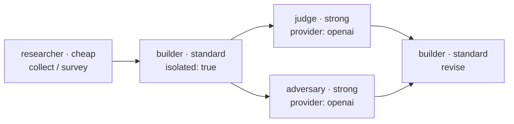
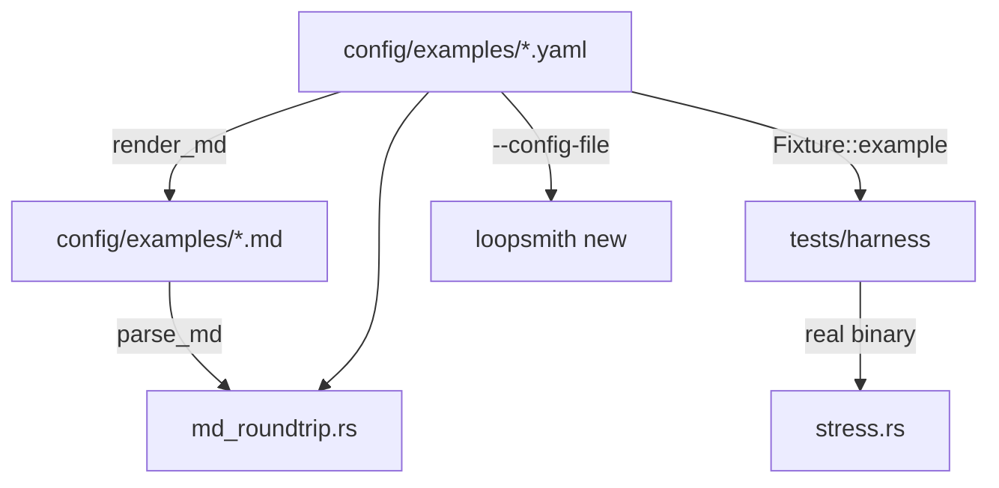

# Example Loops

# Example Loops — `config/examples/`

Thirteen worked loop configurations, each shipped twice: as `<name>.yaml` and as an equivalent `<name>.md`. They are the corpus the runtime is tested against, the starting point `loopsmith new --config-file` copies from, and the repository's argument-by-demonstration for what a checkable gate looks like.

Nothing here is library code. There are no functions, no call graph, and no imports — the module is data. Its contract is enforced from outside, by the schema (`config/loop.schema.json`), the validator (`loopsmith-core/src/validate.rs`), the round-trip test (`loopsmith-core/tests/md_roundtrip.rs`), and the stress harness (`loopsmith-cli/tests/stress.rs`). Editing an example is editing a test fixture.

---

## The two-file rule

Every example exists as YAML and as Markdown because loopsmith accepts both grammars for the same model. The `.md` files are **generated**, not hand-written:

```sh
loopsmith convert config/examples/research-loop.yaml -o config/examples/research-loop.md
loopsmith convert config/examples/research-loop.md            # goes back to YAML
```

`cmd/convert.rs` infers direction from the input extension (`loopsmith_core::is_markdown`) and is load-then-emit: `loopsmith_core::load` → `render_md` or `serde_yaml::to_string`.

Two tests hold the pair together:

- `every_example_config_survives_a_markdown_round_trip` — for each `.yaml`, render to Markdown, `parse_md` it back, and require the two `LoopConfig` values to match field for field.
- `every_shipped_md_example_means_the_same_as_its_yaml_twin` — the checked-in `.md` must still mean what its `.yaml` twin means.

Comparison is on the serialized form with trailing whitespace trimmed in every string (`normalized()`), because a YAML folded scalar (`>`) ends in a newline that a Markdown bullet cannot carry. That is the only permitted difference. **If you edit a `.yaml`, regenerate the `.md`.** Hand-editing one side is exactly what the second test exists to catch.

Note that the top-of-file prose comments in the YAML (the reasoning behind each config) do not survive the round trip — they are YAML comments, not model fields. The `.md` twin carries the structure, not the commentary.

## Anatomy shared by all thirteen

Every example fills the same A–J sections in the same order. What varies is only the content:

| Section | Key | Role in the corpus |
|---|---|---|
| A | `information` | Named constants a node may read: file paths, thresholds stated in prose, the placeholder the user must replace |
| B | `pre_execution` | The "do it by hand first" work list — **always shipped with `done: false`** |
| C | `goals` | Named, `depends_on`-ordered outcomes; nodes and validations both target these |
| D | `validations` | The gate. `objective` (script / file_exists / threshold / regex_match) and `subjective` (judge) |
| E | `success` | Usually one `percentage` entry at `threshold: 1.0` over `target: overall` |
| F | `stop_gates` | Iterations, wall clock, tokens, `max_cost_usd`, no-progress detection |
| G | `schedules` | `cron`, `manual`, or `file_change` |
| H | `constraints` | `rules`, `forbidden_paths`, `forbidden_commands`, `max_seconds`, `human_checkpoint` |
| I | `execution_guidelines` | Named stages plus a `dependency` chain like `research -> draft -> revise` |
| J | `default_skills` | Sub-agents the loop may use; seven examples name `agent-reach` |

Below A–J come `graph`, `providers`, `skills`, and `context`.

### `pre_execution` is unfinished on purpose

`check_pre_execution` in `validate.rs` emits a hard error for any step not marked done:

> `N step(s) not marked done: … . Automating before understanding produces fast, confident garbage`

So **no shipped example will pass `loopsmith validate` as it stands**, and none will run. This is the single most load-bearing property of the corpus and must be preserved when adding an example. The stress harness works around it by rewriting a copy in a scratch directory (`harness/mod.rs`), never `config/examples/` itself.

### Detector scripts do not exist

Examples reference `scripts/check-citations.sh`, `scripts/check-suppression.sh`, `scripts/check-venues.sh`, and about a dozen others. None of them are in the repo. The named script is the specification of a check the user must write for their own project; the harness generates stubs that exit with `$STUB_EXIT` when it needs to run one.

### `regex_match` artifacts must be registered

`blogger-loop` uses `{ type: regex_match, artifact: research, pattern: "https?://" }`. The name `research` resolves because the same config has a `file_exists` detector on `out/research.md` — evidence is registered under both the full path and the stem. A regex naming anything else has nothing to match and fails closed forever, which reads as rigour while being permanently unsatisfiable. `validate.rs` checks this; keep new regex detectors pointed at a path some `file_exists` detector already names.

## The catalogue

**Build things**

| Loop | Gate that carries the weight |
|---|---|
| `refactor-loop` | `cargo test --workspace` plus `scripts/assert-tests-untouched.sh` — the loop is forbidden from editing tests to make them pass |
| `landing-page-loop` | Lighthouse ≥ 90 performance / ≥ 95 accessibility, page weight < 500KB, every CTA resolving |
| `viral-game-loop` | Headless Godot export, time-to-first-play, a cold playtest — "viral" decomposed into four checkable things |

**Find things out**

| Loop | Gate that carries the weight |
|---|---|
| `research-loop` | `independent_sources ≥ 4`, per-claim citation check, link resolution, an adversary node that must steelman the opposing case |
| `trend-radar-loop` | Every trend cites post IDs and a rise ratio against a stated numeric `rise_definition` |
| `idea-radar-loop` | `min_complaints_per_pain ≥ 8` across ≥ 2 venues, plus a competitor check that reports "already taken" honestly |
| `account-watch-loop` | Predictions are timestamped and scored by a *later* run; `scripts/check-timestamps.sh` blocks backdating |

**Reach people**

| Loop | Gate that carries the weight |
|---|---|
| `traffic-loop` | `referred_sessions ≥ 50` — measured traffic, not posts made — and no post to a venue that forbids promotion |
| `blogger-loop` | Three mechanical style metrics (`sentence_length_variance`, `stock_transitions_per_500w`, `hedging_density`) *and* an independent cold read |
| `sales-leads-loop` | `lawful-basis-recorded`; a lead without a recorded source and basis cannot satisfy the gate |
| `cold-outreach-loop` | `suppression-honoured`, `opt-out-present`, `nothing-sent-unreviewed`; the most constrained config here |
| `marketing-automation-loop` | Every claim traced to the business site, disclosure present, cadence respected |

**Spend money**

| Loop | Gate that carries the weight |
|---|---|
| `x402-agent-loop` | Merchant allowlist, `total_spend_usd ≤ cap`, balance reconciliation every iteration; posture chosen by one line in `human_checkpoint` |

## Patterns the corpus repeats

These are the reason the examples exist. Each one shows up in most configs, and a new example is expected to follow them.

**Decompose the unmeasurable claim into measurable parts, then judge the remainder separately.** `blogger-loop` is the clearest case: "sounds human" becomes three numeric thresholds plus one `judge` detector scored against a hand-written reference post, and both are blocking. `landing-page-loop` does the same to "looks good"; `viral-game-loop` to "shareable".

**Put the judge on a different model family than the builder.** Every example sets `enforce_judge_independence: true` and pins its judge nodes to `provider: openai` while builders run on the `standard` tier (`claude`). A model grading its own output is not a gate.

**Give the adversary its own node.** `research-loop`'s `critic`, `account-watch-loop`'s `challenge`, `cold-outreach-loop`'s `specificity-check`, `x402-agent-loop`'s `challenge-plan` — all `role: adversary`, all instructed to argue *against* the work, not to improve it.

**Isolate the writer.** Builder nodes that produce the deliverable carry `isolated: true`, so a wave of parallel builders gets a worktree each rather than racing on the same files.

**Order stages so self-grading is hard.** `account-watch-loop` runs `score-past -> watch -> detect`: yesterday's predictions are scored *before* today's are made, because it is harder to grade yourself generously when you have not yet decided what to predict.

**Put irreversible actions behind `human_checkpoint`.** Publishing, sending, calling, deploying, paying, adopting a proposed config change. `x402-agent-loop` documents the supervised→autonomous switch as removing exactly one line, and says what you must have watched before doing it.

**Refuse to fake a missing capability.** "If a platform's credentials are missing, skip that platform and say so." A missing key is a skipped platform, never an estimate.

### The recurring graph shape

Most examples are the same four-part topology with different labels — cheap collection, a standard-tier isolated build, and two strong-tier reviewers on a different provider fanning out from the build:



`refactor-loop` widens the middle instead of the ends — `refactor-a` and `refactor-b` both depend on `survey`, so auto-concurrency picks 2 despite `cap: 16`, because a third worker has nothing to do. `trend-radar-loop` widens the front (`pull-x`, `pull-instagram`, `pull-tiktok` in one wave, `cap: 8`).

### The provider block is near-identical everywhere

`ollama` (cheap, `qwen2.5-coder`) → `claude` (standard, `claude_code`) → `openai` (strong, `curl` to the chat completions endpoint, `requires_env: [OPENAI_API_KEY]`), with `cascade: { cheap: [ollama, claude], standard: [claude], strong: [openai, claude] }`. Two deviations, both deliberate: `research-loop` uses `llama3` and lets `standard` fall back to `ollama`; `research-loop` and `refactor-loop` both give `claude` the `strong` tier as well, so they degrade rather than fail without an OpenAI key.

`requires_env` is presence-checked only — loopsmith never reads the value, so a key cannot reach a prompt, a log, or the ledger.

## How the runtime consumes these files



**`loopsmith-cli/tests/harness/mod.rs`** turns an example into something runnable without touching the source tree. `Fixture::example(name, scratch)` copies the config, marks every `pre_execution` step done, swaps the providers for deterministic commands that emit a fixed judge block, generates a `scripts/` directory of stubs driven by `Stubs::{Pass, Fail, PassFrom(n)}`, and optionally initialises a git repo so worktree isolation is real rather than silently degraded. `satisfy_files()` writes artifacts containing a URL and a `post_id:` line, because that is what the shipped `regex_match` detectors look for; `satisfy_metrics()` supplies the numbers the `threshold` detectors read.

**`loopsmith-cli/tests/stress.rs`** then runs the whole set through the real binary, twice:

- `every_example_completes_an_iteration_and_leaves_a_consistent_record` — one supervised iteration with detectors satisfiable. Asserts on artifacts, not stdout: the ledger opens with `RunStarted` and closes with `RunFinished` or `StopGateTriggered`, the run log has exactly as many lines as the ledger has entries, and one iteration leaves exactly one summary.
- `every_example_survives_a_run_where_nothing_passes` — no stubs, no artifacts, no metrics. The process must exit non-zero, write the stop to the ledger, and produce no export directory. A detector that fails closed is correct; a runtime that panics on it is not.

Because `all_examples()` reads the directory, **adding a `.yaml` here adds it to both tests automatically**. A config that cannot survive a starved run is a config that will break CI.

## Adding an example

1. Write the `.yaml`. Lead with a comment block naming the failure mode the config is built against — that is the house style, and it is what makes an example teach rather than just run.
2. Leave every `pre_execution` step `done: false`.
3. Make the gate mostly objective. If the interesting property is subjective, decompose it into measurable parts first and put the judge on a different provider than the builder.
4. Point any `regex_match` at a path some `file_exists` detector already names.
5. Put anything irreversible or outward-facing in `human_checkpoint`.
6. Generate the twin: `loopsmith convert config/examples/<name>.yaml -o config/examples/<name>.md`.
7. Run `cargo test -p loopsmith-core --test md_roundtrip` and `cargo test -p loopsmith-cli --test stress`.
8. Add the row to the table in `README-DETAIL.md#the-examples` and the grouped link line in `README.md`, both of which currently say "Thirteen".