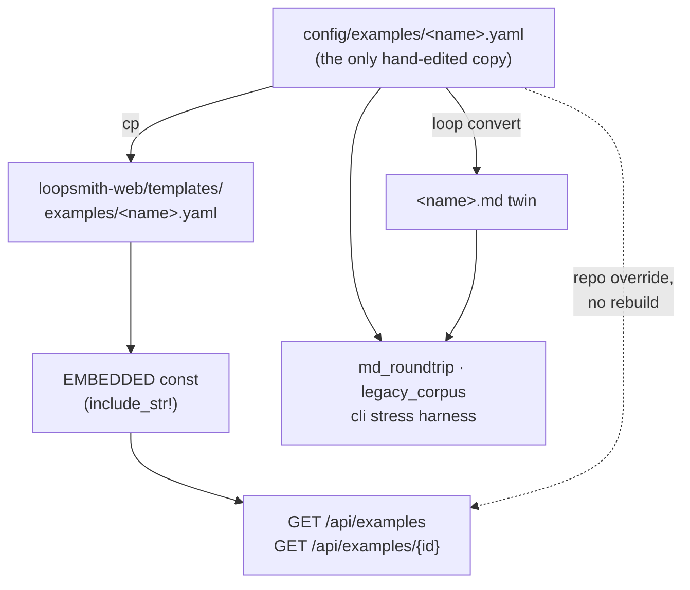

# Example Loops

# Example Loops — `config/examples/`

Fifteen worked loop configurations that ship with loopsmith, plus a frozen 0.3-era corpus in `config/examples/legacy/`. They are simultaneously the primary teaching material, the fixture set for the integration tests, and the example library compiled into the web UI. Editing one of these files touches all three roles, so this module has more invariants around it than its extension (`.yaml`, `.md`) suggests.

## What the module is for

An example is a complete, runnable `LoopConfig` written around one lesson — how a gate is built out of scripts rather than opinions, how `human_checkpoint` stops an irreversible action, how `evolution.baseline` fences self-modification. The header comment at the top of each `.yaml` states that lesson explicitly and is the first thing to read:

```
# Draft and send cold outreach — behind a human checkpoint, with an opt-out.
# ...
# Two decisions carry the weight:
#   1. `human_checkpoint` covers sending. ...
```

These are the most-copied files in the repository. That is also why they are the strictest: three test suites and two CI steps exist purely to stop them drifting from the shape the tool actually has.

## Every example ships as a pair

Each loop is authored **once**, as `<name>.yaml`. The `<name>.md` beside it is *generated* from it and must never be hand-edited:

```bash
loopsmith loop convert config/examples/research-loop.yaml   # prints the Markdown twin
./tools/sync-examples.sh                                     # regenerate all twins + sync the crate copies
./tools/sync-examples.sh --check                             # fail if anything is stale (what CI runs)
```

The two formats are the same model in two grammars — YAML keys on one side, `## Section` / `### item` / `- field: value` bullets on the other. `loopsmith-core`'s `render_md` and `parse_md` are inverses, and `runtime/crates/loopsmith-core/tests/md_roundtrip.rs` enforces it from both directions:

- `every_example_config_survives_a_markdown_round_trip` — load the `.yaml`, render, re-parse, require an identical `LoopConfig`.
- `every_shipped_md_example_means_the_same_as_its_yaml_twin` — load both files on disk and compare. This is the test that catches a hand-edited `.md`.

Both comparisons normalise by trimming trailing whitespace inside strings: a YAML folded scalar (`>`) ends in a newline that a Markdown bullet cannot carry, and that is the only difference the Markdown grammar is allowed to introduce.

Two spellings of the same field coexist across the library and both normalise to the same model. Older examples use the `isolated: true` shorthand on a node; `container-refactor-loop` and `self-tuning-loop` use the explicit form:

```yaml
isolation:
  mode: worktree     # or: none | container (+ network: bool)
```

The rendered `.md` always shows the explicit form, which is why `write` appears as `isolation: mode: worktree` in `blogger-loop.md` but as `isolated: true` in `blogger-loop.yaml`.

## Anatomy

Every 1.0 example has the same four top-level sections — `intent`, `execution`, `safety`, and optionally `evolution` — plus `name`, `version`, `description`, `environment`, and `features`.

**`intent`** — what the loop is for, in terms a person can check.
- `background`: `key`/`value`/`note` triples. These are the knobs a copier edits — `categories`, `daily_cap`, `test_command`, `prevalence_rule`. Values that must be replaced say so in the `note` ("Replace. `Any good idea` is not a segment and returns nothing usable").
- `prerequisites`: the manual work that must precede automation. See below.
- `goals`: named, `depends_on`-ordered, with a `priority`.
- `success`: usually a single `target: overall`, `mode: percentage`, `threshold: 1.0` entry meaning "every blocking check passes".

**`execution`** — how the work gets done.
- `graph.nodes`: `id`, `role` (`researcher`, `builder`, `judge`, `adversary`), `instruction`, `depends_on`, `goals`, `stage`, `tier`, `weight`, `isolation`. `graph.join.strategy`, `graph.concurrency` (`mode: auto`, `cap`, `min_marginal_gain`), and `graph.container_image` where containers are used.
- `providers`: the same three-provider cascade in nearly every example — `ollama` (cheap, local), `claude` (standard, `claude_code`), `openai` (strong, `curl` + `requires_env: [OPENAI_API_KEY]`) — with `cascade` mapping tiers to ordered provider lists and `enforce_judge_independence: true`.
- `phases.items` + `phases.dependency`: named stages with a `guideline`, wired as `research -> draft -> revise`. Node `stage` values must match a phase name.
- `default_skills`, `skills`, `memory`, `triggers`.

**`safety`** — what must not happen, and when to stop.
- `checks`: the gate. Each has a `target` (a goal name or `overall`), `mode: objective | subjective`, a `statement`, and a `detector` of type `file_exists`, `regex_match`, `threshold`, `script`, or `judge`.
- `gates.stop` (`max_iterations`, `max_cost_usd`, `max_wall_clock_seconds`, `no_progress_iterations`, `stop_on_overall_success`), and in `container-refactor-loop` also `gates.entry` and `gates.rollback`.
- `limits.global`: prose `rules`, `forbidden_paths`, `forbidden_commands`, `max_seconds`, `human_checkpoint`.
- `recovery` per failure class, `alerts`, `protected.components`.

**`evolution`** — present and `enabled: true` in exactly one example (`self-tuning-loop`), with `baseline`, `max_regression`, `allowed_kinds`, `require_sandbox`, `require_approval`, `keep_rollback`.

### The deliberate refusal

Every shipped example **fails `loopsmith loop validate` with exactly one error**, and that is load-bearing, not a bug:

```bash
$ loopsmith loop validate config/examples/research-loop.yaml
  error  intent.prerequisites: 2 step(s) not marked done: …
```

`check_pre_execution` in `runtime/crates/loopsmith-core/src/validate.rs:267` emits that error while any `prerequisites` entry has `done: false`, and warns when the list is empty at all. Every example ships with all of its steps false because an example config describes a job nobody has done yet. A copier does the job by hand, ticks the steps with what they actually did, and only then can the loop run.

CI turns this into the cheapest regression signal in the project: the **"Every example refuses for exactly one reason"** step (`.github/workflows/ci.yml:103`) validates all 30 example files and fails if any produces more than one error or any warning at all. A schema change that breaks a config shows up there immediately.

### Conventions that hold across the library

These are not enforced by the schema, but breaking one in a new example makes it teach the wrong thing:

- **The judge sits on a different provider from the writer.** `enforce_judge_independence: true` everywhere, `judge` nodes pinned to `provider: openai` / `tier: strong`. `container-refactor-loop` carries a second provider family *purely* so a judge has somewhere to run — with one provider, judge independence refuses every judgment and nothing can pass.
- **Objective and subjective checks are mixed, and the objective ones carry the weight.** `blogger-loop` is the clearest case: "sounds human" is decomposed into three `threshold` detectors (`sentence_length_variance`, `stock_transitions_per_500w`, `hedging_density`) *plus* a `judge`, and all four are blocking.
- **Irreversible actions go behind `human_checkpoint`**, not behind a stern `instruction`. Publishing, sending, paying, deploying, adopting a proposed config value.
- **Anti-self-grading checks.** `account-watch-loop` scores last run's predictions in its *first* phase, before making new ones, and enforces it with `no-retroactive-predictions` (a `script` detector over timestamps).
- **`features.self_evolution: false`** in every example but `self-tuning-loop`.

## The library

| Example | The lesson it carries |
|---|---|
| `research-loop` | Smallest example whose checks are all deterministic. Cited brief, adversary node, `source_floor`. |
| `refactor-loop` | The test suite as the gate; editing a test to make it pass is a blocking failure. |
| `container-refactor-loop` | Wide parallelism done safely: three `builder` nodes in one `wait_for_all` wave, each `isolation: mode: container` over its own worktree, `gates.entry` requiring a clean tree, `gates.rollback` on a red suite. |
| `self-tuning-loop` | The fence around self-evolution — `evolution.baseline` measured from real manual runs, `max_regression: 0.05`, `allowed_kinds` that deliberately exclude `validation_change`, and `protected.components` a proposal may never touch. |
| `landing-page-loop` | A strong gate for a design task: `npm run build` exits zero, Lighthouse ≥ 90/95, page weight < 500KB, every CTA resolves. Taste is one judge among many, not the verdict. |
| `blogger-loop` | Gating "reads like a person wrote it" by measuring the mechanical tells and putting the taste judgment on another provider. |
| `idea-radar-loop` | Ideas that trace to dated verbatim complaints, with a numeric `pain_threshold` and an honest competitor check. |
| `trend-radar-loop` | A `rise_definition` as a number (2× the trailing 7-day average), every trend carrying the post IDs it came from. |
| `account-watch-loop` | Predictions written with timestamps and scored by a *later* run; unfalsifiable predictions count as misses. |
| `traffic-loop` | Measuring referred sessions from an analytics export rather than posts made, with per-venue rules as constraints. |
| `sales-leads-loop` | Lawful collection: `permitted_sources` / `forbidden_sources`, and `lawful-basis-recorded` as a blocking check. |
| `cold-outreach-loop` | The most constrained example. The loop drafts and queues; a human releases. `suppression-honoured` and `opt-out-present` are blocking. |
| `marketing-automation-loop` | Claims sourced to the product's own site, one post per platform per day, publishing behind a checkpoint. |
| `viral-game-loop` | Decomposing an ungateable word ("viral") into four checkable ones: builds, runs headless, time-to-first-play, cold playtest. |
| `x402-agent-loop` | An agent that spends money, with two documented postures (supervised as shipped; autonomous by removing one `human_checkpoint` line) behind a funded float, a merchant allowlist, and `max_cost_usd`. |

`wiki/Examples.md` carries this table for users, plus a "which one to start from" section. Keep the two in step when adding an example.

### `config/examples/legacy/` — the migration corpus

Thirteen 0.3-shaped copies of the examples that predate 1.0 (everything except `container-refactor-loop` and `self-tuning-loop`). They are **not documentation, and nothing links to them.** They exist so `runtime/crates/loopsmith-core/tests/legacy_corpus.rs` can assert three things:

- `every_legacy_example_migrates_to_the_one_beside_it` — loading the 0.3 file and the 1.0 file of the same name must produce identical `LoopConfig`s. That is a stronger claim than "the old file still parses": it says the relocation table puts every key exactly where the 1.0 file puts it by hand, checked against thirteen configs someone actually wrote.
- `the_legacy_corpus_is_actually_legacy` — each corpus entry must still trip at least one relocation, or it proves nothing.
- `no_shipped_example_still_uses_a_03_key` — the inverse for the files outside `legacy/`. A shipped example needing the relocation table would print a deprecation notice to someone who just installed the tool.

Don't migrate a `legacy/` file. Don't add a 0.3 key to a shipped one.

## How an example reaches a user


```mermaid
graph TD
    Y["config/examples/&lt;name&gt;.yaml<br/>(the only hand-edited copy)"]
    MD["&lt;name&gt;.md twin"]
    CRATE["loopsmith-web/templates/<br/>examples/&lt;name&gt;.yaml"]
    EMB["EMBEDDED const<br/>(include_str!)"]
    API["GET /api/examples<br/>GET /api/examples/{id}"]
    TESTS["md_roundtrip · legacy_corpus<br/>cli stress harness"]

    Y -->|loop convert| MD
    Y -->|cp| CRATE
    CRATE --> EMB
    EMB --> API
    Y -.->|"repo override,<br/>no rebuild"| API
    Y --> TESTS
    MD --> TESTS
```

Both derived copies are produced by `tools/sync-examples.sh`, and both have a test that fails when it has not been run.

The crate copy exists for a specific reason documented in `runtime/crates/loopsmith-web/src/examples.rs`: `include_str!` cannot reach above the package root, and `config/` is excluded from the published tarball. An example served from `config/` works in a checkout and 404s for everyone who installed from crates.io, npm, pip, or brew.

At runtime the web UI resolves examples from three sources, first to claim an `id` winning:

1. `~/.loopsmith/examples/*.yaml` — the user's own (`origin: "user"`)
2. `config/examples/*.yaml` relative to the working directory (`origin: "repo"`) — live edits in a checkout appear without a rebuild
3. the compiled-in copies (`origin: "embedded"`)

`examples::list()` builds one `ExampleCard` per id, and none of its fields are hand-written metadata: `name`, `blurb`, `goals`, `validations`, `judge_validations`, `nodes`, `providers`, `trigger`, `max_iterations`, `max_cost_usd` are all parsed out of the config itself, so a card cannot disagree with the loop it describes. `judge_validations` is surfaced deliberately — a loop judged entirely by models is a loop whose gate is an opinion. An example that fails to parse is dropped rather than shown as a card that errors on click.

## The examples as the integration fixture set

`runtime/crates/loopsmith-cli/tests/stress.rs` runs **every** example through the real binary:

- `every_example_completes_an_iteration_and_leaves_a_consistent_record` — one capped iteration with satisfiable detectors; asserts the ledger opened, recorded why it stopped, that the run log and ledger agree line for line, and that one iteration left exactly one summary.
- `every_example_survives_a_run_where_nothing_passes` — no stubs, no artifacts, no metrics; the run must exit non-zero and write `StopGateTriggered` to the ledger rather than panic.

`tests/harness/mod.rs` is what makes a shipped example runnable, and reading it explains several things about the configs:

- `unblock()` flips every `prerequisites.done` to `true` — otherwise nothing would validate.
- `deterministic_providers()` rewrites each provider to `printf` while **preserving provider ids**, because `enforce_judge_independence` compares ids; renaming them would silently disable the check the examples are demonstrating.
- `stub_scripts()` generates a stub for every `scripts/…` detector a config names. **The examples reference 29 distinct script detectors between them and the repository ships none of them.** `scripts/check-suppression.sh`, `scripts/check-timestamps.sh`, `scripts/word-count.sh` and the rest are contracts a copier implements — an example is deliberately not a turnkey program.
- `satisfy_files()` / `satisfy_metrics()` write the artifacts and `metrics.json` keys the detectors name. The stub artifact body carries a URL and a `post_id:` line because that is what the shipped `regex_match` detectors look for.

`research-loop.yaml` and `refactor-loop.yaml` additionally serve as named fixtures in `tests/surface.rs`, `tests/opt_in.rs`, and `tests/grammar.rs`. Changing either one can move assertions in those files.

## Adding or changing an example

1. Author `config/examples/<name>.yaml` only. Lead with a header comment stating the one lesson. Point `prerequisites` at real manual work and leave every step `done: false`.
2. Give the gate at least one objective detector per goal, and put any judge on a provider the builder does not use.
3. `cd runtime && cargo build --release --bin loopsmith`, then `./tools/sync-examples.sh`. This regenerates the `.md`, copies the YAML into `runtime/crates/loopsmith-web/templates/examples/`, and removes orphans in both directions.
4. **Add an `include_str!` entry to `EMBEDDED` in `runtime/crates/loopsmith-web/src/examples.rs`.** The sync script copies the file but does not touch that array; `embedded_examples_match_the_source_of_truth` compares `EMBEDDED.len()` against the YAML count on disk and fails if you forget.
5. Add a row to `wiki/Examples.md`, and to "Which one to start from" if it is the best example of something.
6. `cargo test --workspace` and `loopsmith loop validate` on both files — exactly one error, zero warnings.

Things that will bite:

- Several test and CI thresholds are floors tied to the current library size: `seen -ge 30` in CI (15 YAML + 15 Markdown), `checked >= 15` in `no_shipped_example_still_uses_a_03_key`, `checked >= 13` over the legacy corpus. Adding examples is free; removing one means updating the floor deliberately.
- Every `.md` needs a `.yaml` twin and vice versa — an orphan in either direction is a failure (`sync-examples.sh --check`, and `every_shipped_md_example_means_the_same_as_its_yaml_twin`).
- A `regex_match` detector can only name an artifact that one of the same config's `file_exists` detectors registers, under its full path or its stem. Anything else has nothing to match and fails closed for the life of the loop.
- The module doc comment at the top of `examples.rs` still says "Thirteen working loops ship inside the binary" while fifteen are in `EMBEDDED`. Fix it next time you add one.