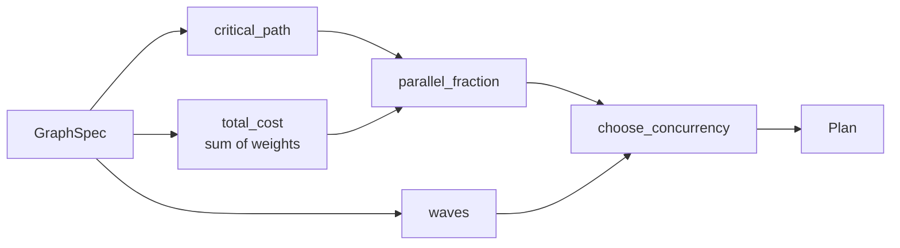
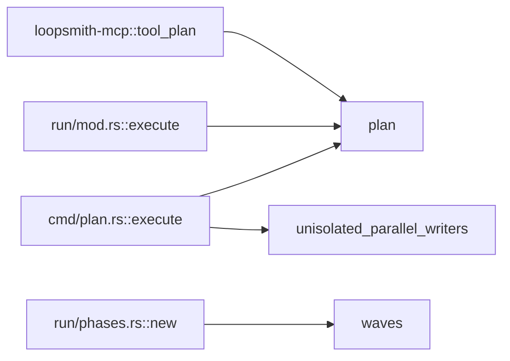

# Execution Graph & Concurrency Planning

# Execution Graph & Concurrency Planning (`loopsmith-graph`)

`runtime/crates/loopsmith-graph/src/lib.rs`

Turns a flat list of nodes that declare `depends_on` into an execution schedule: which nodes may run together, how long the graph can possibly take, and how many workers are worth paying for. Everything in this crate is pure, deterministic, and allocation-light enough to re-run before every iteration of a loop — there is no I/O, no async, and no state carried between calls.

The crate depends only on `loopsmith-core` (for `GraphSpec`, `NodeSpec`, `Phase`, `Concurrency`, `Role`), `serde`, and `thiserror`.

## The three jobs

1. **Cycle and reference validation** — a cyclic or dangling `depends_on` is a config bug. It is caught before anything is dispatched, as a typed `GraphError`, not as a deadlock at runtime.
2. **Wave scheduling** — Kahn's algorithm grouped by level. Every node in a wave has all its dependencies satisfied by earlier waves, so the whole wave is safe to run concurrently.
3. **Sizing** — the critical path is the floor on wall-clock time that no amount of parallelism can lower; Amdahl's law is the ceiling on what additional workers can buy. Both are computed from the graph itself, before dispatch.

## The planning pipeline

`plan(&GraphSpec) -> Result<Plan, GraphError>` is the single entry point most callers want. It composes the four public primitives:



Note that `critical_path` calls `waves` internally to get a topological order, so a full `plan()` runs Kahn's algorithm twice. That is deliberate — the primitives stay independently callable, and the graphs are small.

### `Plan`

```rust
pub struct Plan {
    pub waves: Vec<Wave>,
    pub critical_path: Vec<String>,
    pub critical_path_cost: f64,
    pub total_cost: f64,        // fully serial cost
    pub parallel_fraction: f64, // p, derived not guessed
    pub concurrency: usize,     // chosen worker count
    pub predicted_speedup: f64, // amdahl(p, concurrency)
    pub speedup_ceiling: f64,   // 1 / (1 - p)
}
```

A `Wave` is just `{ index: usize, nodes: Vec<String> }` — node ids, sorted.

## `DagNode`: the scheduler is not welded to `NodeSpec`

```rust
pub trait DagNode {
    fn id(&self) -> &str;
    fn deps(&self) -> &[String];
    fn weight(&self) -> f64;
}
```

Three things is all scheduling needs from a node: what it's called, what it waits for, what it costs. `waves` and `critical_path` are generic over `N: DagNode`, which is what keeps the config's section G execution graph and section I execution guidelines on one implementation of Kahn's algorithm instead of two.

Two impls ship in this crate:

| Type | `id` | `weight` |
|---|---|---|
| `NodeSpec` (section G) | `self.id` | `self.weight` |
| `Phase` (section I) | `self.name` | always `1.0` |

Phases carry no cost of their own — the work lives in the nodes assigned to them — so the critical path through the phase graph degenerates to its longest chain. The test `any_dag_node_type_schedules_through_the_same_code` schedules a local `Step` struct that shares no fields with `NodeSpec` at all, which is the regression guard on that decoupling.

If you add a third graph-shaped concept, implement `DagNode` for it rather than writing another topological sort. Nodes with no meaningful cost should return `1.0` from `weight()`, not `0.0` — a zero weight makes the node invisible to critical-path selection.

## Wave scheduling

```rust
pub fn waves<N: DagNode>(nodes: &[N]) -> Result<Vec<Wave>, GraphError>
```

Standard Kahn, with the ready set drained a whole level at a time so each level becomes a `Wave`. Two properties worth knowing when you touch it:

- **Output is deterministic.** Indegrees live in a `BTreeMap` and the next ready set is a `BTreeSet`, so iteration order never depends on hashing; node names within a wave are additionally sorted explicitly. Two runs over the same spec produce byte-identical plans.
- **Both error paths are checked here, not later.** An unresolvable `depends_on` fails fast with `GraphError::UnknownNode` while indegrees are being built. A cycle is detected structurally at the end: if `placed != nodes.len()`, the nodes still carrying a nonzero indegree are exactly the ones trapped in or downstream of the cycle, and their ids are joined into `GraphError::Cycle`.

## Critical path

```rust
pub fn critical_path<N: DagNode>(nodes: &[N]) -> Result<(Vec<String>, f64), GraphError>
```

Longest weighted path. Because the wave order is a valid topological order, a single forward pass over the flattened waves suffices: each node's best cost is `max(dep costs) + own weight`, with a `prev` map recording which dependency won so the path can be walked back and reversed.

Given `a(1) → b(5) → d(1)` and `a(1) → c(1) → d(1)`, the result is `(["a", "b", "d"], 7.0)`. An empty node list yields `(vec![], 0.0)`.

Ties are broken by iteration order: the terminal node is chosen with `max_by` over a `BTreeMap`, which returns the *last* maximal element, so an exact tie resolves to the alphabetically later id. Deterministic, but do not build logic on top of which of two equal-cost paths gets reported.

## Choosing a worker count

Three functions, in the order the pipeline uses them.

**`parallel_fraction(total_cost, critical_cost) -> f64`** — the share of total work not stuck on the critical path, clamped to `[0, 1]`. This is the mechanical version of the "and then" test: work that genuinely reads an upstream output stays serial, everything else is parallelizable. A pure chain gives `p = 0.0`; sixteen independent unit-weight nodes give `p = 15/16 = 0.9375`. `total_cost <= 0.0` returns `0.0` rather than dividing by zero.

**`amdahl(p, n) -> f64`** — `1 / ((1 - p) + p/n)`. `p` is clamped; `n == 0` returns `0.0`; `n == 1` returns exactly `1.0` for any `p`. The point of having it is that it refuses to flatter a fleet:

| p | n | speedup |
|---|---|---|
| 0.95 | 16 | 9.14 |
| 0.70 | 16 | 2.91 |
| 0.95 | 256 | 18.62 |

**`speedup_ceiling(p) -> f64`** — `1 / (1 - p)`, the limit as workers approach infinity, and `f64::INFINITY` at `p >= 1.0`. In practice `plan()` cannot reach `p == 1.0` with positive weights, since the critical path always contains at least one node, but downstream formatting should still be prepared for a non-finite value if it calls `speedup_ceiling` directly.

**`choose_concurrency(&Concurrency, &[Wave], p) -> (usize, f64)`** returns the worker count and its predicted speedup. Every mode is bounded above by `widest` — the size of the largest wave — because no scheduling policy can use more workers than the graph ever makes runnable at once:

- `Sequential` → `(1, 1.0)`.
- `Fixed { max_parallel }` → `max_parallel.max(1).min(widest)`. A spec asking for 32 workers over a two-node graph gets 2.
- `Auto { cap, min_marginal_gain }` → grows the fleet from 1 while each additional worker still buys at least `min_marginal_gain` of extra speedup, and stops at the first worker that doesn't, capped at `min(widest, cap)`.

Worked example, from `auto_concurrency_stops_when_marginal_gain_dries_up`: 16 independent nodes, so `p = 0.9375`, `widest = 16`, `cap = 16`, `min_marginal_gain = 0.5`. Marginal gains run 0.88, 0.78, 0.70, 0.63, 0.57, 0.52 — and the eighth worker would add only 0.47, below the threshold. The loop breaks and `Auto` settles on **7 workers at ×5.09**, not 16. Sizing a fleet at the cap here would pay more than double for a fifth of the remaining headroom.

## Reported hazard: unisolated parallel writers

```rust
pub fn unisolated_parallel_writers(spec: &GraphSpec, waves: &[Wave]) -> Vec<String>
```

Scans each wave for `NodeSpec`s with `role == Role::Builder` and `isolated == false`. If more than one lands in the same wave, they will write to the same working tree concurrently and clobber each other, so all of them are returned. Fewer than two writers in a wave reports nothing.

This is deliberately a *report*, not a fix. The remedy — mark nodes `isolated`, add a dependency edge, or drop to `Sequential` — is a config decision the crate has no business making. The returned `Vec` is flat across waves, so an id can appear more than once if the node participates in multiple offending waves (`src/cmd/plan.rs` is the consumer that surfaces this to the user).

## How the rest of loopsmith uses this



- **`src/run/mod.rs::execute`** — the real scheduler. Calls `plan()` to get waves and the worker count before dispatching an iteration.
- **`src/cmd/plan.rs::execute`** — the `loopsmith plan` CLI command. Calls `plan()` and additionally `unisolated_parallel_writers` to warn about write conflicts without running anything.
- **`loopsmith-mcp::tool_plan`** — exposes the same planning pass over the local stdio MCP server.
- **`src/run/phases.rs::new`** — calls `waves()` directly over `Phase` values (not `plan()`), because phase gating only needs the level structure; there is no fleet to size for phases.

Because all four go through the same two functions, a change to wave ordering or cycle detection changes the CLI, the runtime, the MCP surface, and phase gating simultaneously. Run impact analysis before editing `waves`, `critical_path`, or `plan`.

## Contributing notes

- **Keep it deterministic.** No `HashMap`/`HashSet` in the scheduling path — `BTreeMap`/`BTreeSet` are load-bearing for reproducible plans, not a style choice.
- **Keep it total.** Every numeric helper already handles its degenerate input (`n == 0`, `total_cost <= 0.0`, empty node list, `p` outside `[0, 1]`). New arithmetic should do the same rather than pushing validation onto callers.
- **The unit tests are the spec.** `amdahl_matches_the_published_table` pins the speedup numbers quoted in the docs; `fixed_concurrency_is_capped_by_the_widest_wave` pins the widest-wave bound; the three `..._foreign_node_type...` tests pin the `DagNode` decoupling. If a change requires editing one of those, it is an intentional behavior change and should be treated as such.
- **Only `src/` ships.** `Cargo.toml` sets `include = ["/src/**/*", "/README.md"]` because the integration tests read `config/examples/` and `config/loop.schema.json` from the repository root, which no crate tarball can contain. Don't add test fixtures that assume the packaged crate can see repo-root files.