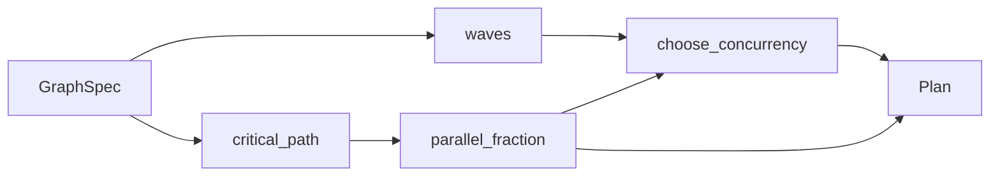

# Execution Graph & Concurrency Planning

# Execution Graph & Concurrency Planning

The `loopsmith-graph` crate is the scheduler for loopsmith's node plane. Nodes declare `depends_on`; this crate answers three questions from that declaration alone, before any node is dispatched:

1. Is the graph acyclic and are all dependencies real?
2. Which nodes can run at the same time?
3. How many workers should actually be started?

All three are pure arithmetic over the config — no I/O, no clock, no provider calls. That is what makes it cheap enough to run before every iteration, and testable without any harness.

## The crate's one public entry point

`plan(&GraphSpec) -> Result<Plan, GraphError>` does the whole pass and is what every caller outside the crate uses:

```rust
let plan = loopsmith_graph::plan(&config.graph)?;
```

Internally it is four steps stitched together:



`critical_path` calls `waves` again internally to get a topological order — the pass is deliberately not micro-optimized, because the graphs are config-sized and the redundant Kahn run costs nothing next to the clarity of each function standing alone.

## `DagNode`: one scheduler, two graphs

The scheduler is not written against `NodeSpec`. It is written against a three-method trait:

```rust
pub trait DagNode {
    fn id(&self) -> &str;
    fn deps(&self) -> &[String];
    fn weight(&self) -> f64;
}
```

Two impls ship in the crate:

| Impl | Config section | Weight |
|---|---|---|
| `NodeSpec` | G — the execution graph | `node.weight` |
| `Phase` | I — execution-guideline phases | always `1.0` |

Phases carry no cost of their own — the work lives in the nodes assigned to a phase — so a phase graph's critical path is just its longest chain. The reason for the trait is stated bluntly in the source: a second copy of Kahn's algorithm would be a second place for a cycle bug to hide. The test `any_dag_node_type_schedules_through_the_same_code` guards this by defining a local `Step` type with nothing in common with `NodeSpec` and scheduling it through the same functions.

If you add a third DAG somewhere in the config, implement `DagNode` for it rather than writing a topological sort next to it.

## Wave scheduling — `waves`

`waves` is Kahn's algorithm with one modification: instead of draining the ready queue one node at a time, it drains an entire level at once. Each level becomes a `Wave { index, nodes }`, and every node in a wave may run concurrently.

Two failure modes are distinguished, and both are config bugs rather than runtime ones:

- `GraphError::UnknownNode(id)` — a `depends_on` names a node that isn't in the list. Detected during the indegree build, before any traversal.
- `GraphError::Cycle(ids)` — after the queue empties, fewer nodes were placed than exist. The error string lists every node still carrying a nonzero indegree, which is the cycle plus everything downstream of it.

Determinism matters here and is bought in two places: `BTreeMap`/`BTreeSet` for the indegree and next-level structures, and an explicit `names.sort()` on each wave. The same config always yields byte-identical waves, which is what lets `plan` output be diffed and checkpointed.

## Critical path — `critical_path`

The longest weighted path through the DAG. It walks nodes in topological order and, for each, takes the best-scoring dependency as its predecessor:

```
best[n] = max(best[d] for d in deps(n), or 0) + weight(n)
```

`prev` records which dependency won, so the path is recovered by walking backward from the highest-scoring node and reversing. An empty graph returns `(vec![], 0.0)`.

This number is the floor on wall-clock time: no worker count lowers it. In the test case `a(1) → b(5) → d(1)` alongside `a(1) → c(1) → d(1)`, the path is `["a", "b", "d"]` at cost `7.0` — the heavier chain wins even though both have the same node count.

## Sizing the fleet

### Deriving `p` instead of guessing it

`parallel_fraction(total_cost, critical_cost)` returns the share of total work not stuck on the critical path:

```
p = (total - critical) / total,  clamped to [0, 1]
```

A pure chain has `total == critical`, so `p = 0` — correctly, because nothing in it can overlap. Sixteen independent nodes have a critical path of one node, so `p` approaches 1. This is the mechanical form of the "and then" test: work that genuinely reads an upstream output stays serial; everything else is parallelizable.

### Amdahl's law

```rust
pub fn amdahl(p: f64, n: usize) -> f64   // 1 / ((1-p) + p/n)
pub fn speedup_ceiling(p: f64) -> f64    // 1 / (1-p), INFINITY at p == 1
```

`amdahl` clamps `p` and returns `0.0` for `n == 0`. The test `amdahl_matches_the_published_table` pins the values that appear in loopsmith's docs — at `p = 0.95`, sixteen workers buy ×9.14 and 256 workers buy ×18.62 against a ceiling of ×20. Those three numbers are the whole argument for not sizing a fleet by intuition.

### `choose_concurrency`

Takes the config's `Concurrency` mode, the computed waves, and `p`; returns `(workers, predicted_speedup)`.

Every mode is bounded above by `widest` — the node count of the largest wave — because workers beyond the widest wave have nothing to pick up:

| Mode | Behavior |
|---|---|
| `Sequential` | pinned to 1 |
| `Fixed { max_parallel }` | `max_parallel`, floored at 1 and capped at `widest` |
| `Auto { cap, min_marginal_gain }` | grows from 1 while each additional worker still buys at least `min_marginal_gain` more speedup, stopping at the first one that doesn't; hard-capped at `min(widest, cap)` |

`Auto` is the crate's thesis in five lines: `amdahl(p, n) - amdahl(p, n-1)` shrinks fast, so the loop breaks early and the fleet stops growing where it stops paying. `auto_concurrency_stops_when_marginal_gain_dries_up` asserts exactly this on 16 independent nodes with `min_marginal_gain: 0.5` — the answer is strictly between 1 and 16.

## The one thing the crate reports but does not fix

```rust
pub fn unisolated_parallel_writers(spec: &GraphSpec, waves: &[Wave]) -> Vec<String>
```

Any wave containing more than one `Role::Builder` node with `isolated == false` yields all of those node ids. Two builders sharing a working tree in the same wave will clobber each other's files. The crate returns the names and stops — as the source comment says, the fix (mark them isolated, or serialize them with a dependency edge) is a config decision, not something a scheduler should make silently.

Note this is a separate call from `plan`; callers that want the warning must invoke it themselves with the waves `plan` produced. Both `src/cmd/plan.rs` and `src/web/assemble.rs` do.

## Who calls this

| Caller | Uses |
|---|---|
| `execute` (`src/cmd/plan.rs`) | `plan` + `unisolated_parallel_writers` — the `loopsmith plan` command's dry-run output |
| `execute` (`src/run/mod.rs`) | `plan` — the live run reads its wave order and worker count from here |
| `plan_view` (`src/web/assemble.rs`) | `plan` + `unisolated_parallel_writers` — the browser config review |
| `tool_plan` (`loopsmith-mcp/src/lib.rs`) | `plan` — exposed as an MCP tool |
| `PhaseState::new` (`src/run/phases.rs`) | `waves` directly, over `Phase` — the section-I phase gate |

`src/run/phases.rs` is the one caller that reaches past `plan` to `waves`, and it is the reason `DagNode` exists: phases need topology and nothing else, so it schedules `Phase` values through the same Kahn implementation rather than duplicating it.

## Dependencies and testing

Only `loopsmith-core` (for `GraphSpec`, `NodeSpec`, `Phase`, `Concurrency`, `Role`), `serde`, and `thiserror`. No async runtime, no filesystem, no clock — every function is deterministic and total.

Note the `Cargo.toml` `include` list ships `src/` and `README.md` only. The integration tests read `config/examples/` and `config/loop.schema.json` from the repository root, which no crate tarball can contain, so they are deliberately excluded from the published package. Run the full suite from the workspace root, not from an unpacked tarball.

## Contributing notes

- New graph shapes belong in the unit tests in `lib.rs`, which cover the whole surface: fan-out, chains, cycles, unknown deps, weighted critical paths, each concurrency mode, and a foreign `DagNode` type.
- If you change `waves`, keep the `BTreeMap`/`BTreeSet` and the per-wave sort. Swapping in a `HashMap` will pass the tests intermittently and break plan determinism.
- `choose_concurrency` deliberately breaks on the *first* worker that fails the marginal-gain test rather than scanning to the cap. Since `amdahl` is monotone-concave in `n`, that break is the true stopping point, not an approximation.
- The `amdahl` values in `amdahl_matches_the_published_table` are quoted in user-facing docs. Changing the formula means changing the docs.