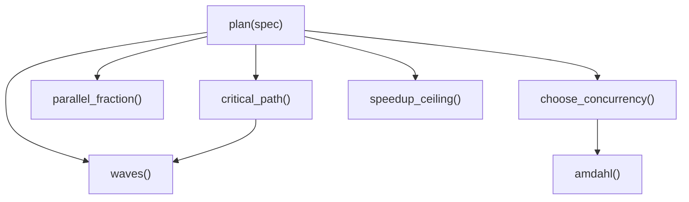

# Execution Graph & Concurrency Planning

# Execution Graph & Concurrency Planning (`loopsmith-graph`)

Nodes declare `depends_on`. This crate turns that declaration into an execution schedule: wave groupings, a critical path, and a worker count derived from arithmetic rather than from a guess.

Everything here is pure, deterministic, and cheap enough to run before every iteration. Nothing in this crate dispatches work, touches a filesystem, or talks to a provider — it answers "what can run together, and how many workers is that worth?" and hands the answer to `loopsmith-run`.

## The three jobs

1. **Cycle detection.** A cyclic dependency graph is a config bug. It is caught before any node is dispatched, with the stuck node IDs named in the error.
2. **Wave scheduling.** Kahn's algorithm, grouped by level. Every node in a wave has no unmet dependency, so every node in a wave may run concurrently.
3. **Sizing.** The critical path is the floor on wall-clock time. Amdahl's law is the cap on what more workers can buy. Both are known before dispatch, which is the point — you size the fleet from the graph instead of from optimism.

## Entry point: `plan`

```rust
pub fn plan(spec: &GraphSpec) -> Result<Plan, GraphError>
```

`plan` is the full pass and the function most callers want. It composes the five primitives below and returns a `Plan`:


```mermaid
flowchart TD
    P["plan(spec)"] --> W["waves()"]
    P --> CP["critical_path()"]
    P --> PF["parallel_fraction()"]
    P --> CC["choose_concurrency()"]
    P --> SC["speedup_ceiling()"]
    CP --> W
    CC --> A["amdahl()"]
```

`critical_path` calls `waves` itself to get a topological order, so a cyclic graph fails in both places; `plan` simply surfaces whichever `GraphError` comes back first.

The resulting `Plan` carries the schedule *and* the reasoning behind the worker count:

| Field | Meaning |
|---|---|
| `waves` | ordered `Vec<Wave>`; everything in one wave is concurrency-safe |
| `critical_path` / `critical_path_cost` | the longest weighted chain and its accumulated weight |
| `total_cost` | sum of all node weights — the fully serial cost |
| `parallel_fraction` | `p`, derived from the graph |
| `concurrency` | the chosen worker count |
| `predicted_speedup` | `amdahl(p, concurrency)` |
| `speedup_ceiling` | `1 / (1 - p)` — what no worker count can beat |

Keeping the inputs alongside the decision is deliberate: `loopsmith-web` and `loopsmith plan` both render the *why*, not just the number.

## `DagNode`: one scheduler, two graphs

```rust
pub trait DagNode {
    fn id(&self) -> &str;
    fn deps(&self) -> &[String];
    fn weight(&self) -> f64;
}
```

Three facts are all scheduling needs: what a thing is called, what it waits for, what it costs. The trait exists so the scheduler is not welded to `NodeSpec`.

loopsmith has two DAGs over the same topology problem:

- **The execution graph** (`execution.graph`) — `NodeSpec`, whose `weight` is a real relative cost.
- **The phase graph** (`execution.phases`) — `Phase`, keyed by `name`, which always weighs `1.0`. Phases carry no cost of their own; the work lives in the nodes assigned to them, so the critical path through the phase graph is simply its longest chain.

Both `impl DagNode` in this crate. A second copy of Kahn's algorithm would be a second place for a cycle bug to hide, and the test `any_dag_node_type_schedules_through_the_same_code` builds a throwaway `Step` type — no role, no provider, no instruction — to keep that decoupling honest.

`index_nodes` is the shared helper: it builds a `BTreeMap<&str, &N>` by ID. The `BTree*` collections throughout are not incidental — they are what makes wave membership and error text deterministic across runs.

## Wave scheduling

```rust
pub fn waves<N: DagNode>(nodes: &[N]) -> Result<Vec<Wave>, GraphError>
```

Standard Kahn, with one deviation: instead of draining the ready queue one node at a time, each iteration drains the *entire* current frontier as a level. That level becomes one `Wave`, with `nodes` sorted so the output is stable.

Two failure modes, both returned rather than panicked:

- `GraphError::UnknownNode(id)` — a `depends_on` entry names a node that is not in the list. Detected during indegree construction, before any traversal.
- `GraphError::Cycle(ids)` — fewer nodes were placed than exist. The nodes still carrying a nonzero indegree are the ones in or downstream of the cycle, and they are joined into the message.

## Critical path

```rust
pub fn critical_path<N: DagNode>(nodes: &[N]) -> Result<(Vec<String>, f64), GraphError>
```

A longest-weighted-path pass over the wave order. Because waves are a topological order, a single forward sweep suffices: for each node, take the heaviest already-computed predecessor as the base, add the node's own weight, and record which predecessor was chosen in a `prev` map. The maximum entry in `best` is the path's end; walking `prev` backwards and reversing yields the path.

An empty node list returns `(vec![], 0.0)` rather than erroring.

The test `critical_path_follows_the_heaviest_chain` pins the behavior: with `a(1) → b(5) → d(1)` and `a(1) → c(1) → d(1)`, the answer is `["a", "b", "d"]` at cost `7.0` — the heaviest chain, not the longest by node count.

## The concurrency decision

This is the part worth understanding before changing anything.

### Deriving `p` from the graph

```rust
pub fn parallel_fraction(total_cost: f64, critical_cost: f64) -> f64
```

`p = (total_cost - critical_cost) / total_cost`, clamped to `[0, 1]`. The critical path is work that genuinely cannot be parallelized — each step reads an upstream output. Everything else can, in principle, run alongside it. So the parallel fraction is the share of total work *not* stuck on the critical path.

This is the mechanical form of the "and then" test, and it means `p` is a property of the declared graph, not a tuning knob. A pure chain gives `p = 0.0` exactly (`a_pure_chain_has_no_parallel_fraction`).

### Amdahl's law

```rust
pub fn amdahl(p: f64, n: usize) -> f64       // 1 / ((1 - p) + p/n)
pub fn speedup_ceiling(p: f64) -> f64        // 1 / (1 - p), or INFINITY at p = 1
```

`amdahl` clamps `p` and returns `0.0` for `n == 0`. The numbers it produces are the whole argument for not sizing a fleet by vibes: at `p = 0.95`, sixteen workers buy **×9.14**, not ×16; 256 workers buy ×18.6 against a ceiling of ×20. `amdahl_matches_the_published_table` asserts exactly these values, so they are a contract, not documentation prose.

### Choosing `n`

```rust
pub fn choose_concurrency(concurrency: &Concurrency, waves: &[Wave], p: f64) -> (usize, f64)
```

Every mode is bounded by `widest` — the node count of the largest wave, floored at 1. No mode can return more workers than the graph could ever keep busy at once.

- **`Sequential {}`** → `(1, amdahl(p, 1))`, which is always `1.0`.
- **`Fixed { max_parallel }`** → `max_parallel`, floored at 1 and clamped down to `widest`. `fixed_concurrency_is_capped_by_the_widest_wave` covers the clamp: asking for 32 workers over a two-node graph gets you 2.
- **`Auto { cap, min_marginal_gain }`** → grow the fleet while each additional worker still buys at least `min_marginal_gain` of additional speedup, then stop. The loop runs `n` from 2 to `min(widest, cap)`, comparing `amdahl(p, n)` against the previous value and breaking on the first insufficient gain.

`Auto` is the answer to "how many agents should I run?" and its failure mode is the one that matters: spending on workers that cannot be used is the most common way a parallel scheduler costs more than it saves. `auto_concurrency_stops_when_marginal_gain_dries_up` asserts that 16 independent nodes with a large `min_marginal_gain` stop well short of the cap — greater than 1, less than 16.

Note that the `Auto` loop breaks on the *first* shortfall rather than scanning the whole range. Amdahl's speedup curve is concave in `n`, so marginal gain is monotonically decreasing and the early break is safe. Anything that changes the speedup model has to re-check that assumption.

## Safety report: `unisolated_parallel_writers`

```rust
pub fn unisolated_parallel_writers(spec: &GraphSpec, waves: &[Wave]) -> Vec<String>
```

Builder nodes that land in the same wave without worktree isolation write to the same files and clobber each other. This function walks each wave, keeps the nodes where `role == Role::Builder && !isolation.needs_worktree()`, and reports every ID from any wave holding more than one such node.

It reports rather than fixes. Adding isolation, splitting the wave with an edge, or accepting the overlap are all config decisions, and the crate does not make config decisions on the user's behalf.

## How the rest of the tree uses this

| Caller | Uses | For |
|---|---|---|
| `loopsmith-run/src/phases.rs` (`new`) | `waves` | building the phase schedule; a later phase stays shut until the earlier one closes |
| `loopsmith-web/src/assemble.rs` (`plan_view`) | `unisolated_parallel_writers` | the clobber warning in the config review UI |
| `src/cmd/plan.rs` (`execute`) | `unisolated_parallel_writers` | the same warning from the CLI |
| `loopsmith-mcp` | the graph surface | exposing planning over stdio |

The phase-graph path is the clearest evidence that `DagNode` earns its keep: `phases::new` feeds `Phase` values straight into `waves` and gets the same cycle detection, the same unknown-dependency check, and the same deterministic ordering that `NodeSpec` gets.

Dependencies run one way only: this crate depends on `loopsmith-core` (for `GraphSpec`, `NodeSpec`, `Phase`, `Concurrency`, `Role`), `serde`, and `thiserror`. It knows nothing about the run engine, the gate, or providers.

## Contributing notes

- **Determinism is a requirement, not a nicety.** `BTreeMap`/`BTreeSet` and the explicit `names.sort()` inside `waves` are there so the same config always produces the same plan. A `HashMap` substituted for speed would silently break wave ordering.
- **`weight` is relative, not a duration.** It exists for critical-path weighting. Node types with no meaningful cost return `1.0` — that is what `Phase` does.
- **New node types need only `impl DagNode`.** Do not add a second traversal. If a new graph kind needs scheduling, give it the trait and it inherits cycle detection, waves, and critical path for free.
- **Errors are values.** `waves` and `critical_path` return `GraphError`; nothing in this crate panics on bad config. The indexing inside `critical_path` (`by_id[id]`, `best[d.as_str()]`) is infallible only because `waves` already validated every dependency — preserve that ordering if you refactor.
- **The Amdahl table is pinned by test.** Changing `amdahl` or `speedup_ceiling` means changing `amdahl_matches_the_published_table`, and those numbers appear in user-facing documentation.

## Packaging

`Cargo.toml` ships `src/` and `README.md` only. The integration tests read `config/examples/` and `config/loop.schema.json` from the repository root, which no crate tarball can contain — shipping them would hand a published crate tests that cannot pass.