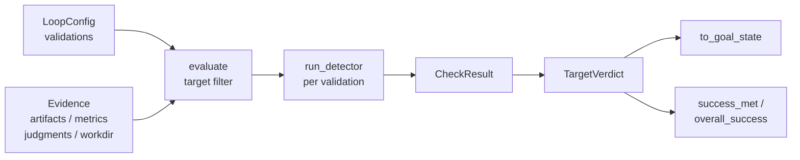

# Gating & Success Criteria

# Gating & Success Criteria (`loopsmith-gate`)

The gate is the only component in the workspace permitted to decide that a goal is done. Everything else in loopsmith — providers, skills, the graph scheduler, the MCP server — can produce work and produce claims about work. Only `loopsmith-gate` turns a claim into a `GoalState { satisfied: true }`.

The crate is small on purpose. It is plain Rust with no model in the loop: it reads validations out of the config, runs mechanical detectors against collected evidence, and returns a verdict. Read `runtime/crates/loopsmith-gate/src/lib.rs` top to bottom and you have seen the whole module.

## The invariant

> A model must not be the thing that certifies its own completion.

Two properties fall out of that, and both are load-bearing:

1. **Only `TargetVerdict::to_goal_state` constructs a satisfied `GoalState`.** No prompt, judge node, or provider response path writes that field. If you are adding a code path that persists goal state, it must route through a verdict.
2. **The gate revokes.** `evaluate` is a pure function of `(config, target, evidence)` with no memory of prior runs. Delete a required artifact and the next evaluation flips `satisfied` back to `false`. The test `the_gate_can_take_done_back` pins this: it writes `report.md`, evaluates to satisfied, removes the file, and asserts the re-evaluation is unsatisfied. A gate that can only promote is a burndown chart with extra steps — do not add caching or "sticky" satisfaction.

## Evaluation flow



`evaluate_all` fans this out: one verdict per `cfg.goals` entry, plus one for the `OVERALL` pseudo-target (the `OVERALL` constant comes from `loopsmith-core`).

## Core types

### `Evidence`

Everything the gate is allowed to look at — and nothing else. Notably absent: the builder's own assertion that it finished.

| Field | Used by |
|---|---|
| `artifacts: BTreeMap<String, String>` | `Detector::RegexMatch` |
| `metrics: BTreeMap<String, f64>` | `Detector::Threshold` |
| `judgments: Vec<Judgment>` | `Detector::Judge` |
| `workdir: PathBuf` | `Detector::Script` (cwd), `Detector::FileExists` (path root) |

Built with `Evidence::new(workdir)` plus the chainable `with_metric` / `with_artifact` / `with_judgment` builders:

```rust
let ev = Evidence::new("/repo")
    .with_metric("coverage", 0.85)
    .with_artifact("test-log", &stdout);
let verdict = evaluate(&cfg, "g1", &ev);
```

### `Judgment`

A model's verdict on a subjective validation, carrying the provenance the gate needs. `validation` names the `Validation` it answers; `provider_id` is who judged; `builder_provider_id` is who produced the work. `score` is optional and only consulted when the detector declares `min_score`. Constructed on the CLI side by `parse` in `loopsmith-cli/src/judgment.rs`.

### `CheckResult` and `TargetVerdict`

`CheckResult` field names (`text` / `passed` / `evidence`) deliberately mirror the grading schema of the existing eval viewer, so verdicts are readable by tooling that already exists. `evidence` is always a human-readable sentence explaining *why* — `"coverage = 0.5, required >= 0.8"`, `"report.md does not exist"` — not just a boolean restated.

`TargetVerdict` aggregates: the checks, `passed`/`failed`/`total` counts, `satisfied`, and a `reason` string. Two methods matter:

- `blocking_pass_rate()` — fraction of *blocking* checks that passed. Non-blocking checks are excluded entirely. **An empty blocking set returns `0.0`, not `1.0`** — consistent with the "silence is not success" rule below.
- `to_goal_state(iteration)` — the only satisfied-`GoalState` constructor in the workspace. Stamps `updated_ms` via `now_ms` (re-exported through `loopsmith-memory`).

### `GateError`

- `Detector(String)` — the check could not be run (binary not on PATH, spawn failure).
- `Regex { name, source }` — a validation's pattern does not compile.

## Satisfaction rules

`evaluate` decides `satisfied` from blocking checks only, in this order:

1. **No blocking validation targets this goal → never satisfied.** Reason: `"no blocking validation targets \`{target}\`; nothing to satisfy"`. A goal with only advisory checks, or with no checks at all, cannot pass. Silence is not success.
2. **All blocking checks passed → satisfied.**
3. **Any blocking check failed → unsatisfied**, with the failing check names listed in `reason`.

Non-blocking failures still increment `failed` and appear in the report, but never hold the gate shut (`non_blocking_failures_do_not_hold_the_gate`).

## Detectors

`run_detector` is a single `match` on `Detector` (defined in `loopsmith-core`). Every arm fails closed — missing input is a failure, never a default pass.

| Detector | Passes when | Fails closed on |
|---|---|---|
| `Script { command, args, expect_exit }` | exit code equals `expect_exit` (default `0`) | spawn error → `GateError::Detector`; no exit code → `-1` |
| `FileExists { path, non_empty }` | `workdir.join(path)` exists, and is non-empty if `non_empty` | missing file; zero-length file when `non_empty` |
| `RegexMatch { artifact, pattern }` | pattern matches the named artifact | artifact not collected; bad pattern → `GateError::Regex` |
| `Threshold { metric, op, value }` | `op.apply(actual, value)` holds | metric not reported (`a_missing_metric_fails_rather_than_passes_by_default`) |
| `Judge { standard, min_score }` | see below | no judgment recorded; `min_score` set but no scores reported |

`Script` captures the last line of stderr into the evidence string, which is usually the part a human wants. `op_str` renders `CompareOp` back into `>`, `>=`, `<`, `<=`, `==` for that evidence text.

### Judge independence

The `Judge` arm is where the crate's thesis is enforced:

1. Collect judgments whose `validation` matches this check's name. Empty → fail.
2. If `cfg.providers.enforce_judge_independence` is set and **any** judgment has `provider_id == builder_provider_id`, the check is **refused outright** — not averaged down, not partially credited. The evidence reads `"a shared provider shares its blind spots"`. Sharing a provider between builder and judge means sharing blind spots, which is the failure the architecture exists to avoid.
3. Otherwise, partition into independent judgments (`provider_id != builder_provider_id`). If any exist, they become the scoring pool; if none do (only reachable with enforcement off), the pool falls back to all judgments.
4. With `min_score`: pass if the mean of reported scores meets the minimum. Without: pass if every judgment in the pool passed.

Note the asymmetry in step 2 versus step 3 — with enforcement on, one self-judgment poisons the whole check even if independent judgments are also present. That is intentional: a self-judgment in the pile is a signal that the routing is wrong, not noise to be outvoted.

## Success scenarios

Detector verdicts answer "is this target satisfied". Success scenarios answer "is that enough to stop", and are evaluated separately:

- `success_met(scenario, verdict)` — for `Mode::Percentage`, compares `blocking_pass_rate()` against `scenario.threshold` (defaulting to `1.0`). For `Mode::Objective` and `Mode::Subjective`, it is just `verdict.satisfied`.
- `overall_success(cfg, verdicts)` — takes every `SuccessScenario` targeting `OVERALL` and requires **all** of them to hold against the `OVERALL` verdict. If no such scenario is declared, it falls back to the raw `OVERALL` verdict. A missing `OVERALL` verdict is `false`.

This is the split that lets a config say "90% of blocking checks is good enough to stop" without ever letting a goal be marked satisfied on a partial pass.

## Integration points

| Caller | Uses |
|---|---|
| `src/cmd/gate.rs::execute` | `evaluate` — the `loopsmith gate` CLI subcommand, one-shot verdict |
| `src/run/mod.rs::execute` | `evaluate_all` — the per-iteration sweep of every goal plus `overall` |
| `src/run/stop.rs::should_stop` | `overall_success` — the stop gate |
| `src/run/phases.rs`, `src/run/export.rs`, `src/run/summary.rs` | `TargetVerdict` — carried through reporting and export |
| `loopsmith-mcp::tool_gate` | `evaluate` — exposes the gate over the local stdio MCP server |
| `loopsmith-cli/src/judgment.rs::parse` | `Judgment` — builds judgments from model output before they reach `Evidence` |

Dependencies point downward only: `loopsmith-core` (config model), `loopsmith-memory` (`GoalState`, `now_ms`), `regex`, `serde`. The gate never reaches back into providers or the scheduler.

## Contributing

**Adding a detector.** Add the variant in `loopsmith-core`'s `Detector` enum and the JSON schema, then add a `match` arm in `run_detector`. The arm must return `(bool, String)` where the string explains the verdict in terms a human can act on, and it must treat absent input as failure. Add a test alongside the existing ones — every detector arm has at least one, and the missing-input case has its own (`a_missing_metric_fails_rather_than_passes_by_default`, `a_missing_judgment_fails_closed`).

**Where "cannot run" currently lands.** `run_detector` distinguishes a `GateError` from a plain `false`, but `evaluate` collapses both into `passed: false`, preserving the distinction only as a `"detector error: {e}"` prefix on the evidence string. If you are building tooling that needs to separate "missing toolchain" from "unfinished work" — the README calls this out as a real distinction — that separation has to be read out of the evidence text today, or the `CheckResult` shape has to grow a field.

**Test fixtures.** `cfg_with(validations)` splices a YAML validation block into a minimal config with two providers (`builder-p` on ollama, `judge-p` on openai) and parses it through `loopsmith_core::parse_str`, so tests exercise real config parsing rather than hand-built structs. Filesystem tests use `loopsmith_util::testing::temp_dir` (gated behind the `testing` feature in dev-dependencies).

**Packaging.** `Cargo.toml` ships only `/src/**/*` and `/README.md`. The integration tests read `config/examples/` and `config/loop.schema.json` from the repository root, which no crate tarball can contain — including them would hand a published crate tests that cannot pass.