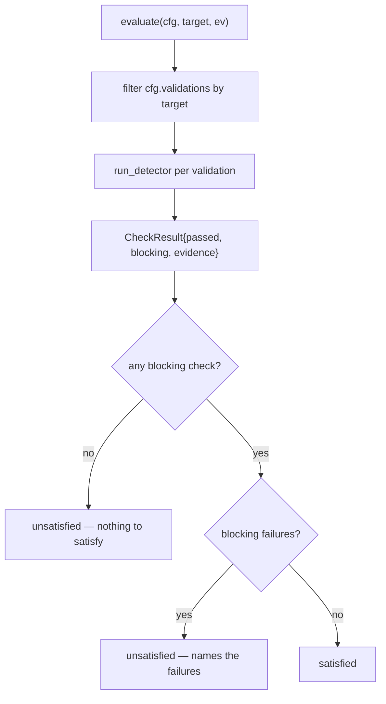
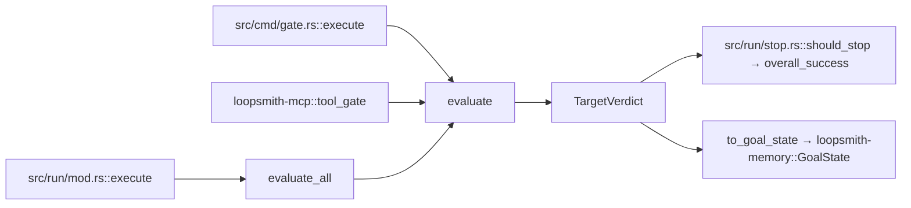

# Gating & Success Criteria

# Gating & Success Criteria (`loopsmith-gate`)

The gate is the crate that decides whether work is done. It is deliberately the least clever crate in the workspace: plain Rust, no provider calls of its own, no prompt anywhere in the code path. Everything it can conclude follows mechanically from a config and a bag of evidence.

Its defining constraint is negative: `GoalState { satisfied: true, .. }` is constructed in exactly one place — `TargetVerdict::to_goal_state` in `src/lib.rs`. Nothing that a model emits can produce that value directly. If you are adding a feature that makes completion easier to declare, you are probably working against the point of the crate.

## The two invariants

**A model cannot certify its own completion.** Verdicts come from detectors, and detectors are exit codes, filesystem metadata, regex matches, and numeric comparisons. The one detector that consults a model (`Detector::Judge`) refuses a judgment whose `provider_id` equals its `builder_provider_id` — it does not discount it, it fails the check outright with `"judgment refused: judge and builder both ran on ..."`.

**The gate can revoke.** `evaluate` holds no memory of prior runs. Re-running against fresh evidence recomputes from scratch, so deleting a required artifact flips a satisfied target back to unsatisfied. The test `the_gate_can_take_done_back` pins this: write `report.md`, evaluate (satisfied), delete it, evaluate again (not satisfied). Any caching layer added in front of `evaluate` must preserve this — a gate that only promotes is a burndown chart.

## Types

| Type | Role |
|---|---|
| `Evidence` | The complete input surface: `artifacts` (name → text), `metrics` (name → f64), `judgments`, and `workdir`. Builder methods `with_artifact`, `with_metric`, `with_judgment` chain off `Evidence::new(workdir)`. |
| `Judgment` | One model verdict, carrying provenance: `validation`, `provider_id`, `builder_provider_id`, `passed`, optional `score`, `standard`, `evidence`. Parsed from model output by `parse` in `loopsmith-cli/src/judgment.rs`. |
| `CheckResult` | One validation's outcome: `name`, `text`, `passed`, `blocking`, `evidence`. Field names mirror the existing eval viewer's grading schema (`text`/`passed`/`evidence`) so reports are readable by tooling that already exists. |
| `TargetVerdict` | All checks for one target plus `satisfied`, the pass/fail/total counts, and a human-readable `reason`. |
| `GateError` | `Detector(String)` for "the check could not run" and `Regex { name, source }` for a validation whose pattern does not compile. |

Note what is *not* in `Evidence`: the builder's own claim that it finished. That omission is intentional and load-bearing.

## Evaluation

`evaluate` selects the validations whose `target` matches, runs each detector, and folds the results into a `TargetVerdict`. Three rules govern the outcome:

1. **Silence is not success.** A target with zero blocking validations is *never* satisfied — `reason` reads `no blocking validation targets \`X\`; nothing to satisfy`. Forgetting to write a check does not count as passing it.
2. **Only blocking failures hold the gate shut.** Non-blocking checks still appear in `checks` and still count toward `failed`, but they cannot block satisfaction (`non_blocking_failures_do_not_hold_the_gate`).
3. **Detector errors fail closed.** An `Err` from `run_detector` becomes `(false, "detector error: {e}")` rather than propagating. The distinction between "the check failed" and "the check could not run" survives in the `evidence` string, not in `satisfied` — a missing tool reads as unfinished work at the boolean level. If you need callers to branch on that difference, the `evidence` prefix is currently the only signal, and lifting it into a typed field is an open improvement.

`evaluate_all` runs `evaluate` once per goal in `cfg.goals` plus once for the `OVERALL` target, returning a `BTreeMap<String, TargetVerdict>` (ordered, so reports and snapshots are stable).

## Detectors

`run_detector` is a single match over `loopsmith_core::Detector`. Each arm returns `(passed, evidence)`, where the evidence string is written to be read by a human in a terminal.

- **`Script { command, args, expect_exit }`** — spawns the command in `ev.workdir`, compares the exit code against `expect_exit` (default `0`), and appends the last line of stderr to the evidence when there is one. A code of `-1` stands in for signal-terminated processes. A failure to *spawn* is a `GateError::Detector`; a non-zero exit is an ordinary failed check.
- **`FileExists { path, non_empty }`** — `workdir`-relative `fs::metadata`. Three distinguishable outcomes: absent, present-but-empty (when `non_empty`), present with a byte count.
- **`RegexMatch { artifact, pattern }`** — compiles the pattern (a bad pattern is `GateError::Regex`, carrying the validation name), then matches against `ev.artifacts[artifact]`. An uncollected artifact fails with `artifact \`X\` was not collected` rather than passing vacuously.
- **`Threshold { metric, op, value }`** — applies `CompareOp::apply` to `ev.metrics[metric]`. An unreported metric fails; `a_missing_metric_fails_rather_than_passes_by_default` guards that. `op_str` renders the operator for the evidence line.
- **`Judge { standard, min_score }`** — the only detector that reads model output. See below.

Every arm defaults to *fail* when its input is missing. That is the house style for this crate; a new detector that returns `true` on absent evidence would be a bug.

## The judge path

`Detector::Judge` collects the judgments whose `validation` matches the check name, then:

1. **No judgments → fail** (`no judgment recorded for \`X\``).
2. **Independence enforcement.** If `cfg.providers.enforce_judge_independence` is set and *any* matching judgment has `provider_id == builder_provider_id`, the whole check fails immediately. This is a refusal, not an averaging-out: one self-judgment poisons the check.
3. **Pool selection.** Independent judgments form the pool. When enforcement is off and no independent judgment exists, the pool falls back to all judgments — that fallback is the only path by which a self-judgment can contribute to a pass, and it requires the config to have explicitly disabled enforcement.
4. **Scoring.** With `min_score`, the mean of the reported `score` values must reach it, and a pool with no scores at all fails. Without `min_score`, every judgment in the pool must have `passed: true`.

## Success scenarios

Verdicts answer "is this target satisfied?". Success scenarios answer "is that enough to stop?".

`success_met(scenario, verdict)` switches on `SuccessScenario::mode`:

- `Mode::Percentage` compares `verdict.blocking_pass_rate()` against `threshold` (default `1.0`). The rate counts only blocking checks, and returns `0.0` when there are none — consistent with "no blocking checks means nothing to satisfy".
- `Mode::Objective` and `Mode::Subjective` both defer to `verdict.satisfied`.

`overall_success(cfg, verdicts)` requires *every* scenario targeting `OVERALL` to hold. With no such scenario declared it falls back to the `OVERALL` verdict's own `satisfied` flag, and returns `false` if that verdict is missing entirely.

## How it plugs into the rest of the workspace

- **`src/run/mod.rs::execute`** calls `evaluate_all` each iteration; `src/run/stop.rs::should_stop` feeds the resulting map to `overall_success` to decide whether the loop terminates.
- **`src/cmd/gate.rs::execute`** is the one-shot `loopsmith gate` CLI path — same `evaluate`, no loop around it.
- **`loopsmith-mcp::tool_gate`** exposes `evaluate` over the local stdio MCP server, so an agent can *ask* the gate for a verdict without being able to write one.
- **`src/run/summary.rs`, `src/run/export.rs`, `src/run/stop.rs`** all consume `TargetVerdict` for reporting; because `CheckResult` uses the eval viewer's field names, exports need no translation layer.
- **`to_goal_state(iteration)`** stamps the verdict with the iteration number and `now_ms()` and hands it to `loopsmith-memory` for persistence.

Dependencies point one way: the gate reads `loopsmith-core` (the A–J config model, `Detector`, `Validation`, `SuccessScenario`, `Mode`, `CompareOp`, `OVERALL`) and writes `loopsmith-memory` (`GoalState`, `now_ms`). It knows nothing about providers, scheduling, or skills — a provider only ever reaches the gate as an *id string* inside a `Judgment`.

## Contributing

**Adding a detector.** Add the variant in `loopsmith-core`'s `Detector` enum, add the schema entry, then add a `run_detector` arm returning `(bool, String)`. Two obligations: fail when the input is absent, and write an evidence string that says what was checked and what was found, including the concrete values. Evidence strings are the primary debugging surface when a loop refuses to finish.

**Testing.** The unit tests in `src/lib.rs` build configs through `cfg_with`, which splices validation YAML into a minimal config and runs it through `loopsmith_core::parse_str` — so tests exercise real parsing, not hand-built structs. Filesystem tests use `loopsmith_util::testing::temp_dir` (available via the `testing` feature, a dev-dependency only).

**Packaging.** `Cargo.toml` ships only `/src/**/*` and the README. Integration tests read `config/examples/` and `config/loop.schema.json` from the repository root, which no crate tarball can contain; including them would publish tests that cannot pass.

**What not to change without a very good reason.** The single-constructor property of satisfied `GoalState`, the never-satisfied-without-blocking-checks rule, the revocation behavior, and the judge independence refusal. Each has a test named after the property it protects, and each is load-bearing for the claim the project makes about itself.