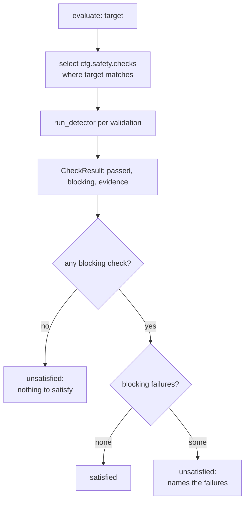
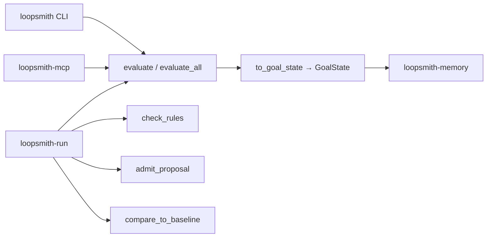

# Gating & Success Criteria

# Gating & Success Criteria (`loopsmith-gate`)

The gate is the component that decides whether work is done. It is plain Rust with no model in the loop: every verdict comes from an exit code, a file's existence, a regex match, a numeric comparison, or an explicitly *independent* judgment. Its reason for existing is a single invariant:

> A model must not be the thing that certifies its own completion.

`GoalState { satisfied: true, .. }` is constructed in exactly one place in the workspace — `TargetVerdict::to_goal_state` in `runtime/crates/loopsmith-gate/src/lib.rs`. Nothing else in the codebase may build one.

## The five responsibilities

The crate is one file, and it does five separable jobs. They share `run_detector` and nothing else.

| Job | Entry point | Answers |
|---|---|---|
| Goal verification | `evaluate`, `evaluate_all` | Is this target satisfied by the evidence? |
| Success criteria | `success_met`, `overall_success` | Do the declared success scenarios hold? |
| Gate rules | `check_rules` | May the run enter / proceed / must it roll back? |
| Proposal admission | `admit_proposal` | May this self-evolution proposal even be recorded? |
| Regression gate | `compare_to_baseline` | Did this run hold the frozen baseline? |

## Evidence: the whole input surface

`Evidence` is a deliberately closed list of what the gate may look at. Anything absent from it cannot influence a verdict — most pointedly, the builder's own claim that it finished.

```rust
let ev = Evidence::new(&workdir)
    .with_metric("coverage", 0.85)
    .with_artifact("test-output", &stdout)
    .with_judgment(judgment);
```

- `artifacts: BTreeMap<String, String>` — named text blobs for `Detector::RegexMatch`.
- `metrics: BTreeMap<String, f64>` — named numbers for `Detector::Threshold`.
- `judgments: Vec<Judgment>` — model verdicts, matched to a validation by `Judgment::validation`.
- `workdir: PathBuf` — the base directory for `Detector::Script` (`current_dir`) and `Detector::FileExists` (joined onto `path`).

The builder-style methods take `self` and return `Self`, so an `Evidence` is assembled in one expression and then read-only.

## How a target is evaluated

`evaluate(cfg, target, ev)` selects the validations in `cfg.safety.checks` whose `target` matches, runs each one's detector, and folds the results into a `TargetVerdict`.


```mermaid
flowchart TD
    E[evaluate: target] --> S[select cfg.safety.checks<br/>where target matches]
    S --> D[run_detector per validation]
    D --> C[CheckResult: passed, blocking, evidence]
    C --> Q{any blocking check?}
    Q -->|no| U1[unsatisfied:<br/>nothing to satisfy]
    Q -->|yes| B{blocking failures?}
    B -->|none| SAT[satisfied]
    B -->|some| U2[unsatisfied:<br/>names the failures]
```

Three decisions in that fold are worth knowing before you touch it:

**Silence is not success.** A target with no blocking validation aimed at it is *never* satisfied. The reason string says so: `` no blocking validation targets `g1`; nothing to satisfy ``. This makes a typo'd `target:` field fail loudly instead of certifying an empty set.

**Non-blocking checks are advisory only.** They contribute to `passed` / `failed` / `total` and to the report, but never to `satisfied`. A verdict can carry `failed: 1` and still be satisfied.

**A detector that errors fails its check.** `run_detector` returning `Err` becomes `(false, "detector error: …")`, not a propagated error. "Could not tell" is not "passed" — a gate that waved a run through because its own tooling was missing would be worse than no gate. The `GateError` type still exists because the message matters for the report: `GateError::Detector` for a command that would not launch, `GateError::Regex { name, source }` so a bad pattern is reported under the validation it came from.

`evaluate_all` maps over `cfg.intent.goals` and adds the `OVERALL` pseudo-target, producing the `BTreeMap<String, TargetVerdict>` that the run engine, exports, and summaries all consume.

### Revocation

Nothing in `evaluate` reads prior state. It looks only at the evidence in front of it, so re-running it on fresh evidence can flip a satisfied target back:

```rust
let before = evaluate(&cfg, "g1", &Evidence::new(&dir));  // report.md exists -> satisfied
std::fs::remove_file(&file).unwrap();
let after  = evaluate(&cfg, "g1", &Evidence::new(&dir));  // -> unsatisfied
```

Keep it that way. A gate that can only promote is a burndown chart with extra steps, and any caching or memoization added here would quietly reintroduce that.

## The detectors

`run_detector(cfg, name, detector, ev)` is the single dispatch point, returning `(bool, String)` — the verdict and a human-readable evidence line for the report. `name` is the validation's name or the gate rule's id; it is what a judgment is matched on and what a bad regex is blamed on.

| `Detector` variant | Verdict | Fails closed when |
|---|---|---|
| `Script { command, args, expect_exit }` | exit code equals `expect_exit` (default `0`), run in `ev.workdir`; last stderr line is appended to the evidence | the process will not spawn → `GateError::Detector` |
| `FileExists { path, non_empty }` | `ev.workdir.join(path)` has metadata, and non-zero length when `non_empty` | missing, or present-but-empty under `non_empty` |
| `RegexMatch { artifact, pattern }` | the compiled pattern matches `ev.artifacts[artifact]` | artifact was not collected; invalid pattern → `GateError::Regex` |
| `Threshold { metric, op, value }` | `op.apply(actual, value)` over `ev.metrics[metric]` | metric was not reported |
| `Judge { standard, min_score }` | see below | no judgment recorded for `name` |

Every one of these fails on absent input. That is the load-bearing property of the whole table: a missing metric, an uncollected artifact, and an unrecorded judgment each read as *not satisfied*, never as *nothing to object to*.

### The judge detector and independence

`Judge` is the only detector whose input is a model's opinion, and it is the most constrained. A `Judgment` carries both `provider_id` (who judged) and `builder_provider_id` (who produced the work).

1. Judgments are filtered to those whose `validation` equals `name`. None → fail, `` no judgment recorded for `name` ``.
2. If `cfg.execution.providers.enforce_judge_independence` is on, *any* judgment where `provider_id == builder_provider_id` fails the check outright — the evidence line reads `a shared provider shares its blind spots`. This is a refusal, not a downgrade: a self-judgment does not get counted at reduced weight, it collapses the check.
3. Otherwise the pool is narrowed to the independent judgments, falling back to all of them only when none are independent.
4. With `min_score`, the pool's mean `score` must reach it; a pool with no scores at all fails. Without `min_score`, every judgment in the pool must have `passed: true`.

If you extend this, preserve step 2's position. Running independence *before* scoring is what stops a self-judgment from being averaged into a passing mean.

## Success criteria

`CheckResult`/`TargetVerdict` answer "did the checks pass". `SuccessScenario` answers the separate question of how much passing is enough.

- `TargetVerdict::blocking_pass_rate()` — fraction of *blocking* checks that passed. It returns `0.0` when there are no blocking checks, consistent with the "nothing to satisfy" rule rather than vacuously perfect.
- `success_met(s, verdict)` — for `Mode::Percentage`, `blocking_pass_rate() >= s.threshold` (defaulting to `1.0`); for `Mode::Objective` and `Mode::Subjective`, simply `verdict.satisfied`.
- `overall_success(cfg, verdicts)` — all `cfg.intent.success` scenarios targeting `OVERALL` must be met. With no such scenario declared it falls back to the `OVERALL` verdict's own `satisfied`. This is what `loopsmith-run/src/stop.rs::should_stop` calls to decide the loop is finished.

## Gate rules

A gate rule is structurally the same thing as a validation — a statement plus a detector — so it is decided by the same compiled code and can no more be argued past. `check_rules(cfg, kind, ev)` filters `cfg.safety.gates.rules()` to one `GateKind` (`Entry`, `Approval`, `Rollback`) and maps each through `check_rule`, which is a thin wrapper over `run_detector`.

The difference from a validation is `RuleVerdict::on_fail: GateOutcome` — the rule carries its own consequence (e.g. `GateOutcome::Pause`), and the gate reports it rather than acting on it. `loopsmith-run/src/rules.rs::apply` is what turns that outcome into behavior.

Kinds do not leak: asking for `GateKind::Entry` when only `approval:` rules are configured returns an empty `Vec`, which callers must treat as "no rules of this kind", not "all clear on entry".

## Proposal admission

`admit_proposal(cfg, kind, patch)` is the gate on self-evolution: it decides whether a proposed config change may even be *written down*. It returns `Admission::Admitted` or `Admission::Refused(String)`, where the string is a ledger-ready sentence.

Two independent refusals, in order:

1. **Kind.** If `cfg.evolution_enabled()` and `!cfg.evolution.allows(kind)`, refuse — `` `graph_change` is not in `evolution.allowed_kinds` ``.
2. **Protected paths.** The patch is parsed as YAML, run through `loopsmith_core::config::legacy::migrate` so a 0.3-shaped fragment is judged as the 1.0 path it means, flattened by `leaf_paths` into dotted paths, and each path tested against `cfg.safety.protected.touches`. Any hit refuses.

The protected-path check runs **regardless of whether evolution is enabled**. A loop that can merely *suggest* loosening its own gates has already started arguing with them.

`leaf_paths` treats a list, a scalar, and an *empty mapping* as leaves. The empty-mapping case is the one that matters: `safety: {}` is a leaf at path `safety`, so wholesale replacement of a protected parent is caught the same as writing to the child. A patch that is not parseable YAML is refused (`its patch is not readable YAML`) — nothing unreadable is admitted. `patch: None` skips the path check entirely and is admitted if the kind allows.

```rust
// all three are Refused
admit_proposal(&c, ProposalKind::ValidationChange, Some("stop_gates:\n  max_iterations: 500\n"));
admit_proposal(&c, ProposalKind::GraphChange, Some("safety:\n  gates: {}\n"));
admit_proposal(&c, ProposalKind::GraphChange, Some("safety: {}\n"));
```

## The regression gate

`compare_to_baseline(cfg, measured)` maps `cfg.evolution.regressions(measured)` onto a four-state `BaselineVerdict`:

- `Off` — evolution disabled; nothing is compared.
- `NoBaseline` — evolution on, no baseline frozen. **This is not a pass.** It reports that the run cannot show an improvement, so proposals are recorded but not adoptable.
- `Held` — within tolerance on every metric the baseline names.
- `Regressed(Vec<String>)` — one line per regressed metric.

`BaselineVerdict::describe()` renders a single ledger/terminal line, returning `None` for `Off` because there is then nothing to say. `src/cmd/mod.rs::report_outcome` is the caller that prints it.

The baseline lives under `safety.protected`, which closes the obvious loop: the run being judged cannot move the bar it is judged against.

## How the rest of the workspace uses it


```mermaid
flowchart LR
    RUN[loopsmith-run] --> EVAL[evaluate / evaluate_all]
    RUN --> RULES[check_rules]
    RUN --> ADMIT[admit_proposal]
    RUN --> BASE[compare_to_baseline]
    CLI[loopsmith CLI] --> EVAL
    MCP[loopsmith-mcp] --> EVAL
    EVAL --> GS[to_goal_state → GoalState]
    GS --> MEM[loopsmith-memory]
```

| Caller | Uses |
|---|---|
| `loopsmith-run/src/running.rs::rule` | `evaluate_all` each iteration |
| `loopsmith-run/src/stop.rs::should_stop` | `overall_success` to end the loop |
| `loopsmith-run/src/rules.rs::apply` | `check_rules`, then acts on `on_fail` |
| `loopsmith-run/src/evolve.rs::write` | `admit_proposal` before recording a proposal |
| `loopsmith-run/src/closing.rs::judge_against_baseline` | `compare_to_baseline` |
| `loopsmith-run/src/judgment.rs::parse` | constructs `Judgment` from model output |
| `loopsmith-run/src/{metrics,phases,summary,export}.rs` | read `TargetVerdict` / `CheckResult` |
| `src/cmd/gate.rs::execute` | `evaluate` for the one-shot `gate` subcommand |
| `loopsmith-mcp/src/lib.rs::tool_gate` | `evaluate` exposed over stdio MCP |

Upstream, the crate depends on `loopsmith-core` for the config model (`LoopConfig`, `Detector`, `Validation`, `GateRule`, `GateKind`, `GateOutcome`, `SuccessScenario`, `Mode`, `Baseline`, `ProposalKind`, `CompareOp`, `OVERALL`) and on `loopsmith-memory` for `GoalState` and `now_ms`. It has no async runtime, no network, and no provider access — a detector's process is spawned with `std::process::Command`.

## Serialization

`CheckResult` uses the field names `text` / `passed` / `evidence` on purpose: they mirror the grading schema the existing eval viewer reads, so gate reports are consumable by tooling that predates this crate. `Judgment`, `CheckResult`, `TargetVerdict`, and `RuleVerdict` all derive `Serialize`/`Deserialize`; `Judgment`'s `score`, `standard`, and `evidence` are `#[serde(default)]`, so a minimal judgment from a model deserializes.

`Evidence` is deliberately *not* serializable — it is assembled per-evaluation from live filesystem and run state.

## Contributing here

The tests in `src/lib.rs` are the specification, and each name states a property rather than a mechanism: `a_target_with_no_blocking_validation_is_never_satisfied`, `a_missing_metric_fails_rather_than_passes_by_default`, `judge_on_the_builders_provider_is_refused`, `the_gate_can_take_done_back`, `a_rule_whose_detector_cannot_run_does_not_pass`, `only_the_gate_builds_a_satisfied_goal_state`. Treat them as the contract; adding a detector means adding the corresponding fails-closed test.

Three rules for changes in this crate:

1. **New detectors fail closed.** Missing input, unparseable input, and un-runnable tooling all produce `(false, …)` with an evidence line that says which of those it was.
2. **`to_goal_state` stays the only constructor of a satisfied `GoalState`.** If another crate needs one, it needs a `TargetVerdict` first.
3. **`evaluate` stays stateless.** No history, no cache, no memory of a previous pass — that is what makes revocation work.

Note that `Cargo.toml` restricts `include` to `/src/**/*` and the README: the integration tests read `config/examples/` and `config/loop.schema.json` from the repository root, which a crate tarball cannot carry, so they are excluded rather than shipped broken.