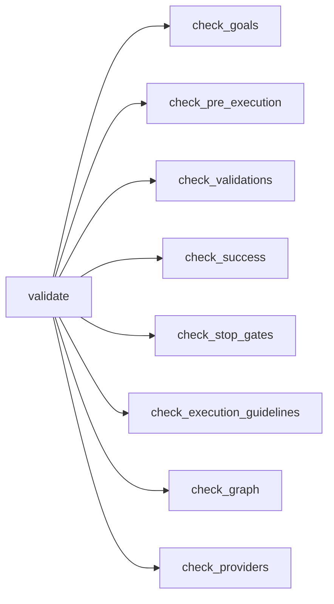
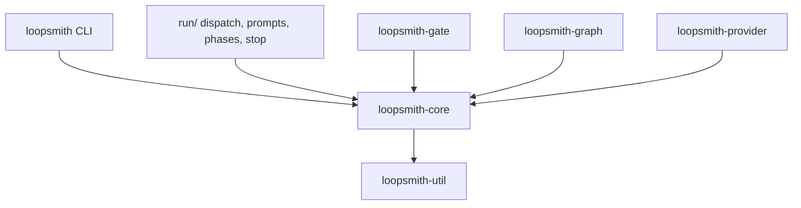

# Loop Configuration Schema

# Loop Configuration Schema

The config layer of loopsmith: one JSON Schema, one Rust model, one validator. Together they decide whether a loop description is coherent enough to be run unattended.

Two artifacts describe the same thing:

| Artifact | Role |
|---|---|
| `config/loop.schema.json` | Draft 2020-12 schema. Editor completion, CI checks, documentation. **Not read at runtime.** |
| `runtime/crates/loopsmith-core` | The `serde` model that actually parses configs, plus `validate()` |

Nothing in the runtime loads the `.json` file — `serde_yaml`/`serde_json` deserialize straight into `LoopConfig`, and `deny_unknown_fields` plays the role `additionalProperties: false` plays in the schema. The crate's `Cargo.toml` makes this explicit: `include = ["/src/**/*", "/README.md"]`, because the integration tests that read `config/loop.schema.json` and `config/examples/` reach outside the crate directory and no published tarball could carry them. So the schema is a repo-level artifact, and keeping it in step with the Rust structs is a manual obligation of anyone adding a field.

## The A–J model

A loop is ten lettered sections. The lettering is load-bearing: it is the same in the template, the schema, the docs, and the module layout, so "where does `stop_gates` live" has one answer everywhere.

| | Section | Rust module | Required |
|---|---|---|---|
| A | `information` | `config/info.rs` | no |
| B | `pre_execution` | `config/work.rs` | no (but see below) |
| C | `goals` | `config/goals.rs` | **yes**, ≥1 |
| D | `validations` | `config/validation.rs` | **yes**, ≥1 |
| E | `success` | `config/success.rs` | no |
| F | `stop_gates` | `config/gates.rs` | no |
| G | `schedules` | `config/triggers.rs` | no |
| H | `constraints` | `config/constraints.rs` | no |
| I | `execution_guidelines` | `config/guidelines.rs` | no |
| J | `default_skills` | `config/default_skills.rs` | no |

Plus four non-lettered sections that describe machinery rather than intent: `graph`, `providers`, `skills`, `context`.

> **Doc drift worth knowing about.** The module headers in `src/lib.rs` and `src/config/mod.rs`, and the schema's own `title`/`description`, still say "the A–H model" — they predate sections I and J. The field-level doc comments on `LoopConfig` and the crate README are current. If you touch either header, fix the letter range.

## Loading a config

```rust
use loopsmith_core::{load, load_validated, parse_str, is_markdown};
```

Three input grammars, two entry points:

```
 .md / .markdown ──► md::parse_md ──┐
                                    ├──► LoopConfig
 .yaml / .yml / .json ──► parse_str ┘
        (YAML first, then strict JSON)
```

`load()` picks Markdown **by extension only**. That is deliberate: a `.md` config is a different grammar, not a different serialization, so sniffing at it would mean reporting a YAML parse error for a document that was never YAML. Everything else falls through to `parse_str()`, which tries `serde_yaml` first (a JSON superset in practice) and then `serde_json`, keeping *both* error strings so `CoreError::Parse` can show the caller which one they probably meant.

`load_validated()` is `load()` plus `validate()`, with any error-severity issue promoted to `CoreError::Invalid(report.render())`. Only two callers use it — `src/cmd/run.rs::start` and `src/cmd/watch.rs::execute` — because those are the ones that are about to spend money. Read-only commands (`plan`, `providers`, `permissions`, `convert`, `gate`, `prune`, `schedule`, `doctor`, `skills`) call plain `load()` so they still work on a config you are in the middle of fixing.

`CoreError` has exactly three shapes: `Io`, `Parse` (carrying both parser messages), and `Invalid` (carrying a rendered `ValidationReport`).

## The config model

`LoopConfig` is a flat struct of the fourteen sections. Every struct in `config/` carries `#[serde(deny_unknown_fields)]`, and the tests in `config/mod.rs` guard it at both levels:

```rust
// stop_gate: (missing s) must be an error, not a silently dropped section
let typo = MINIMAL.to_string() + "stop_gate:\n  max_iterations: 2\n";
parse(&typo).expect_err("a misspelled section must be refused");
```

Without it a misspelled key is dropped and the loop runs with a default the author never chose — which is how a budget cap becomes a surprise invoice.

Four convenience methods carry real weight downstream:

- `goal_names()`
- `blocking_validations_for(target)` — used by `src/run/prompts.rs::build_node_prompt` to tell a node what it will actually be checked against
- `provider(id)` — the lookup the validator uses to reject unknown provider references
- `cascade_for(tier)` — resolves a `Tier` to an ordered provider list. If `providers.cascade` has no entry for that tier, it falls back to *every* provider whose `tiers` list is empty or contains the tier. An empty `tiers` therefore means "eligible for everything", not "eligible for nothing".

`OVERALL` (`"overall"`) is the reserved target name meaning the loop as a whole. It is refused as a goal name in both the schema (`not: { const: "overall" }`) and `check_goals`.

### Detectors (D)

`Detector` is an internally-tagged enum on `type`, mirrored by a `oneOf` in the schema. The ordering in the source follows the independence ladder — `Judge` is rung 3, everything else is rung 4:

| `type` | Passes when | Deterministic |
|---|---|---|
| `script` | command exits with `expect_exit` (default 0) | yes |
| `file_exists` | `path` exists, optionally non-empty | yes |
| `regex_match` | `pattern` matches the named `artifact` | yes |
| `threshold` | `metric` compares against `value` via `op` | yes |
| `judge` | a model verdict against a named `standard` | **no** |

`CompareOp::apply` is the whole comparison surface; note `Eq` uses `(lhs - rhs).abs() < f64::EPSILON`, so it is an exact-ish float compare and not a tolerance you can tune.

One schema/Rust divergence to be aware of: the schema gives `expect_exit` `"default": 0`, while the Rust field is `Option<i32>` with `#[serde(default)]` — so in Rust the absent case is `None`, and whoever runs the detector supplies the 0.

### Stop gates (F)

All gates are evaluated every iteration; any one halts the run. Defaults: `max_iterations: 10`, `max_revisions_per_node: 3`, `no_progress_iterations: 3`, `stop_on_overall_success: true`. Wall clock, token, and cost ceilings are all `Option` and all unset by default.

`no_progress_iterations_randomness` is the interesting one. Set it below `no_progress_iterations` and the run *perturbs itself* at that point — a cheap-tier agent is asked to pick one of four tactics (reorder, escalate, explore, reframe), with a seeded fallback if no agent answers, and the seed lands in the ledger so the run replays. Set it at or above the halt point and it can never fire, which the validator treats as an error rather than a curiosity.

### Execution guidelines (I) vs. graph edges

This is the distinction most likely to trip up a contributor. Both express ordering; they mean different things.

- `graph.nodes[].depends_on` is a **data** dependency: this node reads that node's output. It feeds the critical path. An "and then" that is not read is not an edge.
- `execution_guidelines` are **phases** — method ordering. *Gather before you draft. Land the tests before you refactor.* A node joins a phase with `stage:` and is not dispatched until that phase is active; a node with no `stage` is always eligible.

Overloading `depends_on` with both would make the critical path meaningless, since half the edges would not be real work dependencies.

Phase ordering is written as arrows, one chain per entry, because the thing being described is an ordering:

```yaml
execution_guidelines:
  items:
    - name: gather
      guideline: Collect sources. Write nothing yet.
    - name: draft
      guideline: Write only from what `gather` collected.
  dependency:
    - gather -> draft -> review
```

`parse_chain("a -> b -> c")` yields `[(a,b), (b,c)]`. It refuses a line with no arrow and a line with an empty name on either side, and reports the offending *line*, not the offending character, because that is what the author is looking at. `ExecutionGuidelines::phases()` folds the edge list into `Phase { name, guideline, depends_on }` — and deliberately does **not** check for cycles or unknown names, leaving that to the validator and to `loopsmith-graph`. Guidelines with no arrow between them are independent and run in parallel; two phases must not acquire an ordering just by being written one after the other.

### Providers

Every provider is a command template — `command` plus `args` with `{prompt} {system} {model} {tier} {node}` substituted before spawn. That is why BYOK needs no Rust change: anything invocable from a shell is routable. `requires_env` lists key *names* only; values are never read, substituted, or logged, so they stay out of the ledger.

`ProviderKind` carries serde aliases for the spellings people actually write (`claude`, `openai`, `OpenAI`, `open_ai`, `grok`, `custom`, `MCP`, …), and a test enumerates them, because a config that insists on `open_ai` over `openai` wastes the author's afternoon.

### Context policy

Each iteration is compressed to a summary and only the last `carry_summaries` (default 2) are sent forward, so prompt size stops growing with the run. `summary_provider` is optional — omit it and summaries are still written, just without the prose half. `max_summary_chars` (default 1200) caps the narrative, since a summary that grows without limit defeats the purpose.

### Default skills (J)

`init_command` is an **argv line, not a shell line**. `DefaultSkill::init_argv()` splits on whitespace and the result is executed directly, so `&&`, `|`, and `$(…)` survive as literal arguments — a test asserts exactly this. A config that could smuggle a shell into a setup step would make a loop directory an unreviewable install script.

`is_safe_repo_url()` accepts only `https://`. `git://` and `ssh://` carry no transport authentication a loop could verify, `file://` would let a config reach anywhere on the machine, and a leading `-` would be read by git as a flag rather than a URL.

## Validation

```rust
pub fn validate(cfg: &LoopConfig) -> ValidationReport
```

`ValidationReport` is a `Vec<Issue>`, each with a `Severity` (`Error` | `Warning`), a dotted `field` path (`goals[2].name`, `validations[target=g1]`), and a message. `has_errors()` is the gate; `render()` produces the two-space-indented `error`/`warn ` lines the CLI prints.

`validate()` is a straight fan-out — no early returns at the top level, so an author sees every problem in one pass:



### The rules that are errors

The ones that encode a design commitment rather than a typo:

**Every goal needs at least one blocking validation.** `check_validations` counts blocking validations per target and reports `"goal has no blocking validation; it could never be honestly satisfied"` for any goal at zero. This is the single most common way loops fail, so the config is rejected rather than run.

**Every `pre_execution` step must be `done: true`.** An unfinished manual step is an error, not a warning: automating a process you cannot describe in checkable terms produces fast, confident garbage. An *empty* `pre_execution` is only a warning — the corpus rule is to do the task by hand first, and the manual runs are the spec.

**A `regex_match` must name an artifact something produces.** `available_artifacts()` collects the files this config's own `file_exists` detectors name, registering each under both its full path and its stem — so `out/notes.md` is reachable as `notes` or as `out/notes.md`. A regex naming anything else has nothing to match and fails closed for the whole life of the loop, which reads as "the work is not done" rather than "this check was never wired up." The error lists what *is* available.

**A `judge` detector must name its standard.** An unnamed standard is an opinion. (Blocking + `objective` mode + a judge is a *warning*, nudging toward a script detector.)

**`no_progress_iterations_randomness` must be ≥1 and strictly below `no_progress_iterations`**, and cannot be set at all when `no_progress_iterations` is 0 — staleness is never counted, so it could never fire.

**Guideline arrows must resolve, must not self-loop, and must not cycle.** A node whose `stage` names a nonexistent guideline is an error too: it would simply never be dispatched, three hours into an unattended run.

Plus the structural ones: duplicate goal/node/provider/guideline names, unknown `depends_on` targets, self-dependencies, unknown validation/success targets, `percentage` success without a `threshold` in `0.0..=1.0`, non-positive node `weight`, `max_parallel: 0`, empty provider `command`, cascade keys outside `cheap|standard|strong`.

### The rules that are warnings

Things that are usually a mistake but occasionally a choice: no `overall` validation; empty `pre_execution`; goal descriptions or guidelines under 12 characters; node instructions under 16; `max_iterations` over 100 ("a loop that cannot converge in 100 iterations usually has a miscalibrated verifier"); `no_progress_iterations: 0`; no budget ceiling of any kind; no nodes; no judge node; no providers; judge independence enforced with only one provider; and unisolated parallel builders.

### Two algorithms core re-implements on purpose

`loopsmith-graph` owns the real scheduler, but the dependency runs graph → core, so core cannot reach it. Both re-implementations are small and self-contained:

**`topo_order`** — Kahn's algorithm over phase names, used only to detect guideline cycles. It reuses `ExecutionGuidelines::phases()` rather than writing a second traversal, which is the point of resolving phases into DAG shape in the first place.

**`wave_levels`** — a relaxation pass computing, for each node, the longest dependency chain ending at it. Nodes sharing a wave have no path between them, so they are exactly the ones that can be dispatched together. This is what makes the "parallel writers without isolation" warning precise:

```rust
// `make-media -> publish` cannot overlap, so warning about it trains the
// reader to ignore the warning that matters.
```

The warning only fires for unisolated `Builder` nodes that share a wave, and only when `concurrency` is not `Sequential`. The loop is bounded by `nodes.len()` and breaks early when nothing changes, so a cyclic graph stops improving instead of hanging — cycles are reported at plan time, by the scheduler.

### What validation does *not* check

`constraints`, `default_skills`, `skills`, `context`, and `schedules` have no `check_*` function. They are structurally validated by serde and the schema, and semantically checked (if at all) by the crate that consumes them — `loopsmith-skills` for acquisition and URL safety, the runner for triggers. If you add a cross-field rule for one of those sections, you are adding the first one.

## How this connects to the rest of the system

`loopsmith-core` sits at the bottom of the dependency graph, above only `loopsmith-util`. Everything above it reads config; nothing it depends on reads config.



Representative consumers:

- `src/cmd/validate.rs::execute` — `load()` then `validate()`, the direct surface of this module
- `src/cmd/run.rs::start` and `src/cmd/watch.rs::execute` — `load_validated()`; the only paths where an error-severity issue halts the program
- `src/run/phases.rs::new` — calls `ExecutionGuidelines::phases()` to build the phase scheduler
- `src/run/prompts.rs::build_node_prompt` — `blocking_validations_for()`
- `src/run/dispatch.rs::run_node` — `ConstraintSet::merged(global, per_node)`; node rules *append*, node limits *override*
- `src/run/perturb.rs::ask_agent` — `cascade_for(Tier::Cheap)` to pick the perturbation agent
- `src/run/summary.rs::add_narrative` — `provider()` to resolve `context.summary_provider`
- `src/cmd/convert.rs`, `src/cmd/new.rs` — `is_markdown()` to route between the Markdown and YAML grammars

The one rule the whole design rests on: **a model must not certify its own completion.** Config expresses that in three places — `blocking` on validations, `enforce_judge_independence` on provider routing, and the requirement that a `judge` detector name an external standard — but the enforcement lives in `loopsmith-gate`, which is the only writer of `goal_satisfied` and can revoke it.

## Adding to the config

Adding a field is four edits, and skipping any one of them produces a quiet failure:

1. **The struct** in the matching `config/*.rs`. Give it `#[serde(default)]` or a named default fn — `deny_unknown_fields` means an optional field without a default is a hard parse error for every existing config. Note the shared `pub(crate) fn yes() -> bool` helper: four sections default a boolean to true and a serde default must be a path, not a literal.
2. **`config/loop.schema.json`** — same name, same default, same constraints, and keep `additionalProperties: false` intact.
3. **`validate.rs`**, if the field has a relationship to another field. Schema handles shape; `validate()` handles everything the schema cannot express.
4. **`Default for …`**, if the type has a hand-written `Default` impl (`StopGates`, `SkillPolicy`, `ContextPolicy`, `Concurrency`) — `#[derive(Default)]` is not doing it for you there.

New detector variants also need a `oneOf` branch in the schema and, usually, an arm in `check_validations`. New validation rules belong in the existing `check_*` function for their section; each takes `&LoopConfig` and `&mut ValidationReport` and pushes via `Issue::err` / `Issue::warn`.

Tests live beside the code. `validate.rs::tests::minimal()` builds the smallest config that passes cleanly and each test mutates one field off it — the fastest way to add a rule test is to start there. Several tests assert on the *message text*, not just on `has_errors()`:

```rust
assert!(r.render().contains("can never match"), "the error must say why: {}", r.render());
```

That is intentional. The error message is the feature; a rule that fires without explaining itself is a rule the author will work around rather than fix.