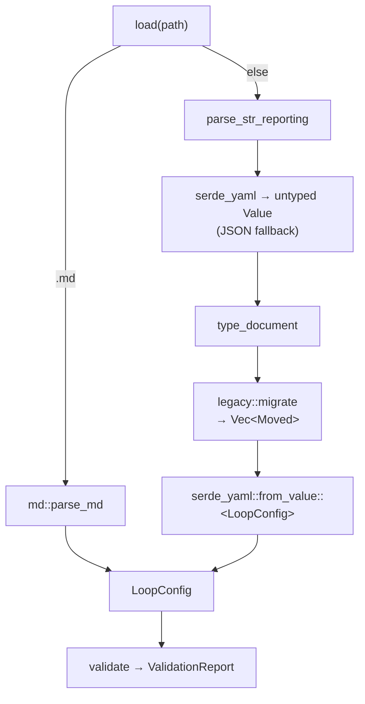

# Loop Configuration Schema

# Loop Configuration Schema

The config model that every other loopsmith crate reads. It lives in `loopsmith-core` (`runtime/crates/loopsmith-core/`), is expressed as Rust types under `src/config/`, and is published as a generated JSON Schema at `config/loop.schema.json`.

A loop config answers four questions, and the top-level shape mirrors them:

| Bundle | Question |
|---|---|
| `intent` | What is this loop for, and how would we know it worked? |
| `execution` | How does the work get done? |
| `safety` | What must not happen, and when does this stop? |
| `evolution` | How is this allowed to change itself? |

Around those four sit five scalar/flag keys: `name` (the only required field in the whole document), `version`, `description`, `environment`, and `features`.

Before 1.0 these were fourteen flat keys, ten of them known by a letter (A–J: information, pre-execution, goals, validations, success, stop gates, schedules, constraints, execution guidelines, default skills). Every one of those spellings still loads — see [Legacy migration](#legacy-migration).

---

## Loading a config

`lib.rs` is the whole public entry surface:

```rust
pub fn load(path: impl AsRef<Path>) -> Result<LoopConfig, CoreError>
pub fn load_validated(path: impl AsRef<Path>) -> Result<LoopConfig, CoreError>
pub fn parse_str(text: &str, origin: &str) -> Result<LoopConfig, CoreError>
pub fn parse_str_reporting(text: &str, origin: &str)
    -> Result<(LoopConfig, Vec<config::legacy::Moved>), CoreError>
pub fn is_markdown(path: &Path) -> bool
pub fn json_schema() -> serde_json::Value
```

`load` dispatches on extension: `.md`/`.markdown` goes to `md::parse_md`, because a Markdown config is a *different grammar*, not a different serialization — guessing would mean reporting a YAML parse error for a document that was never YAML. Everything else falls through to `parse_str`.


```mermaid
flowchart TD
    A["load(path)"] -->|".md"| B["md::parse_md"]
    A -->|"else"| C["parse_str_reporting"]
    C --> D["serde_yaml → untyped Value<br/>(JSON fallback)"]
    D --> E["type_document"]
    E --> F["legacy::migrate<br/>→ Vec&lt;Moved&gt;"]
    F --> G["serde_yaml::from_value::&lt;LoopConfig&gt;"]
    B --> H["LoopConfig"]
    G --> H
    H --> I["validate → ValidationReport"]
```

Two details in `parse_str_reporting` are load-bearing:

1. **Both formats are read into an untyped `serde_yaml::Value` first**, so the same relocation runs for each. Typing directly and only falling back on failure would mean a file mixing old and new keys parses as whichever half the model happened to accept.
2. **Both error strings survive to the caller.** `CoreError::Parse` carries `yaml` and `json` messages side by side, so a mis-indented YAML file does not get reported as bad JSON.

`load_validated` is `load` plus `validate`, treating any `Severity::Error` issue as fatal and rendering the whole report into `CoreError::Invalid`. `src/cmd/run.rs` and `src/cmd/watch.rs` use it; the read-only commands (`plan`, `convert`, `doctor`, `permissions`, `providers`, `gate`, `prune`, `schedule`, `skills`) use plain `load` so they can still operate on a config that does not yet pass.

### Strictness

Nearly every definition in the schema carries `"additionalProperties": false`, which maps to serde's `deny_unknown_fields`. A misspelled nested field is refused, not silently dropped — there is a test named exactly that (`a_misspelled_nested_field_is_refused_not_ignored` in `src/config/mod.rs`). This is why `TriggerSpec` nests its trigger under `on:` rather than flattening it: serde refuses `deny_unknown_fields` on any struct with a flattened field, and losing the guard there would mean a misspelled `idempotency_kye` leaves a trigger with no dedup and no warning.

### The schema file

`config/loop.schema.json` is `json_schema()` written out — `schemars::schema_for!(LoopConfig)`. It is generated, not hand-maintained, and CI regenerates it and fails if the committed copy differs. The previous hand-written schema had already drifted: `max_revisions_per_node` was declared there, defaulted in Rust, documented twice, and read by no runtime code at all.

> **Reading generated defaults carefully.** Two defaults can appear for one field: the per-field default (what you get when the key is omitted from a block that *is* present) and the default rendered for the parent struct. `execution.providers.enforce_judge_independence` shows `true` as its own default but `false` inside the rendered `Execution` default. If judge independence matters to a loop, set it explicitly rather than relying on either.

---

## `intent` — what the loop is for

The bundle a human writes first and reads most. Nothing in it describes machinery.

- **`background: [InfoItem]`** — static `key`/`value` facts every node receives. Formerly section A, `information`. It is deliberately *not* called `context`: 0.3 used that word for the memory policy, and a Markdown config headed `## Context` would then mean one thing in an old file and another in a new one, with no way for the parser to tell which.
- **`prerequisites: [WorkItem]`** — manual work (`step`, `done`, `evidence`) that must be finished before automation may start. This is the one section that makes a fresh config refuse to run.
- **`goals: [Goal]`** — `name`, `description`, `depends_on`, optional `priority`.
- **`success: [SuccessScenario]`** — `name`, `statement`, `target` (a goal name or the reserved `overall`), `mode`, optional `threshold`.

`Mode` is `subjective | objective | percentage`. In `percentage` mode, `threshold` is the fraction of blocking validations that must pass and is required; it is ignored otherwise.

---

## `execution` — how the work gets done

### `graph: GraphSpec`

`nodes: [NodeSpec]`, plus `concurrency`, `join`, and a loop-wide `container_image`.

A `NodeSpec` requires `id`, `instruction`, and `role`. `Role` is `builder | judge | manager | adversary | researcher` — a judge "must not be the same provider instance as the builder it judges". Optional fields: `depends_on` (only list an edge if this step genuinely reads that step's output), `goals`, `skills`, `stage`, `provider`, `tier`, `isolation`, `weight` (relative cost weight for critical-path calculation).

`Isolation` is a three-rung ladder, and the cost is not linear:

| Mode | What it buys | Cost |
|---|---|---|
| `none` | nothing — runs in the loop directory | free; correct for a single writer or a read-only node |
| `worktree` | own git worktree, published back on success | nearly free; **required for parallel writers** |
| `container` | filesystem + network separation over its own worktree | a Docker daemon and an image pull |

`container` **degrades rather than fails**: with no Docker present the node runs under `worktree` and the run records a warning. The same loop directory gets checked out on laptops, CI runners and servers, and refusing to start on the ones without Docker would make container isolation unusable rather than merely unavailable. `network` defaults to `false`.

`Concurrency` is `sequential`, `fixed { max_parallel }`, or `auto { cap = 16, min_marginal_gain = 0.05 }` — derived from the graph's widest wave, capped, and trimmed to where marginal Amdahl speedup still beats marginal cost. `Join` decides when a wave is finished: `wait_for_all` (default), `quorum { count }`, or `first_success`.

### `providers: ProviderRouting`

**Every provider is a command template.** `ProviderSpec` requires `id`, `kind`, `command`; `{prompt}`, `{system}`, `{model}` and `{tier}` are substituted before spawn, or the prompt goes on stdin with `prompt_on_stdin`. This keeps BYOK support out of the Rust build entirely — anything invocable from a shell is routable.

`ProviderKind` covers `claude_code | ollama | grok_cli | grok_build | hermes | openai | gemini`, plus `byok` (any OpenAI-compatible or bespoke command) and `mcp` (stdio). Aliases resolve, so a config writing `openai` is not rejected in favour of `open_ai` (`provider_kind_aliases_still_resolve`).

`requires_env` names variables checked for **presence only** — values are never read, so keys stay out of the ledger. `usage_regex` pulls a token count out of the provider's own output with one capture group; without it, usage is estimated from character count, which is enough to make a budget ceiling real but is not exact. `cascade` is an ordered fallback chain per `Tier` (`cheap | standard | strong`); first reachable provider wins.

### `skills: SkillPolicy` and `default_skills: [DefaultSkill]`

`default_skills` are sub-agents installed before the loop starts (formerly section J), each with a `name`, a `source` (`marketplace | github | local`), an optional `url`, an `init_command`, a `trust_level`, and a `checksum` — "what turns *we fetched the thing we meant to* from a hope into a check".

`TrustLevel` is the real supply-chain control: `untrusted` (the default for anything newly fetched) → `reviewed` (a human read what it does) → `approved` (cleared for effects that leave the loop directory). Before it existed, `min_marketplace_stars` was the only thing between a loop and arbitrary third-party code, and stars measure popularity, not intent.

`SkillPolicy` defaults to `min_trust_level: reviewed`, which means a freshly fetched skill is acquired into `quarantine_dir` (`generated-skills`) but **not dispatched to** — the loop can find a sub-agent on its own, a human decides whether it runs. There is a test for exactly this: `a_freshly_fetched_skill_is_not_dispatched_to_by_default`. `acquisition_order` defaults to `installed → marketplace → generate`. `explore` (off by default — exploration spends real money) trials `explore_candidates` for `min_trials` runs each. `require_checksum` is off by default because it makes discovery impossible, and is the expected setting in `prod`.

### `memory: MemoryPolicy`

Carry-forward within a run: `carry_summaries` (default 2 — enough to see what a node just tried and what it tried before, without the prompt growing with the run; `0` disables), `max_summary_chars` (1200), `max_retrieved` (10). `summary_provider` is opt-in: omit it and summaries are still written, you just lose the prose half, which costs tokens every iteration.

Across runs, four `Namespaces`, each a `NamespacePolicy` with `enabled`, `min_confidence`, `require_provenance`, `retention_days`, and a `Promotion` rule:

| Namespace | Promotion | Why |
|---|---|---|
| `episodic` | `never` | an episode is evidence for a belief, not a belief |
| `failure` | `automatic` | having hit a wall is self-evidencing |
| `procedural` | `repeated_validation { times: 3 }` | reusable methods need corroboration |
| `semantic` | `repeated_validation { times: 3 }` | same, for domain facts |

(`human_approval` is the fourth `Promotion` rule, available but not a default anywhere.) Splitting the namespaces is what makes differing retention defensible — one policy across all four either throws away what the loop learned or keeps every transcript forever.

### `phases: ExecutionGuidelines`

Named `items: [Guideline]`, each a standing instruction injected into the prompt of every node declaring `stage: <name>`, plus `dependency` — ordering written as arrow chains, `"a -> b"` or `"a -> b -> c"`. Anything not named in an arrow has no predecessor and starts immediately, so two guidelines with no arrow between them run in parallel. Sequencing is something you ask for.

### `triggers: TriggerPolicy`

`Trigger` is `cron { expr }`, `interval { seconds }`, `file_change { path }`, `goal_satisfied { goal }`, or `manual`, wrapped in a `TriggerSpec { on, enabled, idempotency_key }`. Two guards make firing safe: `dedup_window_seconds` (300) collapses two firings sharing an idempotency key, and `max_depth` (5) bounds trigger-started-by-trigger chains — depth 0 is a run a human started. Without the cap a self-reachable trigger has no bound at all. Set `idempotency_key` explicitly when the payload is noisier than the event: six files landing in a watched directory together is one event, not six.

---

## `safety` — what must not happen

Everything here is enforced by compiled code rather than asked of a model, and every part of it is a `Protected` component by default.

### `checks: [Validation]`

How each goal is checked (formerly section D). Named `checks` rather than `validations` because the old name read as a synonym for `success`, and authors routinely put success criteria here and detectors there. A `Validation` carries `name`, `statement`, `target`, `mode`, `blocking` (default `true`), and a `Detector`.

`Detector` is ordered by an independence ladder — `judge` is rung 3, everything else rung 4:

| Detector | Passes when |
|---|---|
| `script { command, args, expect_exit }` | exit code 0 (or `expect_exit`). The strongest available. |
| `file_exists { path, non_empty }` | the path exists, optionally non-empty |
| `regex_match { artifact, pattern }` | the pattern matches the named artifact |
| `threshold { metric, op, value }` | the number compares as `CompareOp` says (`gt/gte/lt/lte/eq`) |
| `judge { standard, min_score }` | a model verdict against a **named** external standard |

`judge` requires a judge whose provider differs from the builder's, otherwise the gate refuses it as non-independent. Naming a standard is what turns an opinion into a check.

### `gates: Gates`

Four checkpoints. `entry` runs once before the first iteration (a failing entry gate means the run never starts — the cheapest possible failure); `approval` and `rollback` run after each iteration. Each is a `GateRule { id, statement, detector, on_fail }`, where `GateOutcome` is `stop | escalate | pause | rollback | warn` (`warn` is the only non-blocking one). The `statement` is shown verbatim when a gate blocks, so it is the whole explanation a stopped operator gets — write it for them.

`gates.stop: StopGates` is the old section F entire:

| Field | Default | Note |
|---|---|---|
| `max_iterations` | 10 | hard ceiling |
| `max_revisions_per_node` | 3 | one stuck node cannot burn the whole iteration budget |
| `no_progress_iterations` | 3 | jidoka: stop the line rather than spin |
| `no_progress_iterations_randomness` | unset | perturb *before* giving up; must be **strictly less** than `no_progress_iterations` |
| `stop_on_overall_success` | true | |
| `max_tokens` / `max_cost_usd` / `max_wall_clock_seconds` | unset | |

### `limits: Constraints`

A `global: ConstraintSet` applied to every node, plus `per_node` keyed by node id. A `ConstraintSet` holds `rules` (literal text injected into the node prompt), `forbidden_paths`, `forbidden_commands`, `max_seconds`, `max_tokens`, and `human_checkpoint` — actions that require a human before proceeding. Bezos Type 1: irreversible decisions do not get made at machine speed.

### `recovery: Recovery`

A failure-class → action map. The defaults: retry the world, revise the output, escalate a pattern, never negotiate with a safety violation.

| Failure class | Default action |
|---|---|
| `transient_error` | `retry` — exponential backoff, base 2s, 3 attempts total |
| `invalid_output` | `revise` — 2 attempts, told what was wrong last time |
| `tool_unavailable` | `fallback` — next provider in the tier cascade |
| `repeated_failure` | `escalate` |
| `resource_exhaustion` | `pause` (resumable) |
| `corrupted_state` | `restore_checkpoint` |
| `safety_violation` | `stop` |

`retry` re-dispatches unchanged (failures about the world); `revise` re-dispatches with feedback (failures about the output). `Backoff` is `fixed | linear | exponential`.

### `protected: Protected` and `alerts: [Alert]`

`Protected.components` defaults to every named `ProtectedComponent`: `gates`, `limits`, `recovery`, `protected` (always protected, regardless), `approvals`, `credentials`, `audit`, `baselines`, `retention`, `environment`. `extra_paths` takes dotted config paths for anything the enum does not anticipate. The reasoning on `baselines` is the sharpest: a loop that can move its own baseline can declare any change an improvement.

`Alert { id, metric, above, below, message }` fires on a `Metric` the engine keeps for every run — `iterations`, `tokens_used`, `cost_usd`, `wall_clock_seconds`, `failed_dispatches`, `retries`, `stale_iterations`, `validation_pass_rate` — and gets a human's attention without stopping anything.

---

## `evolution` — how the loop changes itself

Off by default (`enabled: false`), and gated twice: `features.self_evolution` says whether this class of thing is allowed at all, `evolution.enabled` says whether it happens on this run.

`allowed_kinds` defaults to `new_skill`, `skill_update`, `prompt_change`, `validation_change` — a subset of `ProposalKind`, which also defines `graph_change`, `provider_routing`, and `success_criteria`. Opt into those deliberately. The enum is closed and deliberately contains nothing under `safety`: a proposal that wants to relax a limit is not a proposal, it is a request for a human to edit the config.

`baseline: Baseline` is the frozen set of numbers a proposal is measured against — `cost_usd`, `latency_seconds`, `iterations_to_success`, `completion_rate`, `validation_pass_rate`, `measured_at`. Every field is optional, and **a metric left unset is not compared, which is different from being compared against zero.** Without a baseline, no proposal can be adopted, only recorded.

`max_regression` defaults to `0.02` — nonzero on purpose. A change that trades a hair of accuracy for half the cost is usually right, and a zero-tolerance gate refuses every such trade while admitting any change that touches nothing measured.

`require_approval` and `require_sandbox` default on; `keep_rollback` keeps the previous known-good configuration so an adoption can be undone.

---

## `environment` and `features`

`environment` is `dev | staging | prod`, "read before anything else, because it decides how strictly the rest is enforced." `prod` is not a label: the gate refuses an unreviewed marketplace skill and an unapproved evolution proposal outright there, where `dev` only warns. Authors develop against the looser setting and get told what *would* have been refused, instead of discovering it on the run that mattered. Turning off `features.human_approval` or `evolution.require_approval` is refused outright in `prod`.

`features` is five coarse switches, each defaulting to the conservative answer:

| Flag | Default |
|---|---|
| `human_approval` | `true` |
| `parallel_execution` | `true` |
| `external_side_effects` | `false` |
| `marketplace_skills` | `false` (this is the supply-chain surface) |
| `self_evolution` | `false` |

The coarseness is the point: a flag answers "is this class of thing allowed at all", the bundle that owns the capability answers "under what conditions". An operator can disable a whole capability without reading, or trusting, the policy that configures it. Turning `parallel_execution` off forces strict sequential execution — the first thing to try when debugging a run that behaves differently under load.

---

## Validation

`validate(&LoopConfig) -> ValidationReport`, in `src/validate.rs`. A report is a `Vec<Issue>`, each an `Issue { severity, field, message }` where `field` is a dotted path into the config (`safety.checks[2].detector.artifact`). `has_errors()`, `errors()`, `warnings()` and `render()` are the accessors; there is a test asserting `every_issue_names_a_path_the_config_has`.

`validate` does two inline checks (`name` non-empty, at least one goal) and then fans out:

`check_goals` · `check_pre_execution` · `check_validations` · `check_success` · `check_stop_gates` · `check_execution_guidelines` · `check_graph` · `check_providers` · `check_gate_rules` · `check_recovery` · `check_alerts` · `check_containers`

### The rules worth knowing

**Prerequisites gate the whole config.** `check_pre_execution` emits an *error* for any `intent.prerequisites` entry with `done: false`: *"Automating before understanding produces fast, confident garbage."* An empty list is a warning, not an error — the corpus rule is to do the task manually first, because the manual runs are the spec.

**Every goal needs at least one blocking validation.** `check_validations` counts blocking checks per target and errors on any goal with zero: *"it could never be honestly satisfied."* This is the single most common way loops fail, so the config is rejected rather than run. A missing `overall` check is a warning only — the loop can still finish per-goal.

**`overall` is reserved.** A goal named `overall` is an error; it is the whole-loop target for `Validation.target` and `SuccessScenario.target`.

**A `regex_match` must name a real artifact.** `available_artifacts` collects the files this config's own `file_exists` detectors name, registering each under both its full path and its stem. A regex naming anything else has nothing to match and fails closed for the life of the loop — which reads as "the work is not done" rather than "this check was never wired up". The error message lists what *is* available.

**Objective mode with a model judge is warned about** — prefer a script detector so the verdict is not a model's opinion.

**Perturbation must fire before the halt.** `no_progress_iterations_randomness` must be ≥ 1 and strictly less than `no_progress_iterations`; at or past the halt point it never fires. Zero budget ceilings of any kind is a warning: *"an unsolvable task will bill until someone notices."*

**Gate rule ids must be unique within a list** (`a_rule_id_used_twice_is_refused`) — the ledger could not tell them apart. And an `entry` or `approval` rule with `on_fail: rollback` is warned about: it runs before anything has been done, so there is nothing to roll back (`an_entry_rule_cannot_roll_back_what_has_not_run`).

**Phase graphs are scheduled at validation time.** `check_execution_guidelines` resolves the arrow chains via `ExecutionGuidelines::edges()`, rejects arrows naming guidelines that do not exist and self-arrows, and detects cycles by trying to schedule (`an_execution_guideline_cycle_is_refused`). It also errors on any node whose `stage` names a phase that does not exist — that node would never be dispatched. A dependency list with an empty `items` is an error on its own.

**Parallel-writer detection is shape-aware.** `check_graph` warns about concurrent writers but not about chained builders (`chained_builders_are_not_reported_as_parallel_writers`), and `sequential` concurrency silences it entirely.

**A sealed container in front of a hosted model is warned about** — `check_containers` catches a node with no network isolation pointed at a provider that needs it.

### Why cycle detection is duplicated

`topo_order` in `validate.rs` is Kahn's algorithm over phase names. `loopsmith-graph` owns the real scheduler, but **`loopsmith-core` cannot depend on it** — the dependency runs the other way — so validation carries its own copy. The `DagNode` trait is what keeps the two from drifting in shape.

---

## Legacy migration

`config::legacy::migrate(&serde_yaml::Value) -> (Value, Vec<Moved>)` runs on the untyped document before typing. It relocates 0.3 top-level keys into their 1.0 bundles (`insert_path`, `at_mut`), and `repair_nodes`/`migrate_node` fixes node-level spellings — `isolated: true` still parses and still means `Isolation::Worktree`. Bare 0.3 triggers get wrapped in `on:`, which costs one line and keeps `deny_unknown_fields` everywhere.

`Moved` records each relocation. `parse_str` discards the list; `parse_str_reporting` returns it, and the callers that have somewhere to put a deprecation notice use that: the CLI, the wizard, `src/cmd/migrate.rs`, and the browser UI (`loopsmith-web`'s `start_job` → `render` → `assemble::parse_value` → `parse_str`). The list is empty for a file already in the 1.0 shape.

---

## Where this sits in the workspace

`loopsmith-core` depends only on `loopsmith-util`. Everything else depends on it:

```
loopsmith  (CLI: arguments, dispatch, scaffolding)
├── loopsmith-web ─────── loopsmith-wizard ──┐
├── loopsmith-run ──┬──── loopsmith-gate ────┤
│   (the engine)    ├──── loopsmith-skills ──┤
│                   ├──── loopsmith-provider ┼── loopsmith-core ── loopsmith-util
│                   ├──── loopsmith-graph ───┤      (config)        (primitives)
│                   └──── loopsmith-memory ──┘
└── loopsmith-mcp  (gate, memory, and graph over stdio)
```

Consumers to know about when changing the model:

- **`loopsmith-cli/src/scaffold.rs::starter_config`** constructs a `LoopConfig` by hand — `Gates`, `StopGates`, `GraphSpec`, `TriggerPolicy`, `ProviderRouting`, `SkillPolicy`, `ConstraintSet`, `frozen_git_rules`. A new required field breaks scaffolding first.
- **`src/cmd/*`** — `run`/`watch` via `load_validated`, everything else via `load`; `migrate`, `convert` and `new` also call `is_markdown` to pick a writer.
- **`loopsmith-web` / `loopsmith-cli/src/guided.rs`** call `parse_str` on assembled text rather than reading a file.
- **`loopsmith-run/src/export.rs`** round-trips a config through `parse_str` when exporting a run.

### Packaging

`Cargo.toml` sets `include = ["/src/**/*", "/README.md"]` deliberately. The integration tests read `config/examples/` and `config/loop.schema.json` from the repository root, which no crate tarball can contain — shipping them would hand a published crate tests that cannot pass.

---

## The rule the whole model exists to enforce

> A model must not be the thing that certifies its own completion.

`goal_satisfied` is written by `loopsmith-gate` and by nothing else, and the gate can **revoke**: delete a required artifact and a satisfied goal flips back. Everything in this schema — `Detector`, `blocking`, judge independence, `Protected`, `Baseline` — exists so that the gate has something deterministic to decide with. A field that lets a model widen its own success criteria is a bug in the model, not a feature of the config.