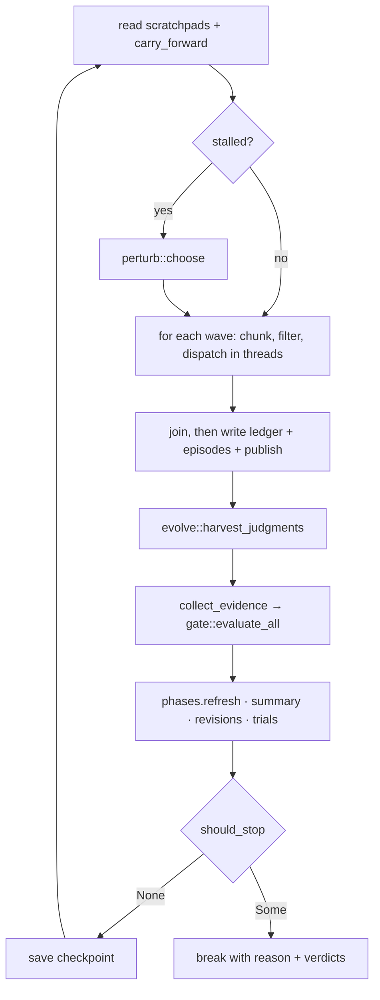
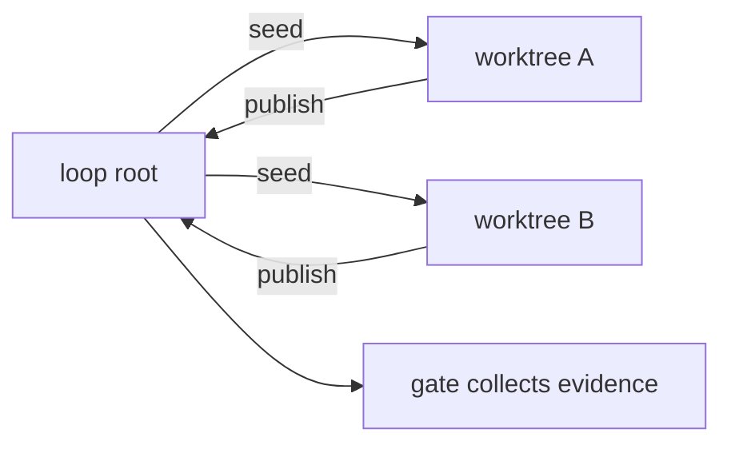

# Loop Execution Engine

# Loop Execution Engine

`runtime/crates/loopsmith-cli/src/run/`

The iteration loop is the part of loopsmith that actually spends money. It takes a validated `LoopConfig`, schedules its node graph into waves, dispatches those waves to providers, collects evidence from disk, asks the gate what is satisfied, and then asks a mechanical ladder of stop gates whether it may go round again.

`mod.rs` is the state machine and nothing else. Everything it needs is delegated to a neighbour module, and the split is by *authority* rather than by convenience — the thing that decides whether work is finished is never the thing that did the work.

| Module | Owns |
|---|---|
| `mod.rs` | `execute()`: the iteration state machine, budget accounting, checkpointing |
| `dispatch.rs` | `run_node()`: isolation, skill resolution, the provider call — store-free by design |
| `prompts.rs` | What a node is told: system prompt, task prompt, the bar it will be checked against |
| `phases.rs` | Section I at runtime: which phase is open, which nodes that lets run |
| `stop.rs` | `should_stop()`: the stop-gate ladder, as a pure function |
| `summary.rs` | Compressing an iteration to what the next one needs to know |
| `perturb.rs` | Varying the approach when the loop has stalled |
| `evolve.rs` | Judge harvesting, skill trials, config proposals |
| `publish.rs` | Moving isolated work back where the gate can see it |
| `export.rs` | The success package a converged run leaves behind |

## Entry point

```rust
pub fn execute<S: Store>(
    cfg: &LoopConfig,
    store: &S,
    opts: &RunOptions,
) -> Result<RunOutcome, String>
```

`RunOptions` carries the run identity and the four switches that change what a run is allowed to do: `dry_run` (plan and report, invoke nothing), `resume` (continue from a stored `Checkpoint`), `acquire_skills` (install missing sub-agents rather than running without them), and `verbose` (mirror the run log to stderr). `config_file` exists only so the scripts written into a success export name the right file.

`RunOutcome` reports the stop reason, the gate's final verdicts, spend (`tokens_used`, `tokens_estimated`, `cost_usd`), the number of config proposals written, and two optional paths — the plain-text run log, and the success export, which is `Some` only when the gate certified overall success.

Three commands construct `RunOptions` and call in: `cmd/run.rs`, `cmd/resume.rs`, and `cmd/watch.rs`. `cmd/run.rs::exit_code` and `cmd/mod.rs::report_outcome` both branch on `StopReason::is_success()`. `cmd/gate.rs` reuses `collect_evidence` directly to evaluate a workspace without running anything.

## Before the first iteration

Two things are resolved up front, because discovering them after a provider call means paying for the discovery:

1. `loopsmith_graph::plan(&cfg.graph)` — the wave schedule, the chosen concurrency, and the predicted speedup. An unschedulable node graph fails here.
2. `Phases::new(cfg)` — the phase graph. It reuses `loopsmith_graph::waves` purely for its cycle and unknown-name checks; a cyclic `execution_guidelines.dependency` refuses to start.

Then a `Recorder` is opened over the store and a `RunLog`. Every event from that point goes to both through one call, which is why `a_run_writes_a_readable_log_beside_the_config` can assert the log's line count equals the ledger's length — the queryable record and the readable one cannot disagree.

If `acquire_skills` is on and this is not a dry run, `install_default_skills` installs section J's declared sub-agents. A failure is recorded as `LedgerKind::NodeFailed` and the run continues: a loop whose optional helper could not be fetched is degraded, not broken.

Resume restores more than the iteration counter. `checkpoint.revisions`, `stale_iterations`, `last_signature`, and (via `restore_verdicts`) the previous rulings all come back, so a resumed run cannot be handed a fresh no-progress counter every time it pauses. Unparseable stored verdicts are dropped rather than guessed at — reporting no deltas on the first iteration is a small loss; reporting invented ones is not.

## One iteration



### Context assembled once

Scratchpad notes (written by the MCP scratchpad tool, one per goal) and `summary::carry_forward` are read once per iteration and shared by reference with every node. A worker thread never touches the store mid-dispatch, and every node in the iteration sees the same account of what happened.

### Perturbation

When `gates.no_progress_iterations_randomness` is set and `stale_iterations` has reached it, `perturb::choose` picks a variation from a deterministic seed (`perturb::seed_for(run_id, iteration)`), given the current stall: how long it has been stuck, which blocking checks are failing (`failing_checks`), and the last two summaries. The seed is written into the ledger so the run replays.

The chosen `Perturbation` reaches nodes two ways: `p.directive()` is appended to the task prompt, and `p.tier_for(node.tier)` may escalate the node one tier stronger. **Neither reaches a judge.** Telling the thing that checks the work to try a different approach — or running it on a stronger model at the same moment as the work — is how a stalled loop talks itself into a lower bar.

`Perturbation::Explore` is the one case where trying an untried sub-agent happens without being asked for; `Perturbation::Reorder` shuffles nodes within a wave before chunking.

### Dispatch

Nodes inside a wave are independent by construction, so the only ordering that matters is between waves. Each wave is chunked by `plan.concurrency.max(1)` and each chunk runs under `std::thread::scope`. A node is dropped from the chunk if:

- `phases.eligible(n)` is false — silently, because a node waiting on its phase is the normal state and one line per node per iteration would bury the events that matter; or
- it has spent `gates.max_revisions_per_node` revisions — logged, with the reason, so the ledger says why it stopped being dispatched.

Everything that touches the store happens outside the threads. `ensure_skills` runs before the spawn; the `published_paths` map is *cloned* per chunk rather than borrowed, so every node in one chunk sees the same published set — which is also the honest answer, since they ran at the same time.

`run_node` is pure with respect to the store. It creates isolation, seeds the worktree, merges the constraint set, builds both prompts, and calls `loopsmith_provider::dispatch`. Both the success and error paths return a `NodeOutcome`; a provider failure is a populated `error` field, not a panic or a lost node. `isolation` is carried out structurally rather than as prose because the caller has to publish from it, and cannot do that from a description.

Writes happen after the join, in a defined order: ledger entry, budget accumulation into the checkpoint, `store.put_episode`, then publication.

### Isolation and publication

An isolated node runs in `state/worktrees/<node>/`. Evidence is collected from the loop root and nowhere else, so isolation is a property of the **wave**, not of the run:



`publish::publish` copies only what `git status --porcelain -z --untracked-files=all` reports as differing from the commit the worktree branched from. Two rules make it safe to reason about:

- **Only what the node changed is published.** Copying the whole tree would republish the repository over itself.
- **The first writer of a path wins; the second is reported.** `claimed_paths` is scoped to the iteration, so a node rewriting its own output next iteration is not a collision. The loser is named in the ledger with the path and the node that got there first, and the entry is recorded as `NodeFailed`.

Paths under `state/`, `logs/`, and `.git/` are reserved and never cross the boundary. Deletions are not propagated — that is a different decision from propagating a write.

`publish::seed` is the mirror image. A worktree branches from `HEAD`, so it would otherwise be blind to everything the run has produced since, including its own upstream's output. `published_paths` is carried across iterations for exactly this; a node is never seeded with a path it published itself, since a builder's in-progress work must not be overwritten by last iteration's copy of it.

### Evidence and the gate

```rust
pub fn collect_evidence(
    cfg: &LoopConfig,
    workdir: &Path,
    metrics_file: Option<&Path>,
    judgments: Vec<Judgment>,
) -> Evidence
```

Deliberately narrow: **a node's own claim that it finished is not evidence.** Only three things count — `metrics.json` parsed as `BTreeMap<String, f64>`, artifacts read from disk, and judge verdicts parsed by `evolve::harvest_judgments`.

Artifacts are the files the config's own `file_exists` detectors name (`artifact_paths`), registered under both their full path and their file stem. Without that, a `regex_match` detector has nothing to match against and reports "artifact was not collected" forever — a check that looks like rigour while being permanently unsatisfiable.

The gate itself is `loopsmith_gate::evaluate_all`, and it is the **only** writer of goal state. That is enforced structurally: `nothing_that_perturbs_or_summarises_can_reach_goal_state` reads `perturb.rs` and `summary.rs` as text and asserts neither mentions `set_goal_state`, `to_goal_state`, or `GoalState`. Both of those take a model's output as input, so the test asserts they have no path to the one function that could hand a model the verdict.

Judge verdicts are only worth reading once you know which provider produced the work being judged — that comes from the episode record, not from the judge's own claim. `a_judge_on_the_builders_provider_still_cannot_satisfy_the_gate` pins this: same provider for builder and judge, and the verdict does not count.

### Phases

A phase is **active** when every phase it depends on is complete, and **complete** when all its member nodes have run and every goal they advance is satisfied *according to the gate*. `Phases::refresh(&verdicts, &dispatched)` is called after every ruling and returns the phases that closed on that pass, so the ledger can say so.

Two deliberate escape hatches: a node with no `stage` is never gated (adding section I must not be a breaking change for configs that don't use it), and a phase with no nodes is complete on sight (`mark_vacuous_complete`) so it never blocks the phase behind it. A stage nobody declared fails closed — validation refuses it, and at runtime `is_active` returns false rather than running work the author did not order.

`guideline_for` supplies the phase's standing instruction, which `build_node_prompt` places *before* the goals: it is usually about what not to do yet.

### Summaries

`summary::deterministic` is written by Rust from the gate's verdicts and the episode record. It is always present, costs nothing, and cannot be wrong about what was satisfied. It reports what ran, what changed since last iteration (`Newly satisfied:` / `REVOKED —`), each still-failing blocking check with the gate's own evidence line, phases closed, and spend to date.

`summary::add_narrative` is optional prose from `cfg.context.summary_provider`, dispatched at `Tier::Cheap`. It is allowed to be interesting and never allowed to matter: the summariser is told explicitly that a separate deterministic gate decides completion and its text has no effect on it. A failed or slow summariser must not fail the iteration it describes, so the whole thing is best-effort.

`carry_forward` renders the last `cfg.context.carry_summaries` summaries into the next iteration's prompt. This is the entire cost-control story — prompt size stops growing with the run. Before it existed, every iteration sent a byte-identical prompt, which is why a stalled loop kept re-running the approach that had already failed; `each_iteration_is_summarised_and_the_next_one_reads_it` proves it no longer does by asserting the `prompt_digest` differs between iterations 1 and 2. Setting `carry_summaries: 0` switches it off and the digests become identical again — summaries are still recorded, they just aren't carried.

### Revisions

`max_revisions_per_node` bounds how many times a node may be re-run with its goals still unsatisfied, so one stuck node cannot spend the whole iteration budget. The counter measures **failed** revisions only:

- nodes with no declared goals are never counted — there is nothing to measure them against, so capping them would be arbitrary;
- a node whose goals the gate satisfied is never capped, however long the run (`a_node_whose_goals_are_satisfied_is_never_capped`).

Nodes that spend their last revision land in `exhausted_nodes`, which `evolve::write_proposals` reads — at that point the graph is questioned rather than the node re-run forever.

## Stop gates

`stop.rs` is a pure function over a snapshot. It touches no store, no provider, and no clock; it is handed numbers and returns a verdict. It runs **after** the gate ruling, so no amount of confident output from a node can extend a run past its ceiling.

```rust
pub fn should_stop(inp: &StopInputs) -> Option<StopReason>  // None means keep going
```

Order is not arbitrary. Success is checked first, so a run that meets the bar on its last permitted iteration reports `OverallSuccess` rather than `IterationCap`. After that it is budgets, cheapest signal first:

| Order | `StopReason` | Fires when |
|---|---|---|
| 1 | `OverallSuccess` | `stop_on_overall_success` and `loopsmith_gate::overall_success` |
| 2 | `NoProgress(n)` | `no_progress_iterations > 0` and `stale_iterations >= it` |
| 3 | `IterationCap(n)` | `iteration >= max_iterations` |
| 4 | `WallClock(s)` | `max_wall_clock_seconds` reached |
| 5 | `TokenBudget(t)` | `max_tokens` reached |
| 6 | `CostBudget(s)` | `max_cost_usd` reached |

`0` means *disabled* for the no-progress gate, not *instant* — pinned by `zero_disables_the_no_progress_gate`.

Progress is measured by `progress_signature`, a sorted fingerprint of `target:satisfied:passed/total` across all verdicts. Unchanged signature increments `stale_iterations`; any change resets it to zero. This is what perturbation reacts to, and perturbation only delays giving up — `a_stalled_run_varies_its_approach_before_it_gives_up` asserts the run still halts with `NoProgress(3)`.

The loop breaks with `(reason, verdicts)` together. Carrying them out as a pair is what removed the older two-variable dance where each of six break sites had to remember to copy `current` into an outer `verdicts` first.

## The success export

Written only when `stop.is_success()`, which is true only for `StopReason::OverallSuccess`, which only `should_stop` produces, and only from `loopsmith_gate::overall_success`. There is no flag that writes it anyway — an export a confident model could produce would be a certificate that means nothing.

`export::export_success` writes `<root>/<sanitized-name>-success/`:

- `SKILL.md` — frontmatter making the package a reusable sub-agent skill, what it proved, how to reuse it, and a "this is a record, not a guarantee" section;
- `EVIDENCE.md` — final rulings with per-check evidence lines, plus the iteration history, stating up front that no node's own claim appears in it;
- `loop.yaml` — the config that converged, verbatim, because someone reusing it needs the thing that worked rather than a description of it;
- `out/` — whatever the nodes produced, copied via `copy_tree`;
- `run.sh` and `run.cmd` — POSIX `sh` (macOS ships bash 3.2) and CRLF batch launchers. Both find `loopsmith` on `PATH` rather than pinning a path that only existed on the producing machine. `run.cmd` has exactly one `exit /b`, on the last line: an early `exit /b` under `setlocal` reports 0, because the implicit `endlocal` restores the saved errorlevel.

`sanitize` maps anything outside `[A-Za-z0-9_-]` to `-`, so a loop named `demo/loop` cannot put its export in a subdirectory and `../../etc` cannot escape at all.

## Crate boundaries

```
loopsmith-cli::run
   ├─ loopsmith-core      LoopConfig, NodeSpec, Role, Tier, Detector, ConstraintSet, Phase
   ├─ loopsmith-graph     plan(), waves() — wave schedule + cycle checks
   ├─ loopsmith-gate      evaluate_all(), overall_success(), Evidence, TargetVerdict, Judgment
   ├─ loopsmith-memory    Store, Checkpoint, Episode, IterationSummary, LedgerKind
   ├─ loopsmith-provider  dispatch(), InvokeRequest, digest()
   ├─ loopsmith-skills    install_default(), find_installed(), acquire()
   └─ crate::{logging, worktree, judgment}
```

The gate crate depends on the memory crate and not the reverse, which is why `Checkpoint` stores verdicts as `verdicts_json: Option<String>` and `restore_verdicts` has to parse them back.

## Contributing

**Adding a stop gate.** Add a `StopReason` variant with a `describe()` arm, add its input to `StopInputs` if it isn't already there, and place the check in `should_stop` by cost — success stays first. `execute()` needs no change; it breaks on whatever `should_stop` returns.

**Adding an evidence source.** Extend `collect_evidence`. If it needs new files, extend `artifact_paths` so the config still declares what the loop produces. Never let a node's own output become evidence.

**Anything that reads model output.** Keep it away from goal state. `nothing_that_perturbs_or_summarises_can_reach_goal_state` will fail if a new file in that class starts referencing `set_goal_state`, `to_goal_state`, or `GoalState` — extend that test's file list rather than working around it.

**Anything that runs on a worker thread.** Keep it store-free, like `run_node`. Return what you learned on `NodeOutcome` and let the caller write it down after the join, so the ledger stays ordered.

**Testing.** `mod.rs`'s tests drive real `execute()` runs against a `SledStore` in a temp dir, using `byok` providers backed by `echo` and `printf` — cheap, deterministic, and enough to exercise budgets, resume, revisions, exports, and judge wiring. `sleeper_provider()` is the pattern for timing assertions: it returns a platform-appropriate delay command (`ping -n` on Windows, `sleep` elsewhere) because a spawn that fails instantly measures nothing and trips the wall-clock assertion for reasons unrelated to concurrency.