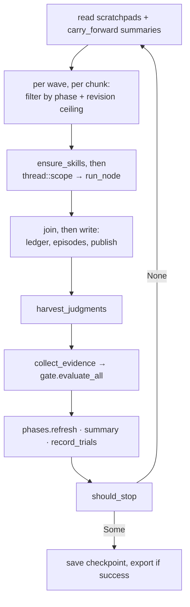

# Loop Execution Engine

# Loop Execution Engine

`runtime/crates/loopsmith-cli/src/run/`

The engine is the state machine that turns a validated `LoopConfig` into a run: it dispatches nodes wave by wave, collects evidence, asks the gate for a ruling, records what happened, and decides whether the run may continue. Everything else in `src/run/` exists so that `mod.rs` can stay a state machine and nothing else.

## The invariant everything else is arranged around

**The thing that decides whether work is finished is never the thing that did the work.**

Concretely:

- `loopsmith_gate` is the only writer of goal state. `collect_evidence` deliberately refuses to treat a node's own output as evidence — only artifacts on disk, parsed metrics, and judge verdicts count.
- A judge verdict only reaches the gate once the engine knows which provider produced the work being judged; that comes from the episode record, not from the judge's claim. A judge sharing the builder's provider cannot satisfy a target (`a_judge_on_the_builders_provider_still_cannot_satisfy_the_gate`).
- Phases close on the gate's ruling, never on a node reporting itself done (`Phases::refresh`).
- The success export is written only when `StopReason::OverallSuccess` was returned, and that variant only comes from `should_stop` calling `loopsmith_gate::overall_success`. There is no flag that writes one anyway.
- The stop-gate ladder is a pure function over a numeric snapshot, evaluated *after* the gate ruling, so no amount of confident model output can extend a run past its ceiling.

There is a structural test asserting the last part stays true: `nothing_that_perturbs_or_summarises_can_reach_goal_state` greps `perturb.rs` and `summary.rs` for `set_goal_state`, `to_goal_state`, and `GoalState`. If you add a component that consumes model output, add it to that list.

## Entry point

```rust
pub fn execute<S: Store>(
    cfg: &LoopConfig,
    store: &S,
    opts: &RunOptions,
) -> Result<RunOutcome, String>
```

`RunOptions` carries the run identity and the four switches that change behaviour rather than configuration: `dry_run` (plan and log, invoke no provider), `resume` (restore the checkpoint), `acquire_skills` (install missing sub-agents rather than running without them), and `verbose` (mirror the run log to stderr). `config_file` exists only so the export's re-run scripts can name the right file.

`RunOutcome` reports the stop reason, the final verdicts, accumulated tokens and cost (with `tokens_estimated` set if any provider reported nothing and usage had to be estimated), the number of evolution proposals written, and the two paths a run may leave behind: `log_path` and `export_path`.

Callers are the CLI commands — `cmd/run.rs`, `cmd/resume.rs`, and `cmd/watch.rs` all build a `RunOptions` and call `execute`; `cmd/run.rs::exit_code` and `cmd/mod.rs::report_outcome` read `StopReason::is_success`. `cmd/gate.rs` reuses `collect_evidence` directly to evaluate a workspace without running anything.

Before the first provider call, `execute` resolves two things that are config bugs if they fail: `loopsmith_graph::plan` (the node graph → waves and concurrency) and `Phases::new` (section I's phase graph, cycle-checked by reusing the scheduler). Discovering an unschedulable graph after dispatch means paying for the discovery.

## One iteration



Ordering is load-bearing at three points. Skill acquisition touches the store, so it happens before threads start. Ledger and episode writes happen after the join, so the record stays ordered. The summary is written after the gate so it quotes rulings rather than predictions.

## Components

### `dispatch.rs` — running one node

`run_node` is **store-free by design**: it runs on a worker thread, and a thread that can write the ledger is a thread that can interleave the ledger. Everything it learns comes back in a `NodeOutcome` and is written by the caller after the join.

It creates isolation (`worktree::create` when `node.isolated`, otherwise `Isolation::Shared`), seeds the worktree from what other nodes published, merges global and per-node constraints, builds both prompts, resolves the tier, and calls `loopsmith_provider::dispatch`. Provider failures become `NodeOutcome { error: Some(..) }` rather than a panic or an early return — the wave still joins cleanly.

`NodeContext` bundles what a node is told beyond its own spec: scratchpad notes, resolved sub-agents, phase guideline, carried summaries, active perturbation, and the published-path map. It's a struct because the alternative is an eight-argument function where two arguments are `&str` and only their order distinguishes them.

`ensure_skills` resolves declared sub-agents, acquiring missing ones when `acquire_skills` is on and otherwise logging that the node runs without them. A missing optional helper degrades a run; it does not break one.

### `phases.rs` — section I at runtime

A phase is **active** when every phase it depends on is complete, and **complete** when all its member nodes have run *and* every goal those nodes advance is satisfied per the gate. `Phases::eligible` is what the dispatch loop consults; nodes without a `stage` are always eligible, so adding phases was not a breaking change for configs that don't use them. Empty phases are marked complete at construction (`mark_vacuous_complete`) so a phase nobody staffed cannot block the one behind it. An unknown stage name fails closed.

`refresh` returns the phases that closed on this pass, so the ledger can say so.

### `prompts.rs` — what a node is told

Two prompts. The system prompt carries loop name, the `information` block, and the merged constraint set (rules, forbidden paths and commands, human checkpoints). The task prompt carries, in order: the instruction, the phase guideline, available sub-agents, the goals this node advances **and the blocking validations those goals face**, then either the judge output contract (for `Role::Judge`) or the perturbation directive (for everyone else), then carried history, then scratchpad notes.

Stating the bar in the prompt is not politeness — the gate will refuse work that missed a target nobody mentioned. The judge/perturbation branch is exclusive on purpose: telling the thing that checks the work to "try a different approach" is how a stalled loop talks itself into a lower bar.

### `publish.rs` — isolation is a property of the wave, not the run

An isolated node runs in `state/worktrees/<node>/`, but evidence is collected from the loop root. Without publishing, a `file_exists` detector pointing at an isolated builder's output could never pass — real work, on disk, invisible to the only thing allowed to rule on it.

`publish` asks git for the paths that differ from the commit the worktree branched from (`git status --porcelain -z --untracked-files=all`, parsed by `parse_status`, which drops rename sources and skips deletions), filters `state/`, `logs/`, and `.git/`, then copies. **First writer wins; the second is named in the ledger** with the path and the node that got there first — taking the last write silently would reintroduce exactly the collision isolation exists to prevent.

`seed` is the mirror: because a worktree branches from `HEAD`, an isolated node starts blind to everything the run produced since, including its upstream's output. Seeding copies published paths in before the node runs — never a path the node published itself, so a builder's in-progress work isn't overwritten by last iteration's copy of it.

The engine keeps two maps for this: `published_paths` spans the whole run (used for seeding), `claimed_paths` is per-iteration (used for collision detection). A node rewriting its own output next iteration is normal and is not a collision.

### `summary.rs` — compressing an iteration

Two halves, and the split is the point:

- `deterministic(&IterationFacts)` is written by Rust from the gate's verdicts and the dispatch log. Always present, costs nothing, cannot be wrong. It reports what ran, newly satisfied targets, **REVOKED** targets (the gate can take `done` back), still-failing blocking checks with the gate's own evidence line, closed phases, and spend.
- `add_narrative` optionally buys prose from `context.summary_provider` at `Tier::Cheap`. Best effort — a failed summariser must not fail the iteration it describes — and the prompt explicitly tells it that it is not deciding whether anything is finished.

`carry_forward` renders the last `context.carry_summaries` summaries for the next iteration's prompts. This is the entire cost-control story: prompt size stops growing with the run. Setting `carry_summaries: 0` disables it, and the observable effect is that iteration 2 gets a byte-identical prompt to iteration 1 — which is precisely the bug carry-forward was added to fix.

### `stop.rs` — the ladder

`should_stop(&StopInputs) -> Option<StopReason>`. Pure: no store, no providers, no clock. Order is not arbitrary:

1. `OverallSuccess` — checked first so a run that meets the bar on its last permitted iteration reports success, not "iteration cap".
2. `NoProgress` — `no_progress_iterations: 0` means *disabled*, not *instant*.
3. `IterationCap`
4. `WallClock`, `TokenBudget`, `CostBudget` — budgets, cheapest signal first.

`progress_signature` fingerprints the verdict map (`target:satisfied:passed/total`, sorted). An unchanged signature increments `stale_iterations`; any change resets it. Adding a gate means adding a variant, a branch, and a `describe()` arm — nothing in `execute` changes.

### `evolve.rs` / `perturb.rs` — learning and unsticking

`evolve` handles the parts that change future runs rather than this one: `harvest_judgments` parses judge output into `Judgment`s, `record_trials` records what each sub-agent was worth (skill × satisfied-goals), `next_candidate` picks an untried skill to explore, and `write_proposals` turns exhausted nodes and stuck verdicts into config proposals.

`perturb` fires only when `stop_gates.no_progress_iterations_randomness` is set and `stale_iterations` has reached it. `seed_for(run_id, iteration)` makes the choice reproducible and the seed is written to the ledger so a run replays. A chosen `Perturbation` can reorder a wave (`shuffle`), escalate a tier (`tier_for`, never for judges), add a prompt directive (`directive`), or trigger `Explore` — the one case where trying an untried sub-agent is worth money without being asked. Perturbation delays giving up; it does not prevent it (`a_stalled_run_varies_its_approach_before_it_gives_up`).

### `export.rs` — what a successful run leaves behind

`export_success` writes `<root>/<name>-success/`: a `SKILL.md` frontmatter'd as a reusable sub-agent, an `EVIDENCE.md` stating where each ruling came from, the converged `loop.yaml` verbatim, whatever is in `out/`, and both `run.sh` (POSIX sh — macOS ships bash 3.2) and `run.cmd` (CRLF, single `exit /b` on the last line because `setlocal`'s implicit `endlocal` restores the errorlevel). The loop name is `sanitize`d before it reaches the filesystem. `SKILL.md` says in as many words that it is "a record, not a guarantee".

## Concurrency

`plan.concurrency` sets the width. Waves run in sequence; within a wave, nodes are independent by construction and are chunked by width, each chunk running under `std::thread::scope`. The published-path map is **snapshotted per chunk** rather than borrowed — every node in one chunk sees the same published set, which is also the honest answer, since they ran at the same time.

Rules for anything you add to the threaded section:

- No store access inside the closure. Return it in `NodeOutcome` and write it after the join.
- Borrow references *outside* the `move` closure (see the `nudge` binding — taking `perturbation.as_ref()` inside would capture the `Option` itself).
- Thread panics are dropped via `filter_map(|h| h.join().ok())`; a panicking node loses its outcome rather than the wave.

`independent_nodes_in_a_wave_run_concurrently` guards this with a wall-clock assertion, using `ping -n` on Windows because `sleep` isn't a command there.

## State that survives

The `Checkpoint` carries `iteration`, `completed_nodes`, `tokens_used`, `cost_usd`, `revisions`, `stale_iterations`, `last_signature`, and `verdicts_json`. Restoring the stop-gate accounting is deliberate: a resumed run must not be handed a fresh revision budget and a zeroed no-progress counter every time it pauses. `restore_verdicts` drops unparseable stored verdicts rather than guessing — a resumed run reporting no deltas on its first iteration is a small loss; one reporting invented deltas is not.

`max_revisions_per_node` is enforced by counting, per node, the iterations where it ran and *left a declared goal unsatisfied*. Nodes with no declared goals are never counted (nothing to measure them against), and a node whose goals pass keeps being dispatched forever. When a node hits the ceiling it stops being dispatched, the ledger says why, and the run continues — one stuck node must not spend the whole iteration budget.

Every event goes through `Recorder::entry`, which writes the sled ledger and the plain-text run log in one call, so the queryable record and the readable one cannot disagree. `a_run_writes_a_readable_log_beside_the_config` asserts they hold the same number of events.

## Contributing notes

- **Adding a stop condition** → `StopReason` variant + branch in `should_stop` + `describe()`. Nothing in `execute` changes.
- **Adding something a node is told** → field on `NodeContext`, rendering in `build_node_prompt`. Remember it changes `prompt_digest`, which several tests use as the proxy for "the prompt actually varied".
- **Adding a component that reads model output** → it must not be able to reach goal state, and it should be added to the file list in `nothing_that_perturbs_or_summarises_can_reach_goal_state`.
- **Adding a detector type that needs artifacts** → `artifact_paths` currently derives the readable set from `file_exists` detectors only. That set is the config's own answer to "what is this loop supposed to produce". A regex naming anything else is caught by validation rather than failing silently at runtime — keep that pairing intact.
- Known limitation, documented in `publish.rs`: an isolated node sees its upstream's work only via `seed`, which copies published files in. It does not see uncommitted work through git. Downstream *unisolated* nodes read the loop root directly and do.