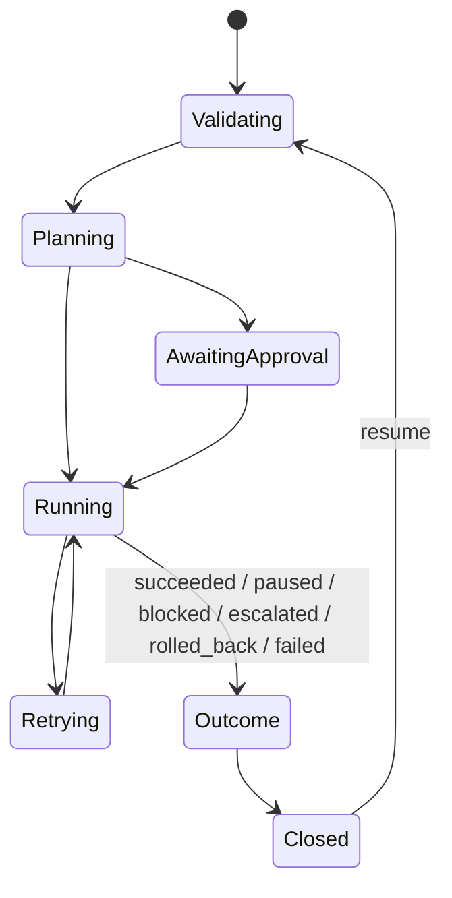
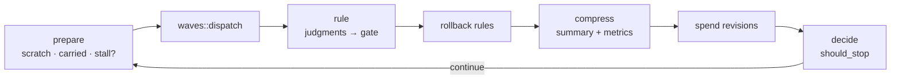

# Loop Execution Engine

# Loop Execution Engine — `loopsmith-run`

Everything that happens between "start this loop" and "here is why it stopped". The crate owns the run lifecycle, the iteration loop, node dispatch (including isolation and recovery), the stop-gate ladder, iteration compression, and the success export.

It does **not** own the verdict. The engine collects evidence and hands it to `loopsmith-gate`; nothing in this crate can mark a goal satisfied. That split is the load-bearing design decision, and most of the structure below exists to keep it true.

Crate root: `runtime/crates/loopsmith-run/src/lib.rs`.

---

## Entry point

```rust
pub fn execute<S: Store>(
    cfg: &LoopConfig,
    store: &S,
    opts: &RunOptions,
) -> Result<RunOutcome, String>
```

`execute` (`lib.rs:122`) is the whole public surface for running a loop. The CLI calls it from two places — `loopsmith run` (`loopsmith-cli/src/cmd/run.rs:37`) and the trigger watcher (`cmd/watch.rs:110`) — with the same options struct; `resume` is the same call with `resume: true`.

`RunOptions` carries the run id, the loop root (`workdir`), and four behavioural flags. Two are worth knowing about:

- `dry_run` — plan and report, invoke no provider. Skill installation is skipped too: "invoke no provider" should not mean "install software anyway" (`planning.rs:48`).
- `answer_escalations` — deliberately separate from `resume`. A scheduler resumes a run on a cadence; if a resume also cleared every open escalation and refunded every stuck node's revision budget, a loop that pauses on a schedule could retry a broken node forever (`lib.rs:83`, `validating.rs:25`).

`RunOutcome` reports the closing `RunState`, the `StopReason`, the gate's final verdicts, spend, the log and export paths, `RunMetrics`, raised alerts, and the `BaselineVerdict`. An `Err` means a config the engine could not start at all — an unschedulable graph, an unresolvable phase chain — and that run is still written to the ledger as having moved to `Failed`, so the record and the return value agree.

---

## The lifecycle

`state.rs` owns the run's state and is the only place a transition is legal. `RunState::successors` *is* the state machine — one table, thirteen states.


```mermaid
stateDiagram-v2
    [*] --> Validating
    Validating --> Planning
    Planning --> AwaitingApproval
    Planning --> Running
    AwaitingApproval --> Running
    Running --> Retrying
    Retrying --> Running
    Running --> Outcome : succeeded / paused / blocked / escalated / rolled_back / failed
    Outcome --> Closed
    Closed --> Validating : resume
```

The property worth having: a run cannot be recorded as `Succeeded` from `Planning`, because the only road to `Succeeded` runs through `Running`, which runs through the gate. `state.rs` tests that directly (`success_is_unreachable_without_running`).

Every state module takes `&mut context::Run` and nothing else, so "what can this state touch" has one answer. `Run::enter` advances the lifecycle, writes the transition to the ledger and the run log together, and persists the checkpoint only when entering a state the engine spends time or money in — `Running`, `Retrying`, `AwaitingApproval`, `Closed`. The states in between are passed through in milliseconds, and every save is an fsync (`context.rs:92`).

`Lifecycle::resume` distinguishes three cases from a stored checkpoint: a run that closed normally, a pre-1.0 checkpoint with no state (every such run was closed — the old engine had no other way to stop), and a checkpoint whose last state was `Running` or similar, which means the process died mid-run. The third is reported and the resume still goes through validation, because the config may have been edited while the run was stopped.

---

## The four states, in order

### `Validating` — may this run start at all?

`validating.rs`. The config was already validated by the loader; what is checked here is the *world*. `safety.gates.entry` rules are evaluated against evidence on disk before a single token is spent: a missing brief, a lockfile another run holds, a metric that says the target system is down.

This is also where answering escalations happens, before `Progress::from_checkpoint` reads the counters — built before, the revision counts would be stale (`lib.rs:131`).

### `Planning` — schedule the graph, resolve the phases

`planning.rs` calls `loopsmith_graph::plan` for the wave decomposition and builds `phases::Phases`. Both resolve before anything is dispatched, because finding an unschedulable graph after the first provider call means paying for the discovery.

`phases.rs` is Section I of the config at runtime. A phase is **active** when every phase it depends on is complete, and **complete** when its own nodes have all run *and* every goal they advance is satisfied. Completion is read off the gate's verdicts (`Phases::refresh`), never off a node's report. A phase with no nodes is complete on sight, so adding an unstaffed phase never blocks the one behind it. Nodes with no `stage` are never gated — otherwise adding `execution.phases` would be a breaking change for every config that does not use it.

Then `planning::approve`: if `safety.gates.approval` has rules and `features.human_approval` is on, the run enters `AwaitingApproval` and the rules are checked. An approval rule is a detector like any other, which is what lets a human approve without loopsmith growing a UI: the rule names an artifact — `APPROVED`, a signed-off ticket, a green deploy check — and the run proceeds once it is there.

### `Running` — the iteration loop

`running::iterate` is one `loop`, and every iteration is the same sequence:


```mermaid
flowchart LR
    P[prepare<br/>scratch · carried · stall?] --> D[waves::dispatch]
    D --> R[rule<br/>judgments → gate]
    R --> B[rollback rules]
    B --> C[compress<br/>summary + metrics]
    C --> V[spend revisions]
    V --> S[decide<br/>should_stop]
    S -->|continue| P
```

- **`prepare`** (`running.rs:371`) gathers what every node in the iteration is shown: per-goal scratchpad notes (read once, so no worker thread touches the store mid-dispatch), the carried summaries, promoted cross-run memory via `remembering::recall`, and — if `stop.no_progress_iterations_randomness` has been crossed — a `perturb::Perturbation`.
- **`rule`** (`running.rs:450`) harvests judge output into `Judgment`s, collects evidence at the loop root, calls `loopsmith_gate::evaluate_all`, and refreshes phase completion.
- **Rollback rules run after every ruling, even one that follows a halt.** A halt decides how the run ends; a rollback decides whether what this iteration achieved is kept. One does not answer the other (`running.rs:219`).
- **Rulings reach the store only if no rollback rule refused them** (`persist_rulings`). Written earlier, `status` and a `goal_satisfied` trigger would both act on a ruling the run has already discarded.
- **`spend_revisions`** charges a revision to every node that ran and left its goals unsatisfied, and returns the ones that just spent their last. Nodes with no declared goals are never counted — there is nothing to measure them against.
- **`decide`** computes `progress_signature(verdicts)`, increments or resets `stale_iterations`, and asks `should_stop`.

`Progress` is the accounting that outlives an iteration, and it is restored from the checkpoint rather than started fresh — a resumed run must not be handed a zeroed no-progress counter and a full revision budget every time it pauses. `Snapshot` is what a rollback returns to, and spend is deliberately *not* in it: a rollback discards what an iteration achieved, never what it cost, or a run could refund its own budget by tripping a rollback rule (`running.rs:159`).

### `Closing` — the outcome, written down once

`closing.rs`. `outcome_for` maps a stop reason to an outcome state: success is `Succeeded`; a budget or iteration ceiling is resource exhaustion, answered by `safety.recovery.resource_exhaustion` (`pause` by default — the run did nothing wrong, and a bigger budget is the ordinary next step); no progress is `Blocked`. Either becomes `Escalated` when the run has questions open for a human, because that, not the ceiling, is what it is waiting on.

Alerts get a final look at the numbers before the counters are stored, since wall clock and spend can cross a line in a run's last moments. Then the outcome state is entered, the export is written if and only if the gate certified success, `remembering::procedure` records the shape of a successful run, `metrics::measure` fills `RunMetrics`, and `judge_against_baseline` compares this run to `evolution.baseline` — on completion and pass rate alone when the run did not succeed, since "mean cost of a successful run" is not comparable to a failure.

---

## Inside an iteration: dispatch

`waves.rs` is the dispatcher; `dispatch.rs` is what a worker actually runs.

**Concurrency.** Up to `graph.concurrency` nodes are in flight at once. The in-flight budget is global rather than per-wave, so a released wave's stragglers keep their slots while the next wave starts, instead of a whole chunk waiting on its slowest member.

**Join** (`execution.graph.join`, modelled by `Tally`):

| Join | Released when | Not met ⇒ |
|---|---|---|
| `wait_for_all` (default) | every node finished, successfully or not | n/a |
| `quorum { count }` | `count` nodes succeeded | later waves not dispatched this iteration |
| `first_success` | one succeeded | same |

A released wave's stragglers are left to finish and their output is still recorded and published if it arrives in time; nodes not yet started are not started. A `quorum`/`first_success` wave whose nodes all finish without meeting the bar is not released, and `break 'waves` stops the iteration there — later waves would be reading answers that are not there.

**Store discipline.** `dispatch::run_node` is store-free by construction: "a thread that can write to the ledger is a thread that can interleave the ledger." Workers return a `NodeOutcome` over an `mpsc` channel and `waves::handle` writes everything down on the dispatcher's thread, in arrival order. A worker panic is caught (`catch_unwind`) and turned into one node's failure — an uncaught panic would mean a report that never arrives and a dispatcher that waits forever.

**What a node is told** — `prompts.rs`. Two prompts: a system prompt with the loop's static context and the merged `ConstraintSet` (rules, forbidden paths and commands, human checkpoints), and a task prompt assembled in a deliberate order — a refused previous attempt first, then the phase guideline (usually about what *not* to do yet), sub-agents, the goals *and the checks those goals face*, then role-specific material. Stating the bar is not politeness: a node that does not know how it will be checked cannot aim at the check.

Two things are never handed to a `Role::Judge`: a perturbation ("try a different approach" is how a stalled loop talks itself into a lower bar) and promoted cross-run memory (the thing that checks the work is held to the standard it was given, not to what the loop has come to believe). For the same reason, a perturbation escalates a *builder's* tier but never a judge's (`dispatch.rs:179`).

**Eligibility** (`eligible_nodes`) drops nodes whose phase is shut, nodes at the `max_revisions_per_node` ceiling, and nodes escalated earlier in the run. A node waiting on its phase is skipped silently — one line per node per iteration would bury the events that matter.

---

## Isolation and publication

`worktree.rs` + `publish.rs` + `container.rs`, and the three-step dance between them is the part most likely to surprise a new contributor.

A node whose `isolation` asks for it gets a git worktree at `state/worktrees/<node>/` on branch `loopsmith/<run>/<node>`. Nothing here is fatal: outside a git repo, or on a machine without git, `worktree::create` returns `Isolation::Shared { reason }` and the run continues with an honest report. An existing worktree is reused across iterations — recreating it would throw away the node's in-progress work every pass.

Because a worktree branches from `HEAD`, it is blind to everything the run has produced since. So:

1. **`publish::seed`** copies in paths other nodes have already published, before the node runs — never a path the node published itself, so a builder's in-progress work is not overwritten by last iteration's copy of it.
2. The node runs in its worktree (and, for `isolation: container`, inside `docker run --rm` with that worktree mounted at `/work` — degrading to a plain worktree, once per run in the ledger, when no runtime, daemon, or image is available).
3. **`publish::publish`** copies what the node changed back into the loop root at join time, because `evidence::at_root` collects evidence there and nowhere else.

Without step 3, a `file_exists` detector pointing at an isolated builder's output could never pass: the work is real, on disk, and invisible to the only thing allowed to rule on it — a worse failure than the clobbering isolation prevents, because it looks like the builder did nothing.

Three rules make publication safe to reason about:

- **Only what the node changed.** `git status --porcelain -z --untracked-files=all` in the worktree is exactly that set. `-z` because paths contain spaces; `--untracked-files=all` because a new artifact in a new directory is the normal case and git's default collapses it to the directory name. Deletions are not propagated.
- **First writer wins, second is named.** `claimed_paths` is carried across every node in the iteration; the loser gets a ledger line with the path and the node that got there first. Taking the last write silently would reintroduce the collision after doing the work to avoid it.
- **`state/`, `logs/`, `.git/` are never published**, whatever a node did to them.

`publish::forbidden_changes` is the one place a `forbidden_paths` constraint is *enforced* rather than merely stated: an isolated node's git status is a record of what it touched. A hit means nothing from that worktree is published — the whole tree is suspect, not just the offending file — and the failure is raised as `FailureClass::SafetyViolation`, which halts the run as `Failed` by default. A node sharing the loop root leaves no such record, so its `forbidden_paths` remain a prompt-level instruction.

A rollback restores the checkpoint and the progress counters but **does not revert published files**; the ledger line names what was written so a human can check before resuming (`running.rs:303`).

---

## Recovery

`recovering.rs` turns a `FailureClass` and an attempt count into a `Response` and nothing more — carrying it out is the dispatcher's job. Keeping the decision pure is what lets every row of the policy table be tested without running a provider.

| `Response` | Meaning |
|---|---|
| `Retry { delay_seconds }` | same dispatch again, after backoff |
| `Revise` | dispatch again now, telling the node what was wrong |
| `Continue` | accept for this iteration; eligible again next |
| `Escalate` | stop dispatching this node for the run, record the question |
| `Halt(state)` | end the run in that state |

`recovering::answer` decides *and* writes the ledger line in one step, so no call site can do one without the other. `may_redispatch: false` — set once dispatch has stopped for the iteration — downgrades a retry or revision to `Continue`: the policy asked for another attempt and there is no longer one to give.

`max_attempts` counts dispatches, not retries; the default of 3 is the first try and two more. `RecoveryAction::Fallback` resolves to `Continue` because the provider cascade *is* the fallback and it has already been walked.

Two classifications are worth calling out. A judge that answered without a single `VERDICT:` block is `InvalidOutput` — it ran, and the gate cannot read a word of it — which the default policy answers with `Revise` rather than a blind retry (`waves.rs:587`). A retry's backoff is slept on the retry's own thread, so it blocks nothing else; on waking it checks `Shared::stopped` and reports itself cancelled rather than spending money after the run stopped dispatching.

Run-level conditions go through `recovering::run_outcome`, which ignores retry and revise: a budget does not refill by being asked twice.

---

## The stop-gate ladder

`stop.rs` is a pure function over a snapshot (`StopInputs`) — no store, no provider, no clock. The gates are the mechanical answer to "may this run continue", and a mechanical answer must not be reachable by anything a node said.

Order is not arbitrary:

1. `stop_on_overall_success` — checked first, so a run that meets the bar on its last permitted iteration reports `OverallSuccess`, not `IterationCap`.
2. `no_progress_iterations` (`0` means disabled, not instant).
3. `max_iterations`, then wall clock, tokens, cost — cheapest signal first.

`progress_signature` fingerprints the verdicts (`target:satisfied:passed/total`, sorted). If it does not change between iterations the loop is spinning rather than progressing. `waves::over_budget` additionally checks the token and cost ceilings mid-iteration and stops launching new nodes, so a wide graph cannot overshoot a budget by a whole wave.

---

## Compression, judgment, and the export

**`summary.rs`** splits an iteration's record in two, and the split is load-bearing. `deterministic` is written by Rust from the gate's verdicts and the episode log — always present, costs nothing, cannot be wrong about what was satisfied. It reports deltas (`Newly satisfied`, and a shouted `REVOKED —` when the gate takes `done` back), the evidence line of every failing blocking check, phases closed, and spend. `add_narrative` optionally asks a cheap provider for two-to-four sentences of prose; the summariser is told explicitly that it is not deciding whether anything is finished, and nothing reads a summary to decide goal state anyway. `carry_forward` renders the last `context.carry_summaries` summaries — not the episodes — which is the whole cost-control story: prompt size stops growing with the run.

**`judgment.rs`** parses judge prose into `Judgment`s the gate can act on. The contract (`JUDGE_OUTPUT_CONTRACT`, appended to every judge prompt and kept in the same file as the parser so the two cannot drift) is a line-oriented block format rather than JSON, because asking for strict JSON in the middle of an explanation is how you get truncated objects:

```text
VERDICT: every-claim-cited PASS
STANDARD: the citation policy in AGENTS.md
EVIDENCE: all 14 claims carry a source line; checked lines 12-96
SCORE: 9
```

Unparseable output yields nothing, so the gate fails closed. An unrecognised decision word is skipped rather than guessed at. **A `PASS` with no evidence is demoted to a fail** — that is an assertion, not a judgment, and letting it through would reopen the hole the gate exists to close. Provider ids come from the episode record, never from the judge's own claim about which model it was.

**`export.rs`** writes `<root>/<name>-success/` — `SKILL.md`, `EVIDENCE.md`, the `loop.yaml` that converged, the `out/` tree, and POSIX + `cmd.exe` re-run launchers — packaged as a sub-agent skill so the next person with the same problem starts from something that worked. It is written only when `StopReason::OverallSuccess` fired, which only `should_stop` produces, and only from `loopsmith_gate::overall_success`. There is no flag to write it anyway: an export a confident model could produce would be a certificate that means nothing. The `SKILL.md` says so in as many words — "a record, not a guarantee" — and a test asserts that line is present.

---

## Supporting modules

| Module | What it does |
|---|---|
| `context.rs` | `Run`: config, store, options, recorder, checkpoint, lifecycle. Checkpoint read/write with the `corrupted_state` policy applied (`save_or_halt`). |
| `logging.rs` | `Recorder` writes the sled ledger and the plain-text `logs/` file through one choke point, so the queryable record and the readable one cannot disagree. `logging::line` is also the seam `loopsmith-web` renders progress through. |
| `evidence.rs` | What the gate is shown: artifacts named by `file_exists` detectors (registered under both full path and stem, so `regex_match` has something to match), `metrics.json`, parsed judgments. A node's claim is not evidence. |
| `rules.rs` | Entry, approval, and rollback rules applied uniformly; a `rollback` outcome on an entry rule has nothing to undo, so it fails the run and says so. |
| `metrics.rs` | The eight numbers every `RunOutcome` reports, and `safety.alerts` thresholds on them — each alert fires at most once per run. |
| `evolve.rs` | Skill trials, judgment harvesting, and proposal writing. Gathers evidence and writes proposals; adopting one is a human's edit. |
| `perturb.rs` | What to do when the loop has stopped moving but has budget left. A fixed four-item menu of changes to *how* the loop works, never to what counts as done; seeded from run id + iteration and logged, so a strange turn can be replayed. |
| `remembering.rs` | Cross-run memory the engine itself writes: failure modes (promoted on write — hitting a wall is its own evidence) and procedures (promoted only once several runs agree). |
| `container.rs` | Docker/Podman probe and the `Containment` decision, including the degrade path. |
| `schedule.rs` | Cron/interval/file triggers and the `Watcher` behind `loopsmith run watch`; plist, crontab, and `schtasks` generation for `run schedule --install`. Cron is evaluated in **UTC** on purpose. |

---

## Working on this crate

- **`loopsmith-run` never decides that work is done.** If a change would let the engine write goal state, set `satisfied`, or gate the export on anything but `StopReason::OverallSuccess`, it is the wrong change. `loopsmith-gate` is the only writer.
- **Keep the stop ladder pure.** `stop.rs` takes numbers and returns a verdict. It used to be eight inline `if` blocks in the middle of `execute()`; adding a gate meant remembering the same two-line dance at every break site.
- **Workers do not touch the store.** Anything a node's dispatch learns comes back on `NodeOutcome` and is written down after the join, in a defined order. Skill acquisition happens on the dispatcher's thread before any worker starts, for exactly this reason.
- **Add a state by editing the table.** `RunState::successors` is the machine; `Lifecycle::advance` refuses anything not in it, and `ALL` drives round-trip and outcome-closure tests.
- Unit tests live beside their module (`phases.rs`, `stop.rs`, `judgment.rs`, `publish.rs`, `worktree.rs`, `export.rs`, `recovering.rs`, `state.rs`, `summary.rs`) and the engine-level tests are in `src/tests.rs`. The git-touching tests build real repositories in temp dirs via `loopsmith_util::testing::temp_dir`, so they are worth running before touching isolation or publication.

---

*Note on the brief: the paths supplied (`loopsmith-cli/src/run/*.rs`, `loopsmith-cli/src/judgment.rs`, `loopsmith-cli/src/worktree.rs`) do not exist and the supplied call-graph data was empty. This module actually lives in its own crate at `runtime/crates/loopsmith-run/src/`, which is what the documentation above describes, read from source.*