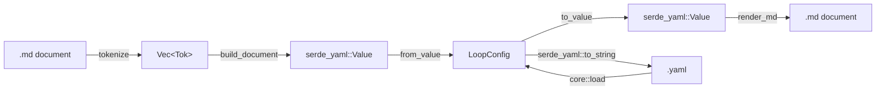

# Markdown/YAML Config Interchange

# Markdown/YAML Config Interchange

A loopsmith config has one model (`LoopConfig`) and two grammars. YAML is the machine-friendly one. Markdown is the one a human can read top to bottom, with the reasoning for a goal sitting directly above the goal. This module is the bridge: `parse_md` turns a document into a `LoopConfig`, `render_md` turns a `LoopConfig` back into a document, and `loopsmith convert` exposes both to the CLI.

**Location:** `runtime/crates/loopsmith-core/src/md/` (`mod.rs`, `parse.rs`, `render.rs`) plus `runtime/crates/loopsmith-cli/src/cmd/convert.rs`.

## The central design decision

Neither the parser nor the renderer knows what a `Goal` is.

`parse_md` builds a `serde_yaml::Value` tree and hands it to `serde_yaml::from_value::<LoopConfig>`. `render_md` starts from `serde_yaml::to_value(cfg)` and walks the resulting `Value`. Both sides speak only mapping/sequence/scalar.

The consequence is the point: every `#[serde(default)]`, every alias, and every `deny_unknown_fields` rule that governs the YAML path governs the markdown path identically, for free. A misspelled field is refused in a `.md` file for the same reason it is refused in a `.yaml` file — the rejection happens in serde, downstream of anything this module wrote. Adding a field to `LoopConfig` requires no change here at all. Adding a whole *section* requires, at most, one line in `section_shape` and one in `SECTIONS`.



## The document grammar

| Markdown construct | Meaning |
|---|---|
| `# my-loop` | sets the top-level `name` |
| bullets before any `##` | top-level fields (`version`, `description`) |
| `## F. Stop gates` | opens a section — normalised to the key `stop_gates` |
| `### ship-it` | opens an entry inside the current section |
| `- key: value` | a field on whichever scope is currently open |
| indented bullets under a valueless `- key:` | a nested mapping or list |
| an indented non-bullet line under a bullet | a continuation of that bullet's value |
| anything else at column 0 | documentation; dropped |

That last row is the feature, not a limitation. Paragraphs, tables, and fenced code blocks at the left margin are ignored entirely, so a config can carry its own justification in the same file.

### Heading normalisation

`heading_to_key` in `mod.rs` maps `A. Pre-execution` → `pre_execution`. Section letters are a navigation aid for humans, not grammar, so a leading `A.` / `B)` / `J -` is stripped — but only when the delimiter sits at index ≤ 2 and the prefix is alphanumeric. That window is why `Pre-execution` (hyphen at index 3) survives intact rather than becoming `execution`. After stripping, the heading is lowercased and its spaces and hyphens become underscores. Writing the raw key (`## stop_gates`) works too.

### `SectionShape`: the one place sections are special

`### ship-it` has to become `name: ship-it` under `goals` but `id: ship-it` under `graph`. `section_shape` is the whole table of that knowledge:

```rust
pub(crate) struct SectionShape {
    pub list_field: Option<&'static str>,  // None when the section *is* the list
    pub key_field: &'static str,           // what a `###` heading fills in
}
```

`goals`, `validations`, `success`, `information`, `pre_execution`, `schedules`, `default_skills` are lists directly (`list_field: None`). `graph`, `providers`, and `execution_guidelines` are mappings that hold their list under a named field (`nodes`, `providers`, `items`). A section absent from the table — `stop_gates`, `constraints`, `skills`, `context` — is a plain field bag and takes no `###` entries; attempting one is a parse error with that exact message.

Both `parse.rs` and `render.rs` call `section_shape`, which is what keeps the two directions from drifting.

## Parsing (`parse.rs`)

`parse_md(text, origin)` runs three stages. Failures at either of the last two become `CoreError::Parse` with `json: "not attempted: the file was read as markdown"` — the markdown path never falls back to JSON, and the error says so rather than leaving a confusing empty field.

### 1. `tokenize` → `Vec<Tok>`

A flat scan producing `H1`, `H2`, `H3`, and `Bullet { indent, text }`. Three behaviours worth knowing:

- **Fences toggle a skip.** A ` ``` ` at column 0 flips `fenced`; everything until the closing fence is dropped. Example configs inside a config's own documentation cannot corrupt it.
- **Headings are only headings at column 0.** An indented `### foo` is not a heading; it is a candidate continuation line.
- **Continuation folding.** A non-bullet line that is indented past the bullet above it, *with no blank line between them*, is appended to that bullet's text with a `\n`. This is how a long `instruction` field spans several lines without becoming prose. The blank-line guard is what separates a wrapped value from a new paragraph.

### 2. `build_document` → `Value`

A single pass over the tokens with two pieces of state: the open `section` and the open `entry`. Every heading first calls `flush_entry`, which appends the entry under construction to the right place — `root[section]` when `list_field` is `None`, `root[section][list_field]` otherwise — and errors clearly if that slot already holds the wrong kind of value.

A `###` heading's text is inserted as a `Value::from(String)` and **never** re-read as YAML. Without that, `### Recorded the baseline: test count, coverage` would parse as a one-entry mapping and land on a field expecting text.

Bullets are gathered into maximal runs and handed to `build_block`, then routed by the current scope:

- an entry is open → the bullets are that entry's fields
- only a section is open → they merge into the section mapping
- neither → they are top-level fields

### 3. `build_block` → mapping or sequence

Recursive over indentation. `split_field` decides whether `- text` is a field or a bare list item, and its guard is deliberately strict: **a key containing whitespace is not a key.** That is what stops `- Never git stash. Never git reset.` from being read as a field named `Never git stash. Never git reset.`. A `- key:` with nothing after it claims the more-deeply-indented bullets below it as its value; with nothing below, it becomes `Value::Null`.

A block that mixes `key: value` bullets with bare items is rejected — it has no unambiguous reading.

`scalar` interprets a value the way YAML would, so `12`, `true`, and `[a, b]` arrive as the types they look like. Multi-line values (i.e. folded continuations) are kept as verbatim strings: prose with a colon in it is not a mapping.

## Rendering (`render.rs`)

`render_md(cfg)` is the inverse, over `serde_yaml::to_value`. It emits `# {name}`, then the `PREAMBLE` fields (`version`, `description`), then each section in `SECTIONS` order — the same A–J ordering as `LOOP-TEMPLATE.md`, so a rendered config and the template read alike. Absent and blank sections are skipped.

`render_section` branches on the same three shapes the parser recognises: a sequence with a shape (each element becomes a `###` entry), a mapping with a shape (its scalar fields first, then its list rendered as entries), and a plain mapping with no shape (a flat bullet list).

### The rules that make round-tripping work

- **`is_blank` omits nulls and empty collections** — a config full of `- skills: []` is noise, and serde defaults put them back on the way in. But an **empty string is not blank**. `value: ""` is a value the author chose, and dropping it from a required field produces a document that no longer parses. `information[].value` is the field that taught this lesson.
- **`push_string` quotes only when it must.** A string is written bare unless YAML would read it back as something other than that same string. Prose stays readable; `"12"` and `"true"` get quotes.
- **Nested lists of objects are emitted as inline JSON flow** via `flow()`. There is no bullet form for them that survives a round trip, and JSON is a subset of YAML — which is exactly what `scalar` feeds a value to on the way back in.
- **Values are `trim_end`ed.** A bullet ends where the line ends, so trailing whitespace inside a value is the one thing markdown cannot carry. Nothing else is lost.
- **Multi-line strings** are written with the first line on the bullet and subsequent lines indented by `indent + 4`, which `tokenize`'s continuation rule folds back together.

### The guard against silent loss

`render_md` walks `SECTIONS` and `PREAMBLE`, so a top-level key in neither list is *silently dropped*. That is a real failure mode — it is how the `context` section went missing once. The test `the_renderer_knows_about_every_top_level_config_key` closes it: it serialises a parsed config and asserts every top-level key it produces appears in `covered_keys()` (`SECTIONS` + `PREAMBLE` + `name`), failing with the list of keys that would be lost.

**If you add a section to `LoopConfig`, add it to `SECTIONS`.** That test will tell you if you forget.

## How it connects

`loopsmith_core::load` dispatches on the file extension and calls `parse_md` for markdown, so *every* command that loads a config goes through this module for `.md` inputs — `run`, `resume`, `gate`, `schedule`, `permissions`, `providers`. That is why the parser has to be as strict as the YAML path rather than merely permissive: it is not a side door.

`loopsmith_core::is_markdown` is the extension check; `parse_md` and `render_md` are the crate's public surface from this module.

Consumers:

- **`cmd/convert.rs`** — `loopsmith convert` is load-then-emit. Direction is inferred: `is_markdown(config)` means the input is markdown so the output is YAML; otherwise render markdown. `--to-yaml` forces YAML either way. Output goes to `--out` (creating parent directories) or stdout.
- **`loopsmith-cli/src/scaffold.rs`** — calls `parse_md` to load bundled markdown templates.
- **`loopsmith-core/tests/md_roundtrip.rs`** — the property test. `roundtrip` runs `render_md` then `parse_md` and compares. Companion tests cover the equivalence of a markdown config with its YAML twin, prose and fenced blocks being ignored, multi-line instructions surviving, and a misspelled field being refused.

## Contributing

| Change | What you touch |
|---|---|
| New field on an existing config struct | Nothing here |
| New plain field-bag section | `SECTIONS` in `render.rs` |
| New section taking `###` entries | `section_shape` in `mod.rs` **and** `SECTIONS` in `render.rs` |
| Change to how a value is spelled | `scalar`/`split_field` in `parse.rs` and `push_string`/`flow` in `render.rs` — always as a pair |

Anything touching the grammar should come with a case in `md_roundtrip.rs`. The round trip is a property test rather than a hope, and the pairing of parse and render rules is the invariant it protects.