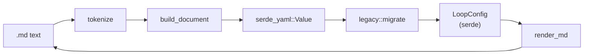

# Markdown/YAML Config Interchange

# Markdown/YAML Config Interchange

A `loopsmith` config can be written as YAML or as a Markdown document, and the two are the *same model in two grammars*. This module (`loopsmith-core::md`, plus the `loopsmith convert` command) is the translation layer: Markdown in, `LoopConfig` out, and back again.

The design constraint that shapes everything here: **the parser and renderer know nothing about the config model.** They move between Markdown text and `serde_yaml::Value`, and serde does the typing. Adding a field to `LoopConfig` requires no change in this module. Adding a whole new *section* usually costs one table entry.

## Why a Markdown grammar at all

YAML has no place to put reasoning. A comment is second-class — it can't be rendered, it's invisible to tooling, and it drifts. In a Markdown config, prose at column 0 is documentation the parser deliberately drops, so the explanation for why a goal exists sits directly beneath the goal:

```markdown
# my-loop

- version: 0.1.0
- description: what this loop is for

This paragraph is ignored by the parser. Fenced blocks at the left margin
are ignored too, so you can show an example without it becoming config.

## C. Goals

### ship-it
- description: the thing is shipped and the suite is green
- priority: 1

## F. Stop gates
- max_iterations: 12
- max_cost_usd: 10.0
```

The grammar in one line: `#` is the loop name, `##` is a section, `###` is an entry within a section, `- key: value` bullets are fields, indentation nests, everything else is prose.

## Pipeline


```mermaid
graph LR
    MD[".md text"] --> T[tokenize]
    T --> B[build_document]
    B --> V["serde_yaml::Value"]
    V --> M["legacy::migrate"]
    M --> C["LoopConfig<br/>(serde)"]
    C --> R[render_md]
    R --> MD
```

`parse_md` / `parse_md_reporting` own the left half, `render_md` the right. Both are deliberately thin over `serde_yaml::Value`, which is what makes them stay correct as the config model grows — every default, `#[serde(alias)]`, and `deny_unknown_fields` rule applies identically on both paths.

## Parsing

### `tokenize` — text to tokens

Produces a flat `Vec<Tok>` of `H1`/`H2`/`H3`/`Bullet { indent, text }`. Three behaviours are worth knowing:

- **Headings only count at column 0.** An indented `### foo` inside a bullet's continuation is not a heading.
- **Fenced blocks at column 0 toggle a `fenced` flag** and everything inside is skipped. This is what lets a config document contain a YAML example of itself.
- **Continuation lines fold upward.** A non-bullet line indented past the bullet above it, with *no blank line between*, is appended to that bullet's text with a newline. This is how a long `instruction` field spans several lines without becoming prose. The `after_blank` flag is the whole distinction between "continuation" and "new paragraph".

Anything that matches none of these is dropped. That's the feature, not a gap.

### `build_document` — tokens to value tree

A small state machine over two variables: the currently-open `section` (a dotted path) and the currently-open `entry` (a `Mapping` being accumulated from a `###` heading).

- **`H1`** sets `name` at the root.
- **`H2`** normalises the heading via `heading_to_key`, resolves it through `section_path`, and opens that path as the current section. An unresolvable heading fails *here* rather than falling through to serde — worth the table lookup, because serde can only say `unknown field 'goles'` while this can list the sections that exist.
- **`H3`** opens a new entry and seeds it with the heading text at `shape.key_field` via `nested_insert`. The heading is inserted as a `Value::String` unconditionally, never re-parsed as YAML: `### Recorded the baseline: test count, coverage` would otherwise become a one-entry mapping landing on a field that wanted text.
- **`Bullet`** grabs the maximal run of consecutive bullets, hands it to `build_block`, and merges the result into the entry (if one is open), else the section (via `slot_at`), else the root as a top-level field.

`flush_entry` runs before every heading and once at the end, appending the finished entry to its section's list — either the section's `list_field` sub-sequence (`execution.graph` → `…graph.nodes`) or the section itself when the section *is* the list (`intent.goals`). It converts an empty mapping left behind by `slot_at` into a sequence, since `slot_at` can't know which shape the caller wants.

### `build_block` — one indent level

Recursive. At a given `indent`, each bullet is classified by `split_field`:

| `split_field` result | meaning |
|---|---|
| `Some((key, ""))` | key owns the deeper bullets below it (or is explicitly `Null`) |
| `Some((key, rest))` | a scalar field |
| `None` | a bare sequence item |

Mixing `key: value` bullets and bare items at the same level is an error — the block is either a mapping or a sequence.

`split_field` carries the load-bearing guard: **a key containing whitespace is not a key.** Without it, `- Never git stash. Never git reset.` would be read as a field named `Never git stash. Never git reset.`. It also accepts a trailing bare `key:` for the owns-children case.

`scalar` reads values the way YAML would, so `12`, `true`, and `[a, b]` arrive as the types they look like, falling back to a string. Multi-line values (the folded continuations) stay verbatim strings — prose with a colon in it is not a mapping.

### `merge_key` — why merging, not inserting

A `###` heading can fill in a *nested* field. A trigger's heading writes `on.type`; the `- on:` bullet beneath it then arrives carrying only `expr`. A shallow `insert` would replace the `on` mapping outright, dropping the `type` the heading just placed — and the entry would fail with `missing field type` while pointing at a document that plainly says `### cron`. `merge_key` recurses whenever both sides are mappings; `merge_into` is the entry point for a whole block.

### Legacy handling

`parse_md_reporting` calls `crate::config::legacy::migrate` on the value tree before handing it to serde, and returns the `Vec<Moved>` describing what was relocated. `parse_md` is the same thing with the report discarded.

This is deliberate and it is the key design decision for 0.3 compatibility: a legacy heading (`## A. Information`, `## F. Stop gates`) is parsed into the **0.3 flat shape** and then migrated by the same code the YAML path uses. The Markdown layer never learns a second relocation table that could drift. It also inherits the per-key repairs for free — a bare trigger gaining its `on:` wrapper, a node's `isolated: true` becoming an isolation level.

## The section tables (`mod.rs`)

Three tables carry all the section-specific knowledge in the module, read by the parser going in and the renderer coming out, so a heading cannot mean one thing when written and another when read back.

**`SECTION_PATHS`** — `(heading key, dotted path, rendered heading)`. Its order *is* the render order, arranged the way a human writes a loop: what it's for, how it runs, what stops it, how it learns.

**`LEGACY_SECTION_KEYS`** — 0.3 heading keys with no 1.0 spelling of their own (`information`, `pre_execution`, `validations`, `stop_gates`, `constraints`, `execution_guidelines`, `schedules`, `context`). These resolve to their flat 0.3 key and are relocated by `migrate`. `goals`, `graph`, `providers`, and `skills` are absent because they're *also* 1.0 headings — `SECTION_PATHS` answers those first and lands them where the migration would anyway.

`context` is the reason `intent.background` isn't called `intent.context`: in a 0.3 document that heading meant the memory policy.

**`section_shape`** — the only place the Markdown layer knows anything section-specific, and it exists solely because `### ship-it` must become `name: ship-it` for a goal but `id: ship-it` for a node:

```rust
pub(crate) struct SectionShape {
    pub list_field: Option<&'static str>,  // None when the section *is* the list
    pub key_field: &'static str,           // may be dotted, e.g. "on.type"
}
```

A section absent from this table takes no `###` entries — it's a plain field bag like `stop_gates`.

### Resolution and normalisation

`section_path` accepts three spellings of the same section: the 1.0 heading (`## Goals`), the 0.3 heading (`## Information`), and the dotted path written out in full (`## execution.graph`) — the last because a config being explicit is being unambiguous, not wrong.

`heading_to_key` strips the A–J navigation letters and normalises: `A. Pre-execution` → `pre_execution`. The letter-stripping window is guarded to index ≤ 2 with alphanumeric-only prefix, which is what keeps `Pre-execution` (hyphen at index 3) from losing its first word. Both behaviours are pinned by unit tests in `mod.rs`.

### Dotted-path helpers

`nested_get`, `nested_insert`, and `nested_remove` operate on `serde_yaml::Mapping` with dotted paths. `nested_insert` creates parents; `nested_remove` recurses and **drops any parent it leaves empty** — that cleanup is what keeps a rendered trigger from carrying a pointless empty `- on:` bullet under the heading that already said which kind it is.

`parse.rs` has its own `slot_at`, which is `nested_insert`'s read-write cousin: it walks to a dotted path creating intermediate mappings and hands back a `&mut Value`, erroring if the path runs through a non-mapping.

## Rendering

`render_md` is the structural inverse, written against `serde_yaml::to_value(cfg)` for the same reason the parser is written against `Value`.

1. `# {name}` from the root, falling back to `unnamed-loop`.
2. Preamble bullets, from the `PREAMBLE` list (`version`, `description`, `environment`, `features`) — top-level keys that are not sections.
3. Each entry of `SECTION_PATHS` in order: resolve the path with `at`, skip if `is_blank`, emit `## {heading}`, then `render_section`.

`render_section` branches on the value and its `section_shape`: a sequence with a shape becomes `###` entries; a mapping with a shape emits its non-list fields as bullets and then its `list_field` sequence as entries; a mapping with no shape is a flat field bag.

`render_entry` pulls the heading text with `nested_get(m, key_field)`, then clones the mapping and `nested_remove`s the key field before rendering the rest as bullets. Removing from a clone rather than skipping inline is what makes a dotted key work — `on.type` has to come out of the nested mapping, and the now-empty `on` has to come out with it.

### Emission rules

`push_field` recurses for mappings (indent + 2) and delegates strings to `push_string`. Sequences — scalar or not — are emitted as **inline YAML flow via `flow`** (`serde_json::to_string`, since JSON is a subset of YAML). A nested list of objects has no bullet form that survives a round trip, so flow style is the honest answer, and it's exactly what the parser's `scalar` reader accepts back.

`push_string` writes prose bare so it stays readable, and quotes only when necessary — specifically when YAML would read the text back as something *other than the same string*. Multi-line values are emitted as a first line plus continuation lines at `indent + 4`, which is what `tokenize`'s fold-upward rule reads back.

`is_blank` drops nulls and empty collections: a config full of `- skills: []` is noise, and serde's defaults put them back on the way in. **An empty string is not blank** — `value: ""` is a value the author chose, and dropping it on a required field produces a document that no longer parses. That is precisely what happened to `information[].value` before the distinction existed.

### Known lossiness

Exactly one thing does not survive a round trip: **trailing whitespace inside a value**, because a bullet ends where the line ends. Values are therefore emitted `trim_end`ed, deliberately. Nothing else is lost.

## Tests that hold the invariants

Round-trip is a property test, not a hope. `loopsmith-core/tests/md_roundtrip.rs` covers `roundtrip` (parse → render → parse), a Markdown config parsing into the same model as its YAML twin, prose and fenced blocks being documentation, multi-line instructions surviving, and misspelled fields being refused in Markdown too (the `deny_unknown_fields` inheritance).

The subtler guard lives in `render.rs`: `the_renderer_knows_about_every_config_section` serialises a config and asserts every path it produces is reachable from `SECTION_PATHS` or `PREAMBLE` (via the test-only `covered_paths`). Sections sit one level inside a bundle now, so it walks two levels — a top-level key is covered if it's listed itself or if every key beneath it is. Without this, adding a section to a bundle and forgetting `SECTION_PATHS` loses it *silently* on the Markdown path, which is what happened to `context` once already.

**If you add a config section, add it to `SECTION_PATHS`.** This test is the thing that will tell you.

## Connections to the rest of the codebase

**Entry points into the module:**

- `loopsmith_core::load` — dispatches on `is_markdown(path)` and calls `parse_md`. This is the main road: `loopsmith run`, `loopsmith schedule`, and the rest reach the Markdown parser through it without knowing it exists.
- `loopsmith-cli/src/scaffold.rs` — `scaffold` parses generated Markdown templates through `parse_md`, so a template that doesn't parse fails at scaffold time.
- `loopsmith-cli/src/cmd/migrate.rs` — uses `parse_md_reporting` to get the `Moved` report and `render_md` to write the upgraded document.
- `loopsmith-wizard::render` and `loopsmith-web`'s `assemble::render` — both emit Markdown via `render_md`, which is why the wizard's output and a hand-written config are the same artifact.

**`loopsmith convert`** (`loopsmith-cli/src/cmd/convert.rs) is the thinnest possible consumer — load then emit:

```rust
let cfg = loopsmith_core::load(config)?;
let want_yaml = to_yaml || loopsmith_core::is_markdown(config);
let text = if want_yaml { serde_yaml::to_string(&cfg)? } else { render_md(&cfg) };
```

Direction is inferred from the input (a `.md` config converts *to* YAML), with `--to-yaml` as an override. Output goes to `--out` (creating parent directories) or stdout.

## Contributing: where changes go

| Change | What to touch |
|---|---|
| New field on an existing section | Nothing in this module. Add it to the config struct. |
| New section | One row in `SECTION_PATHS`; a `section_shape` arm if it takes `###` entries. |
| A `###` heading should fill a different field | `section_shape`'s `key_field` (dotted paths supported). |
| A 0.3 key moved | `crate::config::legacy` only — never a second table here. |
| New grammar affordance | `tokenize` for lexing, `build_block`/`split_field` for structure, and a matching `push_*` so it round-trips. |

The rule underneath all of these: **the parser and renderer must remain ignorant of the config model.** Any change that teaches `md/` about a concrete type like `Goal` or `StopGates` is the wrong shape, because it's a change that will have to be made again for the next type.