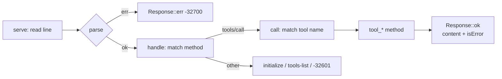

# MCP Server

# MCP Server (`loopsmith-mcp`)

A Model Context Protocol server over stdio that exposes a loop's control plane — schedule, ledger, memory, and gate verdicts — to any MCP client, without exposing the one thing that would break the system's central guarantee.

## Purpose and the omission that defines it

The crate answers a narrow question: what may a reasoning agent legitimately read from and write to the control plane while a loop is running?

The answer is everything *except* completion. There is no `set_goal_satisfied` tool, no `mark_done`, no `satisfy`. `goal_satisfied` is written by `loopsmith-gate` and by nothing else. The MCP surface can *report* the gate's ruling through `loopsmith_gate_evaluate`, but the gate is not reachable as a mutation from here.

This is load-bearing enough to have its own test:

```rust
#[test]
fn there_is_no_tool_for_declaring_a_goal_satisfied() {
    // The gate owns that ruling. If this ever fails, the independence
    // guarantee has been quietly removed.
```

The test scans the names returned by `tools()` for `satisfy`, `set_goal`, and `mark_done`. If you add a tool, that filter is the first thing to check against it.

The second omission is transport: stdio only, no socket. A loop's ledger and goal state are a record of what happened on one machine, and a listening port is a different security question than the one this crate answers.

## Protocol surface

JSON-RPC 2.0, newline-delimited, three methods plus one notification:

| Method | Behavior |
|---|---|
| `initialize` | Returns `PROTOCOL_VERSION` (`"2024-11-05"`), `capabilities.tools`, and `serverInfo` (name `loopsmith`, version from `CARGO_PKG_VERSION`) |
| `notifications/initialized` | Acknowledged with `{}` — and since it carries no `id`, `serve` discards the reply |
| `tools/list` | The `tools()` catalogue |
| `tools/call` | Dispatches on `params.name` with `params.arguments` |

Anything else gets a JSON-RPC error `-32601`. Malformed input gets `-32700` with the serde message attached.

Writing the protocol by hand rather than pulling in an MCP SDK is deliberate: those three methods are the whole surface an MCP client needs, and an async runtime is a heavy dependency for a loop that reads lines off stdin.

## Request lifecycle



`serve(input, output)` is the only I/O in the crate. It loops over `input.lines()`, skips blank lines, and for each parsed `Request` checks `req.id.is_none()` *before* dispatching — the handler still runs, but a notification gets no reply written. Every response is one line, flushed immediately.

`handle` is pure with respect to I/O and takes `&Request`, which is what makes the test suite able to drive the whole server through direct calls without touching a pipe.

## The two error channels

This trips people up, so it is worth being explicit. There are two distinct failure modes and they use different parts of the response:

**Protocol errors** set `Response.error` — an unknown method, a parse failure. These are JSON-RPC-level and use `Response::err(id, code, message)`.

**Tool errors** are *successful* JSON-RPC responses whose result carries `"isError": true`:

```rust
Err(msg) => Response::ok(
    req.id.clone(),
    json!({
        "content": [{ "type": "text", "text": msg }],
        "isError": true
    }),
),
```

A missing argument, a config that will not load, a refused memory write — all of these come back as `isError: true` with the message as the text content, never as a JSON-RPC error. That is the MCP convention: the call succeeded, the tool said no. Tests distinguish them with the `is_error` helper (reads `result.isError`) versus checking `r.error.is_some()`.

On success, `result` is `{ "content": [{ "type": "text", "text": <pretty-printed JSON> }], "isError": false }`. Tool return values are serialized with `serde_json::to_string_pretty` and embedded as text — MCP clients read text content, not structured JSON.

## Tools

`tools()` returns the catalogue as a `serde_json::Value` literal. Each entry carries `name`, `description`, and an `inputSchema` with `type: "object"`; `tools_list_is_non_empty_and_every_tool_has_a_schema` enforces that shape.

### Read-only

| Tool | Backed by | Notes |
|---|---|---|
| `loopsmith_plan` | `loopsmith_core::load` → `loopsmith_graph::plan` | Projects the plan into waves, critical path and cost, parallel fraction, concurrency, predicted speedup, speedup ceiling |
| `loopsmith_gate_evaluate` | `loopsmith_gate::evaluate` | Builds `Evidence` from `workdir` (default `.`), plus optional `metrics` and `artifacts` maps |
| `loopsmith_ledger` | `Store::ledger` | Optional `limit` returns the *last* N entries via `split_off` on a saturating offset |
| `loopsmith_goal_states` | `Store::goal_states` | Gate rulings for every goal plus `overall` |
| `loopsmith_recall` | `namespaces::recall` | Promoted records only, filtered by each namespace's confidence floor |

`tool_gate` filters as it copies: only `f64`-valued metrics and string-valued artifacts make it into `Evidence`. A metric sent as a JSON string is silently dropped rather than rejected — worth knowing when a check mysteriously has no evidence to weigh.

`tool_plan` reads `cfg.execution.graph`; `tool_remember` and `tool_recall` read `cfg.execution.memory`. Every config-taking tool calls `loopsmith_core::load` fresh on each invocation — there is no cache, so an edited config takes effect on the next call.

### Writes

Three tools write, and all three write *records of what happened* rather than rulings about it.

**`loopsmith_record_episode`** builds an `Episode` and calls `Store::put_episode`, returning the assigned `seq`. Required: `run_id`, `node_id`, `provider_id`, `output`. The `provider_id` requirement is the interesting one — an episode without provenance cannot be judged for independence, so it is refused. `role` defaults to `"builder"`; `iteration` to `0`; `prompt_digest` is left empty (the MCP path does not see prompts); `created_ms` comes from `loopsmith_memory::now_ms()`. Note that `tokens`, `cost_usd`, and `duration_ms` are read from the arguments but are not declared in the tool's `inputSchema` — a well-behaved client will not send them.

**`loopsmith_scratchpad`** is read/write on one entry point: present `value` means `set_scratchpad`, absent means `scratchpad`. Since the branch is `args.get("value").and_then(|v| v.as_str())`, a non-string `value` reads instead of writing.

**`loopsmith_remember`** is the most constrained write. It loads the config, resolves the namespace, builds a `Note`, and hands it to `namespaces::remember` along with `cfg.execution.memory`. The three outcomes map as follows:

- `Remembered::Written { promoted, .. }` → `{"written": true, "promoted": <bool>}`
- `Remembered::Refused(why)` → tool error carrying the policy's reason
- `Remembered::Disabled` → tool error naming the switched-off namespace

`confidence` defaults to `0.8` when absent. The memory policy in the config — not this crate — decides whether a record is refused for missing provenance and whether it is promoted.

### Namespace handling

`memory_namespace` parses the optional `namespace` argument and enforces one rule beyond `Namespace::parse`:

```rust
Some(Namespace::Episodic) | None => Err(format!(
    "`{name}` is not a memory namespace; use semantic, procedural, or failure"
)),
```

Episodic is deliberately excluded. An episode is *what happened*, recorded through `loopsmith_record_episode`; it is not something believed, and routing it through `remember` would blur that line. An unparseable name and `episodic` produce the same message.

The `Option` return is what lets the same helper serve both callers: `tool_remember` unwraps `None` into a missing-argument error, while `tool_recall` expands `None` into all three namespaces.

## Promotion, and why an agent cannot shortcut it

The memory model deserves a note because it is the second place independence is enforced. `an_agent_can_remember_a_fact_but_not_promote_it_by_saying_so` walks the whole path:

1. A semantic write with no `provenance` is refused.
2. The same write *with* provenance succeeds and reports `"promoted": false`.
3. `loopsmith_recall` immediately after returns `{"records": []}`.

One run asserting a fact is not enough for that fact to be reused. Corroboration — the same key written from another run — is what promotes it, and promotion is evaluated by `loopsmith-memory` against the loop's policy. The MCP server reports the promotion bit; it cannot set it. Same shape as the gate.

## Arguments and `str_arg`

Every required string argument goes through:

```rust
fn str_arg(args: &Value, key: &str) -> Result<String, String>
```

which produces ``missing required argument `key` `` on absence or a non-string value. Since that message surfaces verbatim as the tool error text, argument names are part of the observable contract — `a_missing_argument_is_reported_as_a_tool_error` asserts the response text contains `run_id`, and `recording_without_provenance_is_refused` asserts it contains `provider_id`.

## Generic over `Store`

```rust
pub struct Server<S: Store> { pub store: S }
```

The server is generic over `loopsmith_memory::Store`, so it never names a concrete backend. Production wires in `SledStore`; tests do the same over a `loopsmith_util::testing::temp_path("mcp")` directory and clean up at the end of each test. `store` is public, which is what lets the episode test assert against `s.store.episodes("r1")` directly rather than round-tripping through another tool.

## Dependency position

`loopsmith-mcp` is a leaf. Nothing in the workspace calls into it; the `loopsmith` binary owns it via the `mcp` subcommand and it reaches downward into four crates:

- `loopsmith-core` — `load` for every config-taking tool
- `loopsmith-graph` — `plan`
- `loopsmith-gate` — `evaluate`, `Evidence`, `TargetVerdict`
- `loopsmith-memory` — `Store`, `Episode`, `LedgerEntry`, `Namespace`, `namespaces::{remember, recall, Note, Remembered}`, `now_ms`

No async runtime, no HTTP stack, no MCP SDK. `serde`, `serde_json`, and `thiserror` are the only non-workspace dependencies.

## Client registration

`runtime/crates/loopsmith-cli/templates/mcp.template.json` holds a copyable `mcpServers` block:

```json
{
  "mcpServers": {
    "loopsmith": {
      "command": "loopsmith",
      "args": ["mcp", "--state", "./state"],
      "env": {}
    }
  }
}
```

Or via CLI: `claude mcp add loopsmith -- loopsmith mcp --state ./state`. The template also carries fallbacks for a binary not on PATH (absolute path) and for development (`cargo run --release -p loopsmith -- mcp --state ./state`).

The template's `$tools` block documents six of the eight tools — `loopsmith_remember` and `loopsmith_recall` were added later and are not listed there. If you add a tool, that block is the third place to update, after `tools()` and `call`.

## Adding a tool

1. Add the entry to `tools()` with a `name`, a `description`, and an `inputSchema` whose `type` is `"object"`.
2. Add the arm to `call`'s match on `name`, returning `Result<Value, String>`.
3. Write `tool_<name>(&self, args: &Value)`, pulling required strings through `str_arg` and mapping every downstream error with `.map_err(|e| e.to_string())`.
4. Check the name against the `satisfy` / `set_goal` / `mark_done` filter — and more importantly, against the rule behind it. If the tool would let a caller assert completion rather than report it, it does not belong here.
5. Update `$tools` in the CLI template.

## Packaging

`Cargo.toml` restricts the published tarball to `include = ["/src/**/*", "/README.md"]`. The integration tests read `config/examples/` and `config/loop.schema.json` from the repository root, which no crate tarball can contain — shipping them would hand a published crate tests that cannot pass. If you add a test that reads a repo-root fixture, keep it out of `src/`.