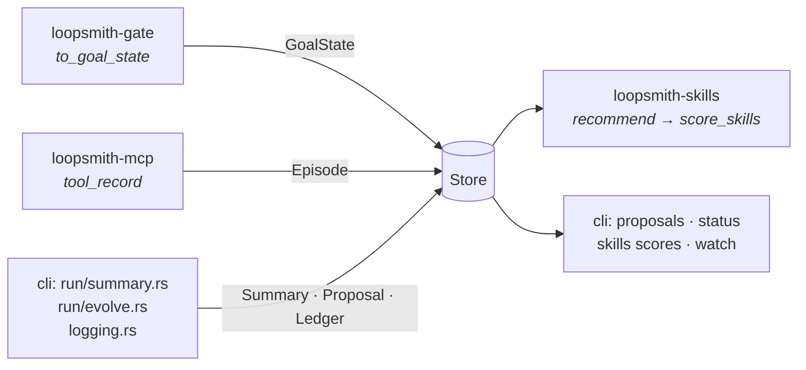

# Memory & Episode Store

# Memory & Episode Store (`loopsmith-memory`)

The persistence plane for a loopsmith run. Everything that must survive a crash, a schedule boundary, or a context reset lives here — and nothing else does. If a piece of state can be recomputed from the config or the graph, it belongs in another crate; if losing it would make a resumed run lie about what already happened, it belongs here.

The crate is deliberately small: a set of plain serializable record types, one trait (`Store`), one shipped backend (`SledStore`), and one piece of analysis (`score_skills`). There is no async, no background task, no schema migration machinery.

---

## Why it exists

A loop that runs for hours across many iterations has three failure modes this crate exists to prevent.

**Amnesia across iterations.** Iteration N+1 either re-sends every prior episode (which grows without bound) or sends nothing at all — and "nothing at all" is why a stalled loop kept producing the byte-identical prompt it had already failed with. `IterationSummary` is the compressed middle path.

**Refunded stop gates.** A loop that pauses and resumes would otherwise be handed a fresh revision budget and a no-progress counter of zero every time, so a run going nowhere could never reach the halt that exists to stop it. `Checkpoint` therefore carries the stop gates' own accounting (`revisions`, `stale_iterations`, `last_signature`), not just "which node ran last".

**Compounding bad data.** One malformed record becomes a retrieved "fact", which becomes reasoning, which becomes another record. Writes validate and reject rather than store.

---

## The two design rules

### 1. Validate before writing

Every write path that can be wrong rejects instead of persisting, returning `MemError::Rejected`:

| Write | Rejects when |
|---|---|
| `put_episode` | `run_id`, `node_id`, or `provider_id` is blank (`Episode::check`) |
| `set_goal_state` | `target` is blank, or `passed + failed > total` |
| `append_ledger` | `run_id` is blank |
| `put_summary` | `run_id` is blank |
| `put_skill_trial` | `skill` is blank, or `pass_rate` is outside `0.0..=1.0` |
| `put_proposal` | `run_id` is blank |

The rejection is total — `malformed_episodes_are_rejected_not_stored` asserts the run's episode list is still empty after a failed write, not merely that the call returned an error.

### 2. The store is a trait

`sled` is the shipped backend but is effectively frozen upstream. Every caller in the workspace depends on `Store`, never on `SledStore` directly, so a different engine can be dropped in without touching them. `Store: Send + Sync`, so implementations are shared across the runtime's threads behind an `Arc`.

### The rule underneath both

> A model must not be the thing that certifies its own completion.

`GoalState { satisfied: true }` is constructed by `loopsmith-gate` and by nothing else. This crate cannot enforce that with a type — it enforces it with dependency direction: `loopsmith-gate` depends on `loopsmith-memory`, never the reverse. That is also why `Checkpoint::verdicts_json` is a `String` rather than the gate's verdict type. Holding it as text keeps the arrow pointing one way and keeps the only constructor of a satisfied goal inside the gate.

The same split runs through `IterationSummary`: `facts` is written by Rust from the gate's verdicts and is always present; `narrative` is optional model prose and is explicitly *never load-bearing*.

---

## Record types

All of these are `Serialize + Deserialize` and stored as JSON.

**`Episode`** — what one node did on one iteration. Carries `provider_id` specifically so the gate can verify a judge did not run on the same provider as its builder. Cost/token/duration fields are `Option` with `#[serde(default)]`.

**`GoalState`** — the gate's ruling on one target, with `passed`/`failed`/`total`, a human-readable `reason`, and the `iteration` at which the ruling was made. `pass_rate()` returns `0.0` for an empty total rather than dividing by zero. State is *replaced* per target, not appended — the store holds the current ruling, and the history lives in the ledger.

**`LedgerEntry` / `LedgerKind`** — append-only audit trail. The point of `LedgerKind::StopGateTriggered` sitting alongside `GoalSatisfied` is that failures are logged too: a node that hits its ceiling constantly is a signal, and that signal is invisible if only completions are recorded. `GoalRevoked` exists because the gate can take a satisfied goal back — delete a required artifact and the ruling flips.

**`SkillTrial`** — one observation of "did this skill help?", pairing a skill with the gate outcome that followed. This is the substrate of self-evolution: a loop cannot reason its way to knowing which sub-agents earn their place, so it tries them and watches the gate.

**`Proposal` / `ProposalKind`** — a change the loop wants but may not apply itself. Anything touching goals, validations, or success criteria is `ChangeCriteria`: always a proposal, never an action.

**`Checkpoint`** — where to resume. Note that `completed_nodes` means "has this node ever run in this run", not "did it run this iteration" — phase completion is computed from it, so the other reading would reopen a phase every iteration.

**`IterationSummary`** — the compressed record of an iteration, with `render()` producing the markdown block injected into a later prompt.

### Proposal expiry

A proposal is evidence about a moment. "This skill correlated with satisfied goals across the last three iterations" is a claim about a graph and a config that may both have been hand-edited since. Nothing deletes a proposal — the record of what the loop wanted is worth keeping — but a reviewer needs to know which suggestions answer a question nobody is asking any more.

```rust
Proposal::default_lifetime_ms(kind)   // None | Some(7 days) | Some(30 days)
proposal.with_default_expiry()        // stamps expires_ms; leaves an explicit one alone
proposal.is_expired(now_ms)           // the expiry instant itself counts as expired
```

`TrySkill` gets 7 days (a marketplace listing may be gone); `AdoptSkill`, `DropSkill`, and `ReshapeGraph` get 30; `ChangeCriteria` never expires, because it is a question about the goal rather than an observation about a run.

The exhaustive `match` in `default_lifetime_ms` is load-bearing: a new `ProposalKind` cannot compile without someone deciding its lifetime. `every_proposal_kind_has_a_decided_lifetime` then pins each decision so a change to one shows up in a diff.

---

## The `Store` trait

```rust
pub trait Store: Send + Sync {
    fn put_episode(&self, ep: &Episode) -> Result<u64>;
    fn episodes(&self, run_id: &str) -> Result<Vec<Episode>>;

    fn set_goal_state(&self, run_id: &str, st: &GoalState) -> Result<()>;
    fn goal_state(&self, run_id: &str, target: &str) -> Result<Option<GoalState>>;
    fn goal_states(&self, run_id: &str) -> Result<BTreeMap<String, GoalState>>;

    fn append_ledger(&self, entry: &LedgerEntry) -> Result<u64>;
    fn ledger(&self, run_id: &str) -> Result<Vec<LedgerEntry>>;

    fn save_checkpoint(&self, cp: &Checkpoint) -> Result<()>;
    fn checkpoint(&self, run_id: &str) -> Result<Option<Checkpoint>>;

    fn set_scratchpad(&self, run_id: &str, key: &str, value: &str) -> Result<()>;
    fn scratchpad(&self, run_id: &str, key: &str) -> Result<Option<String>>;

    fn put_summary(&self, s: &IterationSummary) -> Result<()>;
    fn summaries(&self, run_id: &str) -> Result<Vec<IterationSummary>>;

    fn put_skill_trial(&self, t: &SkillTrial) -> Result<u64>;
    fn skill_trials(&self) -> Result<Vec<SkillTrial>>;   // every run, deliberately

    fn put_proposal(&self, p: &Proposal) -> Result<u64>;
    fn proposals(&self, run_id: &str) -> Result<Vec<Proposal>>;

    fn runs(&self) -> Result<Vec<String>>;
    fn flush(&self) -> Result<()>;
}
```

Almost every method is scoped by `run_id`. The one exception is `skill_trials()`, which returns trials across all runs — a skill's track record is only meaningful if it survives one bad loop.

Errors are a single `MemError` with four variants: `Backend`, `Serde` (via `#[from] serde_json::Error`), `Rejected`, and `NotFound`. `MemError::Rejected` is the one callers should distinguish; it means the input was wrong, not the store.

---

## `SledStore`

### Key layout

Keys are prefixed and zero-padded so `scan_prefix` returns records in insertion order with no secondary index:

```text
ep/<run>/<seq:020>      episode
gs/<run>/<target>       goal state
lg/<run>/<seq:020>      ledger entry
ck/<run>                checkpoint
sp/<run>/<key>          scratchpad
su/<run>/<iter:020>     iteration summary
st/<seq:020>            skill trial   (global, deliberately not per run)
pr/<run>/<seq:020>      proposal
```

`seq` comes from `next_seq()`, a thin wrapper over `sled::Db::generate_id()`. It is a single monotonic counter shared by every keyspace — the values are not dense per prefix and are not meant to be. Only their ordering matters, and the fixed 20-digit padding is what makes lexicographic key order equal insertion order.

Two key choices carry meaning:

- **`su/<run>/<iter>` is keyed by iteration, not sequence.** Re-summarising an iteration must *replace* it. Keyed by sequence, a re-summary would append a second version that a later read silently counted twice.
- **`st/<seq>` is global.** There is no run in the key, which is what makes `skill_trials()` a cross-run scan by construction rather than by convention.

`runs()` is derived, not stored: it scans the `ck/` prefix and strips the prefix off each key. A run therefore becomes visible to `runs()` only once its first checkpoint is saved.

### Durability

Only `save_checkpoint` flushes eagerly:

```rust
fn save_checkpoint(&self, cp: &Checkpoint) -> Result<()> {
    self.put(format!("ck/{}", cp.run_id), serde_json::to_vec(cp)?)?;
    self.flush()   // the resume contract — don't trust the background flusher to beat a crash
}
```

Everything else rides sled's background flusher until someone calls `flush()`. Callers that care (end of iteration, end of run) call it explicitly.

### Opening, and the lock retry

`SledStore::open` is not a plain `sled::open`. Sled releases its file lock as part of cleanup, and neither `drop` nor process exit makes that instantaneous — so "locked" usually means "locked for another millisecond", and failing immediately turns an ordinary race into a user-visible error.

The web UI is what made this reachable: pressing Run and then Status spawns two processes back to back, and the first is often still exiting when the second opens. Under the CLI alone the gap was a human's reaction time.

```
open(path)
  └─ loop until deadline (LOCK_WAIT = 2s)
       sled::open ── Ok ──▶ SledStore
              │
              └─ Err(e) ── is_lock_contention(&e)?
                             ├─ no  ▶ MemError::Backend(e)
                             └─ yes ▶ sleep(backoff); backoff = min(backoff*2, 150ms)
                                      past deadline ▶ "…is locked by another
                                                       loopsmith process…"
```

Backoff doubles from 5 ms rather than polling at a fixed interval: the common case clears on the first retry and should not pay for the rare one. Two seconds is far longer than a releasing lock needs and short enough that a genuinely held lock reports quickly rather than hanging.

`is_lock_contention` matches narrowly and on purpose. It checks `io.kind()` for `WouldBlock`/`ResourceBusy` where sled surfaces a typed `sled::Error::Io`, and falls back to substring-matching the message because sled stringifies the `io::Error` on some paths. A corrupt database or a missing directory must *not* be retried — widening this predicate would turn a hard failure into a two-second hang followed by a misleading message.

Both halves of the trade are tested: `opening_waits_for_a_lock_that_is_being_released` asserts the call actually waited (≥100 ms while a holder is dropped after 120 ms), and `a_lock_nobody_releases_is_reported_rather_than_waited_on_forever` asserts the wait is bounded (≥ `LOCK_WAIT`, < `3 × LOCK_WAIT`) and that the error names what is holding the lock — otherwise the user has nothing to act on.

---

## Skill scoring

`score_skills(&[SkillTrial]) -> Vec<SkillScore>` is the crate's only piece of analysis. It groups trials by skill name into a `BTreeMap`, accumulating trial count, satisfied count, and summed pass rate, then sorts by `satisfaction_rate()` descending with `trials` as the tiebreak.

The tiebreak is the interesting part, together with the doc comment's warning: *a skill with too few trials is reported but should not be acted on — one lucky run is not evidence*. The function does not filter low-trial skills out; it surfaces `trials` on every `SkillScore` and leaves the threshold to the caller. `loopsmith-skills::recommend` and `loopsmith-cli`'s `skills scores` command are the two callers.

`SkillScore::source` is whichever source the *first* trial for that skill reported (`installed | marketplace | generated`). If the same skill name is trialled from two sources, the ranking will show only one of them.

---

## Where it sits in the workspace

`loopsmith-memory` sits at the bottom of the dependency graph next to `loopsmith-core`, depending only on `loopsmith-util` (for `now_ms`, re-exported here so the whole workspace reads one clock) plus `serde`, `serde_json`, `thiserror`, and `sled`. Everything else depends on it.



Concrete edges worth knowing when you change a record type:

- **`loopsmith-gate::to_goal_state`** is the sole constructor of `GoalState`. Changing its fields is a gate change first.
- **`loopsmith-mcp::tool_record`** builds `Episode` from an MCP tool call — the store is exposed over stdio MCP, so record shapes are part of a semi-public surface.
- **`src/run/summary.rs`** (`deterministic`, `carry_forward_honours_the_configured_depth`) constructs `IterationSummary`; `carry_forward` decides how many summaries get rendered into the next prompt.
- **`src/run/evolve.rs`** (`write_proposals` → `propose_reshape` → `write`) is where `Proposal` values originate.
- **`loopsmith-cli/src/logging.rs`** (`entry`) constructs `LedgerEntry`, and writes log files to the logs directory rather than the state directory.
- **`loopsmith-cli/tests/stress.rs`** reads back through `ledger`, `proposals`, `summaries`, and `goal_states` to assert end-to-end behaviour — notably `a_resume_does_not_reset_the_no_progress_counter`, which is the checkpoint-accounting invariant tested from the outside.

`SledStore::open` also shows up in the call graph from a lot of unrelated tests (`scaffold.rs`, `worktree.rs`, `loopsmith-skills`) via the shared `tmp` helper. Those are exercising temp-store setup, not memory behaviour.

---

## Contributing

**Adding a field to a persisted struct.** It must be `#[serde(default)]` (or `Option`). Records live in a sled store that outlives the binary that wrote them; without the default, `loopsmith proposals` reports a backend error on a perfectly healthy store. `a_proposal_written_before_the_field_existed_still_deserialises` pins this for `Proposal::expires_ms` and is the template for the next one. There is no migration step — forward-compatible serde *is* the migration strategy.

**Adding a `ProposalKind`.** The exhaustive match in `default_lifetime_ms` will fail to compile until you decide the lifetime, and `every_proposal_kind_has_a_decided_lifetime` should gain the corresponding row.

**Adding a `Store` method.** Every implementation must be updated; there is no default body. Pick a two-letter key prefix that does not collide with the eight in use, and decide up front whether the key ends in a sequence (append semantics) or a natural key (replace semantics) — that choice is the difference between `pr/` and `su/`.

**Adding validation.** Put it in the write method or in a `check()` on the type, return `MemError::Rejected` with a message naming the field and the offending value, and add a test asserting the record was *not* stored — not merely that the call errored.

**Things to be aware of:**

- `scan` deserializes an entire prefix into a `Vec` with no limit or cursor. `episodes()` and `ledger()` on a long run load everything into memory. This is fine at current run lengths and is the first thing to revisit if it stops being fine.
- Scratchpad values are stored as raw bytes and read back through `String::from_utf8_lossy`. They are opaque to the store — no JSON validation, no size limit, and a non-UTF-8 write comes back mangled rather than erroring.
- `set_goal_state` will happily store `satisfied: true` from any caller. The gate's monopoly is architectural, not enforced at runtime.
- Integration tests read `config/examples/` and `config/loop.schema.json` from the repository root, which is why `Cargo.toml` ships only `/src/**/*` and `/README.md` — a crate tarball cannot contain those, and shipping the tests would hand a published crate tests that cannot pass.