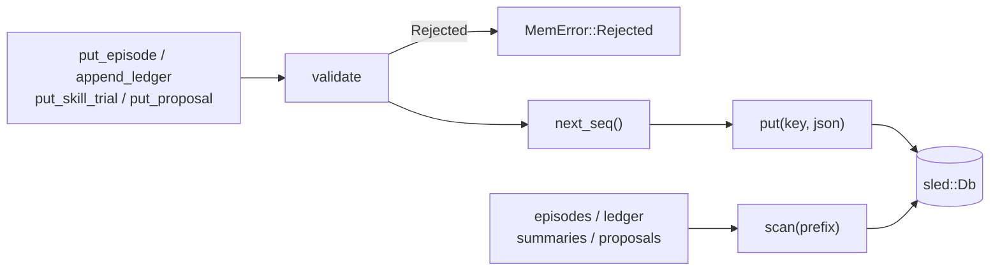
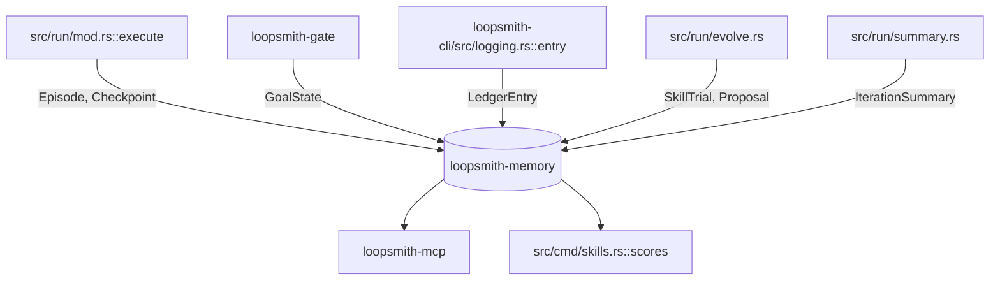

# Memory & Episode Store

# loopsmith-memory

The durable substrate of a loopsmith run. Everything that must survive a crash, a scheduled pause, or a context reset lives in this crate: episodes (what a node did), goal state (what the gate has ruled), the ledger (append-only audit trail), checkpoints (where to resume), per-goal scratchpads, iteration summaries, skill trials, and proposals.

It sits at the bottom of the dependency graph alongside `loopsmith-core`, depending only on `loopsmith-util` (for `now_ms`), `serde`/`serde_json`, `thiserror`, and `sled`. Nothing in this crate knows about the gate, the graph, or providers — the dependency arrows all point *inward*, which is load-bearing for one specific reason covered under [The direction that keeps the gate honest](#the-direction-that-keeps-the-gate-honest).

## Two design rules

**Validate before writing.** Bad data compounds: one wrong record becomes a retrieved "fact", which becomes reasoning, which becomes another record. Every write path in `SledStore` checks its input and returns `MemError::Rejected` rather than storing it. `Episode::check` requires a non-empty `run_id`, `node_id`, and `provider_id`; `set_goal_state` rejects an empty target and any state where `passed + failed > total`; `put_skill_trial` rejects an empty skill name and a `pass_rate` outside `0.0..=1.0`; `append_ledger`, `put_summary`, and `put_proposal` all require a non-empty `run_id`.

**The store is a trait.** `sled` is the shipped backend but is effectively frozen upstream, so callers depend on the `Store` trait and a different engine can be swapped in without touching them. `open(path) -> Result<SledStore>` is the convenience constructor for the shipped implementation; anything that only needs persistence should take `&dyn Store` or a generic bound.

## Record types

| Type | What it records | Written by |
|---|---|---|
| `Episode` | One node's work on one iteration: role, `provider_id`, `prompt_digest`, output, tokens, cost, duration, error | the run loop (`src/run/mod.rs`) |
| `GoalState` | The gate's ruling on one target: `satisfied`, passed/failed/total, reason, iteration | `loopsmith-gate` only |
| `LedgerEntry` | An audit event tagged with a `LedgerKind` | `loopsmith-cli/src/logging.rs` |
| `Checkpoint` | Where to resume, including the stop gates' accounting | the run loop |
| `IterationSummary` | One iteration compressed for re-injection into a later prompt | `src/run/summary.rs` |
| `SkillTrial` | One observation of "did this skill help?" | `src/run/evolve.rs` |
| `Proposal` | A change the loop wants but may not apply itself | `src/run/evolve.rs` |

### Episode

`provider_id` is not bookkeeping. It records the provider that *actually* served the call, so the gate can verify a judge did not run on the same provider as its builder. `tokens`, `cost_usd`, `duration_ms`, and `error` are all `#[serde(default)]` optionals — an episode is written even when the call failed.

### GoalState

`pass_rate()` returns `passed / total`, guarding the zero case. The type carries no constructor discipline of its own — the rule that only `loopsmith-gate` may build one with `satisfied: true` is enforced by the dependency direction, not by visibility.

### LedgerEntry and LedgerKind

The ledger is append-only and records *every* stop-gate trigger, not just successes. A node that hits its ceiling constantly is a signal, and that signal is invisible if only completions are logged. `LedgerKind` spans the full run lifecycle: `RunStarted`, `IterationStarted`, `NodeDispatched`, `NodeSucceeded`, `NodeFailed`, `GateEvaluated`, `GoalSatisfied`, `GoalRevoked`, `SkillAcquired`, `ProposalWritten`, `StopGateTriggered`, `RunFinished`.

Note `GoalRevoked` alongside `GoalSatisfied` — the gate can take back a ruling. Delete a required artifact and a satisfied goal flips back, and the ledger keeps both events.

### Checkpoint

`Checkpoint::new(run_id)` produces a zeroed checkpoint stamped with `now_ms()`. Beyond the obvious resume fields (`iteration`, `completed_nodes`, `tokens_used`, `cost_usd`), it carries the stop gates' own accounting:

- `revisions: BTreeMap<String, u32>` — how many times each node has run with its goals still unsatisfied. This is what `max_revisions_per_node` bounds.
- `stale_iterations` — consecutive iterations in which no verdict moved.
- `last_signature` — the rulings' signature at the last iteration.
- `verdicts_json` — last iteration's gate rulings, serialised as text.

These fields exist because without them a loop that resumes often would be handed a fresh revision budget and a no-progress counter of zero every time, so a run going nowhere could never reach the halt that exists to stop it. The ceilings would apply only to runs that never paused. The `checkpoint_survives_reopen` test asserts all four survive a drop-and-reopen, and `loopsmith-cli/tests/stress.rs` has an end-to-end `a_resume_does_not_reset_the_no_progress_counter`.

Two subtleties worth knowing before you touch this struct:

- `completed_nodes` means "has this node ever run in this run", not "did it run this iteration". Phase completion is computed from it, so redefining it per-iteration would reopen every phase on every pass.
- `verdicts_json` is text rather than the gate's verdict type on purpose. See below.

### IterationSummary

The record that makes a long run affordable. Without it, iteration N+1 either re-sends every prior episode (unbounded growth) or sends nothing (which is why a stalled loop used to produce the byte-identical prompt it had already failed with).

The `facts: Vec<String>` / `narrative: Option<String>` split is deliberate: `facts` is written by Rust from the gate's own verdicts and is always present; `narrative` is optional prose from a model and is never load-bearing. `render()` emits `### Iteration N`, the headline, the facts as bullets, and the trimmed narrative if non-empty — this is the string injected into later prompts.

Storage keys summaries by iteration rather than by sequence, so re-summarising an iteration *replaces* it. Appending a second version would mean a later `summaries()` read silently includes the iteration twice.

### SkillTrial, SkillScore, and `score_skills`

`SkillTrial` is the substrate of self-evolution. A loop cannot reason its way to knowing which sub-agents earn their place — it has to try them and watch the gate. Each trial pairs a skill (with its `source`: `installed | marketplace | generated`) against the gate outcome that followed: the node's blocking `pass_rate` and whether every goal it advances ended the iteration `satisfied`.

`score_skills(&[SkillTrial]) -> Vec<SkillScore>` groups trials by skill name into a `BTreeMap`, sums pass rates, counts satisfied outcomes, and sorts by `satisfaction_rate()` descending with `trials` as the tiebreaker. The `source` recorded on a `SkillScore` is whichever trial was seen first for that skill.

A skill with too few trials is still reported but should not be acted on — one lucky run is not evidence. The scorer does not filter on trial count; that judgment belongs to the caller (`src/cmd/skills.rs::scores`, `src/run/evolve.rs::skill_proposals`).

Trials are keyed globally (`st/<seq>`) rather than per run, because a skill's track record is only meaningful across runs — one bad loop should not erase it.

### Proposal and expiry

A `Proposal` is a change the loop wants to make but may not apply itself. `ProposalKind` covers `AdoptSkill`, `DropSkill`, `TrySkill`, `ReshapeGraph`, and `ChangeCriteria` — and anything touching goals, validations, or success criteria is *always* a proposal, never an action.

Proposals expire because a proposal is evidence about a moment: "this skill correlated with satisfied goals across the last three iterations" is a claim about a graph and a config that have both since been edited by hand. Nothing expires a proposal automatically and nothing deletes one — the record of what the loop wanted is worth keeping — but a reviewer needs to know which suggestions answer a question nobody is asking any more.

```
Proposal { expires_ms: None }
        │
        ├─ with_default_expiry() ──▶ default_lifetime_ms(kind)
        │                              TrySkill              → 7 days
        │                              AdoptSkill / DropSkill → 30 days
        │                              ReshapeGraph          → 30 days
        │                              ChangeCriteria        → never
        │
        └─ an explicitly-set expires_ms is left alone
```

`with_default_expiry` uses `checked_add`, so a `created_ms` near `u64::MAX` yields `None` rather than wrapping. `is_expired(now_ms)` treats the expiry instant itself as already stale (`now_ms >= e`).

The match in `default_lifetime_ms` is exhaustive on purpose: a new `ProposalKind` cannot be added without deciding its lifetime, and `every_proposal_kind_has_a_decided_lifetime` pins each decision so a change to one shows up in a diff.

`expires_ms` is `#[serde(default)]` because proposals live in a sled store that outlives the binary that wrote them. Without it, records written by an earlier build fail to parse and `loopsmith proposals` reports a backend error on a perfectly healthy store — `a_proposal_written_before_the_field_existed_still_deserialises` guards that.

## The `Store` trait

```rust
pub trait Store: Send + Sync {
    fn put_episode(&self, ep: &Episode) -> Result<u64>;
    fn episodes(&self, run_id: &str) -> Result<Vec<Episode>>;

    fn set_goal_state(&self, run_id: &str, st: &GoalState) -> Result<()>;
    fn goal_state(&self, run_id: &str, target: &str) -> Result<Option<GoalState>>;
    fn goal_states(&self, run_id: &str) -> Result<BTreeMap<String, GoalState>>;

    fn append_ledger(&self, entry: &LedgerEntry) -> Result<u64>;
    fn ledger(&self, run_id: &str) -> Result<Vec<LedgerEntry>>;

    fn save_checkpoint(&self, cp: &Checkpoint) -> Result<()>;
    fn checkpoint(&self, run_id: &str) -> Result<Option<Checkpoint>>;

    fn set_scratchpad(&self, run_id: &str, key: &str, value: &str) -> Result<()>;
    fn scratchpad(&self, run_id: &str, key: &str) -> Result<Option<String>>;

    fn put_summary(&self, s: &IterationSummary) -> Result<()>;
    fn summaries(&self, run_id: &str) -> Result<Vec<IterationSummary>>;

    fn put_skill_trial(&self, t: &SkillTrial) -> Result<u64>;
    fn skill_trials(&self) -> Result<Vec<SkillTrial>>;

    fn put_proposal(&self, p: &Proposal) -> Result<u64>;
    fn proposals(&self, run_id: &str) -> Result<Vec<Proposal>>;

    fn runs(&self) -> Result<Vec<String>>;
    fn flush(&self) -> Result<()>;
}
```

`Send + Sync` is required — nodes on the same iteration write concurrently.

Note the two asymmetries in the signatures, both intentional: `skill_trials()` takes no `run_id` (global by design), and the append-style writes (`put_episode`, `append_ledger`, `put_skill_trial`, `put_proposal`) return the assigned sequence number while the keyed writes (`set_goal_state`, `save_checkpoint`, `put_summary`, `set_scratchpad`) return `()` because they overwrite.

### Errors

`MemError` has four variants and `Result<T>` is aliased to `std::result::Result<T, MemError>`:

- `Backend(String)` — the sled layer failed; every `sled::Error` is stringified at the boundary so the trait's error type does not leak the engine.
- `Serde(#[from] serde_json::Error)` — encode/decode failure, the only variant with a `From` impl.
- `Rejected(String)` — validation refused the write. **Nothing was stored.**
- `NotFound(String)` — reserved; the read methods return `Ok(None)` for a miss rather than erroring.

## `SledStore` — the shipped backend

Keys are prefixed and zero-padded to 20 digits so `scan_prefix` returns records in insertion order without a secondary index:

```text
ep/<run>/<seq:020>      episode
gs/<run>/<target>       goal state
lg/<run>/<seq:020>      ledger entry
ck/<run>                checkpoint
sp/<run>/<key>          scratchpad
su/<run>/<iter:020>     iteration summary
st/<seq:020>            skill trial (global, deliberately not per run)
pr/<run>/<seq:020>      proposal
```

Three private helpers carry every operation: `next_seq()` wraps `db.generate_id()` (a monotonic counter shared across all keyspaces — only relative ordering matters, not density), `put(key, value)` inserts and maps the backend error, and `scan::<T>(prefix)` iterates a prefix and deserialises each value.



Two behaviours are worth calling out:

**`save_checkpoint` flushes synchronously.** A checkpoint is the resume contract, so it is made durable immediately rather than trusting sled's background flusher to beat a crash. It is the only write that does this; everything else relies on the background flusher or an explicit `flush()`.

**`runs()` is derived from checkpoints.** It scans the `ck/` prefix and strips the prefix from each key, collecting into a `BTreeSet` for sorted, deduplicated output. A run with episodes but no checkpoint will not appear — checkpoint existence *is* the definition of a known run.

The scratchpad is the one keyspace storing raw bytes rather than JSON; `scratchpad()` reads them back through `String::from_utf8_lossy`, so non-UTF-8 input round-trips lossily rather than failing.

## The direction that keeps the gate honest

> A model must not be the thing that certifies its own completion.

`goal_satisfied` is written by `loopsmith-gate` and by nothing else, and the gate can revoke — delete a required artifact and a satisfied goal flips back.

This is why `Checkpoint::verdicts_json` is a `String` rather than the gate's verdict type. `loopsmith-gate` depends on `loopsmith-memory`; if memory imported the verdict type, the arrow would reverse and the only constructor of a satisfied `GoalState` could no longer be kept inside the gate. Holding the verdicts as opaque text preserves the direction. A resumed run parses that text itself so its first summary can report deltas instead of claiming everything is new.

Keep this in mind when extending the crate: **do not add a dependency on `loopsmith-gate`, `loopsmith-graph`, or `loopsmith-provider`.** If a new field needs a type from one of those crates, store it serialised.

## How the rest of the workspace uses it



- **`src/run/mod.rs::execute`** is the hub. Every traced execution flow in the run loop — `a_node_that_never_satisfies_its_goals_stops_being_dispatched`, `a_stalled_run_varies_its_approach_before_it_gives_up`, `a_judge_on_the_builders_provider_still_cannot_satisfy_the_gate`, `a_satisfiable_loop_stops_on_overall_success` — runs `execute` → `logging::entry` → `LedgerEntry`. The ledger is how those tests assert on behaviour, which makes it a real API surface, not just diagnostics.
- **`src/run/evolve.rs`** writes trials via `record_trials`, reads them back through `score_skills` in `skill_proposals`, and writes the resulting `Proposal`s in `write`.
- **`src/cmd/skills.rs::scores`** is the read-only path: `skill_trials()` → `score_skills` → ranked table.
- **`src/run/summary.rs`** builds `IterationSummary` in both `deterministic` (facts from verdicts) and `carry_forward` (honouring the configured depth) paths.
- **`loopsmith-mcp`** exposes the store read-side over a local stdio MCP server.

## Testing

Tests use `loopsmith_util::testing::temp_path` (behind the `testing` feature, enabled as a dev-dependency) via the local `tmp(tag)` helper, which returns `(SledStore, PathBuf)` and leaves cleanup to the caller's `remove_dir_all`. `sample_episode(run, node)` in `lib.rs` is `#[cfg(test)] pub(crate)` and gives a valid episode to mutate into an invalid one.

The suite is organised around the invariants rather than the methods:

| Test | Invariant |
|---|---|
| `episodes_round_trip_in_order` | zero-padded keys preserve insertion order |
| `malformed_episodes_are_rejected_not_stored` | rejection means *nothing was written* |
| `inconsistent_goal_state_is_rejected` | `passed + failed > total` cannot be stored |
| `checkpoint_survives_reopen` | resume accounting survives a process boundary |
| `skill_trials_accumulate_across_runs_and_rank_by_outcome` | global trial keyspace + ranking order |
| `an_out_of_range_pass_rate_is_rejected` | `pass_rate` stays in `0.0..=1.0` |
| `proposals_are_scoped_per_run` | proposal keyspace is per-run, unlike trials |
| `scratchpad_carries_reasoning_between_iterations` | scratchpad round-trip, miss returns `None` |
| `a_proposal_written_before_the_field_existed_still_deserialises` | forward-compatible deserialisation |

When adding a validation rule, add the paired test that asserts the read-back is empty — "rejected" and "rejected but stored anyway" are indistinguishable from the return value alone.

## Adding a new record type

1. Define the struct in `lib.rs` with `Serialize`/`Deserialize`, `#[serde(default)]` on every new optional field (stores outlive binaries), and a `created_ms: u64` stamped from `now_ms()`.
2. Add the write and read methods to `Store`. Return `Result<u64>` if append-ordered, `Result<()>` if keyed.
3. Pick a two-letter key prefix not already in the table above. Zero-pad sequences to 20 digits. Decide per-run vs. global explicitly and document why in a comment — that decision was the whole point of `st/` versus `pr/`.
4. Validate in the `SledStore` impl, returning `MemError::Rejected` with a message that names the offending field and value.
5. Test both the round-trip and the rejection-writes-nothing case.

## Packaging note

`Cargo.toml` sets `include = ["/src/**/*", "/README.md"]`. Integration tests read `config/examples/` and `config/loop.schema.json` from the repository root, which no crate tarball can contain — shipping them would hand a published crate tests that cannot pass. Test additions that reach outside `src/` will pass locally and fail for anyone building from crates.io.