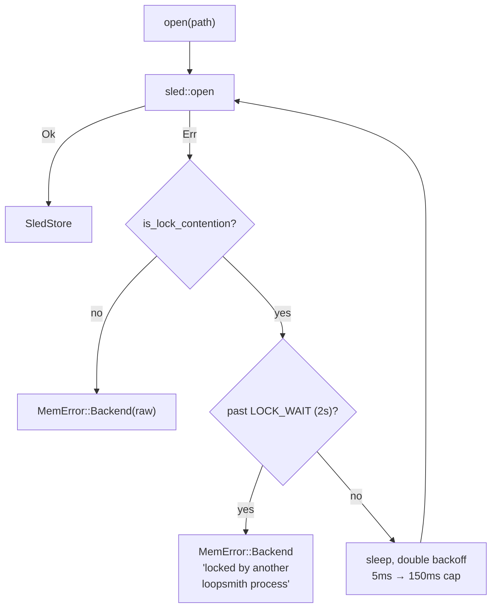
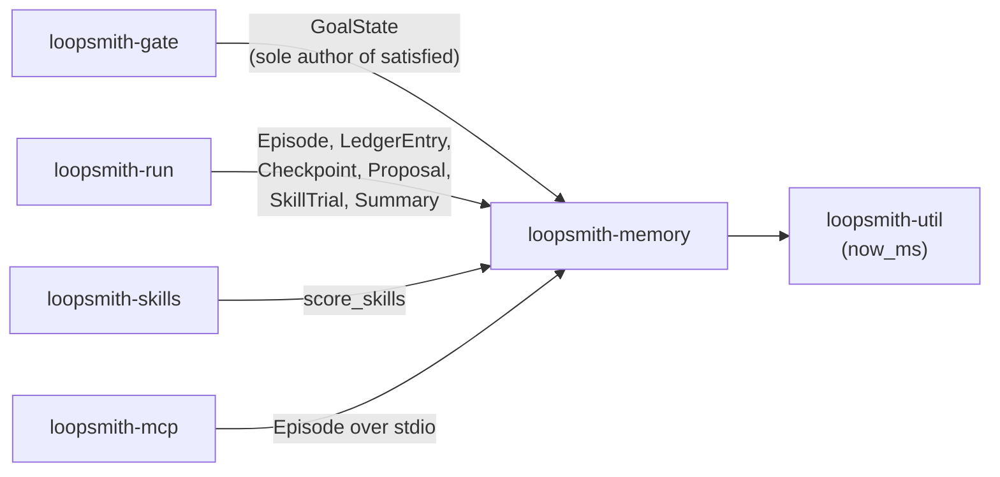

# Memory & Episode Store

# Memory & Episode Store (`loopsmith-memory`)

Everything a loop must not forget lives in this crate: what each node did, what the gate ruled, an append-only audit trail, where to resume, what the loop wants changed, and what it has learned across runs. It is the persistence plane for the whole workspace — `loopsmith-run` writes to it every iteration, `loopsmith-gate` is the only writer of one particular field, and `loopsmith-mcp` exposes parts of it over stdio.

## Two rules the design rests on

**Validate before writing.** Bad data compounds: one wrong record becomes a retrieved "fact", which becomes reasoning, which becomes another record. So writes reject rather than store. `Episode::check` demands a non-empty `run_id`, `node_id`, and `provider_id`; `set_goal_state` rejects a ruling where `passed + failed > total`; `put_skill_trial` rejects a `pass_rate` outside `0.0..=1.0`; `put_record` rejects an empty key or a confidence outside `0..1`. Every one of these returns `MemError::Rejected` and writes nothing — the test `malformed_episodes_are_rejected_not_stored` asserts the store is still empty afterwards.

**The store is a trait.** `sled` is the shipped backend but is effectively frozen upstream. Callers depend on `Store`, never on `SledStore`, so a different engine can be dropped in without touching them. `open(path)` is the one convenience that names the concrete backend, returning `SledStore` directly.

## The data model

| Type | Scope | What it answers |
|---|---|---|
| `Episode` | per run | What one node did on one iteration — role, provider, prompt digest, output, tokens, cost, error |
| `GoalState` | per run, per target | The gate's ruling: `satisfied`, `passed`/`failed`/`total`, a reason, the iteration it was made |
| `LedgerEntry` | per run | Append-only audit; `LedgerKind` spans `RunStarted` through `RunFinished`, plus `StateChanged`, `Recovered`, `Escalated`, `AlertRaised`, `RuleEvaluated`, `Remembered` |
| `Checkpoint` | one per run | Where to resume, including the stop gates' accounting |
| `IterationSummary` | per run, per iteration | What an iteration amounted to, compressed for re-injection |
| `SkillTrial` | **global** | One observation of "did this skill help?" |
| `Proposal` | per run | A change the loop wants but may not apply itself |
| `Record` | cross-run, per namespace | Something the loop remembers between runs |
| scratchpad | per run, per key | Free-text reasoning carried between iterations |

### `GoalState` and the one rule

> A model must not be the thing that certifies its own completion.

`satisfied: true` is constructed only by `loopsmith-gate::to_goal_state` and by nothing else. The dependency direction enforces it: `loopsmith-gate` depends on `loopsmith-memory`, not the reverse, which is also why `Checkpoint::verdicts_json` and `Checkpoint::state` are held as `String` rather than as the gate's verdict type or the engine's state enum. Those crates sit above this one, so this one cannot name their types without inverting the edge that keeps the gate the sole author of a satisfied goal.

`GoalState::pass_rate()` returns `passed / total`, guarding the zero-total case at `0.0`.

### `Checkpoint` — resume is not a reset

The subtle part of resuming is not the node list, it's the accounting. If a checkpoint carried only progress, a loop that resumes often would be handed a fresh revision budget and a zero no-progress counter every time — so a run going nowhere could never reach the halt that exists to stop it, and the ceilings would apply only to runs that never paused. So the checkpoint carries the stop gates' own state:

- `revisions: BTreeMap<String, u32>` — runs per node with goals still unsatisfied; this is what `max_revisions_per_node` bounds.
- `stale_iterations` — consecutive iterations in which no verdict moved.
- `last_signature` — the rulings' signature at the last iteration, so the first iteration after a resume is compared against something rather than always looking like progress.
- `escalations: Vec<Escalation>` — questions put to a human that nobody has answered. `Escalation::node_id` is kept structurally, not folded into prose, so answering one can give that node its revisions back.
- `retries`, `failed_dispatches`, `alerts_raised` — recovery and alert counters that likewise span every resume ("an alert fires once per run, and a resume is the same run").

`completed_nodes` means *has this node ever run in this run*, not *did it run this iteration*. Phase completion is computed from it, so the append-only reading is what stops a phase reopening every iteration.

`Checkpoint::new(run_id)` gives a zeroed checkpoint stamped with `now_ms()`. Every field added since the type shipped carries `#[serde(default)]`, so checkpoints written by an older build still deserialise — `state: None` means "written before runs had states, and every such run was closed."

### `IterationSummary` — why long runs are affordable

Without a compressed per-iteration record, iteration N+1 either re-sends every prior episode (unbounded growth) or sends nothing (which is what the runtime did before, and is why a stalled loop kept producing the byte-identical prompt it had already failed with).

The split inside the type is the point: `facts: Vec<String>` is written by Rust from the gate's own verdicts and is always present; `narrative: Option<String>` is optional model prose and is never load-bearing. A model may describe what happened, but the record of *what was satisfied* is never something a model wrote. `render()` emits `### Iteration N`, the headline, the facts as bullets, then the trimmed narrative if non-empty.

### `Proposal` — evidence with a shelf life

A proposal is a change the loop wants but may not apply. `ProposalKind` covers `AdoptSkill`, `DropSkill`, `TrySkill`, `ReshapeGraph`, and `ChangeCriteria`.

Nothing expires a proposal automatically and nothing deletes one — the record of what the loop wanted is worth keeping — but a reviewer needs to know which suggestions are answering a question nobody is asking any more. `Proposal::default_lifetime_ms` decides that by kind:

- `TrySkill` — 7 days. It names a marketplace listing that may already be gone.
- `AdoptSkill`, `DropSkill`, `ReshapeGraph` — 30 days. They are about a skill set or a graph the reviewer has probably edited since.
- `ChangeCriteria` — `None`, never expires. It is a question about the goal, not an observation about a run.

`with_default_expiry()` stamps that lifetime onto `created_ms` via `checked_add`, and leaves an explicitly set `expires_ms` alone. `is_expired(now_ms)` treats the expiry instant itself as already stale. The match in `default_lifetime_ms` is exhaustive on purpose: a new kind cannot be added without deciding its lifetime, and `every_proposal_kind_has_a_decided_lifetime` pins each decision so a change to one shows up in a diff.

### `SkillTrial` and `score_skills` — self-evolution grounded in verdicts

A loop cannot reason its way to knowing which sub-agents earn their place; it has to try them and watch the gate. Each `SkillTrial` pairs a skill with the gate outcome that followed — `pass_rate` for the node's goals and whether they all ended satisfied.

Trials are keyed **globally**, not per run (`st/<seq>`), because a skill's track record is only meaningful across runs — one bad loop should not erase it. `Store::skill_trials()` accordingly takes no `run_id`.

`score_skills(&[SkillTrial]) -> Vec<SkillScore>` groups by skill name, counts trials and satisfactions, means the pass rate, and sorts by `satisfaction_rate()` descending with trial count as the tiebreak. It is consumed by `src/cmd/skills.rs::scores`. A skill with too few trials is reported but should not be acted on — one lucky run is not evidence, and the struct exposes `trials` so the caller can apply that judgement.

### `Namespace` and `Record` — memory across runs

`Namespace` mirrors `execution.memory.namespaces` in the config model: `Episodic` (what happened), `Semantic` (stable domain facts), `Procedural` (ways of working that worked), `Failure` (known failure modes and what got past them). `Namespace::ALL`, `as_str()`, and `parse()` round-trip the snake_case names.

A `Record` is keyed by `(namespace, key)`. Writing the same key again is **corroboration, not duplication**: the writing run is appended to `runs`, and it is that count — distinct runs, not writes — that promotion reads. `confidence` is a 0-to-1 floor check at retrieval; `promoted` marks a record that has cleared its namespace's bar. The promotion and refusal policy itself lives in the `namespaces` module, which re-exports `Note` and `Remembered`.

## The sled backend

`sled_store.rs` implements `Store` over a single `sled::Db`. Keys are prefix-and-zero-padded so `scan_prefix` returns records in insertion order with no secondary index:

```text
ep/<run>/<seq:020>      episode
gs/<run>/<target>       goal state
lg/<run>/<seq:020>      ledger entry
ck/<run>                checkpoint
sp/<run>/<key>          scratchpad
su/<run>/<iter:020>     iteration summary
st/<seq:020>            skill trial (global, deliberately not per run)
pr/<run>/<seq:020>      proposal
mr/<ns>/<key>           cross-run record
```

Three key-layout decisions carry meaning:

- **Summaries are keyed by iteration, not sequence.** Re-summarising an iteration must *replace* it, not append a second version a later `summaries()` read would silently include twice.
- **Skill trials have no run segment**, for the reason above.
- **Runs are discovered from checkpoint keys.** `runs()` scans `ck/` and strips the prefix, so a run exists exactly when it has a checkpoint.

`next_seq()` wraps `db.generate_id()` — one monotonic counter shared by every keyspace, since only relative ordering matters. `put` and `scan` are the two private helpers every method funnels through; `scan` deserialises with `serde_json`, so a `serde_json::Error` becomes `MemError::Serde` via `#[from]`.

`save_checkpoint` calls `flush()` itself rather than trusting the background flusher to beat a crash — the checkpoint is the resume contract, so it is made durable immediately.

`prune_episodes(before_ms)` scans `ep/`, deserialises each episode to read `created_ms`, and removes those older than the cutoff, returning the count. It is the only method that deletes bulk history.

### Opening: waiting out a lock that is already being released

`SledStore::open` retries. Sled releases its file lock as part of cleanup, and neither `drop` nor process exit makes that instantaneous, so "locked" usually means "locked for another millisecond". Failing immediately turns an ordinary race into a user-visible error.

The web UI is what made this reachable: pressing Run and then Status spawns two processes back to back, and the first is often still exiting when the second opens. Under the CLI alone the gap was a human's reaction time.


```mermaid
flowchart TD
    A["open(path)"] --> B["sled::open"]
    B -->|Ok| C["SledStore"]
    B -->|Err| D{"is_lock_contention?"}
    D -->|no| E["MemError::Backend(raw)"]
    D -->|yes| F{"past LOCK_WAIT (2s)?"}
    F -->|yes| G["MemError::Backend<br/>'locked by another<br/>loopsmith process'"]
    F -->|no| H["sleep, double backoff<br/>5ms → 150ms cap"]
    H --> B
```

`is_lock_contention` matches narrowly on purpose: the typed `sled::Error::Io` kinds `WouldBlock` and `ResourceBusy`, falling back to the message text (`"could not acquire lock"`, `"WouldBlock"`) because sled stringifies the io error on some paths. A corrupt database or a missing directory must not be retried, so anything else surfaces immediately with sled's own message.

`LOCK_WAIT` is two seconds — far longer than the milliseconds a releasing lock needs, and short enough that a genuinely held lock reports quickly rather than hanging. Backoff doubles rather than polling at a fixed interval so the common case, which clears on the first retry, does not pay for the rare one. Two tests hold both ends of that trade: `opening_waits_for_a_lock_that_is_being_released` asserts the call actually waits ~120ms for a holder dropped on another thread, and `a_lock_nobody_releases_is_reported_rather_than_waited_on_forever` asserts it gives up at the deadline, within 3× of it, with a message naming what is holding the database — or the user has nothing to act on.

## Errors

`MemError` has four variants and `Result<T>` aliases over it:

- `Backend(String)` — anything sled reported, including the lock-timeout message.
- `Serde(#[from] serde_json::Error)` — a value that would not encode or decode.
- `Rejected(String)` — a write that failed validation. Nothing was stored.
- `NotFound(String)` — reserved; the read methods return `Ok(None)` for a missing key rather than erroring.

## How the rest of the workspace uses it

`loopsmith-memory` sits at the bottom of the stack, above only `loopsmith-core` and `loopsmith-util` (from which it re-exports `now_ms`, so the whole workspace reads one clock).


```mermaid
flowchart LR
    G["loopsmith-gate"] -->|"GoalState<br/>(sole author of satisfied)"| M["loopsmith-memory"]
    R["loopsmith-run"] -->|"Episode, LedgerEntry,<br/>Checkpoint, Proposal,<br/>SkillTrial, Summary"| M
    S["loopsmith-skills"] -->|"score_skills"| M
    MC["loopsmith-mcp"] -->|"Episode over stdio"| M
    M --> U["loopsmith-util<br/>(now_ms)"]
```

Concretely, in the current tree:

- **`loopsmith-run`** is the heaviest writer. `logging::entry` builds `LedgerEntry` values, reached from `context::enter` and `context::save_or_halt` and from `recovering::answer` — which is why an ordinary iteration, a close, a plan approval, and a recovery all land in the same ledger. `context::open` → `read_checkpoint` is the resume path; `evolve::write` constructs `Proposal`s and `evolve::record_trials` constructs `SkillTrial`s.
- **`loopsmith-gate`** calls `to_goal_state` to produce the only satisfied `GoalState` in the system, and can revoke: delete a required artifact and a satisfied goal flips back.
- **`loopsmith-mcp`** builds `Episode`s in `tool_record`, exposing the memory plane over stdio alongside the gate and graph.
- **`src/cmd/skills.rs::scores`** calls `score_skills` for the CLI's skill ranking.

The ledger deliberately records every stop-gate trigger, not just successes. A node that hits its ceiling constantly is a signal, and that signal is invisible if only completions are logged.

## Contributing notes

- **Adding a `Store` method** means implementing it in `SledStore` and picking a key prefix. Ask whether the record is per-run or global before choosing the shape — the skill-trial keyspace is the precedent for global, and it is a decision about meaning, not storage.
- **Adding a field to a persisted struct** requires `#[serde(default)]`. These types live in a sled store that outlives the binary that wrote them; `a_proposal_written_before_the_field_existed_still_deserialises` exists because without it, `loopsmith proposals` reports a backend error on a perfectly healthy store.
- **Adding a `ProposalKind`** forces a `default_lifetime_ms` arm. Keep the match exhaustive and add the row to `every_proposal_kind_has_a_decided_lifetime`.
- **Adding validation** belongs in the write path, before `next_seq()` or `put`, and must return `MemError::Rejected` — the contract is that a rejected write stores nothing, and tests assert emptiness afterwards.
- **Tests** use `loopsmith_util::testing::temp_path` (via the `testing` feature, a dev-dependency) through the local `tmp(tag)` helper, and clean up with `remove_dir_all`. The crate's `include` list ships only `src/` and `README.md`, because the integration tests read `config/examples/` and `config/loop.schema.json` from the repository root — paths no crate tarball can contain.