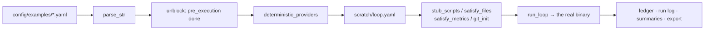

# Other

# The `loopsmith-cli` integration test suite

Everything else in the runtime is unit-tested in isolation. This directory covers what unit tests structurally cannot: whether the pieces work **together**, under a real iteration loop, driven through the real binary, against the configs users are actually handed.

```sh
cargo test -p loopsmith --test stress    # the iteration loop
cargo test -p loopsmith --test surface   # subcommands
cargo test -p loopsmith --test compat    # portability of generated loops
cargo test -p loopsmith --test opt_in    # network / money — skips by default
```

| File | Role |
|---|---|
| `harness/mod.rs` | The `Fixture` builder. No tests of its own. |
| `stress.rs` | Phases, isolation, stop gates, proposals, resume, export |
| `surface.rs` | Subcommands that were implemented and never executed |
| `compat.rs` | What a generated loop assumes about the machine it lands on |
| `opt_in.rs` | Anything that reaches the network or spends money |

## The problem the harness exists to solve

The shipped examples under `config/examples/` **cannot be run as they stand**, and both reasons are deliberate design, not bugs:

1. **Every example refuses.** `pre_execution` steps ship as `done: false`, so `validate` and `run` both stop. That refusal is the teaching mechanism — a user is meant to read the steps and tick them off.
2. **No detector scripts exist.** The examples name 29 distinct `scripts/…` detectors between them and the repository ships none. A missing script becomes a *detector error*, which the gate converts to a failed check. Correct behaviour, and useless for exercising anything past the first gate.

`Fixture` therefore never touches `config/examples/`. It parses an example, rewrites the parsed model in memory, and serialises the result into a scratch directory. Everything a scenario needs — unblocked steps, runnable detectors, providers that cost nothing — is applied to that copy.



## `Fixture`

Construction goes through one of two entry points, both of which run `unblock` and `deterministic_providers` before writing `loop.yaml`:

- `Fixture::example(name, tag)` — a runnable copy of a shipped example.
- `Fixture::from_yaml(text, tag)` — config text directly, for shapes no example has (`NEVER_SATISFIED`, `ISOLATED_WRITER`, `ISOLATED_CHAIN` in `stress.rs`).

`tag` names the temp directory. It must be unique across concurrently running tests — see [Traps](#traps-worth-not-rediscovering).

The struct exposes `dir`, `config`, and `cfg` (the parsed `LoopConfig`). A scenario mutates `cfg` in place and then calls `write_config()`; nothing else notices the change. This is the standard shape:

```rust
let mut f = Fixture::example("traffic-loop", "phases");
cap(&mut f.cfg, 6);
starve(&mut f.cfg, "overall");
f.write_config();
let f = f.stub_scripts(Stubs::Pass).satisfy_files().satisfy_metrics();
```

### Builder methods

All of these consume and return `Self`, so they chain — but note they must come *after* the last `write_config()`, since `stub_scripts` may rewrite the config itself on Windows.

| Method | Effect |
|---|---|
| `stub_scripts(Stubs)` | Generates an executable stub for every `scripts/…` detector the config names |
| `satisfy_files()` | Writes `ARTIFACT_BODY` into every path a `file_exists` detector points at |
| `write_artifacts(body)` | Same, with a body the scenario chooses |
| `satisfy_metrics()` | Writes a `metrics.json` that satisfies every threshold, via `satisfying_value` |
| `metrics(&[(name, value)])` | Specific values, for a threshold meant to fail |
| `git_init()` | Makes the loop directory a repository, so `isolated: true` produces a real worktree |

`Stubs` is the axis that reaches the interesting states:

- `Stubs::Pass` — the success path and the export.
- `Stubs::Fail` — `no_progress_iterations`, the randomness gate, `max_revisions_per_node`.
- `Stubs::PassFrom(n)` — fails until iteration `n`. Implemented with a `.stub-count` file in the loop root rather than an environment variable, because the loop cannot change its own environment between iterations and the gate re-runs every detector each pass.

### Running and reading back

`run(args)` and `run_with_env(args, env)` invoke the binary in `dir`. `run_loop(run_id, env)` is the common case — `run loop.yaml --run-id <id> --no-acquire` — with a fixed run id so assertions know what to look up.

`store()` opens the sled ledger, `log_text(run_id)` reads `logs/<run-id>.log`, and `export_dir()` is `<name>-success/`. `cleanup()` removes the scratch directory.

`LOOPSMITH` is the binary under test, supplied by Cargo through `env!("CARGO_BIN_EXE_loopsmith")` — there is no `cargo run` anywhere here and no chance of driving a stale build.

## Assertions read artifacts, not stdout

Stdout is a report. The record is the sled ledger, `logs/<run-id>.log`, `store.summaries()`, the checkpoint, and the presence or absence of `<name>-success/`.

One assertion recurs and is worth keeping, in `every_example_completes_an_iteration_and_leaves_a_consistent_record`:

```rust
assert_eq!(log.lines().count(), ledger.len());
```

The run log and the ledger are written through a single call, so they must always hold the same number of events. A divergence means one of the two write paths grew a branch the other did not.

## How the fixture stays deterministic

`deterministic_providers` replaces every provider with `printf` emitting a fixed judge block. Three properties of that rewrite are load-bearing:

- **Provider ids are preserved.** `enforce_judge_independence` compares them: a judge must sit on a different id from the builder it reviewed, or the gate refuses the judgment outright. Rewriting the ids would quietly switch that check off.
- **Every provider emits the judge block**, not only the ones a judge lands on. Judge output is harvested only from `Role::Judge` nodes, so a builder emitting the same text is inert — and this avoids re-deriving the cascade to work out where a judge would land. `judge_provider_ids` exists for scenarios that do need that answer.
- **`judge_payload` always emits an `EVIDENCE:` line and `SCORE: 10`.** A judge PASS with no evidence is demoted to FAIL by the parser, which would make every subjective validation permanently unsatisfiable. `failing_judge_payload` and `set_provider_output` are the escape hatches for making one judge disagree while builders carry on.

`ARTIFACT_BODY` is likewise not arbitrary. The files a `file_exists` detector names are the same files a `regex_match` detector reads — evidence collection registers them under their stem — so the default body carries a URL and a `post_id:` line, which is what the shipped examples look for. `a_regex_detector_reads_the_file_the_loop_produced` asserts both directions: the default body satisfies `sources-cited`, and `write_artifacts("no links in here at all\n")` does not.

## `stress.rs` — the iteration loop

Two helpers shape most scenarios. `cap(cfg, n)` pins `max_iterations` and disables the no-progress gates, so a scenario cannot sit inside a long example's default ceiling of ten iterations and three hours. `starve(cfg, target)` rewrites every validation on a target to `Detector::Script { command: "false" }`, so a run keeps iterating instead of succeeding on its first pass — `phases_open_one_at_a_time_across_a_real_run` starves `overall` for exactly this reason.

The two broad sweeps run over `all_examples()` and are the cheapest signal that a config change broke the runtime rather than the schema: every example must complete one supervised iteration and leave a consistent record, and every example must survive a run where nothing at all is satisfiable without panicking.

Beyond that, the areas covered:

- **Phases** (`traffic-loop`, four strictly linear phases). Nodes must come online one iteration at a time in order, a phase whose goals are never certified must keep the ones behind it shut for the whole run, and a phased success must still export.
- **Worktree isolation** (`refactor-loop`). Outside a repository, `isolated: true` degrades to the shared directory *silently by design*, and the degradation must be reported in the ledger. Inside one, `state/worktrees/<node>/` must actually exist. Two hand-written configs go further: `ISOLATED_WRITER` proves an isolated builder's output reaches the gate (which reads the loop root), and `ISOLATED_CHAIN` proves an isolated node can read what its isolated upstream produced — a worktree branches from `HEAD`, so seeding is required and must appear in the ledger as "was seeded with".
- **Stop gates and the randomness agent.** The seeded fallback must record its seed so the choice replays; a reachable cheap provider must make the *agent* path fire; and an answer off the four-item menu (`reorder:`, `escalate:`, `explore:`, `reframe:`) must fall back rather than be guessed at, with the refused text never leaking into the choice.
- **Resume.** Everything the stop gates count used to be declared inside the iteration loop, so it was rebuilt from nothing on resume — a scheduled long-lived loop could therefore never reach the ceilings meant to stop it. Two tests pin this: a resume must not refund a node's revision budget, and must not reset `stale_iterations` or drop `last_signature`.
- **Proposals.** The loop proposes; a human applies. Each `ProposalKind` has a test — `ReshapeGraph` for an exhausted node, `ChangeCriteria` for a detector that cannot run (broken, not failing), `TrySkill` for unexplored candidates. Each also asserts the negative: exactly one proposal rather than one per iteration, the config on disk untouched, and no ledger entry showing the proposal self-applied.
- **Summaries and skill trials.** A configured `context.summary_provider` must produce prose, and that prose must not be able to satisfy a goal the gate refused. A `SkillTrial` must carry the token cost of the node that used the skill, or ranking cannot distinguish a free win from one that triples the bill.

## `compat.rs` — portability of a generated loop

A loop directory outlives the checkout that produced it. Three differences break it every time and all three are invisible on the machine that wrote it: **bash 3.2** (macOS still ships it), **BSD versus GNU `sed`/`stat`/`readlink`**, and **whichever scheduler is installed**, which is not implied by the OS.

These tests scaffold with `new_loop(tag)` — `loopsmith new` refuses a path inside the loopsmith checkout, which is why it always happens in a scratch directory — and then *run* the generated scripts rather than reading them.

- `the_compatibility_helpers_work_under_posix_sh` sources `scripts/compat.sh` under `sh` and exercises every helper (`compat_report`, `sed_i`, `stat_size`, `stat_mtime`, `readlink_f`, `sha256`, `require`), because a helper nobody calls is a helper nobody has checked. It also asserts `sed_i` left no `sample.txt.bak` behind, which is what a wrong `-i` spelling produces on BSD.
- **`need_bash` and `require` exit 2, not 1.** A detector's exit code is its verdict, and "this machine cannot run the check" is a different fact from "the check failed". A gate that cannot tell them apart reports missing tooling as unfinished work.
- `the_generated_scripts_parse_under_posix_sh` runs `sh -n` over `run.sh`, `resume.sh`, and `compat.sh`, then scans for bashisms — through `strip_comments`, because these files *document* the constructs they must not use and a naive check flags its own explanation. `strip_comments` handles both `#` and the `rem ` dialect for the same reason.
- `the_generated_cmd_launchers_are_crlf_and_shaped_for_cmd_exe` pins the `.cmd` launchers' shape: CRLF throughout, a pinned absolute binary with a `where loopsmith` fallback, `setlocal enabledelayedexpansion`, and **exactly one** `endlocal & exit /b %CODE%` on the last line. Two `cmd.exe` traps live here and Windows CI walked into both — the implicit `endlocal` restoring a saved errorlevel (so an early `exit /b 127` reported 0), and `%ERRORLEVEL%` inside a parenthesised block expanding at parse time.
- `launcher()` and `launcher_file()` pick the launcher this host can actually execute. Hardcoding `./run.sh` would test nothing on Windows; `#[cfg(unix)]` would leave the `.cmd` unexercised on the only platform that runs it.
- `a_generated_script_falls_back_to_path_when_the_pinned_binary_has_moved` rewrites the pinned path to a bogus one and asserts exit 127 with a message that says what to do, then proves the `PATH` fallback fires with the real binary. `with_system_path` keeps `System32` on `PATH` on Windows, since removing it stops the test measuring the fallback and starts it measuring whether `where.exe` exists.
- `the_export_script_is_posix_and_does_not_pin_a_binary` — a success export travels further than anything else a loop produces, so it must assume least of all.
- `doctor` must report `os`, `userland`, `bash`, `scheduler`, and `git`, must quote the in-place `sed -i` spelling for this userland, and must stay **advisory** (a non-zero exit would fail a CI step that was working). Pointed at a config it also names detector scripts that do not exist or are not executable, with `chmod +x` in the message.

The non-executable-detector test is `#[cfg(unix)]` for a semantic reason, not just because `set_permissions` needs `PermissionsExt`: there is no executable bit to clear off unix, so `loopsmith_util::is_executable` degrades to a file check and `doctor` is *right* to say nothing. Gating the whole test states that; gating only the chmod would leave a test asserting the wrong thing.

## `surface.rs` — the command surface

Cheap, provider-free, scratch-directory-only exercises of subcommands that compiled and were never executed: `new --config-stdin` (YAML and `--markdown`), `convert --to-yaml` in both directions, `skills install`, `watch --check` and `watch` as a resident process, `schedule` with and without `--install` (redirected via `LOOPSMITH_LAUNCH_AGENTS_DIR`), the reporting commands (`plan`, `providers`, `permissions`, `gate`), the run reports against an unknown run id, and `prune`.

The round-trip test compares **parsed models**, not text — comment placement and quoting are presentation, and the round trip is about meaning. `trimmed()` normalises trailing whitespace on both sides: a YAML block scalar ends with a newline and Markdown has no way to say so, which is a documented property of the Markdown grammar rather than a conversion bug. The Markdown-on-stdin test generates its input by running `convert` rather than hand-writing the grammar, so it tests the stdin path rather than the author's typing.

## `opt_in.rs` — network and money

Every test here begins with the `gated!` macro, which prints why it is skipping and returns unless its variable is `1` or `true`. `cargo test --workspace` therefore never clones a repository, never calls a model, and never costs anything.

```sh
LOOPSMITH_STRESS_NETWORK=1  cargo test -p loopsmith --test opt_in
LOOPSMITH_STRESS_PROVIDER=1 cargo test -p loopsmith --test opt_in -- --nocapture
```

`LOOPSMITH_STRESS_NETWORK` covers the section-J clone path: `install_default` shelling out to `git clone --depth 1` into `generated-skills/`, and a post-clone `init_command` running as argv inside the installed directory. Its counterpart, `an_unsafe_repo_url_is_refused_before_git_is_reached`, is **not** gated — refusing takes no network, and it is the half of the clone path that matters most.

`LOOPSMITH_STRESS_PROVIDER` invokes whatever model the example names; point it at the cheapest one you have, since the aim is to prove the plumbing reaches a real provider, not to get a good answer. These two tests read `research-loop.yaml` directly rather than through `Fixture::example`, because the fixture would swap the providers out. `the_harness_still_builds_a_runnable_fixture` is an ungated sanity check, so a failure above is about the network or the provider rather than the scaffolding around it.

## Traps worth not rediscovering

- **Give every fixture a distinct tag.** Temp directories are named from it and the suite runs threaded, so two concurrent tests sharing a tag collide on the sled lock — the same error, from the same cause, with nothing pointing at the tag.
- **The store cannot be opened while the binary under test is running**, and the handle must be dropped before its directory is removed. Every test here ends `drop(store); f.cleanup();`. A store held open around a `Command` call reports a lock error that reads like a backend bug.
- **A detector script runs with no shell and no timeout.** `command` is argv[0] and `args` are literal, so a stub needs a shebang and must not hang. On Windows there is no shebang handling at all, which is why `stub_scripts` writes `.cmd` stubs and repoints the config's detector commands at them — the same rewrite a user has to do there, which is why `compat.sh` says so.
- **A `\` continuation in a non-raw `format!` eats the next line's indentation.** `run.sh` reached disk flat because of it. Nothing about that fails a build or a parse, so `the_generated_scripts_keep_the_indentation_they_were_written_with` reads the layout back.

## Not covered, and why

- **Loading a launch agent.** `--install` writes the plist and stops; `launchctl load -w` stays the user's call. The write itself is covered because `LOOPSMITH_LAUNCH_AGENTS_DIR` redirects the destination. Same reasoning for `schtasks /Create`: `schedule` prints the command rather than running it.
- **Executing a `.cmd` launcher.** No POSIX host can run one, so this suite checks its shape and the `windows-latest` CI leg runs it.
- **A GNU userland, locally.** `compat.rs` exercises the helpers rather than mocking the userland, so whichever machine runs the suite proves its own half and the `ubuntu-latest` CI leg proves the other.

## Adding a test

1. Pick a fixture source — a shipped example if the shape exists, `from_yaml` if it does not.
2. Give it a tag no other test uses.
3. Mutate `cfg`, then `write_config()`, then chain the builder methods.
4. Run through `run_loop` with a fixed run id.
5. Assert against `store()`, `log_text()`, or `export_dir()` — not stdout.
6. `drop(store)` before `cleanup()`.

If the behaviour you are pinning is currently a sentence someone has to remember, it belongs in the trap table with a test name beside it. A remembered rule is one refactor away from being gone; a test is not.