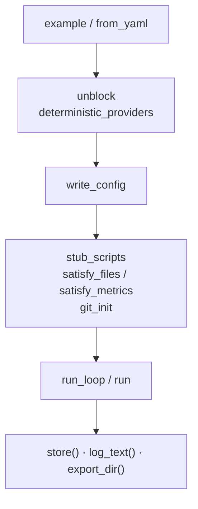

# Other

# CLI integration tests (`runtime/crates/loopsmith-cli/tests/`)

This directory is the stress harness: four test binaries plus a shared fixture builder. Unit tests elsewhere in the workspace cover each piece of the runtime in isolation. Nothing else covers whether those pieces work *together*, under a real iteration loop, driven through the real binary, against the configs that ship in `config/examples/`.

```sh
cargo test -p loopsmith --test stress
cargo test -p loopsmith --test surface
cargo test -p loopsmith --test compat
cargo test -p loopsmith --test opt_in     # skips everything gated by default
```

| File | Covers |
|---|---|
| `harness/mod.rs` | The fixture builder — no tests of its own |
| `stress.rs` | The iteration loop: phases, isolation, stop gates, proposals, resume, export |
| `surface.rs` | Subcommands that were implemented and never executed |
| `compat.rs` | What a generated loop assumes about the machine it lands on |
| `opt_in.rs` | Anything that reaches the network or spends money |

Each binary declares `mod harness;` and shares the same builder. `README.md` in this directory is the human-facing index — a feature × example matrix of what has actually been executed, plus the traps that used to be prose and are now assertions.

---

## Why a fixture exists at all

The shipped examples cannot be run as they stand, and both reasons are deliberate rather than accidental:

1. **Every example refuses.** `pre_execution` steps ship as `done: false`, so `validate` and `run` both stop. That is the teaching mechanism.
2. **No detector scripts exist.** The examples name 29 distinct `scripts/…` detectors between them and the repository ships none. A missing script becomes a detector error, which the gate converts to a failed check — correct behaviour, and useless for exercising anything past the first gate.

`Fixture` rewrites a **copy** in a scratch directory. Nothing under `config/examples/` is ever touched.

---

## `Fixture` — the builder

```rust
pub struct Fixture {
    pub dir: PathBuf,     // scratch directory, named from the tag
    pub config: PathBuf,  // dir/loop.yaml
    pub cfg: LoopConfig,  // the rewritten config, in memory
}
```

Two constructors, both taking a `tag`:

- `Fixture::example(name, tag)` — reads `config/examples/<name>.yaml`
- `Fixture::from_yaml(text, tag)` — config text directly, for shapes no example has

Both funnel through `from_yaml`, which parses with `loopsmith_core::parse_str`, applies `unblock` (marks every `pre_execution` step done) and `deterministic_providers`, then writes `loop.yaml`.

Everything after construction is opt-in and chainable, taking `self` by value:

```rust
let f = Fixture::example("research-loop", "export")
    .stub_scripts(Stubs::Pass)
    .satisfy_files()
    .satisfy_metrics();
```



### Mutating the config

`cfg` is public and mutated directly for anything the builder does not cover — stop gates, extra providers, a starved detector. **Nothing notices the change until `write_config()` re-serialises it.** `stress.rs` has two helpers for the common cases:

- `cap(&mut cfg, iterations)` — bounds `max_iterations` and switches off both no-progress gates, so a scenario cannot sit in a long example's default ceiling of ten iterations
- `starve(&mut cfg, target)` — repoints every validation on a target at `Detector::Script { command: "false", .. }`, so a run keeps iterating instead of succeeding on its first pass

The two combine: `phases_open_one_at_a_time_across_a_real_run` caps at six iterations and starves `overall`, so each goal can be satisfied while the run itself never finishes and the phases keep opening.

### Providers

`deterministic_providers` replaces every provider with `printf "%s" <payload>`, where the payload is a judge block covering every `Detector::Judge` in the config. Three properties are load-bearing:

- **Provider ids are preserved.** `enforce_judge_independence` compares them; rewriting the ids would quietly switch the check off.
- **`SCORE: 10` and an `EVIDENCE:` line are mandatory.** A judge PASS with no evidence is demoted to FAIL by the parser, which would make every subjective validation permanently unsatisfiable.
- **Every provider emits the block**, not only the ones a judge sits on. Judge output is harvested only from nodes whose role is `Role::Judge`, so a builder emitting the same text is inert — and this avoids re-deriving the cascade to work out where a judge would land.

To make one provider disagree, `set_provider_output(&mut cfg, id, payload)` repoints a single id; `failing_judge_payload(&cfg)` builds the refusing counterpart. `judge_provider_ids(&cfg)` resolves which ids judges actually sit on, following `cfg.cascade_for(tier)` when a node named none.

A scenario that needs a provider to *do* something rather than say something overwrites `cfg.providers.providers[n].command` and `.args` after construction — see `ISOLATED_WRITER` and `ISOLATED_CHAIN` in `stress.rs`, where the "providers" are `sh -c` invocations that write files.

### Detector stubs

`stub_scripts(mode)` generates an executable stub for every path in `script_detectors()` (every `Detector::Script` whose command contains a `/`).

```rust
pub enum Stubs { Pass, Fail, PassFrom(u32) }
```

`PassFrom(n)` fails until iteration `n`, implemented with a `.stub-count` file in the loop root rather than an environment variable — the loop cannot change its own environment between iterations, and the gate re-runs every detector each pass.

A detector runs with **no shell**: `command` is argv[0] and `args` are literal. On unix a stub is therefore a `#!/bin/sh` file with mode `0o755`. Windows has no shebang handling, so `stub_scripts` writes a CRLF `.cmd` instead *and repoints the config's detector commands at it*. That rewrite is honest — it is exactly what a user has to do there — and it keeps the iteration loop covered on Windows rather than `#[cfg]`-ing the tests away.

### Artifacts and metrics

`satisfy_files()` creates every path a `Detector::FileExists` names, with a body that is not arbitrary:

```
written by the stress harness
source: https://example.invalid/reference
post_id: 1
```

Those same files are what `Detector::RegexMatch` detectors read — evidence collection registers them under their stem — so the body carries a URL and a `post_id:` line, the tokens the shipped examples look for. Without them the file exists, `file_exists` passes, and the regex on the same file fails. `write_artifacts(body)` takes a specific body when a scenario needs one; `a_regex_detector_reads_the_file_the_loop_produced` uses both directions.

`satisfy_metrics()` writes a `metrics.json` satisfying every `Detector::Threshold`, via `satisfying_value(op, want)` over `CompareOp`. `metrics(&[(name, value)])` writes specific values when a threshold should fail on purpose.

### Git

`git_init()` initialises the loop directory as a repository, configures a fixture identity, writes a `.gitignore` covering `state/` and `logs/`, and commits — a repository with no commit has no `HEAD`, and `git worktree add` refuses to branch from nothing.

This matters in both directions. Outside a repository, `isolated: true` degrades to the shared directory *silently, by design*, and a scratch loop is not a repository unless someone makes it one. `isolation_degrades_to_shared_outside_a_repository` and `isolation_is_real_inside_a_repository` run the same example on either side of that line.

### Running and reading back

| Method | Does |
|---|---|
| `run(&["subcommand", …])` | The binary at `LOOPSMITH`, cwd `dir` |
| `run_with_env(args, env)` | Same, with environment overrides |
| `run_loop(run_id, env)` | `run loop.yaml --run-id <id> --no-acquire` |
| `store()` | Opens the sled ledger via `loopsmith_memory::open(dir/state)` |
| `log_text(run_id)` | `logs/<run-id>.log` |
| `export_dir()` | `<cfg.name>-success/` |
| `cleanup()` | Removes the scratch directory |

`LOOPSMITH` is `env!("CARGO_BIN_EXE_loopsmith")` — Cargo builds the binary for this integration test and hands over the path, so there is no `cargo run` here and no chance of driving a stale build.

---

## Assertions read artifacts, not stdout

Stdout is a report. The record is the sled ledger, `logs/<run-id>.log`, `store.summaries()`, the checkpoint, and the presence or absence of `<name>-success/`.

One assertion recurs and is worth keeping:

```rust
assert_eq!(log.lines().count(), ledger.len());
```

The run log and the ledger are written through a single call, so they must always hold the same number of events. A divergence means one of the two write paths grew a branch the other did not.

The two broadest tests — `every_example_completes_an_iteration_and_leaves_a_consistent_record` and `every_example_survives_a_run_where_nothing_passes` — sweep `all_examples()` and are the cheapest signal that a config change broke the runtime rather than the schema.

---

## What each binary is for

### `stress.rs` — the iteration loop

Phases (`traffic-loop`'s four strictly linear stages, asserted against verdicts the gate actually produced rather than the synthetic ones `phases.rs` unit-tests), worktree isolation, stop gates, resume, export, proposals, summaries, skill trials.

Several tests exist because the behaviour they pin was once wrong in a way nothing failed on:

- `an_isolated_builders_output_reaches_the_gate` — isolated nodes run in `state/worktrees/<node>/` and evidence is collected from the loop root, so before publishing existed a `file_exists` detector on an isolated builder's output could never pass.
- `an_isolated_node_can_read_what_its_isolated_upstream_produced` — a worktree branches from `HEAD`, so the second node starts blind to its upstream. Publishing fixed the gate's view, not the next node's.
- `a_resume_does_not_hand_a_stuck_node_its_revision_budget_back` and `a_resume_does_not_reset_the_no_progress_counter` — everything the stop gates count used to be declared inside the iteration loop, so a run that resumed on a schedule could never reach the ceilings meant to stop it.

The proposal tests all assert the same boundary: the loop proposes, a human applies. `a_node_that_exhausts_its_revisions_asks_for_the_graph_to_be_reshaped` checks the config on disk is untouched; `unexplored_candidates_are_proposed_rather_than_spent_on_unasked` checks nothing dispatched the candidate. `a_summary_provider_adds_prose_that_cannot_decide_anything` points a summariser at a payload claiming everything is complete and asserts the gate still says otherwise.

The shared config constants are worth knowing: `NEVER_SATISFIED` (one node, one goal, wired to fail) is the base for the resume, proposal, perturbation and skill-trial scenarios.

### `surface.rs` — subcommands

`new --config-stdin` (YAML and `--markdown`), `convert --to-yaml`, `skills install`, `watch --check` and `watch` as a resident process, `schedule` with and without `--install`, the reporting commands, `prune`. Each is cheap, needs no provider, and touches only a scratch directory.

`a_config_survives_the_trip_out_to_markdown_and_back` compares *parsed models*, not text, via a local `trimmed()` that strips trailing whitespace from every scalar — a YAML block scalar ends with a newline and Markdown has no way to say so, which is a documented property of the grammar rather than a conversion bug.

`schedule --install` writes into a redirected directory (`LOOPSMITH_LAUNCH_AGENTS_DIR`) rather than `~/Library/LaunchAgents`. Actually loading the agent stays the user's call, so no test runs `launchctl load -w`; the same reasoning applies to `schtasks /Create`, which `schedule` prints rather than runs.

### `compat.rs` — portability

A loop directory outlives the checkout that produced it. Three differences break it every time, and all three are invisible on the machine that wrote it: **bash 3.2** (macOS still ships it), **BSD versus GNU `sed`/`stat`/`readlink`**, and **whichever scheduler is installed**, which is not implied by the OS.

These tests *run* the generated scripts. `new_loop(tag)` scaffolds into a scratch directory — `loopsmith new` refuses a path inside the loopsmith checkout, which is why this is never done in-tree.

The `.cmd` assertions carry the most hard-won detail. `the_generated_cmd_launchers_are_crlf_and_shaped_for_cmd_exe` requires CRLF throughout, `setlocal enabledelayedexpansion`, `cd /d "%~dp0"`, a `where loopsmith` fallback, and **exactly one** `exit /b`, spelled `endlocal & exit /b %CODE%`. Windows CI walked into both traps behind that: `setlocal`'s implicit `endlocal` restores the errorlevel, so an early `exit /b 127` reported success; and writing `endlocal & exit /b 127` fixes that on a top-level line but not inside a nested `if ( … )` block, which is where the broken one was. A single exit point needs no reasoning about block parsing.

Two helpers make one test meaningful on both platforms rather than gating it out. `launcher(dir, stem)` returns a runnable `Command` for `.sh` or `cmd /c *.cmd`; `with_system_path(dir)` builds a minimal `PATH` that still contains `System32` on Windows, because `where.exe` lives there and a bare `PATH` would stop measuring the fallback and start measuring whether `where` exists.

`strip_comments` scans code rather than prose: these files document the very constructs they must not use, so a bashism check that reads comments flags its own explanation. It handles `#` and, case-insensitively, `rem ` for the `.cmd` dialect.

`need_bash_exits_two_so_a_missing_tool_is_not_read_as_a_failed_check` pins the exit-code distinction the whole gate depends on — "this machine cannot run the check" is a different fact from "the check failed", and a gate that cannot tell them apart reports missing tooling as unfinished work.

The `doctor` tests close the loop: it must name the platform facts (`os`, `userland`, `bash`, `scheduler`, `git`, plus the in-place `sed -i` spelling), stay advisory so a non-zero exit never fails a working CI step, and when pointed at a config name detectors this machine cannot run.

`doctor_reports_a_detector_that_is_not_executable` is `#[cfg(unix)]` for a substantive reason, not just `PermissionsExt`: there is no executable bit to clear off unix, so `loopsmith_util::is_executable` degrades to a file check and `doctor` is *right* to report nothing. Gating the whole test says that; a `#[cfg]` around only the chmod would leave a test asserting the wrong thing on Windows.

### `opt_in.rs` — network and money

Every test here returns without asserting unless its variable is set, via the local `gated!` macro:

```sh
LOOPSMITH_STRESS_NETWORK=1  cargo test -p loopsmith --test opt_in
LOOPSMITH_STRESS_PROVIDER=1 cargo test -p loopsmith --test opt_in -- --nocapture
```

So `cargo test --workspace` never clones a repository, never calls a model, and never costs anything. `LOOPSMITH_STRESS_PROVIDER` invokes whatever model the example names — point it at the cheapest one you have; the aim is to prove the plumbing reaches a real provider, not to get a good answer. `the_simplest_example_runs_against_a_real_provider` reads `research-loop.yaml` directly rather than through `Fixture::example`, precisely because the fixture would swap the providers out.

Two things here are deliberately *not* gated. `an_unsafe_repo_url_is_refused_before_git_is_reached` needs no network and is the half of the clone path that matters most. `the_harness_still_builds_a_runnable_fixture` is a sanity check, so a failure above is about the network or the provider rather than the scaffolding around it.

---

## Connections to the rest of the workspace

| Crate | Used for |
|---|---|
| `loopsmith-core` | `parse_str`, `load`, `LoopConfig`, `Detector`, `ProviderSpec`, `ProviderKind`, `Tier`, `Role`, `CompareOp`, `cascade_for` |
| `loopsmith-memory` | `open`, `SledStore`, the `Store` trait (`ledger`, `episodes`, `summaries`, `goal_states`, `checkpoint`, `proposals`, `skill_trials`, `runs`), `LedgerKind`, `ProposalKind` |
| `loopsmith-util` | `testing::temp_dir`, and `is_executable` indirectly through `doctor` |
| `loopsmith` (the binary) | Everything, through `CARGO_BIN_EXE_loopsmith` |

`repo_root()` derives the workspace root from `CARGO_MANIFEST_DIR` by walking three ancestors up; `examples_dir()` and `all_examples()` build on it. If the crate ever moves in the tree, that `nth(3)` is the thing to fix.

---

## Traps worth not rediscovering

These are the rules that will bite when adding a test, most of which have already cost someone an afternoon:

- **Give every fixture a distinct tag.** Temp directories are named from it and the suite runs threaded, so two concurrent tests sharing a tag collide on the sled lock — the same error, from the same cause, with nothing pointing at the tag.
- **The store cannot be opened while the binary under test is running**, and the handle must be dropped before its directory is removed. A store opened around a `Command` call reports a lock error that reads like a backend bug. This is why every test ends `drop(store); f.cleanup();`.
- **A detector script runs with no shell and no timeout.** `command` is argv[0] and `args` are literal, so a stub needs a shebang and must not hang.
- **Providers keep their ids when swapped for stubs** — see `enforce_judge_independence` above.
- **A judge PASS with no evidence is demoted to FAIL.** Any stub judge payload needs an `EVIDENCE:` line.
- **`satisfy_files` writes a body, not a placeholder** — the same files feed `regex_match`.
- **A `\` continuation inside a non-raw `format!` eats the next line's indentation.** The generated `run.sh` once reached disk flat and unindented; nothing about that fails a build or a parse, which is why `the_generated_scripts_keep_the_indentation_they_were_written_with` reads the layout back.

## Deliberate gaps

- **Loading a launch agent.** `--install` writes the plist and stops; the write is covered because the destination is redirected.
- **Executing a `.cmd` launcher.** No POSIX host can run one, so this suite checks its shape and the `windows-latest` CI leg runs it.
- **A GNU userland, locally.** `compat.rs` exercises the helpers rather than mocking the userland, so whichever machine runs the suite proves its own half and the `ubuntu-latest` CI leg proves the other.