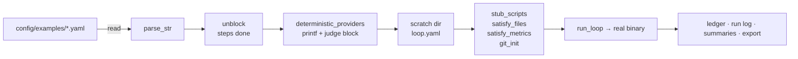

# Other

# The Stress Harness (`loopsmith-cli/tests`)

Integration tests for the `loopsmith` binary. Every crate in the runtime has unit tests; this directory covers what unit tests structurally cannot — whether the pieces work *together*, under a real iteration loop, driven through the real binary, against the configs users are actually handed.

```sh
cargo test -p loopsmith --test stress     # the iteration loop
cargo test -p loopsmith --test surface    # subcommands
cargo test -p loopsmith --test compat     # portability of generated loops
cargo test -p loopsmith --test opt_in     # gated: network and money
```

| File | Covers |
|---|---|
| `harness/mod.rs` | The `Fixture` builder. No tests of its own. |
| `stress.rs` | Phases, isolation, stop gates, proposals, resume, export |
| `surface.rs` | Subcommands that were implemented and never executed |
| `compat.rs` | What a generated loop assumes about the machine it lands on |
| `opt_in.rs` | Anything that reaches the network or spends money |

---

## Why a fixture exists

The shipped examples under `config/examples/` **cannot be run as they stand**, and both reasons are deliberate design rather than defects:

1. **Every example refuses.** `pre_execution` steps ship as `done: false`, so `validate` and `run` both stop. That refusal is the teaching mechanism.
2. **No detector scripts exist.** The examples name 29 distinct `scripts/…` detectors between them; the repository ships none. A missing script becomes a detector *error*, which the gate converts to a failed check — correct behaviour, and useless for exercising anything past the first gate.

`Fixture` therefore rewrites a **copy** in a scratch directory. Nothing under `config/examples/` is ever touched.


```mermaid
graph LR
  E["config/examples/*.yaml"] -->|read| P["parse_str"]
  P --> U["unblock<br/>steps done"]
  U --> D["deterministic_providers<br/>printf + judge block"]
  D --> W["scratch dir<br/>loop.yaml"]
  W --> S["stub_scripts<br/>satisfy_files<br/>satisfy_metrics<br/>git_init"]
  S --> R["run_loop → real binary"]
  R --> A["ledger · run log · summaries · export"]
```

### The builder

`Fixture::example(name, tag)` loads a shipped example; `Fixture::from_yaml(text, tag)` takes config text directly, for shapes no example has. Both funnel through `from_yaml`, which parses, applies `unblock` and `deterministic_providers`, and writes `loop.yaml` into a temp directory named from `tag`.

The remaining methods are chained opt-ins, each returning `Self`:

- **`stub_scripts(Stubs)`** — writes an executable stub for every `scripts/…` path the config names. `Stubs::Pass` exercises the success path and the export; `Stubs::Fail` reaches `no_progress_iterations`, the randomness gate, and `max_revisions_per_node`. `Stubs::PassFrom(n)` fails until iteration `n` using a `.stub-count` file in the loop root, because the loop cannot change its own environment between iterations.
- **`satisfy_files()` / `write_artifacts(body)`** — creates every path a `file_exists` detector points at. `satisfy_files` uses `ARTIFACT_BODY`, which carries a URL and a `post_id:` line; see the trap below.
- **`satisfy_metrics()` / `metrics(&[(name, value)])`** — writes `metrics.json`, where threshold detectors read from. The no-argument form derives a satisfying value per `CompareOp` via `satisfying_value`.
- **`git_init()`** — makes the loop directory a repository *with a commit*, so `isolated: true` produces a real worktree. A repository with no `HEAD` makes `git worktree add` refuse to branch from nothing.

Mutating `cfg` in place is the normal way to reshape a scenario (`cap`, `starve`, pushing a provider), but **nothing notices until you call `write_config()`**.

### Running and reading back

`run(args)` and `run_with_env(args, env)` invoke `LOOPSMITH` — the path Cargo hands over in `CARGO_BIN_EXE_loopsmith`, so there is no `cargo run` here and no chance of driving a stale build. `run_loop(run_id, env)` is the common case: `run loop.yaml --run-id <id> --no-acquire`.

Assertions then read the **record**, not stdout:

| Accessor | Reads |
|---|---|
| `store()` | the sled ledger, episodes, goal states, summaries, proposals, checkpoint, skill trials |
| `log_text(run_id)` | `logs/<run-id>.log` |
| `export_dir()` | `<config name>-success/` |

Stdout is a report. One invariant recurs and is worth keeping: the run log and the ledger are written through a single call, so they must always hold the same number of events. A divergence means one of the two write paths grew a branch the other did not — `every_example_completes_an_iteration_and_leaves_a_consistent_record` asserts exactly that.

---

## Harness-authoring traps

These are not stylistic preferences. Each one has produced a failure that reads like a bug somewhere else.

**Give every fixture a distinct tag.** Temp directories are named from it and the suite runs threaded, so two concurrent tests sharing a tag collide on the sled lock — with nothing in the error pointing at the tag. Loops over `all_examples()` use `&format!("all-{i}")` for this reason.

**The store cannot be opened while the binary under test is running**, and the handle must be `drop`ped before its directory is removed. A store opened around a `Command` call reports a lock error that reads like a backend bug. Every test in `stress.rs` ends `drop(store); f.cleanup();`.

**Providers keep their ids when they are swapped for stubs.** `deterministic_providers` rewrites `kind`, `command`, `args`, and clears `requires_env`, but leaves `id` alone — `enforce_judge_independence` compares ids to require that a judge sits on a different provider from the builder it reviewed. Rewriting the ids would quietly switch that check off.

**A judge PASS with no evidence is demoted to FAIL.** `judge_payload` emits `VERDICT/STANDARD/EVIDENCE/SCORE` for every `Detector::Judge` in the config; the `EVIDENCE:` line is mandatory or every subjective validation becomes permanently unsatisfiable. `failing_judge_payload` is the inverse, and `set_provider_output` points one id at a different payload so a judge can disagree while builders carry on.

**`satisfy_files` writes a body, not a placeholder.** The files a `file_exists` detector names are the same files a `regex_match` detector reads — evidence collection registers them under their stem — so the default body carries the tokens the shipped examples look for. Without them the file exists, `file_exists` passes, and the regex on the same file fails.

**A detector script runs with no shell and no timeout.** `command` is argv[0] and `args` are literal, so a stub needs a shebang and must not hang.

---

## Windows stubbing

Windows has no shebang handling, so a `#!/bin/sh` stub is unrunnable and every stubbed detector fails to spawn. `stub_scripts` writes a `.cmd` instead and `point_at_cmd_stubs` repoints the config's detector commands at it. Rewriting rather than skipping keeps the iteration loop covered there, and the rewrite is honest — it is exactly what a user has to do.

The subtlety is *which* detectors get repointed. `detectors` and `detectors_mut` walk checks **and** every entry, approval, and rollback gate rule. These were two separate lists once, and only the first learned about gates: on Windows an entry gate went on naming the `.sh` whose `.cmd` replacement had been written, the run failed while still validating, and the only symptom was `a run must open the ledger` — because `RunStarted` had not reached the ledger yet. Keep `detectors` and `detectors_mut` side by side; they must have the same order and the same members.

`point_at_cmd_stubs` is a plain function of the config rather than a Windows-gated branch, so `the_windows_stubs_are_named_by_every_detector_they_replace` runs on **every** OS and fails locally first. It also asserts `gate_scripts > 0`, so the test cannot pass while proving nothing about the half of the list that broke.

---

## What `stress.rs` pins

Two scenario shapers sit at the top and appear throughout:

- `cap(cfg, n)` — sets `max_iterations`, zeroes `no_progress_iterations`, clears the randomness threshold. Without it a scenario sits in a long example's default ceiling of ten iterations and three hours.
- `starve(cfg, target)` — rewrites every validation on a target to `command: "false"`, so a run keeps iterating instead of succeeding on its first pass. Starving `overall` while leaving the per-goal checks satisfiable is how the phase-ordering tests keep a run alive long enough to observe.

Two inline configs carry the rest: `NEVER_SATISFIED` (one node, nothing satisfiable — the base for proposals, resume, and perturbation), plus `ISOLATED_WRITER` and `ISOLATED_CHAIN` for the worktree tests.

The scenarios group into six areas.

**The whole set, twice.** `every_example_completes_an_iteration_and_leaves_a_consistent_record` runs all 13 examples with everything satisfiable; `every_example_survives_a_run_where_nothing_passes` runs them with no stubs, no artifacts, no metrics. A detector that fails closed is correct; a runtime that panics on one is not. This pair is the cheapest signal that a config change broke the runtime rather than the schema.

**Phases.** `phases.rs` is unit-tested against synthetic verdicts. `phases_open_one_at_a_time_across_a_real_run` is the first time the ordering is asserted against verdicts the gate actually produced, walking `traffic-loop`'s four linear phases and checking that each node's *first* iteration strictly follows its predecessor's. `a_phase_that_never_satisfies_its_goals_never_opens_the_next_one` covers the negative: no timeout, no eventual give-up that lets later work start anyway.

**Isolation.** Outside a repository, `isolated: true` degrades to the shared directory — silently, by design — and `isolation_degrades_to_shared_outside_a_repository` asserts the degradation is *reported* rather than hidden. Inside one, `isolation_is_real_inside_a_repository` requires `state/worktrees/<node>/` per isolated node. The two harder cases concern visibility: a worktree branches from `HEAD`, so an isolated node starts blind to everything the run has produced since. `an_isolated_builders_output_reaches_the_gate` covers publishing back to the loop root (before it existed, a `file_exists` detector on an isolated builder's output could never pass — the work was real, on disk, and invisible to the only thing allowed to rule on it), and `an_isolated_node_can_read_what_its_isolated_upstream_produced` covers the seeding that publishing did not fix, for the node reading its own tree.

**Stop gates and the randomness agent.** `a_run_with_no_moving_verdicts_halts_on_no_progress` checks the halt fires long before the iteration cap. The randomness gate has three tests because only its *seeded fallback* had ever run — no cheap provider is reachable in a test environment, so `ask_agent` returned `None` every time and `parse_choice` saw only strings. A deterministic cheap provider on the `cheap` cascade closes that: `the_randomness_agent_chooses_when_a_cheap_provider_answers` proves the directive survives the round trip, and `an_answer_off_the_menu_falls_back_rather_than_being_guessed_at` proves an off-menu `CHOICE:` is discarded in favour of the seed and does not leak into the recorded choice.

**Resume.** Everything the stop gates count used to be declared inside the iteration loop, so it was rebuilt from nothing whenever a run resumed — a long-lived loop resuming on a schedule could never reach the ceilings that exist to stop it. Two tests pin the fix: `a_resume_does_not_hand_a_stuck_node_its_revision_budget_back` (checks `checkpoint.revisions`) and `a_resume_does_not_reset_the_no_progress_counter` (checks `stale_iterations` **and** that `last_signature` is non-empty, or the first iteration after a resume always looks like progress).

**Proposals.** The loop is not allowed to reshape itself, so evidence about the graph has to surface as a proposal. One test per kind — `ReshapeGraph` from an exhausted revision budget, `ChangeCriteria` from a detector that *cannot run* as distinct from one that fails, `TrySkill` for unexplored candidates when `explore` is off. Each asserts exactly one proposal (not one per iteration) and that the proposal is not self-applying: the config on disk stays untouched, and no ledger entry shows the skill being acquired.

Two smaller ones close gaps nothing else reaches: `a_summary_provider_adds_prose_that_cannot_decide_anything` (a configured `summary_provider` claims everything is complete; the gate disagrees and the gate is the only thing that counts) and `a_skill_trial_records_what_the_node_that_used_it_cost` — without `SkillTrial.tokens` the ranking cannot tell a skill that lifts the pass rate for free from one that does it by tripling the bill.

Finally, two combinations no single unit test covers: `perturbation_and_phases_do_not_dispatch_a_shut_phase` (a shuffle that assumed every node in the wave was eligible would dispatch work whose phase is shut) and `a_phased_loop_that_succeeds_still_exports` (phases gate dispatch; they must not gate the certificate).

---

## What `compat.rs` pins

A loop directory outlives the checkout that produced it and gets copied to build boxes, containers, and colleagues' laptops. Three differences break it every time, and all three are invisible on the machine that wrote it: **bash 3.2** (macOS still ships it, because 4.0 changed licence), **BSD versus GNU `sed`/`stat`/`readlink`**, and **whichever scheduler is installed**, which is not implied by the OS.

These tests *run* the generated scripts rather than reading them. `new_loop(tag)` scaffolds into a scratch directory via `loopsmith new --path . --name portable --force` — never in-tree, because `new` refuses a path inside the loopsmith checkout.

`the_compatibility_helpers_work_under_posix_sh` sources `scripts/compat.sh` under `sh` and exercises **every** helper (`compat_report`, `sed_i`, `stat_size`, `stat_mtime`, `readlink_f`, `sha256`, `require`), because a helper that is never called is a helper nobody has checked. It also asserts the in-place edit leaves no `sample.txt.bak` behind — the litter a wrong `sed -i` spelling produces on BSD.

`need_bash` and `require` must exit **2, not 1**. A detector's exit code is its verdict; "this machine cannot run the check" is a different fact from "the check failed", and a gate that cannot tell them apart reports missing tooling as unfinished work.

`the_generated_scripts_parse_under_posix_sh` uses `sh -n` to parse without executing, then scans for bashisms (`[[`, `declare -A`, `mapfile`, `readarray`, `${!`, `&>>`) — through `strip_comments`, because these files *document* the constructs they must not use and a check that reads prose flags its own explanation. `strip_comments` drops everything after the first `#` on a line and blanks any line starting `rem ` (case-insensitive), the same trap in the `.cmd` dialect.

### The `.cmd` launcher

`the_generated_cmd_launchers_are_crlf_and_shaped_for_cmd_exe` encodes several `cmd.exe` traps that Windows CI walked into:

- **CRLF is required.** With LF only, the trailing newline becomes part of the last token on a line, so `exit /b 2` turns into an unknown command with no useful message attached. The test counts lone-LF endings and requires zero.
- **Exactly one exit, on the last line, `endlocal & exit /b %CODE%`.** `setlocal` saves the errorlevel and the implicit `endlocal` restores it, so an early `exit /b 127` reports 0 — a loop whose binary had moved printed its diagnostic and then exited *successfully*. Writing `endlocal & exit /b 127` fixes that on a top-level line but **not** inside a nested `if ( … )` block, which is where the broken one was. A single exit point plus a `:loopsmith_done` label needs no reasoning about block parsing.
- **Delayed expansion.** A parenthesised block is parsed before it runs, so `%ERRORLEVEL%` inside one expands to the value from *before* the block. The test requires `setlocal enabledelayedexpansion` and forbids `set "CODE=%ERRORLEVEL%"`.
- `cd /d "%~dp0"`, so the launcher runs from its own directory.

### Cross-platform launcher selection

`launcher(dir, stem)` returns a runnable `Command` for whichever launcher *this* host can execute — `cmd /c run.cmd` on Windows, `./run.sh` otherwise. Windows cannot run a `#!` script and no POSIX shell will run a `.cmd`, which is exactly why both are generated; a test hardcoding `./run.sh` would test nothing on Windows, and `#[cfg(unix)]` would leave the `.cmd` unexercised on the only platform that runs it.

`with_system_path(dir)` builds a `PATH` containing only `dir` — plus `%SystemRoot%\System32` on Windows, because the `.cmd` launcher searches with `where.exe`, which lives there. On unix the `.sh` launcher uses `command -v`, a shell builtin that needs nothing on `PATH`. Without the addition, the fallback test would stop measuring the fallback and start measuring whether `where` exists.

Those two feed `a_generated_script_falls_back_to_path_when_the_pinned_binary_has_moved`: the script pins an absolute path (cron and launchd do not inherit a login shell's `PATH`), but a moved binary must produce exit 127 with a message naming `not on PATH` and telling the user to `Re-point it` — then be found again when the real binary is on `PATH`. `the_export_script_is_posix_and_does_not_pin_a_binary` is the inverse for exports, which travel furthest and must assume least.

`the_generated_scripts_keep_the_indentation_they_were_written_with` pins a Rust-side trap: a `\` line continuation inside a **non-raw** `format!` eats the leading whitespace of the next line, and the generated `run.sh` reached disk flat and unindented because of it. Nothing about that fails a build or a parse, so the only way it stays fixed is a test that reads the layout back.

### `doctor`

`doctor` must report `os`, `userland`, `bash`, `scheduler`, and `git`, quote the in-place `sed -i` spelling for this userland, and **stay advisory** — reporting a constraint is not the machine being unusable, and a non-zero exit would fail a CI step that was working. Pointed at a config it also names detector scripts that do not exist, and (unix only) ones that exist but are not executable, with `chmod +x` in the message. That gate is on the whole test, not just the `chmod`: there is no executable bit off unix, so `loopsmith_util::is_executable` degrades to a file check and `doctor` is *right* not to report anything — a `#[cfg]` around only the chmod would leave a test asserting the wrong thing on Windows.

---

## `opt_in.rs`

Every test here returns without asserting unless its environment variable is set, via the `gated!` macro, which accepts `1` or `true` and otherwise prints why it is skipping. So `cargo test --workspace` never clones a repository, never calls a model, and never costs anything.

```sh
LOOPSMITH_STRESS_NETWORK=1  cargo test -p loopsmith --test opt_in
LOOPSMITH_STRESS_PROVIDER=1 cargo test -p loopsmith --test opt_in -- --nocapture
LOOPSMITH_STRESS_DOCKER=1   cargo test -p loopsmith --test opt_in
```

| Variable | Covers |
|---|---|
| `LOOPSMITH_STRESS_NETWORK` | `git clone --depth 1` into quarantine; the post-clone `init_command` running *inside* the installed directory |
| `LOOPSMITH_STRESS_PROVIDER` | one real-provider run of `research-loop`; the randomness agent keeping to its four-item menu with a real model |
| `LOOPSMITH_STRESS_DOCKER` | a container node actually running in a container |

`an_unsafe_repo_url_is_refused_before_git_is_reached` is deliberately **not** gated — refusing `file:///etc` takes no network, and it is the half of the clone path that matters most.

The provider tests read the example directly rather than through `Fixture::example`, since the whole point is keeping the real providers. They cap iterations and set `max_cost_usd`, then assert against episodes' `provider_id` and a `GateEvaluated` entry in the ledger. Point `LOOPSMITH_STRESS_PROVIDER` at the cheapest model you have; the aim is to prove the plumbing reaches a real provider, not to get a good answer.

`a_container_node_really_runs_in_a_container` is the only test that calls library APIs rather than the binary. `loopsmith_run::container` has unit tests for the *decision* (which image, network or not, degrade or not) and `loopsmith_provider::container_argv` has unit tests for the *argv*, but neither had ever handed that argv to a daemon — so three things nobody could see were untested: that the mount spelling is one a real runtime accepts, that `-w /work` puts the command where the node's files are, and that `--network none` is *applied* rather than merely appended. It probes via `rt::probe()` and skips gracefully if no runtime is present. The image is `alpine:3` and the command is `cat`, because a provider's CLI has to exist *inside* the image — the host's copy is not visible in there, which is the whole point of the isolation.

`the_harness_still_builds_a_runnable_fixture` is ungated, so a failure above is about the network or the provider rather than the scaffolding around it.

---

## Deliberately not covered

- **Actually loading a launch agent.** `--install` writes the plist and stops; `launchctl load -w` stays the user's call. The write itself is covered because `LOOPSMITH_LAUNCH_AGENTS_DIR` redirects the destination. Same reasoning for `schtasks /Create`: `schedule` prints the command rather than running it.
- **Executing a `.cmd` launcher.** No POSIX host can run one, so this suite checks its shape and the `windows-latest` CI leg runs it.
- **A GNU userland, locally.** `compat.rs` exercises the helpers rather than mocking the userland, so everything portability-related is asserted on whichever machine the suite runs on — and this one is BSD. The `ubuntu-latest` CI leg proves the other half by running the same tests.

---

## Traps that used to be prose

Each of these was a sentence someone had to remember. A remembered rule is one refactor away from being gone, so each is now something that fails.

| Trap | Pinned by |
|---|---|
| A `\` continuation in a non-raw `format!` eats the next line's indentation | `the_generated_scripts_keep_the_indentation_they_were_written_with` |
| `cmd.exe` needs CRLF; LF-only makes the last token unparseable | `the_generated_cmd_launchers_are_crlf_and_shaped_for_cmd_exe` |
| A bashism check that reads comments flags its own explanation | `strip_comments`, extended to `rem ` for the `.cmd` dialect |
| The userland is probed with `sed --version`, never inferred from the OS | `the_userland_is_probed_and_never_inferred_from_the_operating_system` (`platform.rs`) |
| Windows fell into the catch-all arm and was offered `crontab` | `every_os_has_a_scheduler_worth_probing_and_windows_gets_the_native_one` |
| `HOME` is unset on Windows | `the_home_directory_is_found_by_this_platforms_variable` |
| `require` / `need_bash` exit 2, not 1 | `need_bash_exits_two_so_a_missing_tool_is_not_read_as_a_failed_check` |
| A new `ProposalKind` must decide its own staleness | `every_proposal_kind_has_a_decided_lifetime` (`loopsmith-memory`) |
| Proposals written before `expires_ms` existed must still load | `a_proposal_written_before_the_field_existed_still_deserialises` |

---

## Adding a scenario

1. Pick a **unique tag**. Grep the suite if unsure.
2. Start from `Fixture::example` when the point is that a *shipped config* works; from `Fixture::from_yaml` (or `NEVER_SATISFIED`) when the point is a shape no example has.
3. Apply `cap` and, if the run must stay alive, `starve` — then `write_config()`.
4. Chain the opt-ins the scenario actually needs. Stubbing and artifacts are not free; a test that stubs what it does not read is a test whose failure mode is unclear.
5. Assert against `store()`, `log_text()`, or `export_dir()`. If you find yourself matching on stdout, the fact you want is probably in the ledger.
6. End with `drop(store); f.cleanup();`.