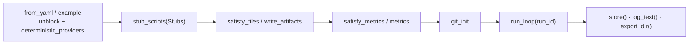

# Other

# The `loopsmith-cli` Integration Suite

`runtime/crates/loopsmith-cli/tests/` is the only place in the workspace where the shipped configs are executed by the real binary. Every crate underneath it has unit tests that prove a component in isolation; this suite proves the components work *together*, under a real iteration loop, against the same `config/examples/*.yaml` files users are handed.

```sh
cargo test -p loopsmith --test stress    # the iteration loop
cargo test -p loopsmith --test surface   # subcommands
cargo test -p loopsmith --test compat    # portability of generated scripts
cargo test -p loopsmith --test opt_in    # network / money — skips by default
```

| File | Role |
|---|---|
| `harness/mod.rs` | The `Fixture` builder. No tests of its own. |
| `stress.rs` | Phases, isolation, stop gates, proposals, resume, export |
| `surface.rs` | `new --config-stdin`, `convert`, `watch`, `schedule`, `skills install`, report commands |
| `compat.rs` | What a generated loop assumes about the machine it lands on |
| `opt_in.rs` | Anything that clones, calls a model, or needs a container daemon |

## Why a fixture layer exists

The shipped examples deliberately cannot be run as they stand, and both reasons are load-bearing features rather than defects:

1. **Every example refuses.** `pre_execution` steps ship with `done: false`, so `validate` and `run` both stop. That is the teaching mechanism — the user is meant to read the prerequisites and tick them off.
2. **No detector scripts exist.** The examples name 29 distinct `scripts/…` detectors between them and the repository ships none. A missing script becomes a detector *error*, which the gate converts to a failed check — correct behaviour, and useless for exercising anything past the first gate.

`Fixture` therefore rewrites a **copy** in a scratch directory. Nothing under `config/examples/` is ever mutated.

## `Fixture`: the builder

```rust
pub struct Fixture {
    pub dir: PathBuf,      // scratch loop root
    pub config: PathBuf,   // <dir>/loop.yaml
    pub cfg: LoopConfig,   // the rewritten config, in memory
}
```

Two constructors:

- `Fixture::example(name, tag)` — loads `config/examples/<name>.yaml`
- `Fixture::from_yaml(text, tag)` — inline config for shapes no example has

Both route through `from_yaml`, which parses with `loopsmith_core::parse_str`, then applies two non-negotiable rewrites before anything reaches disk:

- **`unblock`** marks every `cfg.intent.prerequisites` step `done: true`.
- **`deterministic_providers`** replaces every provider with `printf "%s" <judge payload>` — `ProviderKind::Byok`, no model, `requires_env` cleared, `usage_regex` dropped.

The rest is opt-in, chained fluently. Each stage returns `Self`:


```mermaid
graph LR
  A["from_yaml / example<br/>unblock + deterministic_providers"] --> B["stub_scripts(Stubs)"]
  B --> C["satisfy_files / write_artifacts"]
  C --> D["satisfy_metrics / metrics"]
  D --> E["git_init"]
  E --> F["run_loop(run_id)"]
  F --> G["store() · log_text() · export_dir()"]
```

`cfg` is public and mutable. Anything changed in place needs `write_config()` afterwards — nothing else notices the change, because the binary reads the file, not the struct.

### `stub_scripts(Stubs)`

Generates one executable stub for every path `script_detectors()` returns. `Stubs` is the axis that reaches the interesting states:

| Variant | Behaviour | Reaches |
|---|---|---|
| `Pass` | `exit ${STUB_EXIT:-0}` | success path, export |
| `Fail` | `exit ${STUB_EXIT:-1}` | `no_progress_iterations`, randomness gate, `max_revisions_per_node` |
| `PassFrom(n)` | fails, then passes from iteration `n` | progress that actually moves |

`PassFrom` uses a `.stub-count` file in the loop root rather than an environment variable, because the loop cannot change its own environment between iterations while the gate re-runs every detector.

On Windows the same stubs are written as `.cmd` (there is no shebang handling) **and** the config's detector commands are repointed from `foo.sh` to `foo.cmd`. That rewrite is honest: it is exactly what a user has to do there, which is why `compat.sh` says so.

`script_detectors()` collects from `safety.checks` **and** from `safety.gates.{entry,approval,rollback}`. A gate is a detector too, and an entry gate whose script is missing stops the run while it is still validating — before `RunStarted` reaches the ledger, so the failure surfaces as "a run must open the ledger" and says nothing about the missing file.

### Artifacts and metrics

`satisfy_files()` delegates to `write_artifacts(ARTIFACT_BODY)`. The body is not arbitrary:

```
written by the stress harness
source: https://example.invalid/reference
post_id: 1
```

The files a `file_exists` detector names are the same files a `regex_match` detector reads — evidence collection registers them under their stem — so the default body carries a URL and a `post_id:` line, the tokens the shipped examples look for. Use `write_artifacts(body)` when a scenario needs something specific; `a_regex_detector_reads_the_file_the_loop_produced` uses `write_artifacts("no links in here at all\n")` for the negative half.

`satisfy_metrics()` writes `metrics.json` covering every `Detector::Threshold` in the config, choosing a value with `satisfying_value(op, want)` per `CompareOp`. `metrics(&[(name, value)])` writes exact values when a threshold should fail on purpose.

### `git_init()`

Makes the loop directory a repository so `isolated: true` produces a real worktree instead of degrading to the shared directory. It sets a local identity, disables `commit.gpgsign`, writes a `.gitignore` for `state/` and `logs/`, and makes one commit — `git worktree add` refuses to branch from a repository with no `HEAD`.

Worth doing deliberately in both directions: `isolation_degrades_to_shared_outside_a_repository` and `isolation_is_real_inside_a_repository` are the same example with and without this call.

### Running and reading back

`LOOPSMITH` is `env!("CARGO_BIN_EXE_loopsmith")` — Cargo builds the binary for the integration test and hands over the path, so there is no `cargo run` anywhere and no chance of driving a stale build.

- `run(args)` / `run_with_env(args, env)` — arbitrary subcommand in `dir`
- `run_loop(run_id, env)` — `run loop.yaml --run-id <id> --no-acquire`
- `store()` — opens the sled ledger via `loopsmith_memory::open(dir/state)`
- `log_text(run_id)` — `logs/<run-id>.log`
- `export_dir()` — `<cfg.name>-success/`

## Assertions read artifacts, not stdout

Stdout is a report. The record is the sled ledger, the run log, `store.summaries()`, `store.goal_states()`, `store.checkpoint()`, `store.proposals()`, `store.skill_trials()`, and the presence or absence of the export directory.

One assertion recurs and earns its place:

```rust
assert_eq!(log.lines().count(), ledger.len(),
    "{name}: the run log and the ledger disagree about what happened");
```

The two are written through a single call, so a divergence means one of the write paths grew a branch the other did not.

## Judge payloads

`judge_payload(cfg)` emits one block per `Detector::Judge`:

```
VERDICT: <name> PASS
STANDARD: <standard>
EVIDENCE: asserted deterministically by the stress harness
SCORE: 10
```

Three constraints are encoded here and each one silently breaks the suite if violated:

- **`EVIDENCE:` is mandatory.** A judge PASS with no evidence is demoted to FAIL by the parser, which makes every subjective validation permanently unsatisfiable.
- **`SCORE: 10`** clears any `min_score`.
- **Provider *ids* are preserved** by `deterministic_providers`. `enforce_judge_independence` compares them: a judge must sit on a different id from the builder it reviewed. Rewriting the ids would quietly switch that check off.

Every provider emits the block, not just the ones a judge lands on — judge output is only harvested from nodes whose role is `Judge`, so a builder emitting the same text is inert, and this avoids re-deriving the cascade. `failing_judge_payload`, `set_provider_output(cfg, id, payload)` and `judge_provider_ids(cfg)` (which follows `cfg.cascade_for(tier)` when a node names no provider) exist for scenarios that need a judge to disagree while the builders carry on.

## `stress.rs`: what the loop is held to

Two local helpers shape most scenarios:

- `cap(cfg, n)` — pins `max_iterations`, zeroes `no_progress_iterations`, clears the randomness threshold, so a scenario cannot sit in a long example's default ceiling of ten iterations and three hours.
- `starve(cfg, target)` — rewrites every validation on `target` to `Detector::Script { command: "false" }`. Starving `overall` keeps a run alive so phases keep opening; starving a goal keeps its phase shut.

The two broadest tests iterate `all_examples()`:

- `every_example_completes_an_iteration_and_leaves_a_consistent_record` — one supervised iteration, everything satisfiable, `RunStarted` present, a stop recorded, log and ledger in agreement, exactly one summary.
- `every_example_survives_a_run_where_nothing_passes` — no stubs, no artifacts, no metrics. A detector that fails closed is correct; a runtime that panics on it is not. Exit must be non-zero and no export may appear.

Beyond that, the file is organised by the property under test rather than by example. Notable areas:

**Phases.** `traffic-loop` has four strictly linear phases with one node each. `phases_open_one_at_a_time_across_a_real_run` reads `store.episodes()`, takes each node's minimum iteration, and asserts the order `find-venues → write-posts → publish → measure` strictly increases — the first time `phases.rs` ordering is checked against verdicts the gate actually produced rather than synthetic ones. `a_phase_that_never_satisfies_its_goals_never_opens_the_next_one` starves the first phase and asserts the later three never appear in the episode log at all: no timeout, no eventual give-up.

**Worktree isolation.** Two inline configs, `ISOLATED_WRITER` and `ISOLATED_CHAIN`, cover the two bugs a naive worktree implementation has. An isolated builder writes into `state/worktrees/<node>/`, but evidence is collected from the loop root — so `an_isolated_builders_output_reaches_the_gate` pins the publish step. A worktree branches from `HEAD`, so an isolated node starts blind to what its isolated upstream produced — `an_isolated_node_can_read_what_its_isolated_upstream_produced` pins the seeding, and asserts the ledger says `"was seeded with"` rather than doing it silently.

**Stop gates and the randomness gate.** `a_run_with_no_moving_verdicts_halts_on_no_progress` sets a cap of 20 and asserts the actual iteration count is far below it. Three tests cover the perturbation menu: the seeded fallback (`a_stalled_run_is_perturbed_before_it_is_abandoned`, which requires `"seed "` in the ledger so the choice replays), the agent path with a deterministic cheap provider on the `cheap` cascade, and the off-menu answer — `an_answer_off_the_menu_falls_back_rather_than_being_guessed_at` feeds `CHOICE: rewrite-the-gate` and asserts both that the fallback chose *and* that the refused string never leaks into the recorded choice.

**Resume.** Everything the stop gates count used to be declared inside the iteration loop, so it was rebuilt from nothing on resume: a long-lived loop resuming on a schedule could never reach the ceilings that exist to stop it. `a_resume_does_not_hand_a_stuck_node_its_revision_budget_back` runs `NEVER_SATISFIED` to its ceiling, raises `max_iterations`, resumes, and asserts the dispatch count is still 2 and `checkpoint.revisions["build"] == 2`. Its companion asserts `checkpoint.stale_iterations` and a non-empty `last_signature` survive — without the signature, the first iteration after a resume always looks like progress.

**Proposals.** The loop may not reshape itself, so it has to say what it wants. One test per `ProposalKind`: `ReshapeGraph` from an exhausted revision budget (exactly one proposal, not one per iteration, with a `patch`), `ChangeCriteria` from a detector that *cannot run* as opposed to one that fails, and `TrySkill` for unexplored candidates when `skills.explore` is false. Each also asserts the counter-property — the config on disk is untouched, and no ledger entry says the proposal was self-applied.

**Precedence of the gate.** `a_summary_provider_adds_prose_that_cannot_decide_anything` wires a `memory.summary_provider` that claims everything is complete, then asserts the prose landed in `summaries[0].narrative` *and* that `goal_states["g1"].satisfied` is still false. A model's prose must not be able to satisfy a goal.

## `compat.rs`: the machine a loop lands on

A loop directory outlives the checkout that produced it. Three differences break it every time and all three are invisible on the machine that wrote it: **bash 3.2** (macOS still ships it, because 4.0 changed licence), **BSD versus GNU `sed`/`stat`/`readlink`**, and **whichever scheduler is installed**, which is not implied by the OS.

These tests *run* the generated scripts. `new_loop(tag)` scaffolds into a scratch directory — `loopsmith new` refuses a path inside the loopsmith checkout, which is why this is never done in-tree.

`the_compatibility_helpers_work_under_posix_sh` sources `scripts/compat.sh` under `sh` and exercises every helper — `compat_report`, `sed_i`, `stat_size`, `stat_mtime`, `readlink_f`, `sha256`, `require` — because a helper that is never called is a helper nobody has checked. It then scans the directory for `sample.txt*` strays, which is what a wrong `sed -i` spelling leaves behind on BSD.

`need_bash` and `require` must **exit 2, not 1**. A detector's exit code is its verdict; "this machine cannot run the check" is a different fact from "the check failed", and a gate that cannot tell them apart reports missing tooling as unfinished work. `need_bash 99` asks for the impossible on every machine, so the assertion holds wherever the suite runs.

Bashism scanning runs over `strip_comments(&text)`, not the raw file. These scripts document the very constructs they must not use, so a check that reads prose flags its own explanation — and `rem POSIX sh, so no [[ … ]]` is a comment in the `.cmd` dialect, which is why `strip_comments` blanks `rem ` lines too.

`the_generated_cmd_launchers_are_crlf_and_shaped_for_cmd_exe` encodes two `cmd.exe` traps Windows CI walked into:

- `setlocal` saves the errorlevel and the implicit `endlocal` restores it, so an early `exit /b 127` reports 0. Writing `endlocal & exit /b 127` fixes that on a top-level line but **not** inside a nested `if ( … )` block. The test therefore requires **exactly one** `exit /b`, spelled `endlocal & exit /b %CODE%`, plus a `:loopsmith_done` label the early paths jump to — a single exit point needs no reasoning about block parsing.
- A parenthesised block is parsed before it runs, so `%ERRORLEVEL%` inside one expands to the value from before the block. `setlocal enabledelayedexpansion` is required and `set "CODE=%ERRORLEVEL%"` is banned outright.

`launcher(dir, stem)` and `launcher_file(stem)` pick `.sh` or `.cmd` per host. Gating these tests with `#[cfg(unix)]` would leave the `.cmd` launcher unexercised on the only platform that runs it; picking the right one keeps a single test meaningful on both. `with_system_path` builds a deliberately minimal `PATH` — on Windows it must retain `System32`, or the test stops measuring the `where` fallback and starts measuring whether `where` exists.

`a_generated_script_falls_back_to_path_when_the_pinned_binary_has_moved` rewrites the pinned absolute path to a nonexistent one and asserts exit 127 plus a message containing both `"not on PATH"` and `"Re-point it"` — the fix has to be in the message. `the_export_script_is_posix_and_does_not_pin_a_binary` asserts the opposite for an export, which travels further than anything else a loop produces and must assume least of all.

`doctor` is covered in three tests, all asserting it **stays advisory**: reporting a constraint is not the machine being unusable, and a non-zero exit would fail a CI step that was working. It must name `os`, `userland`, `bash`, `scheduler`, `git`, and quote the literal `sed -i` spelling for this userland. Pointed at a config it names missing detector scripts and says `"does not exist"`; run again after `stub_scripts(Stubs::Pass)` it must stop complaining. The non-executable case is `#[cfg(unix)]` — not merely because `set_permissions` needs `PermissionsExt`, but because there is no executable bit off unix, `loopsmith_util::is_executable` degrades to a file check, and `doctor` is *right* not to report anything there.

## `opt_in.rs`: gated tests

Every test here begins with `gated!("VAR")`, a macro that prints why it is skipping and returns unless the variable is `1` or `true`. `cargo test --workspace` therefore never clones a repository, never calls a model, and never costs anything.

| Variable | Covers |
|---|---|
| `LOOPSMITH_STRESS_NETWORK` | `install_default`'s `git clone --depth 1` into `generated-skills/`, and a post-clone `init_command` running inside the installed directory |
| `LOOPSMITH_STRESS_PROVIDER` | one real-provider run of `research-loop`; the randomness agent keeping to its four-item menu with a real model |
| `LOOPSMITH_STRESS_DOCKER` | `loopsmith_provider::container_argv` handed to a real daemon |

`an_unsafe_repo_url_is_refused_before_git_is_reached` is deliberately **not** gated — refusing `file:///etc` takes no network, and it is the half of the clone path that matters most.

`the_simplest_example_runs_against_a_real_provider` reads `research-loop.yaml` directly rather than through `Fixture::example`, precisely because the fixture would swap the providers out. It caps iterations at 1 and sets `max_cost_usd`, then asserts non-empty `store.episodes()` with a non-empty `provider_id` and a `LedgerKind::GateEvaluated` entry.

`a_container_node_really_runs_in_a_container` is the only test that touches `loopsmith_run::container::probe` and `loopsmith_provider::{Container, InvokeRequest, container_argv}`. The decision logic and the argv construction are both unit-tested; neither had ever handed that argv to a daemon, so three invisible things were untested: that the mount spelling is one a real runtime accepts, that `-w /work` puts the command where the node's files are, and that `--network none` is *applied* rather than merely appended. The image is `alpine:3` and the command is `cat` — a provider's CLI has to exist inside the image, which is the whole point of the isolation.

`the_harness_still_builds_a_runnable_fixture` is ungated and deliberately dull: it proves a failure above is about the network or the provider rather than about the scaffolding.

## `surface.rs`: the command surface

Several subcommands were implemented and never executed by a test: they parsed, they compiled, and nobody had found out whether they worked. Each test here is cheap, needs no provider, and touches only a scratch directory.

`new_from_stdin` spawns the binary with a piped stdin, which is the path an agent setting a loop up would use. Both the YAML and `--markdown` forms are covered, and each asserts two things: that the *supplied* config landed rather than the starter, and that what landed passes `validate` with `0 error(s)`. The Markdown case generates its input by running `convert` on `STDIN_YAML` rather than hand-writing the grammar, so the test measures the stdin path and not the author's typing.

`schedule --install` is redirected by `LOOPSMITH_LAUNCH_AGENTS_DIR`, so the plist write is covered without touching `~/Library/LaunchAgents`. The bare `schedule` form only prints.

## Test-authoring rules

Two constraints are properties of the harness rather than of the runtime, so they cannot be asserted — they have to be known:

**Give every fixture a distinct tag.** Temp directories are named from it via `loopsmith_util::testing::temp_dir`, and the suite runs threaded. Two concurrent tests sharing a tag collide on the sled lock and report an error that reads like a backend bug, with nothing pointing at the tag. The `all_examples()` loops use `format!("all-{i}")` for this reason.

**Drop the store before removing its directory, and never open it while the binary is running.** sled holds an exclusive lock. Every test in the suite calls `drop(store)` before `f.cleanup()`; a store held open around a `Command` call reports a lock error that looks like corruption.

Three more are behaviours of the runtime that a fixture has to respect:

- **A detector script runs with no shell and no timeout.** `command` is argv[0] and `args` are literal, so a stub needs a shebang (or a `.cmd` extension) and must not hang.
- **Providers keep their ids when they are swapped for stubs**, or `enforce_judge_independence` stops checking anything.
- **A judge PASS with no evidence is demoted to FAIL**, so any stub judge payload needs an `EVIDENCE:` line.

## Deliberate gaps

- **Loading a launch agent.** `--install` writes the plist and stops; `launchctl load -w` stays the user's call. The same reasoning applies to `schtasks /Create` — `schedule` prints the command rather than running it.
- **Executing a `.cmd` launcher.** No POSIX host can, so this suite checks its shape and the `windows-latest` CI leg runs it.
- **A GNU userland, locally.** `compat.rs` exercises the helpers against whichever userland the suite runs on rather than mocking one; the `ubuntu-latest` CI leg proves the other half by running the same tests.