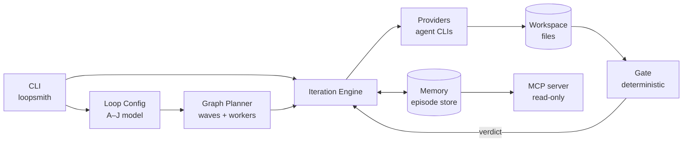

# loops — Wiki

# loopsmith

> Self-evolving agent loops. The gate is code, so "done" cannot be argued.

loopsmith runs a long-lived, unattended loop over a job you'd otherwise redo by hand every week — a competitor roundup, a lead list, a landing page, a nightly refactor. You describe the job once in a config file: what you want, how anyone would tell it's good, and when the loop is allowed to give up. loopsmith then puts an AI to work on it, checks the result against the files on disk, sends it back when it falls short, and stops when it passes.

One rule holds the whole design up:

> **A model must not be the thing that certifies its own completion.**

`GoalState { satisfied: true }` is constructed in exactly one place in the entire workspace — inside the deterministic Rust gate. No prompt, no provider response, and no MCP tool can produce that value. The gate can also **revoke**: delete a required artifact and a satisfied goal flips back to unsatisfied. That asymmetry is what makes it safe to leave a loop running for weeks.

---

## Getting started

The repository is a Rust workspace under `runtime/` that produces exactly one executable, `loopsmith`. Everything else is a library it links.

```bash
cd runtime
cargo build --release          # requires Rust 1.75+
cargo test --workspace         # ~415 tests
```

To install a release build instead of working from the tree, pick whichever package manager you already have — `cargo install loopsmith`, `npm install -g @bitphill/loopsmith`, `pip install loopsmith-cli`, or the Homebrew tap. All of them put the same binary on `PATH`; the packaging scripts and the one-line installers live in [Distribution & Installers](distribution-installers.md).

Your first loop:

```bash
loopsmith new --path ~/loops/nightly-refactor --purpose "keep the module simple"
cd ~/loops/nightly-refactor
$EDITOR loop.yaml
loopsmith validate loop.yaml && loopsmith plan loop.yaml && ./run.sh
```

`--path` must point **outside** this repository — a loop edits files and writes state, so it never gets aimed at the tool that runs it.

Expect `validate` to fail the first time. It refuses to pass until every `pre_execution` step is marked `done: true`, which is a deliberate demand that you do the task by hand once before automating it. The manual run *is* the spec.

Two front ends will build the config for you if you'd rather not start from a blank file: `loopsmith --web` opens a six-step browser editor on `127.0.0.1:3000`, and `loopsmith --guided` asks the same questions one at a time in the terminal, so it works over SSH. Both are compiled into the binary and both spawn the real CLI for every action, so neither can drift from it.

---

## The config is the whole interface

A loop is described by ten sections, **A** through **J**: context, the manual work list, goals, validations, success scenarios, stop gates, schedules, constraints, execution guidelines, and default skills. That model is defined once, in [Loop Configuration Schema](loop-configuration-schema.md) — as `config/loop.schema.json` for editors and external tooling, and as the Rust types plus cross-field rules in `loopsmith-core`. Nothing else in the workspace gets to invent config shape.

You can write that config as YAML or as Markdown. They are the same model, and [Markdown/YAML Config Interchange](markdown-yaml-config-interchange.md) converts either way (`loopsmith convert`). The Markdown form exists so the reason a goal exists can sit in prose directly beside the goal.

Thirteen complete, non-toy loops ship in [Example Loops](example-loops.md) — research, refactoring, marketing, lead generation, agent payments — each as both a `.yaml` and an equivalent `.md`. They double as the broadest integration fixture in the repo: a config change that breaks the runtime fails against all thirteen before it reaches a user.

---

## Architecture



Read it left to right and the design falls out. A config is parsed and validated, planned into waves, executed against providers that write real files, and then judged by a gate that only ever looks at those files. The engine never hears "I'm done" from a model; it hears a verdict from code.

[CLI Command Surface](cli-command-surface.md) is the only binary in the workspace and does no real work of its own — it parses arguments, dispatches, and presents. Its heaviest traffic is into the config model (`validate`, `plan`, `new`, `convert`) and into the store (`status`, `ledger`, `proposals`, `watch`).

[Execution Graph & Concurrency Planning](execution-graph-concurrency-planning.md) answers three questions from `depends_on` declarations alone, before anything is dispatched: is the graph acyclic and are all its dependencies real, which nodes may run simultaneously, and how many workers are actually worth starting. It is pure arithmetic over the config — no I/O, no clock — which is why `loopsmith plan` can show you the wave schedule and the Amdahl ceiling without spending a cent.

[Loop Execution Engine](loop-execution-engine.md) is the state machine that spends the money. It is split by *authority* rather than convenience: `mod.rs` holds the iteration state and delegates dispatch, prompt construction, evidence collection, stopping, and export to neighbouring modules.

[Provider Integration](provider-integration.md) turns "call a model" into "run a program." Claude Code, Ollama, a Grok CLI, an OpenAI-compatible endpoint driven by `curl`, an MCP server over stdio — all of them are the same struct: a command, argument templates, a few knobs. There is no per-vendor Rust code and no HTTP client anywhere in the crate, which is exactly why bring-your-own-key is free and why adding a provider is a config edit.

[Gating & Success Criteria](gating-success-criteria.md) is deliberately the least clever crate here: plain Rust, no provider calls, no prompt in the code path. Everything it concludes follows mechanically from a config plus a bag of evidence read off disk.

[Memory & Episode Store](memory-episode-store.md) is the persistence plane, and it holds only what must survive a crash, a schedule boundary, or a context reset. If a piece of state can be recomputed from the config or the graph, it lives elsewhere; if losing it would make a resumed run lie about what already happened, it lives here.

[MCP Server](mcp-server.md) is the read side of the control plane. It lets an editor or an agent inspect a loop's schedule, ledger, and gate verdict over stdio — everything about its own run except the one thing it must not control. There is a test that fails if a tool for setting `goal_satisfied` ever appears.

Around that spine sit four supporting concerns. [Evolution & Perturbation](evolution-perturbation.md) runs once per iteration to answer "the loop is not converging — what now?", splitting by who may act on the answer: `evolve.rs` writes proposals for a human, `perturb.rs` changes the next iteration itself. [Skills System](skills-system.md) resolves the sub-agents a loop asks for — installed, then marketplace, then generated — and pairs each use with the gate verdict that followed it, so adopt/drop advice comes from outcomes rather than reasoning. [Permissions & Sandboxing](permissions-sandboxing.md) derives the narrowest grant a config actually needs and writes it into the harness settings file. [Scheduling & Triggers](scheduling-triggers.md) answers "should this run right now?" via cron expressions, file-mtime scans, and edge detection, and generates the launchd / systemd / Task Scheduler artifacts that ask.

Underneath everything is [Platform Utilities](platform-utilities.md), the base of the dependency graph. Every crate depends on it and it depends on nothing — not even serde — because anything added there is added to every build in the workspace.

---

## The end-to-end flows

**Loading a config.** Every command that touches a loop funnels through the same path: `loopsmith-core::load` sniffs the format, and Markdown goes through tokenize → build document → section shape before landing in the identical `LoopConfig` a YAML file produces. Because `new`, `validate`, `run`, `resume`, `schedule`, and both the web and guided front ends all call it, a parser change is felt everywhere at once — which is intentional, and why the parser has the test coverage it does.

**One iteration.** The engine plans the node graph into waves, dispatches each wave to its providers, and lets those providers write files. It then collects evidence from disk, hands it to the gate, and receives a verdict per target — never a claim from a model. Skill usage and ledger entries land in the store. Evolution and perturbation get a look at the trend. Finally the stop ladder runs, mechanically, in order: overall success, iteration cap, wall clock, token budget, cost budget, and no-measurable-progress. Only the first of those six counts as success; when it fires, loopsmith writes a `<name>-success/` directory beside the config holding the converged configuration, the gate's evidence, and the artifacts.

**Resuming.** `resume.sh <run-id>` re-enters through the same start path as a fresh run, reloads the validated config, and picks up from the last checkpoint in the store. Nothing about a resumed run is a special case in the engine.

**Running on a schedule.** `loopsmith schedule` evaluates triggers and installs an OS-level scheduler artifact that invokes the loop unattended. This is where the "walk away for weeks" claim is actually cashed — and where the gate's ability to revoke matters most, because nobody is watching.

---

## Finding your way around

`runtime/crates/` holds the nine crates: `loopsmith` (the binary) plus `loopsmith-util`, `-core`, `-memory`, `-graph`, `-gate`, `-provider`, `-skills`, and `-mcp`. `config/` holds the schema and the example corpus. `installers/`, `npm/`, `pypi/`, and `Formula/` are the packaging channels. The six top-level Markdown files are described in [Project Documentation](project-documentation.md) — several are load-bearing rather than decorative, since `LOOP-TEMPLATE.md` is a file users copy and `config/examples/*` is compiled into the binary.

Unit tests live beside their crates. What they structurally cannot cover — whether the pieces work together, through the real binary, against the configs users are actually handed — lives in the integration suite documented in [Other](other.md):

```sh
cargo test -p loopsmith --test stress    # the iteration loop
cargo test -p loopsmith --test surface   # subcommands
cargo test -p loopsmith --test compat    # portability of generated loops
cargo test -p loopsmith --test opt_in    # network / money — skips by default
```

If you're touching the gate, read [Gating & Success Criteria](gating-success-criteria.md) first and understand why `satisfied: true` has exactly one construction site before you add a second one.