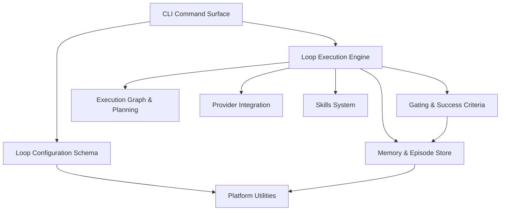

# loops — Wiki

# loopsmith

> Self-evolving agent loops. The gate is code, so "done" cannot be argued.

loopsmith runs an AI agent against a goal, over and over, until a **program** — not a model — says the goal is met. You write down what you want, what counts as proof, and how much budget you'll spend. loopsmith schedules the work, collects evidence, runs mechanical checks against that evidence, and stops when the checks pass or the budget runs out.

The whole project is arranged around one invariant:

**The thing that decides whether work is finished is never the thing that did the work.**

A model can write code, run tests, and claim success. It cannot mark its own goal satisfied. That ruling belongs exclusively to [Gating & Success Criteria](gating-success-criteria.md), a small, dependency-light Rust crate with no model in the loop. Everything else in the system — providers, skills, the scheduler, the MCP server — produces work and produces claims *about* work. Only the gate turns a claim into `GoalState { satisfied: true }`.

## Architecture at a glance



Read it top to bottom: the CLI parses and routes, the engine drives iterations, the graph decides what may run in parallel, providers do the work, the gate rules on it, and memory remembers all of it. `loopsmith-core` (the config model) and `loopsmith-util` sit underneath as the two things everything is allowed to depend on.

## The layers

**Configuration.** A loop is a document. [Loop Configuration Schema](loop-configuration-schema.md) defines the `LoopConfig` model — goals, validations, nodes, budgets, schedules — and the `validate()` pass that decides whether a description is coherent enough to run unattended. `config/loop.schema.json` mirrors the same shape for editors and CI, but the runtime never reads it; `serde` is the source of truth.

That config has two grammars. YAML is the machine-friendly one; Markdown is the one a human can read top to bottom, with the reasoning for a goal sitting directly above the goal. [Markdown/YAML Config Interchange](markdown-yaml-config-interchange.md) bridges them in both directions and backs `loopsmith convert`. If you want to see what a real loop looks like before writing one, [Example Loops](example-loops.md) ships thirteen worked configs — in both formats — that double as the runtime's test corpus.

**Execution.** [CLI Command Surface](cli-command-surface.md) is the `loopsmith` binary: it parses, routes, prints, and picks exit codes, and deliberately decides nothing else. Config semantics stay in core, scheduling math in graph, verdicts in the gate.

The state machine lives in [Loop Execution Engine](loop-execution-engine.md). Each iteration it asks [Execution Graph & Concurrency Planning](execution-graph-concurrency-planning.md) which nodes may run together (pure, deterministic, no I/O — cheap enough to re-plan every iteration), dispatches that wave through [Provider Integration](provider-integration.md), collects evidence, and hands it to the gate.

Providers are the deliberately thin part: no HTTP client, no SDK, no per-vendor module. A provider is a command template — `claude -p {prompt}`, `ollama run {model}`, a `curl` to an OpenAI-compatible endpoint. Pick one, run it, report honestly on what happened.

**Adaptation.** When a loop stalls but still has budget, [Evolution & Perturbation](evolution-perturbation.md) changes *method* — retry shape, prompt variation, notes to a future human — while being structurally incapable of changing *criteria*. Neither module can mutate `LoopConfig`, and neither can move a goal from unsatisfied to satisfied. When a node needs a capability it doesn't have, [Skills System](skills-system.md) acquires a sub-agent for it, records the trial, and lets the loop learn whether it was worth having. Network-touching work (`curl`, `npx`, `git`) is shelled out, so a machine with no network degrades to "installed skills only" rather than failing.

**Durability.** [Memory & Episode Store](memory-episode-store.md) is the sled-backed substrate for everything that must survive a crash, a scheduled pause, or a context reset: episodes, goal state, an append-only ledger, checkpoints, scratchpads, skill trials, proposals. It knows nothing about loops or gates — it just stores.

**Surfaces around the loop.** [Scheduling & Triggers](scheduling-triggers.md) turns a `schedules:` block into something that actually fires, via `loopsmith watch` (a long-lived poller with its own cron parser) or a handoff to launchd/systemd/Task Scheduler. [MCP Server](mcp-server.md) exposes the schedule, the ledger, and the gate's verdict over stdio to any MCP client — read-only by construction, with no `mark_done` tool anywhere in it. [Permissions & Sandboxing](permissions-sandboxing.md) derives the narrowest permission set a given config could need, shows it once up front, and writes it into the harness settings — so an unattended run neither stops to ask nor runs unsupervised.

**Foundations.** [Platform Utilities](platform-utilities.md) is the root of the dependency graph: every crate depends on it, it depends on nothing, not even `serde`. Command lookup, executable detection, home directories, `now_ms`. Admission requires having already been written more than once, in more than one state of correctness.

## End-to-end: what one run does

1. `loopsmith run` loads a config (YAML or Markdown, same model either way) and validates it.
2. Permissions are derived from that config and written once, before any work starts.
3. The graph planner turns `depends_on` declarations into waves and a worker count.
4. Each wave dispatches through a provider; nodes may pull in skills they need.
5. Evidence lands in the episode store as it's produced.
6. The gate reads the config's validations, runs mechanical detectors over the evidence, and returns a verdict.
7. Unsatisfied but budget remaining → evolution/perturbation adjusts method and iterates. Satisfied, or budget spent → the run ends, with the ledger explaining why.

A `watch`-driven loop wraps this: triggers fire, a run executes, checkpoints in memory let the next wake-up resume where the last one stopped.

## Getting started

Install:

```sh
cargo install loopsmith    # the package is named loopsmith, not loopsmith-cli
```

Installers for Linux/macOS/BSD (`install.sh`), Homebrew, and Windows are described in [Distribution & Installers](distribution-installers.md) — worth reading if an install fails, since that module is where most "loopsmith doesn't work" reports originate.

Then:

```sh
loopsmith new my-loop              # scaffold a config
loopsmith convert my-loop.md       # switch between Markdown and YAML
loopsmith run my-loop.yaml         # run it once
loopsmith watch my-loop.yaml       # keep it alive on its schedule
```

Copy a starting point from `config/examples/` rather than writing from scratch — `loopsmith new --config-file` does exactly that.

## Working on loopsmith

The workspace is under `runtime/crates/`, Rust 1.75+. Unit tests live with each crate; the cross-cutting coverage — real binary, real iteration loop, the shipped example configs — is in the CLI integration tests:

```sh
cargo test                                # everything
cargo test -p loopsmith --test stress     # full-loop integration
cargo test -p loopsmith --test surface    # CLI surface
cargo test -p loopsmith --test compat     # config compatibility
```

One more module worth knowing about: [Project Documentation](project-documentation.md). The root Markdown files aren't decoration — `CLAUDE.md` and the `skills/loopsmith*/SKILL.md` files are read by an agent at runtime, and the README encodes claims the runtime is expected to keep. Changing them can change behavior.