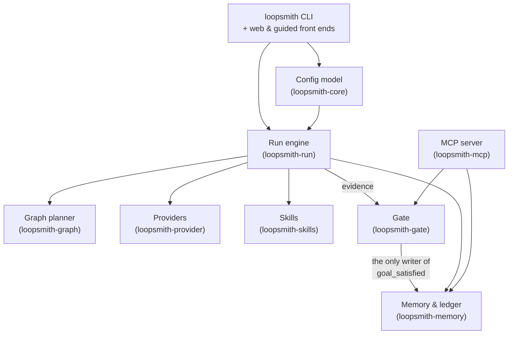

# loops — Wiki

# loopsmith

**Self-evolving agent loops. The gate is code, so "done" cannot be argued.**

loopsmith runs a job you would otherwise redo by hand every week — a competitor roundup, a lead list, a landing page, a refactor, a research brief. You write down what you want and how anyone would tell it's good, in one plain text file. loopsmith puts an AI to work on it, checks the result against your criteria, sends it back when it falls short, and stops when it passes. It can run on a schedule for weeks without you.

One rule holds the entire design up:

> A model must not be the thing that certifies its own completion.

`GoalState { satisfied: true }` is constructed in exactly one place in the workspace — a deterministic Rust function in [Gating & Success Criteria](gating-success-criteria.md). Every verdict comes from an exit code, a file's existence, a regex match, a numeric comparison, or an explicitly independent judgment. The gate can also **revoke**: delete a required artifact and a satisfied goal flips back to unsatisfied. A system that can only promote is a burndown chart with extra steps.

Everything else in the codebase — providers, scheduling, memory, evolution, the MCP server — exists to feed that gate evidence and to keep it the only authority.

## The shape of the system


```mermaid
graph TD
    CLI["loopsmith CLI<br/>+ web & guided front ends"] --> CFG["Config model<br/>(loopsmith-core)"]
    CLI --> RUN["Run engine<br/>(loopsmith-run)"]
    CFG --> RUN
    RUN --> GRAPH["Graph planner<br/>(loopsmith-graph)"]
    RUN --> PROV["Providers<br/>(loopsmith-provider)"]
    RUN --> SKILL["Skills<br/>(loopsmith-skills)"]
    RUN -->|evidence| GATE["Gate<br/>(loopsmith-gate)"]
    GATE -->|"the only writer of<br/>goal_satisfied"| MEM["Memory & ledger<br/>(loopsmith-memory)"]
    RUN --> MEM
    MCP["MCP server<br/>(loopsmith-mcp)"] --> MEM
    MCP --> GATE
```

Read it as one sentence: the **CLI** loads a **config**, the **run engine** plans and dispatches work through **providers** and **skills**, and hands what it observed to the **gate**, which alone decides whether a goal is satisfied and records that in **memory**.

## Where things live

The workspace is a Rust monorepo under `runtime/crates/`, ten library crates plus the binary, arranged as a strict dependency stack — nothing lower ever calls something higher.

The entry point is [CLI Command Surface](cli-command-surface.md) (`loopsmith-cli`, published as **`loopsmith`**). It owns the argument grammar, one module per command, and loop scaffolding — `loopsmith loop new` materialises a whole loop directory with run/resume scripts for every platform. It runs nothing itself; each command loads a config and calls a library crate. Two front ends sit beside it for people who would rather not learn a schema first: `loopsmith --web` paints the config in a browser, and `loopsmith --guided` asks one question at a time in a bare terminal.

Every crate reads the same config model, defined in [Loop Configuration Schema](loop-configuration-schema.md) and published as a generated JSON Schema at `config/loop.schema.json`. A config answers four questions — `intent` (what is this for, and how would we know it worked), `execution` (how the work gets done), `safety` (what must never happen, when to stop), and `evolution` (what the loop may propose about itself). You can write it as YAML or as a Markdown document; [Markdown/YAML Config Interchange](markdown-yaml-config-interchange.md) translates between the two, and `loopsmith loop convert` exposes that in either direction. The translation layer knows nothing about the config model — it moves between Markdown and a generic YAML value and lets serde do the typing, which is why adding a config field requires no change there.

[Loop Execution Engine](loop-execution-engine.md) (`loopsmith-run`) owns everything between "start this loop" and "here is why it stopped": the run lifecycle, the iteration loop, node dispatch with isolation and recovery, the stop-gate ladder, iteration compression, and the success export. Before each iteration it asks [Execution Graph & Concurrency Planning](execution-graph-concurrency-planning.md) to turn `depends_on` declarations into waves, a critical path, and a worker count derived from arithmetic rather than a guess — pure, deterministic, and cheap enough to rerun constantly. Work itself goes out through [Provider Integration](provider-integration.md), where every provider (Claude Code, Ollama, a Grok CLI, an OpenAI-compatible endpoint driven by `curl`, an MCP server over stdio) is a command template: a binary, an argument list with placeholders, and some metadata. Adding a provider is a config edit, never a Rust change and never a rebuild. When a node needs a capability it doesn't have, [Skills System](skills-system.md) finds, installs, and later ranks sub-agent skills by how the gate ruled on the work they did.

Nothing the loop learns is allowed to evaporate. [Memory & Episode Store](memory-episode-store.md) is the persistence plane for the whole workspace: per-node records, gate verdicts, an append-only audit trail, resume points, proposals, and cross-run learning. It validates before it writes, because one bad record compounds across weeks of unattended running.

Two sibling modules let a loop improve *how* it works without ever touching *what counts as done*. [Evolution & Perturbation](evolution-perturbation.md) records what a run learned about its own tooling and shape, and — when progress stalls — varies dispatch order, tier, sub-agent, and prompt for a single iteration. Evolution writes proposals; it never mutates the config. The loop never edits itself, and `loopsmith run proposals` shows you what it would like changed.

[MCP Server](mcp-server.md) exposes the control plane — schedule, ledger, memory, gate verdicts — to any MCP client over stdio, and is defined as much by what it omits as what it offers: there is no `set_goal_satisfied`, no `mark_done`, no `satisfy`. A reasoning agent can read everything and write almost everything except completion.

Around the runtime: [Scheduling & Triggers](scheduling-triggers.md) is what makes `execution.triggers` more than decoration — cron, intervals, file watching, and handing a loop to whichever scheduler the machine actually has. [Permissions & Sandboxing](permissions-sandboxing.md) keeps two mechanisms deliberately apart — the permission grant that stops a harness interrupting a hands-off run, and the constraint and isolation machinery that stops a run doing something you can't undo. Only the second is a safety boundary, and the code says so in several places. [Platform Utilities](platform-utilities.md) is the bottom crate that everything depends on, and therefore has no dependencies at all — `which`, `now_ms`, and a handful of primitives that earned their place by having been written correctly more than once.

Finally, [Example Loops](example-loops.md) holds fifteen worked configurations in `config/examples/`. They wear three hats at once: the primary teaching material, the fixture set for the integration tests in `runtime/crates/loopsmith-cli/tests/` (see [the integration suite](other.md)), and the example library compiled into the web UI — so editing one touches all three. [Distribution & Installers](distribution-installers.md) covers the five acquisition paths and the one script that keeps their version numbers in sync, and [Project Documentation](project-documentation.md) explains which of the four root documents answers which reader's question.

## End-to-end: one iteration

1. A trigger fires, or you run `./run.sh`. [Scheduling & Triggers](scheduling-triggers.md) decides whether a run may start.
2. The config is parsed and typed by [Loop Configuration Schema](loop-configuration-schema.md) — via Markdown or YAML, and through a legacy migration pass that repairs 0.3-era shapes on the way in.
3. [Execution Graph & Concurrency Planning](execution-graph-concurrency-planning.md) produces waves and a worker count for this iteration.
4. [Loop Execution Engine](loop-execution-engine.md) dispatches each node through [Provider Integration](provider-integration.md), acquiring sub-agents through [Skills System](skills-system.md) where a node asks for one, and records every step in [Memory & Episode Store](memory-episode-store.md).
5. [Gating & Success Criteria](gating-success-criteria.md) reads the actual files and exit codes and rules on each goal — promoting *or* revoking — and writes `goal_satisfied`.
6. The engine consults the stop-gate ladder: satisfied, out of iterations, out of budget, stalled, or forbidden. If stalled, [Evolution & Perturbation](evolution-perturbation.md) varies something and the loop tries again. If satisfied, the engine writes `<name>-success/` beside the config — the converged configuration, the gate's evidence, and the artifacts.

Throughout, `loopsmith run status`, `run ledger`, and `run gate` answer questions against the live ledger, and `logs/run-<id>.log` stays plain text so `tail -f` works.

## Getting started

Requires Rust 1.85+; runs on Linux, macOS, and Windows.

```bash
cargo install loopsmith        # or: npm install -g @bitphill/loopsmith
                              #     pip install loopsmith-cli
                              #     brew install bitphill/loopsmith/loopsmith

# --path must be outside this repository: a loop edits files and writes state,
# so it does not get pointed at the tool that runs it.
loopsmith loop new --path ~/loops/nightly-refactor --purpose "keep the module simple"

cd ~/loops/nightly-refactor
$EDITOR loop.yaml             # your goals, and how each one is checked
loopsmith loop validate loop.yaml && loopsmith loop plan loop.yaml && ./run.sh
```

Prefer to start from something that already works? `loopsmith loop new --path … --config-file config/examples/research-loop.yaml`. Prefer not to edit YAML at all? `loopsmith --web` or `loopsmith --guided`.

**`validate` fails on purpose** until every `pre_execution` step is marked `done: true`. That refusal is deliberate and it is the most valuable thing the tool does: do the task by hand once first, because the manual run *is* the spec. Automating before understanding produces fast, confident garbage.

### Working on loopsmith itself

```bash
cd runtime
cargo build --release
cargo test                          # the whole workspace
cargo test -p loopsmith --test stress    # the real binary against the shipped examples
cargo test -p loopsmith --test surface   # subcommands
cargo test -p loopsmith --test compat    # portability of generated scripts
```

`loopsmith doctor` reports what the current machine is and what that stops you doing — which bash, GNU or BSD userland, which scheduler, which detector scripts it cannot run. CI runs the full suite on Linux, macOS, and Windows, so the three-platform claim is checked rather than asserted.

## Two habits worth acquiring early

**Follow the dependency stack when reading.** Start at [Loop Configuration Schema](loop-configuration-schema.md) — it is the vocabulary every other crate speaks, and the most-called module in the workspace. Then [Loop Execution Engine](loop-execution-engine.md) for the lifecycle, then [Gating & Success Criteria](gating-success-criteria.md) for why the engine is shaped the way it is.

**Respect the seam.** The engine collects evidence; the gate decides. If a change would let the run engine, a provider, an MCP client, or a model mark a goal satisfied, that change is wrong no matter how convenient it looks. Most of the structure in this codebase exists to keep that sentence true.