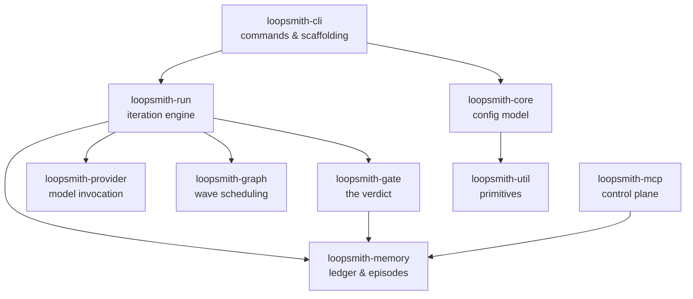

# loops — Wiki

# loopsmith

**Self-evolving agent loops. The gate is code, so "done" cannot be argued.**

loopsmith runs an AI agent in a loop against a goal, and stops when a program — not a model — says the goal is met. You write a config describing what you want, how work gets done, and what must be true for it to count as finished. loopsmith iterates: dispatch nodes, collect evidence, evaluate the gate, and either stop or try again with what it learned.

The load-bearing idea is a separation the whole codebase is organized around: **the thing doing the work never decides whether the work is done.** A model can write code, fix tests, and argue persuasively that it succeeded. It cannot set `goal_satisfied`. That flag is written in exactly one place in the workspace, by a crate whose entire job is to compare exit codes, file existence, regex matches and numbers against thresholds.

---

## Architecture at a glance


```mermaid
graph TD
    CLI[loopsmith-cli<br/>commands & scaffolding]
    CORE[loopsmith-core<br/>config model]
    RUN[loopsmith-run<br/>iteration engine]
    GATE[loopsmith-gate<br/>the verdict]
    PROV[loopsmith-provider<br/>model invocation]
    MEM[loopsmith-memory<br/>ledger & episodes]
    GRAPH[loopsmith-graph<br/>wave scheduling]
    MCP[loopsmith-mcp<br/>control plane]
    UTIL[loopsmith-util<br/>primitives]

    CLI --> CORE
    CLI --> RUN
    RUN --> GRAPH
    RUN --> PROV
    RUN --> GATE
    RUN --> MEM
    GATE --> MEM
    MCP --> MEM
    CORE --> UTIL
```

Read it top to bottom: the CLI parses a config, the engine plans and dispatches it, the gate rules on it, and memory remembers all of it. `loopsmith-util` sits underneath everything with zero dependencies of its own.

---

## The pieces

A run starts as text. The [loop configuration schema](loop-configuration-schema.md) is the shared vocabulary every other crate reads — four bundles answering four questions: `intent` (what is this for?), `execution` (how does work happen?), `safety` (what must not happen?), `evolution` (what may change?). You can write it as YAML or as a Markdown document; the [Markdown/YAML interchange](markdown-yaml-config-interchange.md) treats them as one model in two grammars, translating in both directions without knowing anything about the config types.

The [CLI command surface](cli-command-surface.md) is what you type. It owns the argument grammar, one module per command, and the scaffolding that materializes a new loop directory — but it runs nothing itself. Every command loads a config and calls into a library crate.

The [loop execution engine](loop-execution-engine.md) owns everything between "start" and "here is why it stopped": the iteration loop, node dispatch, isolation and recovery, the stop-gate ladder, and the success export. Before each iteration, [execution graph planning](execution-graph-concurrency-planning.md) turns `depends_on` declarations into wave groupings, a critical path, and a worker count derived by arithmetic rather than guesswork. Dispatch itself goes through [provider integration](provider-integration.md), which treats every model — Claude Code, Ollama, a Grok CLI, an HTTP endpoint driven by `curl`, an MCP server over stdio — as a command template. Adding a provider is a config edit, never a rebuild.

Then [gating and success criteria](gating-success-criteria.md) rules. No model is in that loop.

When a loop stalls, [evolution and perturbation](evolution-perturbation.md) lets it change *how* it works without touching *what counts as done* — varying dispatch order, tier, sub-agent, and prompt for an iteration, and recording proposals for the operator. [Skills](skills-system.md) handle sub-agent acquisition: find what a node needs, install it somewhere inert, and rank future choices by what the gate ruled afterward.

Everything a loop must not forget lives in the [memory and episode store](memory-episode-store.md) — node results, gate verdicts, an append-only audit trail, resume points, and cross-run learning. The [MCP server](mcp-server.md) exposes that control plane over stdio to any MCP client, deliberately omitting the one thing that would break the guarantee: there is no `mark_done` tool.

Around the edges: [scheduling and triggers](scheduling-triggers.md) decides what starts a run and what stops it starting itself forever; [permissions and sandboxing](permissions-sandboxing.md) keeps two distinct things apart — the grant that stops consent prompts interrupting a hands-off run, and the isolation machinery that is the actual safety property; [platform utilities](platform-utilities.md) is the dependency-free bottom of the stack. [Distribution and installers](distribution-installers.md) gets the binary onto a machine and is coupled to the runtime only through a version string.

---

## How a run actually goes

**Parsing.** Whatever you wrote — YAML, Markdown, or a request arriving through the web API — converges on the same path: text becomes a `serde_yaml::Value`, gets typed into a `LoopConfig`, and passes through migration that repairs older 0.3-era shapes in place. Config authored two versions ago still loads.

**Planning.** Nodes declare dependencies; the graph crate groups them into waves and computes how many workers that parallelism is actually worth.

**Iterating.** Each wave dispatches through the provider plane. Results, costs, and failures land in memory as they happen. If a node dies mid-iteration, the resume point in the ledger is enough to pick the run back up where it stopped.

**Ruling.** The gate reads the evidence and constructs a verdict. Satisfied → export and stop. Not satisfied → check the stop ladder (budget, iteration cap, stall detection), then either stop with a reason or run again, possibly perturbed.

---

## Getting started

```sh
# Install (macOS / Linux)
curl -fsSL https://raw.githubusercontent.com/bitphill/loopsmith/main/install.sh | sh

# Or build from a clone — Rust 1.85+
cargo build --release
```

Then scaffold and run a loop:

```sh
loopsmith new my-loop      # materialize a loop directory
loopsmith run my-loop      # start iterating
loopsmith convert loop.md  # Markdown ↔ YAML
```

The fastest way to learn the config model is to read the [example loops](example-loops.md) in `config/examples/` — fifteen worked configurations, each built around one lesson, which double as the integration-test fixtures and the web UI's example library.

For tests, `cargo test` covers the unit suites; the integration harness runs through the real binary:

```sh
cargo test -p loopsmith --test stress    # the iteration loop
cargo test -p loopsmith --test surface   # subcommands
cargo test -p loopsmith --test compat    # portability of generated loops
```

---

## Where to look when you change something

The [project documentation](project-documentation.md) page explains which of the four root-level documents owns what, so a behavior change lands in one place rather than drifting across four. If you are touching the config model, expect the JSON Schema at `config/loop.schema.json` and the examples to move with it. If you are touching the gate, read `TargetVerdict::to_goal_state` first — it is the single construction site for a satisfied goal, and it stays that way on purpose.