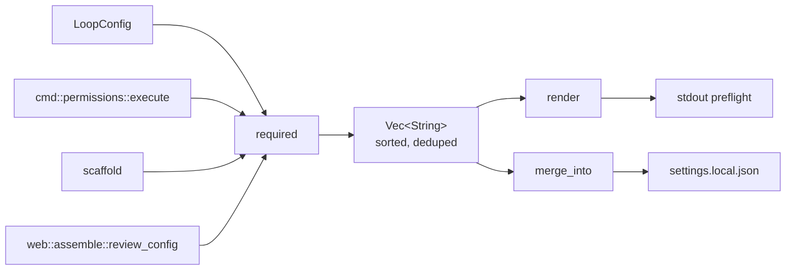

# Permissions & Sandboxing

# Permissions & Sandboxing

Derives the narrowest permission grant a loop config actually needs, renders it for human review, and writes it into the settings file the harness reads. A second, separate concern lives alongside it: detector scripts run with no shell, so the module also ships the portability shim those scripts source.

**Files**

| Path | Role |
|---|---|
| `runtime/crates/loopsmith-cli/src/permissions.rs` | Derivation, rendering, and settings-file merge |
| `runtime/crates/loopsmith-cli/src/cmd/permissions.rs` | `loopsmith permissions` subcommand |
| `runtime/crates/loopsmith-cli/templates/permissions.template.json` | Documented reference shape (not a generated artifact) |
| `runtime/crates/loopsmith-cli/templates/compat.template.sh` | Sourced by generated detector scripts |

## Why derivation instead of a fixed allowlist

A hands-off run cannot pause to ask for consent, but a run that grants itself blanket access is not hands-off — it is unsupervised. The resolution is to compute the rules from the config, show them once, and grant once. A loop with no script detectors never asks to run `cargo`; a loop whose `skills.acquisition_order` never reaches the marketplace never asks for network access.

The important thing to understand before changing anything here: **this grant is not the safety mechanism.** The `$deny_note` in the template says so explicitly, and `render` repeats it to the user — the constraint block in the loop config is what stops on irreversible actions, and it stops regardless of what the settings file allows. Permissions exist to remove *prompts*, not to bound behaviour. Don't add denial logic here expecting it to enforce policy.

## The three functions



### `required(&LoopConfig) -> Vec<String>`

Collects into a `BTreeSet<String>`, so the returned vector is sorted and duplicate-free by construction — `the_grant_has_no_duplicates_and_is_sorted` pins that property rather than the function sorting explicitly. Four sources contribute:

- **Providers** — every entry in `cfg.providers.providers` is a command, so each yields `Bash({p.command}:*)`.
- **Script detectors** — each `Detector::Script { command, .. }` in `cfg.validations` yields `Bash({command}:*)`, so the gate can run its checks without a mid-run prompt.
- **Skill acquisition** — only when `cfg.skills.acquisition_order` contains `AcquisitionSource::Marketplace`, and then both `Bash(npx skills:*)` and `WebFetch(domain:claudemarketplaces.com)`.
- **Core tools** — `Read`, `Write`, `Edit`, `Glob`, `Grep`, unconditionally, because the loop reads and writes inside its own directory.

Note that the provider and detector rules collapse when they share a binary: a config whose provider command and detector command are both `cargo` produces one rule, not two.

### `render(&[String]) -> String`

The preflight block shown before the single grant. It lists the rules, then states two things the reader needs: nothing outside the list is requested, and human checkpoints still stop and wait regardless of the grant. `render_mentions_that_checkpoints_still_stop` guards the second sentence — it is a load-bearing claim about the system, not decoration, so keep it if you rewrite the copy.

### `merge_into(&Path, &[String]) -> io::Result<String>`

Additive, idempotent, and deliberately forgiving of whatever is already in the file:

1. Read and parse the existing file if it exists; **unparseable JSON falls back to `json!({})`** rather than erroring. A non-object root (array, string, number) is likewise replaced.
2. Walk to `permissions.allow`, creating `permissions` as `{}` and `allow` as `[]` if absent.
3. Build a `BTreeSet` of the existing string entries and push only rules not already present.
4. Pretty-print, `create_dir_all` the parent, write with a trailing newline, and return the serialized JSON so the caller can display it.

Two behaviours worth knowing before you touch this:

- **Unrelated keys survive.** `merging_preserves_existing_rules_and_adds_new_ones` asserts both that a pre-existing `Skill(claude-api)` rule is retained and that a sibling `"theme": "light"` is untouched. Any rewrite of this function must keep that true — it edits a file the user also owns.
- **A malformed `permissions` value is silently skipped.** If `permissions` exists but is not an object, `as_object_mut()` yields `None`, `allow` becomes `None`, and no rules are added — yet the file is still rewritten and `Ok` is returned. The caller reports success with a count that was never applied. If you need that surfaced, this is the place to change it.

Corrupt-file recovery is destructive by design (step 1 discards unparseable content), which is fine for `settings.local.json` but is the reason this function should not be pointed at a file whose content it did not expect.

## The `permissions` subcommand

`cmd::permissions::execute(config, write)` loads the config via `loopsmith_core::load`, computes the grant, and branches on the destination:

```
loopsmith permissions ./loop.yaml
    → render(&grant) to stdout, for a human to read before granting

loopsmith permissions ./loop.yaml --write .claude/settings.local.json
    → merge_into, then print "wrote N permission rule(s) to <path>" and the merged JSON
```

`N` is `grant.len()`, i.e. the number of rules *required*, not the number newly added — a second identical run reports the same count while changing nothing.

## Other callers of `required`

Two paths consume the derivation without going through the subcommand, and both must keep working when it changes:

- `scaffold::scaffold` (`loopsmith-cli/src/scaffold.rs`) — bakes the grant into a freshly generated loop directory.
- `web::assemble::review_config` (`src/web/assemble.rs`) — surfaces it in the browser review step, so the guided flow shows the same list the CLI would.

Because all three share one function, a new rule source added to `required` propagates everywhere at once. That is the intended design; adding a rule in a caller instead is the thing to avoid.

## `permissions.template.json` is documentation, not output

The template's own `$comment` is blunt about this: *"This file is the shape, not the answer."* It exists so a reader can see the full space of rules, with `$sections` explaining each category and `$still_stops` listing what remains gated no matter what (`constraints.human_checkpoint` entries, publishing/sending/deleting/paying, promoting a quarantined sub-agent out of `generated-skills/`, applying anything in `proposals/`).

One concrete divergence to be aware of: the template lists `Bash(loopsmith:*)` under `control_plane`, but `required` does not emit it. Nothing keeps the two in sync automatically — if you add a rule source, update the template's prose too, and if you believe the control-plane rule should be granted, that's a change to `required`, not to the template.

## `compat.template.sh` — the detector execution environment

Loopsmith runs a detector **with no shell**: `command` is `argv[0]` and `args` are literal. A detector is therefore a real file with a real shebang, not a shell string, and this file is what it sources:

```sh
. ./scripts/compat.sh
```

Everything in it detects at run time rather than being baked in when the loop was generated — a loop directory gets copied to a build box, a container, or a colleague's laptop, and a pre-computed answer would be wrong on arrival with no sign that anything had changed.

**Exported environment**

- `LOOPSMITH_OS` — `uname -s`, or `unknown`.
- `LOOPSMITH_USERLAND` — `gnu` if `sed --version` succeeds, else `bsd`.
- `LOOPSMITH_BASH_MAJOR` — major version of the `bash` on `PATH`, or `0` when there is none.

**Helpers**

| Function | Papers over |
|---|---|
| `sed_i <expr> <file>…` | GNU `sed -i` takes no argument, BSD requires one. Getting it wrong on BSD consumes the next argument as a backup suffix — which is how a script ends up editing a file named `-e`. |
| `stat_size` / `stat_mtime` | `-c%s`/`-c%Y` on GNU, `-f%z`/`-f%m` on BSD. |
| `readlink_f <path>` | `readlink -f` is absent from BSD readlink before macOS 12; falls back to a `cd`/`pwd -P` walk. |
| `sha256 <file>` | `sha256sum` or `shasum -a 256`, whichever exists; exits 127 with a message if neither. |
| `need_bash <major>` | macOS ships bash 3.2.57 (4.0 changed licence). Associative arrays, `${x,,}`, `mapfile`, `&>>`, and `**` all arrived in 4.0. |
| `require <command>…` | A tool the detector needs is not on `PATH`. |
| `compat_report` | One line of environment for a log or bug report. |

### The exit-2 convention

`need_bash` and `require` exit **2**, not 1, and this is the single most important contract in the file. A detector's exit code *is* its verdict: `1` means the check failed, `2` means this machine cannot run the check. A gate that cannot distinguish them reports missing tooling as unfinished work. Preserve the distinction in any new helper that can abort.

### Writing detectors against this

Target POSIX `sh` unless `need_bash 4` says otherwise — that is what the rest of a generated loop uses. On Windows the file runs under Git Bash, WSL, or MSYS and behaves as it does on Linux; nothing here runs under `cmd.exe` or PowerShell. A detector meant for those is a `.cmd` or `.ps1` naming its own interpreter, precisely because there is no shell to interpret it.

## Tests

The unit tests in `permissions.rs` build configs from YAML through `loopsmith_core::parse_str` via the local `cfg(extra: &str)` helper, which is how the marketplace test mutates `skills.acquisition_order` to `[Installed]` and asserts the network and `npx skills` rules disappear. Filesystem tests use `loopsmith_util::testing::temp_dir` and clean up with a best-effort `remove_dir_all`. When adding a rule source, add both halves of the marketplace pattern: the rule appears when the config needs it, and is absent when it does not.