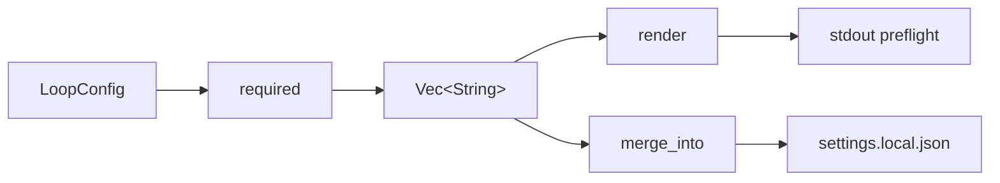

# Permissions & Sandboxing

# Permissions & Sandboxing

A hands-off loop has an awkward property: it cannot stop halfway through to ask
whether it may run `cargo test`. The two obvious ways out are both wrong.
Prompting mid-run defeats the point of running unattended; granting blanket
access means nothing is supervised at all.

This module takes the third path. It reads the loop config, derives the
*narrowest* set of permission rules that config could possibly need, shows them
once, and writes them into the settings file the harness reads. A loop that only
reads files never asks for write access. A loop that never touches the
marketplace never asks for the network.

The module has two source files and one template:

| File | Role |
|------|------|
| `runtime/crates/loopsmith-cli/src/permissions.rs` | Derivation, rendering, merging |
| `runtime/crates/loopsmith-cli/src/cmd/permissions.rs` | The `loopsmith permissions` subcommand |
| `runtime/crates/loopsmith-cli/templates/permissions.template.json` | Annotated reference shape |

A fourth file, `templates/compat.template.sh`, is documented at the end. It is
sandboxing of a different kind — portability of the detector scripts that run
under the grant, rather than the grant itself.

---

## The three functions

All of `permissions.rs` is three public functions with no shared state between
them. They compose in one direction: `required` produces a grant, and both
`render` and `merge_into` consume one.



### `required(cfg: &LoopConfig) -> Vec<String>`

Walks the config and collects permission strings into a `BTreeSet<String>`,
which gets both deduplication and a stable sort for free. Four sources:

- **Providers.** Every entry in `cfg.providers.providers` is invoked as a
  command, so each contributes `Bash({p.command}:*)`.
- **Script detectors.** Each validation whose `detector` matches
  `Detector::Script { command, .. }` contributes `Bash({command}:*)`. These run
  during gating, so without the rule the gate would block on a prompt in the
  middle of a run.
- **Skill acquisition.** Only if `cfg.skills.acquisition_order` contains
  `AcquisitionSource::Marketplace` do `Bash(npx skills:*)` and
  `WebFetch(domain:claudemarketplaces.com)` get added. This is the conditional
  worth understanding: network access is not a baseline capability here, it is
  something the acquisition policy has to actually ask for.
- **Core tools.** `Read`, `Write`, `Edit`, `Glob`, `Grep` are unconditional —
  the loop reads and writes inside its own directory as a matter of course.

The `BTreeSet` is the reason the ordering guarantee holds without an explicit
sort call anywhere; `the_grant_has_no_duplicates_and_is_sorted` pins that
behaviour so a future refactor to `Vec` + `push` cannot silently regress it.

### `render(grant: &[String]) -> String`

Builds the human-readable preflight block: a one-line preamble, the rules
indented two spaces, and a closing paragraph. That closing paragraph is not
decoration. It states that nothing outside the list is requested, and that
anything the constraints mark as a human checkpoint still stops and waits —
grant or no grant. `render_mentions_that_checkpoints_still_stop` asserts on the
string `"human checkpoint"` specifically, because the sentence is a promise
about how the runtime behaves and removing it would misrepresent the grant.

### `merge_into(path: &Path, grant: &[String]) -> io::Result<String>`

Writes the grant into a settings JSON file without clobbering it. The rules it
follows, in order:

1. If the file exists, parse it; on a parse failure, fall back to `json!({})`
   rather than erroring. A corrupt settings file becomes a fresh one instead of
   a dead command.
2. If the root parses to a non-object (an array, a bare string), replace it with
   `json!({})`.
3. Navigate to `permissions.allow`, creating either level with `or_insert_with`
   if absent.
4. Collect existing entries into a `BTreeSet<String>` and append only rules not
   already present.
5. Pretty-print, `create_dir_all` on the parent, write with a trailing newline,
   and return the serialized string so the caller can display it.

Two properties fall out of step 4 and are covered by tests.
`merging_preserves_existing_rules_and_adds_new_ones` checks that an unrelated
`Skill(claude-api)` rule survives and that a sibling key (`theme`) is untouched.
`merging_is_idempotent` runs the same merge twice and asserts the `allow` array
still has length 1 — running `--write` repeatedly is safe, which matters because
it is the natural thing to do after editing a config.

One sharp edge for contributors: the `allow` binding is an
`Option<&mut Vec<Value>>`, and it is `None` when `permissions` or `allow` exist
but hold the wrong JSON type — say `"permissions": "none"`. In that case the
`if let Some(list)` body is skipped, the file is rewritten with its existing
shape intact, and *no rules are added*, silently. If you are changing this
function, that branch is the one to think about.

---

## The CLI surface

`cmd/permissions.rs` is deliberately thin:

```rust
pub fn execute(config: &Path, write: Option<&Path>) -> Result<ExitCode, String>
```

It loads the config through `loopsmith_core::load`, calls `required`, and then
branches on `write`:

- **No `--write`** — prints `render(&grant)`. Read-only; this is the preflight
  you show a human before the single grant.
- **`--write <path>`** — calls `merge_into`, prints a count line
  (`wrote N permission rule(s) to <path>`) followed by the merged JSON.

Every error is flattened to `String` via `map_err(|e| e.to_string())`, so the
command surfaces both config-parse failures and IO failures the same way.

Note that `execute` takes the config *path*, not a parsed config, which is why
`load` sits on the call path. That pulls the whole Markdown-config pipeline in
behind it — `parse_md` → `tokenize` → `build_document` → `build_block`, with
`section_shape` and `heading_to_key` doing the structural work. The permissions
command is therefore an end-to-end exercise of the config parser, which makes it
a useful smoke test when working on `src/md/`.

### The other caller

`scaffold` (in `src/scaffold.rs`) calls both `required` and `render`. This is
the path that matters for new loops: scaffolding a loop directory emits the
preflight text alongside everything else, so the grant is visible at creation
time rather than being discovered on the first run. When changing the signature
or output shape of either function, `scaffold` is the caller to check — the CLI
subcommand is the obvious one, scaffold is the easy one to miss.

---

## `permissions.template.json`

The template is a *shape*, not an answer, and it says so in its own `$comment`.
It exists so a human can read what a generated grant looks like without running
anything. Its `$sections` block annotates each group — core tools, control
plane, providers, detectors, acquisition — and mirrors the derivation rules in
`required`.

The `$deny_note` is the load-bearing part:

> Nothing is denied here by default. Denial is not the mechanism that protects
> you — the constraint block in the loop config is, because it stops on
> irreversible actions regardless of what this file allows.

This is the module's actual security model, and it is worth stating plainly
because it is easy to get backwards. The allow-list is a *prompt-suppression*
mechanism: it exists so the run does not stall. It is not the thing that stops
the loop from doing something irreversible. That job belongs to
`constraints.human_checkpoint` in the loop config, which halts regardless of
what the settings file permits. The template's `$still_stops` list enumerates
the categories: anything in `constraints.human_checkpoint`, publishing/sending/
deleting/paying, promoting a quarantined sub-agent out of `generated-skills/`,
and applying anything written to `proposals/`.

If you are adding a capability to this module, the question to ask is not "is
this safe to allow?" but "does the constraint layer already stop the dangerous
version of this?" Widening the grant to avoid a mid-run prompt is in scope.
Widening it to let the loop do something a checkpoint would have caught is not.

The template also lists `Bash(loopsmith:*)` under `control_plane` — plan, gate,
ledger, resume. Note that `required` does *not* currently emit this rule; the
template documents it as part of a realistic hand-written grant.

---

## `compat.template.sh` — the detector execution contract

This template is sourced by a loop's detector scripts:

```sh
. ./scripts/compat.sh
```

It is in this module's orbit because of one fact about how detectors run:
**loopsmith runs a detector with no shell.** `command` is `argv[0]` and `args`
are literal — no globbing, no pipes, no `&&`. A detector is therefore a real
file with a real shebang, not a shell fragment. That constraint is what makes
the `Bash({command}:*)` rules in `required` meaningful: the rule names an actual
binary, and there is no shell layer in between where something else could be
smuggled in.

The same fact determines the Windows story. Git Bash, WSL, and MSYS all behave
like Linux here. Nothing runs under `cmd.exe` or PowerShell — a detector meant
for those is a `.cmd` or `.ps1` naming its own interpreter.

### Runtime detection, not generation-time baking

Everything in the file detects at run time. The comment explains why: a loop
directory gets copied to a build box, a container, or a colleague's laptop, and
a value baked in by the generating machine would be wrong on arrival with no
sign that anything had changed.

Three exported variables are computed on source:

| Variable | Derivation |
|----------|-----------|
| `LOOPSMITH_OS` | `uname -s`, or `unknown` |
| `LOOPSMITH_USERLAND` | `gnu` if `sed --version` succeeds, else `bsd` |
| `LOOPSMITH_BASH_MAJOR` | Major version of `bash` on PATH, `0` if absent |

The GNU/BSD probe is `sed --version` rather than an OS check because the
userland is what actually differs — a GNU coreutils install on macOS should be
treated as GNU.

### Helpers

`sed_i`, `stat_size`, and `stat_mtime` branch on `LOOPSMITH_USERLAND`. These
cover the three divergences that actually break scripts:

- `sed -i` takes no argument on GNU and requires one on BSD. Getting it wrong on
  BSD consumes the next argument as a backup suffix, which is how a script ends
  up editing a file named `-e`.
- `stat` is `-c%s` on GNU, `-f%z` on BSD.
- `readlink -f` is absent from BSD readlink before macOS 12.

`readlink_f` probes with `readlink -f . >/dev/null 2>&1` and falls back to a
`cd`/`pwd -P` walk in a subshell. `sha256` tries `sha256sum`, then `shasum -a
256`, and returns 127 with a message on PATH if neither is installed.

### Exit code 2 is a distinct verdict

`need_bash` and `require` both `exit 2`, and the comment on `need_bash` explains
why that number matters:

> A detector's exit code is its verdict, and "this machine cannot run the check"
> is a different fact from "the check failed". A gate that cannot tell them
> apart reports missing tooling as unfinished work.

If you add a helper that can fail because the environment is inadequate — a
missing tool, a too-old interpreter — exit 2, not 1. Anything that conflates the
two will cause the gate to report a broken build box as a failing goal.

`need_bash` defaults to major version 4 and special-cases Darwin in its message,
because macOS ships bash 3.2.57 for licence reasons and the fix (`brew install
bash`, or rewrite to POSIX sh) is not obvious. Associative arrays, `${x,,}`,
`mapfile`, `&>>`, and `**` all arrived in bash 4.0 — the file's standing advice
is to write POSIX `sh` unless `need_bash 4` says otherwise.

`compat_report` prints a single `os=… userland=… bash=… sh=…` line, intended for
a log or a bug report.

---

## Testing notes

The tests in `permissions.rs` build configs through a local `cfg(extra: &str)`
helper that formats a minimal YAML-ish document and runs it through
`loopsmith_core::parse_str`. The base fixture has one provider (`ollama`), one
script detector (`cargo`), and one goal; `extra` is appended so a test can add
sections. The marketplace test builds the config and then mutates
`c.skills.acquisition_order` directly rather than expressing it in the fixture
text, which is the shortest path to the negative case.

Filesystem tests use `loopsmith_util::testing::temp_dir` and clean up with
`let _ = std::fs::remove_dir_all(dir)`. The ignored result is intentional — a
failed assertion panics before cleanup, and a leaked temp directory is not worth
failing a test over.

When adding a new derivation rule to `required`, add it to the fixture's
positive case *and* write the negative case. The marketplace test is the pattern
to copy: assert the rule appears when the policy asks for it, and assert it is
absent when the policy does not. A rule that is only ever tested positively will
not catch the regression that matters here, which is a grant quietly getting
wider than the config justifies.