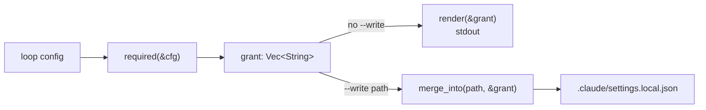
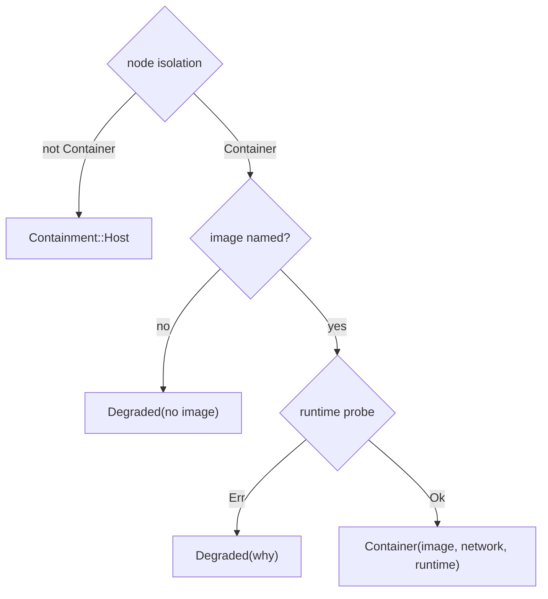

# Permissions & Sandboxing

# Permissions & Sandboxing

Two unrelated mechanisms share this territory, and keeping them apart is the point of the design:

- **The permission grant** is what stops the harness from interrupting a hands-off run with a consent prompt. It is a convenience that buys uninterrupted execution.
- **The constraint and isolation machinery** is what stops a run from doing something you cannot undo. It is the safety property.

The grant is derived, narrow, and additive. It is *not* a security boundary, and the code says so in several places — `permissions.template.json` carries a `$deny_note` explaining that nothing is denied by default because "denial is not the mechanism that protects you," and `render()` ends every preflight block with the reminder that human checkpoints stop the run "grant or no grant."

---

## Deriving the grant

`loopsmith_core::permissions::required(&LoopConfig) -> Vec<String>`
(`runtime/crates/loopsmith-core/src/permissions.rs:17`)

The grant is computed from the config, never guessed or templated. It accumulates into a `BTreeSet<String>`, so the output is deduplicated and sorted — a property with a test of its own (`the_grant_has_no_duplicates_and_is_sorted`), because a sorted grant produces a stable diff in `.claude/settings.local.json`.

| Rule | Derived from |
|---|---|
| `Read`, `Write`, `Edit`, `Glob`, `Grep` | Unconditional. The loop reads and writes inside its own directory. |
| `Bash(<command>:*)` per provider | `cfg.execution.providers.providers[].command` |
| `Bash(<command>:*)` per script detector | `cfg.safety.checks[].detector`, matched on `Detector::Script { command, .. }` |
| `Bash(npx skills:*)` + `WebFetch(domain:claudemarketplaces.com)` | Only when `cfg.execution.skills.acquisition_order` contains `AcquisitionSource::Marketplace` |

The marketplace pair is the case that best shows the intent: a loop whose `acquisition_order` is `[installed]` gets no network rule at all. `marketplace_access_is_only_requested_when_the_policy_uses_it` asserts both directions — that the rules appear when the policy uses the marketplace, and that they are absent when it does not.

Note that `required()` reads the **acquisition policy**, not `features.marketplace_skills`. The feature flag gates whether acquisition may happen at run time; the grant reflects what the config declares it intends to reach.

## Presenting and writing it


```mermaid
flowchart LR
    C[loop config] --> R["required(&cfg)"]
    R --> G["grant: Vec&lt;String&gt;"]
    G -->|no --write| P["render(&grant)<br/>stdout"]
    G -->|--write path| M["merge_into(path, &grant)"]
    M --> S[".claude/settings.local.json"]
```

**`render(&[String]) -> String`** produces the human-readable preflight block: a header, the rules one per line, and the closing note about checkpoints. It is the "show it once, then ask once" half of the compromise described in the module doc comment. `render_mentions_that_checkpoints_still_stop` pins the closing note in place so a reword cannot quietly drop it.

**`merge_into(&Path, &[String]) -> io::Result<String>`** is the write path, and its contract is *additive and non-destructive*:

- A missing file becomes `{}`; an existing file that fails to parse as JSON also becomes `{}` (`unwrap_or_else(|_| json!({}))`) rather than an error — a corrupt settings file does not block a run. A non-object root is likewise replaced.
- `permissions.allow` is created if absent, then each grant string is appended only when not already present. Existing rules survive, and unrelated top-level keys survive: `merging_preserves_existing_rules_and_adds_new_ones` checks that both a hand-added `Skill(claude-api)` and an unrelated `"theme": "light"` are intact afterwards.
- Repeated calls are no-ops (`merging_is_idempotent`), which is what makes it safe to wire into scaffolding and into a web button.
- Parent directories are created before the write, so `--write .claude/settings.local.json` works in a fresh directory.

The returned string is the pretty-printed result, so every caller can display exactly what landed on disk.

## The CLI surface

`runtime/crates/loopsmith-cli/src/cmd/permissions.rs` is a thin shell over the two core functions:

```
loopsmith loop permissions <config> [--write <path>]
```

It loads the config with `loopsmith_core::load`, derives the grant, and either prints `render(&grant)` or merges into `--write`'s path and prints a count plus the merged JSON. Every error is flattened to `String` via `map_err(|e| e.to_string())`; success is always `ExitCode::SUCCESS`.

`permissions` is in the 0.3 alias table (`loopsmith-cli/src/cli/alias.rs`) mapped to the `loop` noun, so the bare `loopsmith permissions <config>` spelling still works and is rewritten before clap sees the arguments.

### Other callers

- **Scaffolding** (`loopsmith-cli/src/scaffold.rs:664`) derives the grant for the config it just generated and merges it straight into `.claude/settings.local.json`, falling back to `render(&grant)` as the file contents if the merge fails — so a new loop directory always ships with *something* readable in place. It also writes `permissions.template.json` alongside as documentation.
- **The web UI** surfaces the grant twice: `loopsmith-web/src/assemble.rs:134` puts `required(cfg)` into the `Review` struct that the draft-review endpoint returns as you type (the `permissions_are_derived_rather_than_guessed` test covers that field), and `Action::PermissionsWrite { config, settings }` in `loopsmith-web/src/exec.rs:506` spawns the CLI as `loop permissions <config> --write <settings>` — the browser never touches the file itself, it asks for one of a closed set of argv shapes.

## `permissions.template.json` — the shape, not the answer

The scaffolded template is deliberately over-broad and deliberately annotated as such. Its `$comment` tells the reader to generate the real file with `loopsmith loop permissions <config> --write .claude/settings.local.json`; the `$sections` map explains each group (`core_tools`, `control_plane`, `providers`, `detectors`, `acquisition`); and `$still_stops` enumerates what no allow-rule can authorise:

- anything in `constraints.human_checkpoint`
- publishing, sending, deleting, or paying
- promoting a quarantined sub-agent out of `generated-skills/`
- applying anything written to `proposals/`

## What actually constrains a run

The grant says what will not prompt. These are the mechanisms that say what cannot happen.

**Constraints** (`loopsmith-core/src/config/constraints.rs`). `ConstraintSet` carries `rules`, `forbidden_paths`, `forbidden_commands`, `max_tokens`, `max_seconds`, and `human_checkpoint` — the last documented as Bezos Type 1: "irreversible decisions do not get made at machine speed." `ConstraintSet::merged(global, node)` appends node lists onto the global ones and lets node limits win where present. `frozen_git_rules()` is the canned set (no `git stash`, no `git reset`, no git command except committing a specific file) emitted into parallel nodes.

Constraints reach a node two ways. `loopsmith-run/src/prompts.rs:32` renders them into the system prompt as `Never touch:`, `Never run:`, and `Stop and ask a human before:` lines. That is instruction, not enforcement — and the code is honest about the difference: `publish::forbidden_changes` (`loopsmith-run/src/publish.rs:88`) enforces `forbidden_paths` *mechanically*, but only for a node with `Isolation::Worktree`, where the worktree's git status is an exact record of what changed. A node sharing the loop root "leaves no such record, so its `forbidden_paths` remain a prompt-level instruction and nothing more." When a worktree node does touch a forbidden path, `waves.rs:831` publishes **nothing** from it — "the whole worktree is suspect, not just the offending file."

**Protected components** (`loopsmith-core/src/config/protected.rs`). Self-evolution is only safe if the evolving thing cannot reach what constrains it. `ProtectedComponent` maps each protected area to dotted config paths, and the list includes `Approvals` → `safety.limits.global.human_checkpoint`, `safety.gates.approval`; `Credentials` → `execution.providers.providers.requires_env`, `secrets`; and `Protected` itself. The check lives in the gate — compiled code the loop cannot dispatch to.

**Feature flags** (`loopsmith-core/src/config/environment.rs`). `Features` keeps capability separate from policy: `self_evolution`, `marketplace_skills` ("this is the supply-chain surface"), and `external_side_effects` all default to `false`; `human_approval` defaults to `true` and turning it off is refused outright in `prod`.

## Process isolation


```mermaid
flowchart TD
    I{"node isolation"} -->|not Container| H[Containment::Host]
    I -->|Container| IMG{"image named?"}
    IMG -->|no| D["Degraded(no image)"]
    IMG -->|yes| RT{"runtime probe"}
    RT -->|Err| D2["Degraded(why)"]
    RT -->|Ok| CN["Container(image, network, runtime)"]
```

`container::resolve` (`loopsmith-run/src/container.rs:98`) answers where a node's provider command runs, given the node's `Isolation`, the graph-level `execution.graph.container_image` fallback, and the result of `container::probe`. The node image wins over the graph image; `network` defaults off.

The load-bearing decision is that a container node **degrades to a worktree** rather than failing when the runtime is absent, its daemon is stopped, or no image is named — machines without Docker are the common case, and "a loop that refused to run there would be a loop that only runs on its author's machine." The ledger records which happened. `probe()` caches its answer in a `OnceLock` (the answer cannot change mid-process, and a five-second daemon timeout in front of every dispatch would be intolerable) and reads `LOOPSMITH_DOCKER` to allow a CLI-compatible runtime such as `podman`.

`loopsmith_provider::container_argv` (`loopsmith-provider/src/lib.rs:134`) builds the invocation: `run --rm`, `-i` when the provider takes its prompt on stdin, `--network none` unless the node asked for a network, `-v <workdir>:/work -w /work`, then `-e KEY` for each entry in `requires_env`. Passing env vars **by name** is deliberate — the runtime reads each value from the parent process's environment, so a secret never appears in argv where anyone on the machine could read it from the process table. The provider CLI must exist inside the image; the host's copy is not visible, which is the isolation.

## Detectors run with no shell

A `Detector::Script { command, args, expect_exit }` is executed by `run_detector` in `loopsmith-gate/src/lib.rs:436` as `Command::new(command).args(args).current_dir(&ev.workdir)`. There is no shell: `command` is argv[0] and every `arg` is a literal. No globbing, no pipes, no `&&`, no variable expansion. A detector that needs any of that is a real file with a real shebang.

`compat.template.sh` (scaffolded to `scripts/compat.sh`, mode `0o755`) is what such a file should source. Three rules govern it:

1. **Everything is detected at run time.** A loop directory gets copied to a build box, a container, or a colleague's laptop, and a baked-in answer "would be wrong on arrival with no sign that anything had changed." `scaffold.rs` ships this file verbatim rather than generating it for exactly that reason.
2. **POSIX `sh` unless `need_bash 4` says otherwise**, because macOS ships bash 3.2.57 and associative arrays, `${x,,}`, `mapfile`, `&>>` and `**` all arrived in 4.0.
3. **Exit 2, not 1, when the machine cannot run the check.** `need_bash` and `require` both exit 2, and the comment explains why: a detector's exit code is its verdict, and "this machine cannot run the check" is a different fact from "the check failed." A gate that conflates them reports missing tooling as unfinished work — and since `expect_exit` defaults to 0, a 2 is a clean failure with a distinguishable code rather than a false negative.

The exported environment (`LOOPSMITH_OS`, `LOOPSMITH_USERLAND`, `LOOPSMITH_BASH_MAJOR`) and the helpers built on it cover the differences that actually break scripts:

| Helper | Papers over |
|---|---|
| `sed_i` | GNU `sed -i` takes no argument, BSD requires one — get it wrong on BSD and you edit a file called `-e` |
| `stat_size`, `stat_mtime` | `-c%s`/`-c%Y` on GNU, `-f%z`/`-f%m` on BSD |
| `readlink_f` | `readlink -f` is missing from every BSD before macOS 12; falls back to a `cd`/`pwd -P` walk |
| `sha256` | `sha256sum` or `shasum -a 256`, whichever exists; 127 with a message when neither does |
| `require`, `need_bash` | Missing tooling, reported as exit 2 |
| `compat_report` | One line for a log or bug report |

Windows is in scope only through Git Bash, WSL, or MSYS. Nothing here runs under `cmd.exe` or PowerShell — a detector for those is a `.cmd` or `.ps1` naming its own interpreter, which works precisely because there is no shell in the way. The same reasoning is why scaffolding writes both `run.sh`/`resume.sh` and `run.cmd`/`resume.cmd` on every host.

---

## Contributing

**Adding a permission rule.** Put the derivation in `required()` and key it off a config field, never off a guess. If the rule is conditional, add a test in the style of `marketplace_access_is_only_requested_when_the_policy_uses_it` that asserts *both* presence and absence — a rule that is always emitted is indistinguishable from a template, which is what this module exists to replace. If the rule group is new, add a line to `$sections` in `permissions.template.json`.

**Do not add a deny list.** The empty deny list is a decision, documented in `$deny_note`. Something that must not happen belongs in `constraints`, `safety.protected`, or a `features` flag — places the gate enforces and evolution cannot reach.

**Touching `merge_into`.** The three invariants under test are: existing rules survive, unrelated keys survive, and repeat calls add nothing. The scaffolder and the web UI both depend on all three.

**Touching `compat.sh`.** Add a helper that probes rather than a constant that was true on your machine, and use exit 2 for "cannot check." `loopsmith-cli/tests/compat.rs` exercises the shipped template.

**Adding a web action.** `Action` in `loopsmith-web/src/exec.rs` is a closed set with no wildcard arm in `named()`, so a new variant is a compile error until it is added to `all_actions()` — and the argv it produces must be a spelling the 1.0 grammar accepts without tripping the 0.3 alias notice.