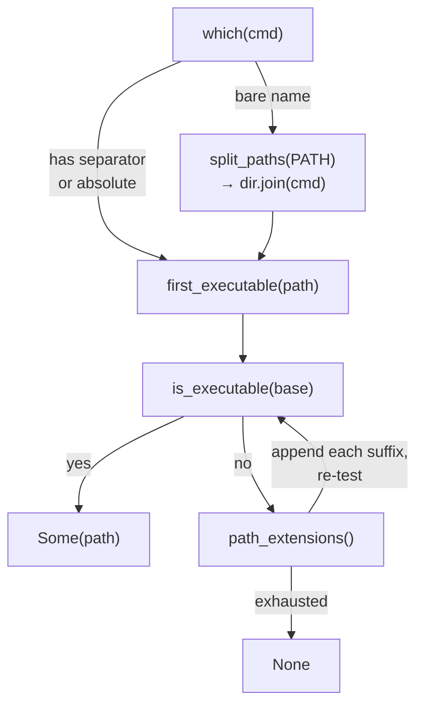

# Platform Utilities

# Platform Utilities (`loopsmith-util`)

`loopsmith-util` is the root of the loopsmith dependency graph: every other crate in the workspace depends on it, and it depends on nothing at all — not even `serde`. That constraint is the crate's defining property. Anything added here is added to every build of every crate, so the bar for admission is high: a primitive earns its place by having already been written more than once, in more than one state of correctness.

The crate answers three questions that keep coming up across the workspace:

1. **Is this command available, and where?** — `which`, `is_executable`
2. **What time is it?** — `now_ms`
3. **What is this machine actually capable of?** — the `platform` module
4. (Plus, behind a feature flag: **where do tests put their scratch files?** — `testing`)

---

## Layout

| Path | Contents |
|---|---|
| `src/lib.rs` | `which`, `is_executable`, `now_ms`, `first_executable`, `path_extensions`, `testing` |
| `src/platform.rs` | `Os`, `Userland`, `BashVersion`, `Platform`, `home_dir`, `preferred_schedulers` |

The `testing` submodule is gated behind a `testing` Cargo feature, enabled from `[dev-dependencies]` so resolver 2 keeps it out of release builds. The published tarball ships `include = ["/src/**/*", "/README.md"]` only — integration tests in sibling crates read fixtures from the repository root, which no crate tarball can carry.

---

## Command resolution

### `which(cmd: &str) -> Option<PathBuf>`

Resolves a command name the way a shell would, with two branches:

- **Anything containing a path separator** (or an absolute path) is checked directly. It is *not* joined onto `PATH` entries. Three prior copies of this function existed in the workspace; some of them joined absolute paths onto every `PATH` directory and therefore returned `None` for every absolute path handed to them. The test `an_absolute_path_is_checked_directly_not_joined_onto_path` pins this.
- **A bare name** is joined onto each `PATH` entry in order, and the first executable match wins.

Both branches funnel into `first_executable`, which enforces the two rules that make the result trustworthy.



### Rule 1: executability, not existence

`is_executable` consults the unix permission bits (`mode() & 0o111 != 0`) in addition to `is_file()`. Two of the three previous copies of `which` checked only `is_file()`, which reports a non-executable file named `curl` sitting on `PATH` as "curl is available." The failure then surfaces much later, as a confusing spawn error far from its cause.

Off unix there is no permission bit to consult, so `is_executable` degrades to a plain file check rather than pretending to know more than it does. This asymmetry is deliberate and is asserted per-platform in `a_file_that_is_not_runnable_is_not_a_command` — the unix arm asserts the bit, the non-unix arm asserts the equivalent Windows claim (nothing is invented by appending a suffix that does not exist on disk).

### Rule 2: platform executable suffixes

`path_extensions()` returns an empty `Vec` on unix — the executable bit is the whole answer there. On Windows it reads `PATHEXT`, falling back to `.COM;.EXE;.BAT;.CMD` (what Windows itself defaults to). Honouring the variable rather than hardcoding a list is how a machine gets to say that `.ps1` or `.py` counts as a command.

Two details in `first_executable` matter:

- **The suffix is appended, never substituted.** `set_extension` would turn `check.sh` into `check.exe`; a command name may legitimately contain a dot, so the code pushes onto the `OsString` directly. `a_suffix_is_appended_rather_than_replacing_a_real_extension` pins this.
- **Without the suffix loop, `which` returns `None` for everything on Windows.** `git` there is a file called `git.exe`, so joining the bare name onto `PATH` matches nothing. Everything downstream then faithfully reports the falsehood it was given: `doctor` says no tools are installed, `Platform::detect` finds no scheduler, and worktree isolation degrades to a shared directory citing "git not on PATH" — on a machine where git is very much on PATH.

---

## The clock

`now_ms()` returns milliseconds since the Unix epoch, and is the single clock for the workspace. Timestamps are stored as numbers so the ledger stays sortable without a date parser.

A clock that runs backwards yields `0` rather than panicking. The tradeoff is stated plainly: a wrong timestamp on a ledger entry is a nuisance; a panic partway through an unattended run is not.

Callers include the ledger and logging (`loopsmith-cli/src/logging.rs::entry`), run bookkeeping (`src/run/mod.rs::execute`), evolution records (`src/run/evolve.rs`), and `src/run/summary.rs::deterministic`.

---

## The `platform` module

`cfg!(target_os = …)` answers what the binary was *compiled for*. That is a different question from what the machine running it can *do*, and three facts in particular change what loopsmith and its generated scripts are allowed to assume:

- **The bash on `PATH` may be from 2007.** macOS still ships 3.2.57 because 4.0 changed licence. Associative arrays, `${x,,}`, `mapfile`, and `&>>` all arrived in 4.0.
- **`sed`, `stat`, and `readlink` take different flags** under GNU vs. BSD userlands. `sed -i` requires an argument on BSD and must not have one on GNU.
- **The scheduler is whatever is installed**, not whatever the OS is famous for. A container has neither `launchctl` nor `crontab`; a Mac has both.

Everything in this module probes and reports. Nothing decides on the caller's behalf, and nothing is cached across processes — a probe costs one `--version` call, and a run is not a hot loop.

### `Os`

A five-variant enum (`MacOs`, `Linux`, `FreeBsd`, `Windows`, `Other`) over `std::env::consts::OS`. This one genuinely *is* a compile-time fact; it lives here so callers have a single place to ask, next to the facts that are not. `as_str()` gives the stable string used in reports (`"bsd"` for the BSD family), and `is_windows()` is the "does this host run `.cmd` batch files rather than `#!` scripts" predicate.

### `home_dir()`

Returns the home directory by whichever variable *this* operating system uses. On Windows the order is `HOME` → `USERPROFILE` → `HOMEDRIVE` + `HOMEPATH`; elsewhere it is simply `HOME`. Empty values are filtered out, not accepted.

Reading `HOME` directly is the bug this exists to prevent: it is unset on Windows outside a POSIX emulation layer, and the loss surfaces as "cannot locate LaunchAgents" or as a loop cheerfully scaffolding itself into a relative path. `the_home_directory_is_found_by_this_platforms_variable` asserts the result is absolute for exactly that reason.

`loopsmith-cli/src/scaffold.rs::guard_path` and `loopsmith-skills`' `skill_search_paths` both go through here.

### `Userland`

`Gnu` / `Bsd` / `Unknown`, **probed, never inferred from the OS**. Homebrew's `coreutils` puts GNU tools ahead of BSD ones on a Mac, and a stripped container may have busybox — so `Os::MacOs` does not imply BSD and `Os::Linux` does not imply GNU.

`Userland::detect()` runs `sed --version`. GNU answers with a banner; BSD refuses with a non-zero status. Busybox is classified as `Gnu` for flag purposes. A banner that succeeds but mentions neither is `Unknown`.

`sed_in_place()` is the payoff:

| Userland | Flags |
|---|---|
| `Gnu` | `["-i"]` |
| `Bsd` | `["-i", ""]` |
| `Unknown` | `["-i", ""]` |

`Unknown` takes the BSD spelling deliberately. GNU rejects the empty suffix loudly; BSD, given a bare `-i`, silently swallows the *next* argument as a backup suffix — which is how a script ends up editing a file called `-e`. When you must guess, guess toward the failure you can see.

### `BashVersion`

Holds `major`, `minor`, and `raw` (the whole first line, kept for the `doctor` report).

`parse(first_line: &str)` splits on `"version "`, then takes the leading run of digits and dots — a shape stable across every bash release since 2.0 (`GNU bash, version 3.2.57(1)-release (x86_64-apple-darwin24)`). A missing minor defaults to `0`, so `version 5 (x86_64)` parses as `5.0`. Anything that is not a bash banner yields `None`.

`MODERN_MAJOR = 4` is the line between POSIX `sh` and everything else, and `is_modern()` is `major >= 4`. The private `probe(command)` runs `<command> --version` and parses the first stdout line.

### `Platform` — the whole picture, probed once

```rust
pub struct Platform {
    pub os: Os,
    pub userland: Userland,
    pub bash: Option<BashVersion>,      // `bash` on PATH; a machine may have none
    pub sh_bash: Option<BashVersion>,   // `/bin/sh`, when it is bash in POSIX mode
    pub schedulers: Vec<&'static str>,  // installed, in preference order
}
```

`Platform::detect()` fans out to every probe in the module:

```mermaid
flowchart LR
    D["Platform::detect()"] --> OS["Os::detect()"]
    D --> UL["Userland::detect()<br/>sed --version"]
    D --> B["BashVersion::probe(\"bash\")"]
    D --> SH["BashVersion::probe(\"/bin/sh\")"]
    D --> PS["preferred_schedulers(os)"]
    PS --> WH["which(candidate)<br/>filter to installed"]
```

`sh_bash` being `None` is itself information: on Debian `/bin/sh` is `dash`, which rejects `[[`, `local -n`, and `echo -e` that a bash-as-sh would have accepted by accident.

Three methods sit on top of the struct:

- **`scheduler()`** — the first installed candidate, or `None` when the machine has none.
- **`has_modern_bash()`** — `false` when bash is missing entirely. A script that cannot be run is not a script that may assume anything.
- **`portability_note()`** — one line explaining why a generated script sticks to POSIX `sh`, or `None` when nothing is holding it back. Distinguishes "no bash on PATH" from "bash 3.2 predates 4.0."

### `preferred_schedulers(os)`

The **candidate** list, best first — not the answer. `Platform::detect` filters it through `which`.

| OS | Candidates |
|---|---|
| `MacOs` | `launchctl`, `crontab` |
| `Linux`, `FreeBsd` | `crontab`, `systemctl` |
| `Windows` | `schtasks`, `crontab` |
| `Other` | `crontab` |

launchd goes first on macOS because it is the one that survives a reboot without the user enabling anything else. Windows previously fell into the catch-all arm and was offered `crontab` alone, so `schedule` reported "no scheduler" on machines with a perfectly good Task Scheduler; `every_os_has_a_scheduler_worth_probing_and_windows_gets_the_native_one` pins the fix. `crontab` still trails `schtasks` on Windows because a machine with Cygwin or WSL interop on `PATH` has a real cron — prefer the native tool, still find the other one.

`src/cmd/schedule.rs::preferred_names` calls this directly; `detection_answers_something_for_this_machine` asserts that no reported scheduler is absent from `PATH`.

---

## `testing` (feature-gated)

Three functions, enabled via `features = ["testing"]` from a `[dev-dependencies]` entry:

- **`temp_path(tag)`** — a unique path under the system temp dir, **not created**.
- **`temp_dir(tag)`** — the same, created.
- **`cleanup(path)`** — best-effort `remove_dir_all`, errors discarded. A leaked temp directory must never fail a test.

The name is `loopsmith-{tag}-{pid}-{now_ms}-{counter}`, and the **counter is the load-bearing part**. This existed six times in four shapes across the workspace, and two of those shapes omitted it. Tests run in parallel threads within a single process, so pid and millisecond timestamp do not separate two directories created in the same millisecond — and when two tests share a directory, sled reports a lock error that reads like a backend bug rather than a test collision.

Used throughout `loopsmith-cli` tests (`logging.rs`, `permissions.rs`) and the run-layer tests in `src/run/{export,publish,mod}.rs`.

---

## How the workspace uses this crate

```
loopsmith  (the CLI binary)
└── loopsmith-mcp ── loopsmith-gate ─┐
    loopsmith-skills ────────────────┤
    loopsmith-provider ──────────────┼── loopsmith-core ── loopsmith-util
    loopsmith-graph ─────────────────┤        (config)      (primitives)
    loopsmith-memory ────────────────┘
```

The most instructive consumers:

- **`src/cmd/doctor.rs`** is the densest caller: `Platform::detect`, `scheduler()`, `portability_note()`, plus `which` and `is_executable` in `report_tool` and `config_notes`. Doctor's entire report is a rendering of this crate's probes — which is why a `which` that silently returns `None` produces a doctor report where nothing exists.
- **`src/cmd/schedule.rs`** pairs `Platform::detect` + `scheduler()` with `preferred_schedulers` via `preferred_names`.
- **`src/cmd/new.rs`** calls `Platform::detect` so scaffolded scripts match the host.
- **`loopsmith-cli/src/worktree.rs::which_git`** resolves git through `which`; failure there degrades worktree isolation to a shared directory.
- **`loopsmith-skills::skill_search_paths`** reaches `home_dir` — and because `home_dir` calls `Os::detect`, several traced flows run from `install_default` all the way down through `which` into `path_extensions` and `is_executable`.

---

## Contributing notes

- **Adding a dependency is a workspace-wide decision.** There are none today, by design. A new one lands in every crate.
- **Probe, don't infer.** The recurring bug class this module exists to prevent is deducing a runtime fact from a compile-time one. `Userland` is the canonical example: `the_userland_is_probed_and_never_inferred_from_the_operating_system` re-derives the answer from the raw `sed` output and requires `detect()` to agree.
- **Tests must not mutate `PATH` or the environment.** `set_var` races every other test thread that reads the environment — the same class of parallel-test collision the temp-dir counter exists to prevent. Both the PATHEXT and non-executable-file tests assert through `which`'s absolute-path branch and real fixture files on disk instead.
- **Platform assertions must state that platform's own rule.** Asserting "a plain file is not executable" is asserting unix semantics on a system that may have none; write the `#[cfg(unix)]` / `#[cfg(not(unix))]` arms to make the platform's actual claim.
- **New `Platform` fields need a `portability_note`-shaped answer.** The pattern throughout is: probe the fact, expose it as data, and give `doctor` a human-readable line explaining what it constrains.