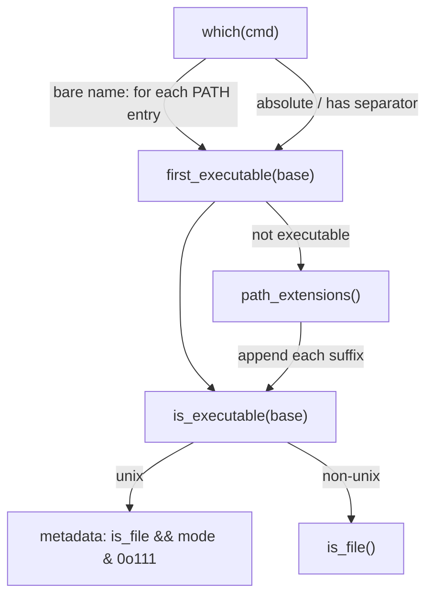

# Platform Utilities

# Platform Utilities (`loopsmith-util`)

The bottom crate of the workspace. Every other loopsmith crate depends on it, which is why it has **no dependencies at all** — not `serde`, not `libc`, nothing. Anything added here is added to every build of every crate above it, so the bar for entry is high: a primitive earns its place here by having already been written more than once, in more than one state of correctness.

Three things live here:

| Surface | What it answers |
|---|---|
| `which` / `is_executable` | Is this command really runnable, and where? |
| `now_ms` | The single wall clock. |
| `platform` | What is this host *actually*, at run time? |
| `testing` (feature-gated) | Collision-free temp paths for parallel tests. |

---

## Command resolution: `which`

```rust
pub fn which(cmd: &str) -> Option<PathBuf>
pub fn is_executable(p: &Path) -> bool
```

`which` resolves a command the way a shell does, and splits on the shape of the input:

- **Absolute paths, or anything containing a separator** are checked directly. This branch exists because the three previous copies of this function were PATH-only: they joined an absolute path onto every `PATH` entry and returned `None` for a binary the caller was holding a valid path to.
- **Bare names** are resolved against `PATH` via `std::env::split_paths`, taking the first hit.

Both branches funnel into the same private helper, and that helper is where the platform behaviour lives:


```mermaid
graph TD
    W["which(cmd)"] -->|"bare name: for each PATH entry"| F["first_executable(base)"]
    W -->|"absolute / has separator"| F
    F --> E["is_executable(base)"]
    F -->|"not executable"| X["path_extensions()"]
    X -->|"append each suffix"| E
    E -->|unix| B["metadata: is_file && mode & 0o111"]
    E -->|"non-unix"| P["is_file()"]
```

### Why the executable bit matters

`is_executable` on unix requires both `is_file()` **and** at least one execute bit (`mode() & 0o111 != 0`). Two of the three earlier copies of `which` checked `is_file()` alone, so a non-executable file named `curl` sitting on `PATH` read back as "curl is available" — and the lie only surfaced much later as a confusing spawn error, far from the check that produced it.

Off unix there is no permission bit to consult, so `is_executable` degrades to a file check rather than pretending to know more than it does. Tests in this crate are careful about that distinction: `a_file_that_is_not_runnable_is_not_a_command` asserts unix semantics under `#[cfg(unix)]` and the *extension* rule under `#[cfg(not(unix))]`, because "not runnable" genuinely means different things on the two platforms.

### Why the suffix loop matters

`path_extensions()` returns an empty `Vec` on unix and the `PATHEXT` list on Windows (falling back to `.COM;.EXE;.BAT;.CMD`, which is what Windows itself defaults to). `PATHEXT` is honoured rather than hardcoded because it is how a machine declares that `.ps1` or `.py` counts as a command.

Without this loop, `which` is simply broken on Windows: `git` there is a file called `git.exe`, so joining the bare name onto every `PATH` entry matches nothing. Everything downstream then faithfully reports the falsehood it was handed — `doctor` says no tool is installed, `Platform::detect` finds no scheduler, and worktree isolation degrades to a shared directory citing "git not on PATH", on a machine where git is very much on `PATH`.

One subtlety worth preserving: the suffix is **appended by building an `OsString`**, never applied with `set_extension`. `set_extension` would rewrite `check.sh` into `check.exe`; a command name may legitimately contain a dot, so `check.sh` must be allowed to become `check.sh.exe`. `a_suffix_is_appended_rather_than_replacing_a_real_extension` pins that.

### Callers

`which` is the most widely consumed thing in the crate. The notable paths:

- `loopsmith-run/src/worktree.rs::which_git` → `create` — git worktree isolation. This is the chain that appears in execution flows from `run_node` (dispatch), `worktree` (publish), and `prune`.
- `src/cmd/doctor.rs` — `report_tool`, `config_notes`, and `execute` all probe tools through it; `config_notes` also calls `is_executable` directly.
- `loopsmith-cli/src/scaffold.rs::init_git` — decides whether a new loop directory can be turned into a repo a worktree can resolve against.
- `platform::Platform::detect` — filters scheduler candidates. This is the only call *out* of `platform` into the crate root.

---

## The clock: `now_ms`

```rust
pub fn now_ms() -> u64
```

Milliseconds since the Unix epoch, and the only clock in the workspace. Timestamps are stored as numbers so the memory ledger stays sortable without a date parser anywhere in the read path.

A clock that runs backwards (`duration_since` returning `Err`) yields `0` rather than panicking. The trade is explicit: a wrong timestamp on one ledger entry is a nuisance; a panic partway through an unattended overnight run is not.

---

## Runtime platform detection: `platform`

This module exists because `cfg!(target_os = …)` answers none of the questions that actually change what loopsmith and its generated scripts may assume:

- **The bash on `PATH` may be from 2007.** macOS still ships 3.2.57 (4.0 changed licence). Associative arrays, `${x,,}`, `mapfile`, `&>>`, and `**` all arrived in 4.0, so a detector script written on Linux fails on a Mac with a syntax error instead of a useful message.
- **`sed`, `stat`, and `readlink` take different flags** under GNU versus BSD userland — the single most common way a working script stops working on someone else's machine.
- **The scheduler is whatever is installed**, not whatever the OS is famous for. A container has neither `launchctl` nor `crontab`; a Mac has both; a systemd host may have `systemctl` and no `crontab`.

Everything here probes and reports. **Nothing decides on the caller's behalf, and nothing is cached across processes** — a probe costs one `--version` call and a run is not a hot loop.

### `Os`

A thin wrapper over `std::env::consts::OS` (`MacOs`, `Linux`, `FreeBsd` — which also covers OpenBSD and NetBSD — `Windows`, `Other`). This one genuinely *is* a compile-time fact, since the binary is built for the platform it runs on; it is wrapped here so callers have one place to ask, sitting next to the facts that are not compile-time. `as_str()` gives the stable report string (`"bsd"` for the BSD family) and `is_windows()` answers whether the host runs `.cmd` batch files rather than `#!` scripts.

### `home_dir`

```rust
pub fn home_dir() -> Option<PathBuf>
```

On non-Windows, `HOME` (rejecting the empty string). On Windows it walks a cascade: `HOME` first, because Git Bash and MSYS set it and it is the more specific answer when both exist; then `USERPROFILE`; then `HOMEDRIVE` + `HOMEPATH` concatenated, for a bare `cmd.exe`.

Code that reads `HOME` directly silently loses the home directory on Windows, where the failure surfaces as "cannot locate LaunchAgents" or as a loop cheerfully scaffolding itself into a relative path.

### `Userland`

```rust
pub enum Userland { Gnu, Bsd, Unknown }
```

`Userland::detect()` probes by running `sed --version`: GNU answers successfully (and busybox is classed as GNU-compatible here), BSD's `sed` exits non-zero. A successful exit whose output mentions neither is `Unknown`, and a spawn failure is `Unknown` too.

The reason this is a probe and not a `match` on `Os`: Homebrew's `coreutils` puts GNU tools ahead of BSD ones on a Mac, and a stripped container may have busybox. `Os::MacOs` does not imply BSD and `Os::Linux` does not imply GNU.

`sed_in_place()` returns the argv fragment for an in-place edit — `["-i"]` for GNU, `["-i", ""]` for BSD. **`Unknown` deliberately takes the BSD spelling**, because GNU rejects the empty suffix loudly while BSD would silently swallow the next argument as a backup suffix — which is how a script ends up editing a file called `-e`. When guessing, guess toward the louder failure.

### `BashVersion`

```rust
pub struct BashVersion { pub major: u32, pub minor: u32, pub raw: String }
pub const MODERN_MAJOR: u32 = 4;
```

`BashVersion::parse` takes the first line of `bash --version` and splits on the literal `"version "`, then collects the leading run of digits and dots. The banner shape has been stable since bash 2.0 (`GNU bash, version 3.2.57(1)-release (x86_64-apple-darwin24)`). A missing minor defaults to `0`, so `version 5 (x86_64)` parses as 5.0; anything that is not a bash banner returns `None`. `raw` keeps the whole trimmed line for the `doctor` report.

`is_modern()` is `major >= 4` — the line between "write POSIX `sh`" and "bash 4 syntax is fine". The private `probe(command)` runs `<command> --version` and feeds the first line to `parse`.

### `Platform`

```rust
pub struct Platform {
    pub os: Os,
    pub userland: Userland,
    pub bash: Option<BashVersion>,      // `bash` on PATH; a machine may have none
    pub sh_bash: Option<BashVersion>,   // `/bin/sh`, iff it is bash in POSIX mode
    pub schedulers: Vec<&'static str>,  // actually installed, preferred first
}
```

`Platform::detect()` is the one entry point, and it fans out to every probe in the module:

```mermaid
graph LR
    D["Platform::detect()"] --> O["Os::detect()"]
    D --> U["Userland::detect()<br/>sed --version"]
    D --> B["BashVersion::probe(\"bash\")"]
    D --> S["BashVersion::probe(\"/bin/sh\")"]
    D --> PS["preferred_schedulers(os)"]
    PS --> WH["which(candidate)<br/>filter to what exists"]
```

`sh_bash` being `None` is itself information: on Debian `/bin/sh` is `dash`, which rejects `[[`, `local -n`, and `echo -e` that a bash-as-sh would have accepted by accident.

Three accessors read off the struct:

- **`scheduler()`** — the first installed scheduler, or `None` when the machine has none. Consumed by `src/cmd/schedule.rs::execute` and the `doctor` report.
- **`has_modern_bash()`** — `false` when bash is missing entirely, on the principle that a script which cannot be run is not a script that may assume anything.
- **`portability_note()`** — one line explaining why a generated script sticks to POSIX `sh` (no bash at all, or a pre-4.0 bash), or `None` when nothing is holding it back. `doctor` prints this verbatim.

### `preferred_schedulers`

```rust
pub fn preferred_schedulers(os: Os) -> &'static [&'static str]
```

The **candidate** list, best first — not the answer. `Platform::detect` filters it through `which`, and `src/cmd/schedule.rs::preferred_names` reuses it for its own listing.

| OS | Candidates | Why this order |
|---|---|---|
| macOS | `launchctl`, `crontab` | launchd survives a reboot without the user enabling anything else |
| Linux / BSD | `crontab`, `systemctl` | |
| Windows | `schtasks`, `crontab` | Task Scheduler is the only one that ships with Windows; `crontab` still worth probing for Cygwin/WSL interop |
| Other | `crontab` | |

Windows having its own arm is a fixed bug, pinned by `every_os_has_a_scheduler_worth_probing_and_windows_gets_the_native_one`: it previously fell into the catch-all and was offered only `crontab`, so `schedule` reported "no scheduler" on a machine with a perfectly good Task Scheduler.

---

## Test scaffolding: the `testing` feature

```toml
[dev-dependencies]
loopsmith-util = { workspace = true, features = ["testing"] }
```

Opt-in so it never ships in a release build; resolver 2 keeps the dev-dependency feature out of the normal build graph.

```rust
pub fn temp_path(tag: &str) -> PathBuf  // unique, NOT created
pub fn temp_dir(tag: &str) -> PathBuf   // unique, created
pub fn cleanup(p: &Path)                // best-effort; never fails a test
```

Names take the form `loopsmith-{tag}-{pid}-{now_ms}-{n}`, where `n` comes from a process-wide `AtomicU64`.

**The counter is the load-bearing part.** This function existed six times in four shapes, and two of those shapes omitted it. Tests run in parallel threads inside one process, so pid and millisecond timestamp do not separate two directories created in the same millisecond — and when two tests share a directory, sled reports a lock error that reads like a backend bug rather than a test collision.

`cleanup` swallows its error on purpose: a leaked temp directory is not a test failure.

These are used broadly across the workspace — `loopsmith-cli` integration tests (`guided.rs`, `surface.rs`, `compat.rs`, `opt_in.rs`), `loopsmith-cli/src/guided.rs::draft_path`, `scaffold.rs` tests, `loopsmith-core/src/permissions.rs` tests, and `tests/harness/mod.rs::from_yaml`.

---

## Contributing here

A few conventions that the existing code holds to, and that a change should keep:

**The dependency count is zero, and that is a feature.** Adding a dependency here adds it to every crate in the workspace. If a primitive needs a crate, it probably belongs one level up.

**Tests must not mutate the environment.** Several tests explicitly say so: `std::env::set_var` on `PATH` races every other test thread reading the environment — the same class of parallel-test collision the temp-dir counter exists to prevent. The Windows suffix behaviour is therefore asserted through the *absolute-path* branch of `which`, which exercises `first_executable` and `path_extensions` without touching `PATH`, and is meaningful on both platforms.

**Assertions must mean the platform's own rule.** Where behaviour genuinely differs, the test splits on `#[cfg]` and asserts what that platform actually promises, rather than asserting unix semantics on a system that has none.

**Probes report; they do not decide.** `platform` returns what it found, including `Unknown` and `None`. The choice of what to do about a missing bash or an unrecognised userland belongs to the caller — usually `doctor`, `schedule`, `new`, or the script generator.

**Packaging note.** `Cargo.toml` restricts `include` to `/src/**/*` and `/README.md`. The integration tests read `config/examples/` and `config/loop.schema.json` from the repository root, which no crate tarball can contain — shipping the tests would hand a published crate tests that cannot pass.