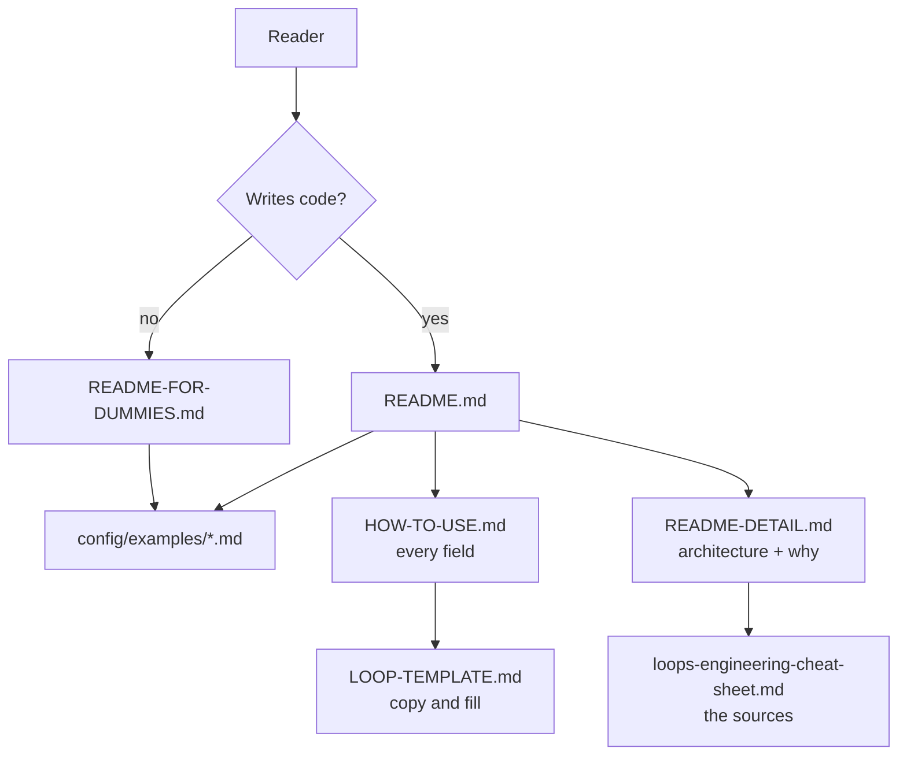

# Project Documentation

# Project Documentation

The root Markdown files are a module in their own right: they are the only interface most people ever touch, they encode claims the runtime is expected to keep, and several of them are load-bearing for the tool itself (`skills/loopsmith*/SKILL.md` and `CLAUDE.md` are read by an agent, not a person). This document is for whoever has to change them without breaking that.

## Inventory

| File | Lines | Audience | Job |
|---|---|---|---|
| `README.md` | 274 | Developer arriving from a package registry | Install, five-minute path, scheduling, portability. Routes everywhere else |
| `README-FOR-DUMMIES.md` | 397 | Non-programmer | One install line, the thirteen example loops, the six fields you edit, scheduling |
| `README-DETAIL.md` | 450 | Contributor / evaluator | Architecture, command table, the A–J model, providers, self-evolution, repo layout, named tests |
| `HOW-TO-USE.md` | 546 | Config author | Field-by-field reference for every section, plus failure playbook and promotion path |
| `LOOP-TEMPLATE.md` | 370 | Config author, copying | The authoring surface — a fill-in `SKILL.md` with `REPLACE ME` slots and inline rationale |
| `loops-engineering-cheat-sheet.md` | 157 | Anyone questioning a design decision | Distillation of the 20-source corpus, what was borrowed, what was rejected, and why |
| `CHANGELOG.md` | — | Upgraders | Release-by-release changes |
| `CLAUDE.md` / `AGENTS.md` | — | Agents | GitNexus index instructions; machine-generated between `<!-- gitnexus:start -->` markers |

`assets/` holds the three logo sizes; every doc header points at `loopsmith-logo-512.png`.

## The routing design

Nothing is written twice for the same reader. Each entry point is a triage step that hands off rather than expands.



Two rules fall out of this and are worth preserving:

- **`README.md` never explains a field.** It names sections A–J and links to `HOW-TO-USE.md`. The moment it starts documenting `no_progress_iterations`, it has two owners.
- **`README-FOR-DUMMIES.md` never mentions a crate, a tier, or the graph.** It documents six fields (B, C, D, F, G, H) and explicitly tells the reader to leave the rest alone — including the instruction to delete every `type: script` detector block, which is the one place the docs tell a reader to remove shipped config.

## The claim the whole doc set exists to make

Every long-form doc restates one sentence, deliberately:

> A model must not be the thing that certifies its own completion.

It appears as the epigraph in `README.md`, as the design finding in `README-DETAIL.md`, as the justification for the three-plane split in `HOW-TO-USE.md §1`, and as the verifier-independence ladder in `loops-engineering-cheat-sheet.md §2.2`. This is intentional repetition — the docs are read non-linearly and the claim is the reason the architecture looks the way it does — but it means **a change to the trust model is a four-file edit**. The concrete assertions that ride along with it, and must stay consistent:

- `goal_satisfied` is written by `loopsmith-gate` and by nothing else.
- The gate can **revoke** — the corpus's grading question, "can your system take 'done' back?"
- The MCP server has **no tool for marking a goal satisfied**, guarded by the test `there_is_no_tool_for_declaring_a_goal_satisfied`.
- A `judge` verdict from the builder's own provider is **refused, not discounted**.

## What binds documentation to code

The docs are not free prose; several of their claims are checkable, and the ones that are should stay that way.

| Doc statement | Bound to |
|---|---|
| The A–J sections and every field name | `config/loop.schema.json` |
| `compat.sh` helpers (`sed_i`, `stat_size`, `readlink_f`, `sha256`, `require`, `need_bash`) | `runtime/crates/loopsmith-cli/templates/compat.template.sh` |
| Trust floors, marketplace sources | `runtime/crates/loopsmith-cli/templates/marketplaces.json` |
| The permission grant shape, MCP registration | `templates/permissions.template.json`, `templates/mcp.template.json` |
| Thirteen example loops, `.yaml` + `.md` twins | `config/examples/` — 26 files, verified |
| Named tests in `README-DETAIL.md#tests` | `runtime/crates/*` test modules |
| Nine published crates | `runtime/crates/` — `loopsmith-{util,core,memory,graph,gate,provider,skills,mcp,cli}` |

`README-DETAIL.md` cites tests by name (`the_gate_can_take_done_back`, `judge_on_the_builders_provider_is_refused`, `amdahl_matches_the_published_table`, `a_cron_trigger_fires_once_per_minute_not_once_per_poll`, and others). Renaming one of those tests silently invalidates the document — treat the names as public API of the docs.

The Markdown/YAML config duality is likewise doc-visible: `README-DETAIL.md` claims a round-trip test keeps both grammars honest against every shipped example, which is what makes the `.md`/`.yaml` twins in `config/examples/` safe to document as equivalent.

## Ownership of repeated facts

Some facts genuinely appear in several files. Each has one owner; the others must be strictly less detailed.

| Fact | Owner | Restated in |
|---|---|---|
| Install lines per registry | `README.md#install` | `README-FOR-DUMMIES.md` (one line per manager, no table) |
| Command list | `README-DETAIL.md#commands` | `README.md#while-it-runs` (question→command only) |
| Detector types, strongest first | `HOW-TO-USE.md §5 D` | `README-DETAIL.md`, `LOOP-TEMPLATE.md` (table only, no semantics) |
| Section field reference | `HOW-TO-USE.md §5` | `LOOP-TEMPLATE.md` (YAML snippets with rationale) |
| Stop gates | `LOOP-TEMPLATE.md#f--stop-gates` | `HOW-TO-USE.md §5 F`, `README-DETAIL.md` |
| Provider command-template model | `HOW-TO-USE.md §6` | `README-DETAIL.md#providers`, `LOOP-TEMPLATE.md#providers` |
| What the loop may change about itself | `README-DETAIL.md` | Same two-column table verbatim in `HOW-TO-USE.md §11` and `LOOP-TEMPLATE.md` |
| Corpus reasoning and rejections | `loops-engineering-cheat-sheet.md` | Cited by link only |

The "does on its own / only proposes" table is duplicated word-for-word in three files. If you change what the loop may do autonomously, grep for `only proposes`.

## Verified drift

Checked against the working tree while writing this:

1. **Test counts disagree three ways.** `README.md` badges 327 passing, `README-DETAIL.md` badges 240, and `README-DETAIL.md#tests` says 148 in prose. At most one is current. The badge and the prose in the same file contradicting each other is the worst of the three.
2. **`README-DETAIL.md#repository-layout` points at files that moved.** It lists `config/marketplaces.json`, `config/permissions.template.json`, and `config/mcp.template.json`. `config/` actually contains only `loop.schema.json` and `examples/`; those three templates live in `runtime/crates/loopsmith-cli/templates/`. The same document cites the correct path for `marketplaces.json` in its self-evolution section, so the layout block is the stale copy.
3. **`loopsmith-util` is missing from every architecture diagram.** `README.md#packages` names all nine crates; the control-plane blocks in `README-DETAIL.md` and `HOW-TO-USE.md §1` show six and seven respectively.
4. **"A–H" survives where the model is now A–J.** `HOW-TO-USE.md §1` and `§4` say "A–H config model", `LOOP-TEMPLATE.md` is titled "The A–H model" and its `validate` comment says "A–H model complete", while both READMEs and `HOW-TO-USE.md §5` document ten sections through J. Sections I and J are fully specified elsewhere in the same files.
5. **`README-DETAIL.md#the-aj-model`** says "Two more sections exist" and then lists four (`graph`, `providers`, `skills`, `context`).
6. **Two installer scripts are undocumented.** `README.md` names `install.sh`, `install.bat`, `installers/deps.sh`, and `installers/deps.ps1`; `installers/install.ps1` also exists and is mentioned nowhere.
7. **`README-FOR-DUMMIES.md` links `skills/loopsmith/SKILL.md` and `skills/loopsmith-reference/SKILL.md`** — both directories exist, but the doc set never states that `LOOP-TEMPLATE.md` is the template *for* those skill files, which is what its frontmatter and `disable-model-invocation: true` field imply.

None of these are hard to fix; they are listed because they are the failure mode this module has. Every one is a fact that lives in two places with no test between them.

## Conventions

**Voice.** Declarative, and every rule carries its reason in the same breath — "`validate` fails on purpose", "that refusal is the most valuable thing the tool does", "popularity is not trust". A rule stated without its reason gets edited out by the next contributor who finds it inconvenient.

**Error text is quoted verbatim.** `README.md`, `README-DETAIL.md`, `LOOP-TEMPLATE.md`, and `HOW-TO-USE.md#10-failure-playbook` all reproduce real output:

```
error  pre_execution: 2 step(s) not marked done: …
[FAIL] prose — judgment refused: judge and builder both ran on `claude`
```

These are copied from the binary, not paraphrased. When you change a message in `loopsmith-cli`, grep the docs for the old string.

**Diagrams.** ASCII for architecture (the three-plane block, the promotion path, the ledger flow); Mermaid only in `README-FOR-DUMMIES.md`, where three small `flowchart` diagrams carry the six-fields story for readers who will not parse a box-drawing diagram. Developer docs stay ASCII so they render in a terminal `less`.

**Links are repo-relative** so they resolve on GitHub, on crates.io, and in a local checkout. `config/examples/*.md` is linked from the dummies guide and `config/examples/*.yaml` from the developer READMEs — deliberate, since each audience edits a different flavour.

**Tables carry the reference material, prose carries the argument.** Field lists, detector types, platform matrices, and failure modes are tables; everything that explains a tradeoff is a paragraph.

**Nothing is claimed that CI does not check.** The three-platform matrix is stated as "something that gets checked rather than something written down" — that phrasing is a promise. Don't add a platform, registry, or guarantee to a badge or table before it runs somewhere.

## Changing these files

Before editing, know which document owns the fact you are changing (table above), then:

- **New or renamed config field** → `config/loop.schema.json` first, then `HOW-TO-USE.md §5` (the reference), then `LOOP-TEMPLATE.md` (the snippet), then the READMEs only if it changes the ten-section story.
- **New CLI command** → `README-DETAIL.md#commands` is the complete list; add to `README.md#while-it-runs` only if it answers a question a running loop provokes.
- **Changed error message** → grep for the old text across all six root docs.
- **New example loop** → add both `.yaml` and `.md` to `config/examples/`, then update the count (currently thirteen, hard-coded in four places), the grouped link list in `README.md#examples`, the annotated table in `README-DETAIL.md#the-examples`, and the plain-language table in `README-FOR-DUMMIES.md#what-people-use-it-for`.
- **Design decision reversed** → `loops-engineering-cheat-sheet.md §4` is where rejections live. Record what changed and why there before rewriting the docs that depend on it.
- **`CLAUDE.md` / `AGENTS.md`** → generated content between the `gitnexus` markers; regenerate rather than hand-edit.

The counts sprinkled through the prose — thirteen examples, nine crates, twenty sources, 2,600 marketplace repos, the test totals — are the most fragile thing in this module. Treat any numeric claim as something you are agreeing to maintain.

MIT licensed, same as the code it describes.