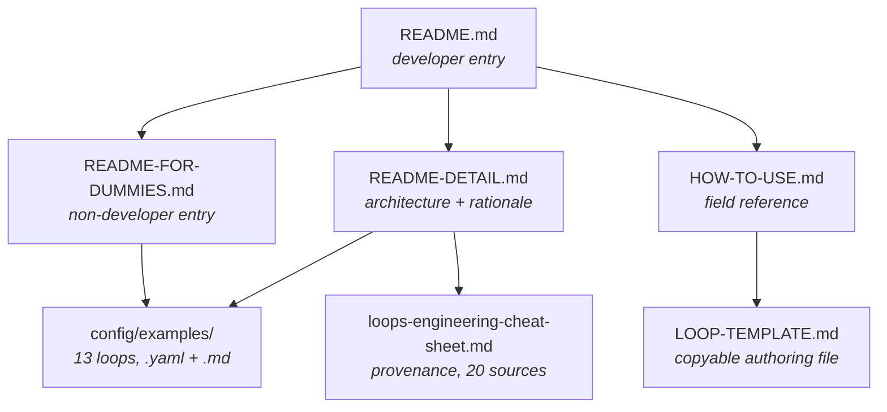

# Project Documentation

# Project Documentation

The prose layer of loopsmith: six top-level Markdown files plus the example corpus they point at. It is not incidental — several of these files are load-bearing artifacts that the build, the tests, and the CLI itself depend on. `LOOP-TEMPLATE.md` is a file users copy. `config/examples/*` is compiled into the binary. `loops-engineering-cheat-sheet.md` is the provenance record that justifies the architecture and is cited from `README-DETAIL.md`.

## Why there are six documents and not one

Each file is a complete description of the same system, pitched at a different reader, and the split is by **entry condition** rather than by topic. A reader who lands in the wrong one bounces; a reader who lands in the right one never needs the other five.

| File | Reader | Entry condition | What it uniquely owns |
|---|---|---|---|
| `README.md` | Developer evaluating the tool | Found the repo, hasn't run anything | Install matrix, the five-minute path, the front-end tour (`--guided`, `--web`), portability table |
| `README-FOR-DUMMIES.md` | Non-developer | Has a repeating job, does not write code | Markdown-config workflow (`loop.md`, not `loop.yaml`), the six sections worth editing, the "delete every `type: script` block" instruction |
| `README-DETAIL.md` | Contributor / architect | Has run a loop, wants to know why it's shaped this way | Command table, crate layout, the verifier-independence ladder, the named tests |
| `HOW-TO-USE.md` | Author writing a config | Editing `loop.yaml` and needs field semantics | Field-by-field A–J reference, detector portability, the permission preflight, the failure playbook |
| `LOOP-TEMPLATE.md` | Author starting from blank | Wants a file to fill in | A copyable `SKILL.md` with frontmatter and inline rationale per section |
| `loops-engineering-cheat-sheet.md` | Anyone questioning a design decision | "Why is the gate Rust?" | Per-source distillation of 20 sources, cross-cutting findings, `[unverified]` provenance markers |

Note the asymmetry: `README-FOR-DUMMIES.md` links *out* to examples and back to `README.md`, but nothing in the developer chain routes into it except one signpost. That is intentional — it is a leaf, and it must stay self-sufficient.

## The documentation-to-code coupling points

Four places where editing docs without editing code (or vice versa) produces a broken build or a lying document.

### `config/examples/` is compiled into the binary

The thirteen worked loops are not just documentation. `runtime/crates/loopsmith-cli` pulls them in with `include_str!`, which cannot reach above the package root, so `tools/sync-examples.sh` copies `config/examples/*.yaml` into `runtime/crates/loopsmith-cli/templates/examples/`. **A test fails if the two have drifted.** Editing an example is therefore a `cargo test`-visible change, not a prose change.

Each example ships as a `.yaml` and an equivalent `.md`, and a round-trip test holds the two grammars honest against every shipped example. Adding an example means adding both halves.

Every example ships with `pre_execution` unfinished — `validate` refuses them by design. Any doc that shows an example being run must show the refusal first, or it teaches users to skip the one step the tool exists to enforce.

The count "thirteen" appears in `README.md`, `README-DETAIL.md`, `README-FOR-DUMMIES.md`, and `HOW-TO-USE.md`. Adding a fourteenth example is a four-file edit plus a table row in three of them.

### `config/loop.schema.json` is the field authority

`HOW-TO-USE.md §5` and `LOOP-TEMPLATE.md` both enumerate fields. Neither is generated — both are hand-maintained mirrors of the schema plus the cross-field rules the schema cannot express (every goal having a blocking validation, targets resolving, `execution_guidelines` cycles, `no_progress_iterations_randomness < no_progress_iterations`). Those cross-field rules live only in `loopsmith_core::validate` and in prose; there is no third place that records them.

### The guided wizard's field list has three mirrors

`README-DETAIL.md` states the rule explicitly: `guided/mod.rs::stages()` is the source of the terminal wizard's order, `guided/sections.rs` holds the labels, defaults, validators and gates, and `web/src/guided/spec.ts` is a declarative mirror the browser walks. The documentation asserts there is deliberately no second field list with its own opinions. **A field added to one is a field the other is expected to grow** — and the docs claiming that parity are the only place the expectation is written down.

### Skills are documented and shipped

`skills/loopsmith/` (user-invoked, `disable-model-invocation: true`) and `skills/loopsmith-reference/` (model-invoked) are described in `HOW-TO-USE.md §2` and §3. The conventions in §3 — the 1,536-character cap on `description` plus `when_to_use`, keeping the body under 500 lines, putting all "when to use" information in the description because the body isn't loaded until after the load decision — apply to those two shipped skills *and* to any skill the loop generates into `generated-skills/`. §3 is a spec, not commentary.

## Invariants restated across files

Some claims appear in four or five documents. They are the load-bearing facts, and they must move together or the corpus starts contradicting itself.

| Invariant | Appears in |
|---|---|
| A model must not certify its own completion; `goal_satisfied` is written by `loopsmith-gate` and nothing else | all except the template |
| The gate can **revoke** — delete an artifact and a satisfied goal flips back | `README.md`, `README-DETAIL.md`, `HOW-TO-USE.md`, cheat sheet |
| `validate` fails on purpose until every `pre_execution` step is `done: true` | `README.md`, `README-DETAIL.md`, `README-FOR-DUMMIES.md`, `HOW-TO-USE.md`, `LOOP-TEMPLATE.md` |
| A `judge` verdict from the builder's own provider is **refused**, not discounted | `README-DETAIL.md`, `HOW-TO-USE.md`, `LOOP-TEMPLATE.md` |
| Every goal needs at least one blocking validation or the config is rejected | `README-DETAIL.md`, `HOW-TO-USE.md`, `LOOP-TEMPLATE.md` |
| Cron is evaluated in **UTC**; prefer `interval` for plain cadence | `README.md`, `README-DETAIL.md`, `HOW-TO-USE.md`, `LOOP-TEMPLATE.md` |
| `requires_env` names keys; values are never read, substituted, or logged | `README.md`, `README-DETAIL.md`, `HOW-TO-USE.md`, `LOOP-TEMPLATE.md` |
| Pull an `ollama` model first; the starter provider sits at `timeout_seconds: 120` | `README.md`, `README-DETAIL.md`, `HOW-TO-USE.md`, `LOOP-TEMPLATE.md` |
| `--path` is mandatory for `new` | `README.md`, `README-DETAIL.md`, `HOW-TO-USE.md`, `LOOP-TEMPLATE.md` |
| The loop proposes goals/validations/success/skills; it never applies them | `README-DETAIL.md`, `HOW-TO-USE.md`, `LOOP-TEMPLATE.md`, `README-FOR-DUMMIES.md` |

The MCP invariant is a special case: `README-DETAIL.md` notes the server exposes plan, ledger, gate verdict, and scratchpad, and has **no tool for marking a goal satisfied** — and that a test (`there_is_no_tool_for_declaring_a_goal_satisfied`) asserts the absence. That's the pattern to imitate. Where a documented guarantee has a named test, cite the test; the citation is what stops the guarantee from being removed quietly.

## Conventions

**Every Mermaid diagram carries a plain-text fallback.** `README-DETAIL.md` pairs each `mermaid` block with an ASCII box-drawing equivalent, explicitly "for a terminal with no image or mermaid support." `README-FOR-DUMMIES.md` leads with the ASCII picture and offers the Mermaid version second. Diagrams also come in a third form — a PNG in `assets/` (`architecture.png`, `guided-flow.png`, `web-guided-flow.png`) inside a `
`. New diagrams are expected to ship at least the Mermaid + ASCII pair.

**Tables over prose for anything enumerable.** Detector types, stop gates, platform differences, failure modes, "does on its own / only proposes" — all tables. The detector table specifically is always ordered **strongest first** (`script` → `file_exists` → `regex_match` → `threshold` → `judge`), in every file where it appears, because the ordering *is* the advice.

**Claims are shown, not asserted.** Where a document states a behaviour it prefers to paste the actual terminal output — the `pre_execution` refusal, `judgment refused: judge and builder both ran on 'claude'`, the `loopsmith providers` availability listing, the `plan` wave output with its Amdahl arithmetic, `skills scores`. These are transcript excerpts and go stale if output formats change.

**Rationale is inline, under a stable heading.** `LOOP-TEMPLATE.md` uses a literal `*Why it exists:*` line under every A–H section. `HOW-TO-USE.md` uses tables titled by consequence ("Why" columns). Neither hides the reasoning in a separate rationale document — the cheat sheet is for *provenance*, not for *why this field exists*.

**Uncertainty is marked.** The cheat sheet flags eighteen of twenty sources as self-published and tags every figure that drives a design decision `[unverified]` or `[unverified, secondhand]`. It names the one authoritative source (the official Claude Code skills documentation). Preserve those markers; they are the reason the design section can be trusted at all.

## `LOOP-TEMPLATE.md` is executable-ish, not just prose

It opens with YAML frontmatter (`name`, `description`, `argument-hint`, `arguments`, `allowed-tools`, `disable-model-invocation`) because it is meant to be copied to `<your-loop>/SKILL.md`. Its `REPLACE ME` markers are the fill-in slots. The body deliberately stays thin — the file itself explains why:

> the config is data the runtime validates, and data in a config file can be checked, diffed, and scheduled. Prose in a skill body cannot.

Consequence for maintainers: content added to `LOOP-TEMPLATE.md` should be a config example plus one line of rationale, never a paragraph of guidance. Guidance belongs in `HOW-TO-USE.md`, which the template points to. The closing "Checklist before first run" is the one place in the corpus that collapses every invariant into a pre-flight list; it is worth updating whenever a new invariant lands.

## `loops-engineering-cheat-sheet.md` and the provenance chain

Structurally different from everything else: it is a distillation of `planning/docs/loops-engineering/` (33 files, 20 unique sources) with a **traceability table** mapping each source's load-bearing idea to the component that implements it. Section 3 (*What loopsmith Takes From This*) is the explicit corpus-idea → component → enforcement mapping.

This is what `README-DETAIL.md`'s *Why the gate is Rust* section defers to. The four-rung ladder — separate prompt, separate context, separate model family, separate mechanism — originates here (§2.2), and `loopsmith-gate` sitting at rung 4 is the sentence the whole architecture hangs on. The cheat sheet also records what was **rejected** and why, which is the part that stops a rejected idea from being re-proposed a year later.

Amdahl's table (§2.4) is duplicated as a doc claim *and* as the test `amdahl_matches_the_published_table`. That is the tightest doc-to-code binding in the repo: the published table is the oracle.

## Contributing to the docs

### When you add a config field

1. `config/loop.schema.json` — the field itself.
2. `HOW-TO-USE.md §5` — semantics, defaults, and any cross-field rule the schema can't express.
3. `LOOP-TEMPLATE.md` — only if it belongs in a starter config; add the YAML plus one `*Why it exists:*` line.
4. `guided/sections.rs` and `web/src/guided/spec.ts` — if the wizard should ask for it.
5. `README-DETAIL.md` §*The A–J model* — only if it's a new section, not a new field.

### When you add a CLI command

`README-DETAIL.md`'s command table is the canonical list. `README.md`'s *While it runs* table and `README-FOR-DUMMIES.md`'s equivalent table carry only the subset a running loop needs. `HOW-TO-USE.md` documents commands where they're relevant to a workflow section, not in a table of their own.

### When you add an example loop

Both `.yaml` and `.md`, run `tools/sync-examples.sh`, then update the count and the annotated row in `README.md`, `README-DETAIL.md` (*The examples*), and `README-FOR-DUMMIES.md` (*What people use it for*). Leave `pre_execution` unfinished. `cargo test` catches a missed sync; nothing catches a missed count.

### When you change a default or a message

Grep for the pasted terminal output. The refusal text, the `providers` listing, the `plan` block, and the spend line all appear verbatim in more than one file.

## Known drift

Worth fixing on the next pass, and worth knowing about before you cite these files:

- **The A–H / A–J mismatch.** The model has ten sections. `HOW-TO-USE.md §1` still labels the core crate "A–H config model and validation", §4 calls the scaffolded file "the A–H config", and `LOOP-TEMPLATE.md`'s main heading is "The A–H model" despite the corpus documenting `I · execution_guidelines` and `J · default_skills` elsewhere. `README.md` and `README-DETAIL.md` say A–J. The template's checklist and the `HOW-TO-USE` architecture block are the stale ones.
- **Duplicate `## Architecture` heading in `README-DETAIL.md`.** Two sections share the name, so the `#architecture` anchor in the nav header resolves to the first (the ASCII plane diagram) and the second (the three-front-ends / one-`LoopConfig` explanation) is unreachable by link.
- **`skills` appears in two lists.** `README-DETAIL.md`'s architecture block lists six crates under the control plane and omits `skills`; `HOW-TO-USE.md §1` lists seven and includes it. The repository-layout tree in `README-DETAIL.md` lists all eight published crates.
- **Hardcoded counts.** The `tests-415 passing` badge appears in two files and the "415 tests, no warnings" line in a third. Nothing verifies them.
- **`config/marketplaces.json` vs `runtime/crates/loopsmith-cli/templates/marketplaces.json`.** The repository-layout tree names the former; the trust-floor prose in both `README-DETAIL.md` and `HOW-TO-USE.md §8` points at the latter. Only one is the file the binary reads.