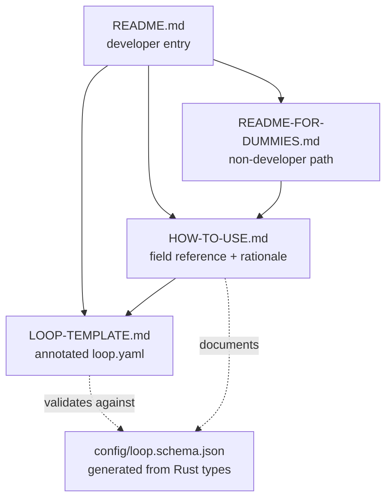

# Project Documentation

# Project Documentation

The `loopsmith` repository ships four root-level documents plus a template. They are not four versions of the same text — each one is written for a different reader arriving with a different question, and they cross-link rather than repeat. This page describes what each file owns, the rules that keep them from drifting apart, and where to make a change when behavior changes.

## The four documents

| File | Reader | Question it answers |
|---|---|---|
| `README.md` | A developer evaluating the tool | What is this, how do I install it, what does a loop look like? |
| `README-FOR-DUMMIES.md` | Someone who does not write code | Can I use this, and what do I actually type? |
| `HOW-TO-USE.md` | Someone writing or debugging a config | What does every field mean, and why does it exist? |
| `LOOP-TEMPLATE.md` | Someone authoring a loop right now | What goes in `loop.yaml`, slot by slot? |

`README-DETAIL.md` and `loops-engineering-cheat-sheet.md` also live at the root but are not part of the maintained set described here.

### `README.md`

The entry point. It carries the install matrix (crates.io, npm, PyPI, Homebrew, and `./install.sh` / `install.bat`), the five-minute walkthrough, the three front ends (`--web`, `--guided`, plain config editing), scheduling, the portability table, and the "While it runs" command reference.

Two things in it are load-bearing and easy to break on edit:

- **The install section carries operational caveats, not just commands.** Homebrew accepts only `bitphill/loopsmith/loopsmith` or a separate `brew tap` + `brew install`; the two-component form is read as a core formula and fails. Homebrew 6's `brew trust` gate is documented because it is per-tap, not per-formula. The npm and PyPI package names (`@bitphill/loopsmith`, `loopsmith-cli`) differ from the binary name because the plain names were already taken. Each of these exists because someone hit it.
- **The `validate`-fails-on-purpose block.** The README shows the real error text for unfinished `pre_execution` steps and states outright that the refusal is the most valuable thing the tool does. Every document in the set repeats this in its own register; none of them soften it.

### `README-FOR-DUMMIES.md`

The non-developer path, linked prominently from the README's TL;DR. It is a parallel route to the same product, not a simplified summary — it assumes no YAML knowledge and no terminal fluency ("Mac: press `⌘ + Space`, type *Terminal*").

Its structural choices:

- **Fifteen examples first.** The table of `config/examples/*.md` loops leads the document, because reading a working config is faster than reading a schema.
- **One diagram twice.** The loop idea is drawn as ASCII art and then again as Mermaid — the ASCII version survives contexts where Mermaid does not render, and both put the AI strictly on the left of the pass/fail diamond.
- **Six things you edit, and only six.** Prerequisites, Goals, Checks, Stop gates, Triggers, Limits. Everything else in `loop.md` is explicitly declared off-limits for this reader.
- **A hard-coded gotcha.** Readers are told to delete every `type: script` check from an example, because script detectors need a script file that examples do not ship. This is the single most likely first-run failure for a non-developer, called out inline rather than left to the troubleshooting table.

### `HOW-TO-USE.md`

Fourteen numbered sections, the longest document in the set, and the one that carries the reasoning. §5 is the field-by-field configuration reference; the rest covers architecture, the two skills, providers and BYOK, the permission preflight, sub-agent acquisition, the memory ledger, a failure playbook, self-evolution, promotion, and long-running operation.

§14, *Where the design came from*, is the design rationale: twenty sources distilled, what each contributed, what was rejected and why, and a self-imposed source-quality warning marking uncorroborated claims `[unverified]`. It was a separate file before 1.0 and was merged in on the stated principle that a rationale living beside the design it explains is one that gets read.

### `LOOP-TEMPLATE.md`

The authoring surface: a complete annotated `loop.yaml` wrapped in a `SKILL.md` frontmatter block. Every section is a real YAML fragment followed by a *"Why it exists"* paragraph, and the document closes with a pre-first-run checklist. `loopsmith loop new --path <dir>` writes the same two files, so the template is the manual path to what the scaffolder produces.

## How they connect


```mermaid
flowchart TD
    R["README.md<br/>developer entry"]
    D["README-FOR-DUMMIES.md<br/>non-developer path"]
    H["HOW-TO-USE.md<br/>field reference + rationale"]
    T["LOOP-TEMPLATE.md<br/>annotated loop.yaml"]
    S["config/loop.schema.json<br/>generated from Rust types"]
    R --> D
    R --> H
    R --> T
    D --> H
    H --> T
    T -.validates against.-> S
    H -.documents.-> S
```

The dotted edges matter more than the solid ones. `config/loop.schema.json` is **generated from the Rust types**, so the prose in `HOW-TO-USE.md` §5 and `LOOP-TEMPLATE.md` describes a schema it cannot change. Cross-field rules a JSON Schema cannot express — a goal with no blocking check, a judge that would grade its own provider, `no_progress_iterations_randomness` not strictly below `no_progress_iterations` — live in `loopsmith loop validate`, and the docs name that as their enforcement point rather than implying the schema does it.

## The invariants the docs enforce

Four claims appear in every document, in different words. They are the reason the set holds together, and changing one means editing four files.

**A model must not certify its own completion.** `goal_satisfied` is written by `loopsmith-gate` and by nothing else. The README states it as the design's single rule; `README-FOR-DUMMIES.md` renders it as "the AI never gets to say 'done'"; `HOW-TO-USE.md` §14.2.2 gives the four-rung independence ladder (separate prompt → separate context → separate model → separate mechanism) and places the gate at rung four.

**The gate can revoke.** Delete a required artifact and a satisfied goal flips back. `HOW-TO-USE.md` §14.1 names this the grading test for the whole system: *can it take "done" back?* A system that can only promote is a burndown chart with extra steps.

**`validate` refuses on process, not just syntax.** `intent.prerequisites` must be all `done: true`. This is documented as the only place the tool refuses on a matter of process, and every document says the refusal is deliberate.

**The loop proposes; a human applies.** Goals, checks, success criteria, and skill adoption are written to `proposals/`. The loop may acquire and trial sub-agents on its own, but they land in quarantine. Both `HOW-TO-USE.md` §11 and `LOOP-TEMPLATE.md` carry the same two-column "does on its own / only proposes" table.

## Configuration surface, as documented

The docs describe eight top-level keys: `name`, `version`, `description`, `environment`, `features`, and four bundles.

```yaml
intent:      # background, prerequisites, goals, success
execution:   # graph, providers, phases, default_skills, skills, memory, triggers
safety:      # checks, gates, limits, recovery, protected, alerts
evolution:   # enabled, baseline, max_regression, allowed_kinds, ...
```

`features` sits above the bundles because its five switches (`self_evolution`, `marketplace_skills`, `external_side_effects`, `parallel_execution`, `human_approval`) are capabilities rather than settings — two decide what the loop can *become*, two decide whether its limits are real.

**0.3 configs still parse.** The lettered keys — `information`, `pre_execution`, `goals`, `validations`, `success`, `stop_gates`, `schedules`, `constraints`, `execution_guidelines`, `default_skills` — are relocated into the bundles by one table as the file is read, with a warning naming each moved key. `loopsmith loop migrate --write` rewrites a file using that same table, which is why the migrator cannot disagree with the parser. The full mapping lives in `wiki/Migration-0-3-To-1-0.md`.

Section **A**–**J** language still appears in `README.md` and `README-FOR-DUMMIES.md` (Gates are **F**, Triggers **G**, and so on) because those are the headings a 0.3-shaped Markdown config still uses. A reader following the dummies guide edits a `loop.md` with lettered sections; a reader following the template writes a bundled `loop.yaml`. Both are valid input — keep that in mind before "fixing" one document to match the other.

## Documentation-adjacent machinery

Three things outside these files keep the docs honest, and a docs change may need one of them updated too:

- **Compiled-in examples.** All fifteen `config/examples/*.yaml` are compiled into the binary with `include_str!` for the web UI. `tools/sync-examples.sh` copies them into `runtime/crates/loopsmith-web/templates/examples/`, and a test fails if the two have drifted — so a stale copy is caught by `cargo test` rather than by a user.
- **One wizard spec, two front ends.** `--guided` and the browser walk-through both render the spec the wizard crate serves at `/api/wizard/spec`. Neither front end can ask a question the other does not, which is why `README.md` and `HOW-TO-USE.md` §4b can describe them as the same interview.
- **The generated schema.** `config/loop.schema.json` comes from the Rust types. If a field's meaning changes, the schema follows the code automatically; the prose does not.

## Writing conventions in this set

Observable across all four files, and worth matching:

- **Every rule states its cost.** Not "set `max_cost_usd`" but "a loop with only an iteration cap and an expensive provider is an unbounded bill waiting for a slow night." Claims of the form *X is refused* are paired with what goes wrong if it were allowed.
- **Tables carry the reference load, prose carries the reasoning.** Field lists, detector strength orderings, failure-class defaults, and platform differences are tables. The paragraph after the table says why the defaults are unequal.
- **Commands appear as they are typed, with real output.** The `loopsmith providers` sample shows an `unavailable  missing env: OPENAI_API_KEY` line; the `validate` failure shows its actual error text.
- **Exit codes and edge semantics are stated explicitly.** `require` and `need_bash` exit **2**, not 1, because "this machine cannot run the check" is a different fact from "the check failed". `file_change` and `goal_satisfied` fire on the edge, not the level. Cron is evaluated in UTC, with the reason given.
- **No superlatives about the tool.** The closest the set comes to a boast is the CI note — the three-platform claim is described as "something that gets checked rather than something written down."

## Where to make a change

| What changed | Edit |
|---|---|
| A config field's meaning or default | `HOW-TO-USE.md` §5 **and** the matching fragment in `LOOP-TEMPLATE.md` |
| A new CLI command or flag | `README.md` (the relevant section + "While it runs" if it's a query command) |
| A new failure mode users will hit | `HOW-TO-USE.md` §10 playbook **and** the "When something goes wrong" table in `README-FOR-DUMMIES.md` |
| A new example loop | `config/examples/`, both tables (`README.md` §Examples, `README-FOR-DUMMIES.md` §What people use it for), and run `tools/sync-examples.sh` |
| Install mechanics for a registry | `README.md` §Install + §Packages table, and the one-line form in `README-FOR-DUMMIES.md` |
| A platform difference | `README.md` §Portability table, and `HOW-TO-USE.md`'s `compat.sh` helper table if a helper is involved |
| Design reasoning behind a rule | `HOW-TO-USE.md` §14 — mark unverified claims `[unverified]`, as the existing entries do |

A field change that touches only one of `HOW-TO-USE.md` §5 and `LOOP-TEMPLATE.md` is the most common drift in this set. They describe the same schema from two angles — reference and worked example — so they move together.