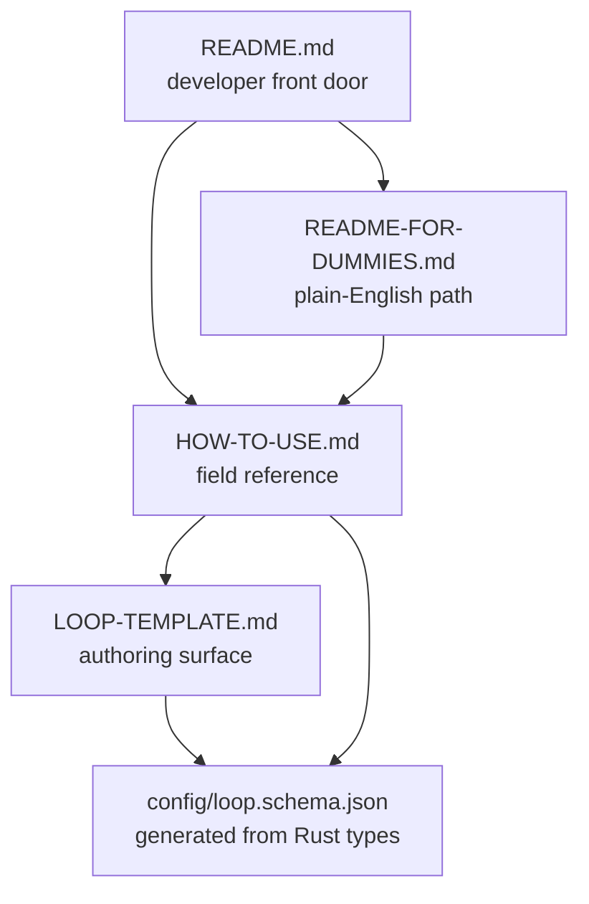

# Project Documentation

# Project Documentation

The `loopsmith` documentation set is not a byproduct of the code — it is a layer of the product. Four files at the repository root carry the whole surface a user can reach without reading Rust, and each one is written for a different reader arriving with a different question. This page explains what each file is responsible for, the invariants that hold across all of them, and what you have to update when you change the runtime.

## The four documents

| File | Reader | Question it answers |
|---|---|---|
| `README.md` | a developer evaluating the tool | What is this, how do I install it, what does a config look like? |
| `README-FOR-DUMMIES.md` | a non-developer with a repeating job | Can I use this without learning YAML, and what do I edit? |
| `HOW-TO-USE.md` | someone authoring a real loop | What does every field mean, and why does it exist? |
| `LOOP-TEMPLATE.md` | someone writing `loop.yaml` right now | What goes in this slot? |

`README-DETAIL.md` was deleted; its design-rationale content now lives in `HOW-TO-USE.md` §14, on the stated principle that *a design rationale that lives beside the design it explains is one that gets read*. Do not reintroduce a separate rationale file.

The entry points fan out rather than nest:

```mermaid
flowchart TD
    R["README.md<br/>developer front door"] --> D["README-FOR-DUMMIES.md<br/>plain-English path"]
    R --> H["HOW-TO-USE.md<br/>field reference"]
    D --> H
    H --> T["LOOP-TEMPLATE.md<br/>authoring surface"]
    T --> S["config/loop.schema.json<br/>generated from Rust types"]
    H --> S
```

`config/loop.schema.json` is the terminal node and the only machine-readable one. It is **generated from the Rust types**, not hand-written, so prose in the three documents above it can drift from the runtime while the schema cannot. That asymmetry is the main hazard this module has.

## The thesis every document restates

All four files are organised around one claim, and none of them may soften it:

> A model must not be the thing that certifies its own completion.

The concrete form: `goal_satisfied` is written by `loopsmith-gate` and by nothing else, and the gate can **revoke** — delete a required artifact and a satisfied goal flips back. `HOW-TO-USE.md` §14.2.2 gives the reasoning as a four-rung independence ladder (separate prompt → separate context → separate model → separate mechanism), and places the gate at rung 4.

Each document says this at its own reading level. `README.md` states it as a block quote in the opening. `README-FOR-DUMMIES.md` renders it as an ASCII diagram where the AI is only ever on the left of the pass/fail diamond, captioned *"It cannot mark its own homework."* `HOW-TO-USE.md` derives it from the corpus. `LOOP-TEMPLATE.md` enforces it as a checklist item (*judge nodes pinned to a different provider family than their builder*). When you touch one, check that the others still agree.

## Structure of `HOW-TO-USE.md`

This is the largest document and the one most likely to go stale. Fourteen numbered sections, with §5 doing most of the work:

- **§1** — the three-plane architecture (invocation, control plane, execution) as a `text` block listing the crates: `core`, `graph`, `memory`, `gate`, `provider`, `skills`, `run`, `wizard`, `web`, `util`, `mcp`.
- **§2–§4** — the two skills (`loopsmith`, `loopsmith-reference`), frontmatter conventions, and what `loopsmith loop new --path` writes.
- **§4b** — the browser UI. Structurally separate from §4 because `--web` is an alternative front end, not a step in the same flow.
- **§5** — the configuration reference. One subsection per dotted path, in the order of the model itself: `intent` → `execution` → `safety` → `evolution`, then `features` and `environment`.
- **§6–§13** — operational concerns: BYOK providers, the permission preflight, sub-agent acquisition, the ledger, the failure playbook, proposals, the promotion path, long runs.
- **§14** — provenance. Twenty sources, what each contributed, what was rejected and why.

### The §5 ordering is load-bearing

`§5` follows the config's own shape: eight top-level keys, four of which are bundles grouping sections *by what they are for*. Every subsection heading is written as `` `dotted.path` · Human name `` — for example `` `intent.prerequisites` · Pre-execution work ``. The second half of that heading is the 0.3-era lettered name, which keeps the document searchable for anyone arriving from an old config. Keep both halves when you add a field.

### Each field says *why it exists*

The convention across §5 and all of `LOOP-TEMPLATE.md` is that a field's documentation leads with the failure it prevents, not with its type. The type is in the schema. Examples of the house voice:

- `intent.background` — "every node starts fresh with only its spawn prompt. Whatever is not here has to be rediscovered, badly, by each of them."
- `safety.gates.stop` — "a loop with no exit runs until it succeeds, breaks, or drains the account."
- `safety.protected` — "A loop allowed to edit its own limits does not have limits."

This is not decoration. The browser UI's ⓘ affordances and the `:help` text in `loopsmith --guided` serve the same explanations, so a field whose documentation is only a type signature produces a wizard prompt a user cannot answer.

## Structure of `LOOP-TEMPLATE.md`

A copyable `SKILL.md` with YAML frontmatter (`name`, `description`, `argument-hint`, `arguments`, `allowed-tools`, `disable-model-invocation: true`) followed by the full annotated config. Every placeholder is literally `REPLACE ME`, which is what makes it greppable.

Two properties to preserve:

1. **The body stays thin.** The file says so explicitly: "the config is data the runtime validates, and data in a config file can be checked, diffed, and scheduled. Prose in a skill body cannot." Resist the urge to move explanation out of the YAML comments and into paragraphs.
2. **The closing checklist is the fast path.** Fourteen checkboxes covering the cross-field rules a JSON Schema cannot express — every goal has a blocking check, `no_progress_iterations_randomness` strictly below `no_progress_iterations`, parallel builders given `isolation: { mode: worktree }`, a budget ceiling that can actually fire. These correspond one-to-one with refusals in `loopsmith loop validate`. Adding a cross-field validation rule to the runtime means adding a line here.

## Structure of `README-FOR-DUMMIES.md`

Written to a hard constraint: **no YAML schema knowledge, and no assumption that the reader has a terminal habit**. Terminal is explained down to `⌘ + Space`. It uses three Mermaid `flowchart LR` diagrams, deliberately small — the six things you edit, the schedule decision, and the run cycle — because a wide graph is unreadable on a phone.

Two things in this file are easy to break:

- **It links to `.md` examples, not `.yaml`.** Every row of the uses table points at `config/examples/<name>-loop.md`. The `README.md` equivalent table points at `.yaml`. Both files must exist for all fifteen examples; `loopsmith loop convert` is what keeps the pair in sync.
- **The `type: script` warning.** The file tells the reader to grep `loop.md` for `type: script` and delete those blocks, because a script detector needs a file the shipped examples do not include. If an example ever ships a working script detector, that instruction becomes wrong and destructive.

## Invariants across the set

These hold in more than one file, so a change in one place is a change in several.

**Fifteen examples, everywhere.** The count appears in `README.md` (twice), `README-FOR-DUMMIES.md` (three times), and `HOW-TO-USE.md` §4b. All fifteen `config/examples/*.yaml` are compiled into the binary with `include_str!`; `tools/sync-examples.sh` copies them into `runtime/crates/loopsmith-web/templates/examples/`, and a test fails if the two have drifted. Adding an example means: the `.yaml`, the `.md`, the sync script run, and every prose count.

**Both spellings of the front ends.** `loopsmith --web` / `loopsmith web`, and `loopsmith --guided` / `loopsmith loop guided`. `HOW-TO-USE.md` §4b states the reasoning — "Both spellings exist and neither is the real one" — and that `--web` combined with a subcommand is refused rather than silently resolved. Document both forms wherever either appears.

**Secrets: name only.** Every file that mentions API keys repeats the same rule: `requires_env` records the key *name*, values are never read, substituted, or logged. `README.md` adds an explicit warning about pasting keys into chats or issues. Do not add an example that inlines a key value, even a fake one.

**`validate` fails on purpose.** All four documents say that `loopsmith loop validate` refuses while any `intent.prerequisites` step is `done: false`, and all four say it is deliberate rather than a bug. `README.md` calls it "the most valuable thing the tool does." Keep the framing — a reader who thinks this is a defect files an issue.

**Three-platform claims are checked.** The `README.md` portability table (launchers, scheduler, home directory, `compat.sh`) makes claims CI verifies on `ubuntu-latest`, `macos-latest`, and `windows-latest`. Nothing in that table is decided at build time: the userland is probed by asking `sed` for a version, and the scheduler is whichever candidate is on `PATH`. If you edit that table, the claim has to remain one CI can fail on.

## What to update when the runtime changes

| Change | Also touch |
|---|---|
| New config field | `HOW-TO-USE.md` §5 subsection, `LOOP-TEMPLATE.md` YAML block + its "why it exists" note |
| New cross-field validation rule | `LOOP-TEMPLATE.md` pre-flight checklist, `HOW-TO-USE.md` §10 failure playbook |
| New detector type | The detector table in both `HOW-TO-USE.md` §`safety.checks` and `LOOP-TEMPLATE.md` (both are ordered strongest-first, `judge` last) |
| New stop reason | `HOW-TO-USE.md` §10, `README-FOR-DUMMIES.md` "When something goes wrong" |
| New `compat.sh` helper | The helper tables in `README.md` §Portability and `HOW-TO-USE.md` §`safety.checks` |
| New example loop | Both example tables, all four prose counts of "fifteen", `tools/sync-examples.sh` |
| New CLI subcommand | `README.md` "While it runs" table, `README-FOR-DUMMIES.md` equivalent table, `LOOP-TEMPLATE.md` "Run it" block |
| New crate | `HOW-TO-USE.md` §1 architecture block, `README.md` library list |

## Voice

Consistent across the set and worth matching:

- **A rule is stated with its consequence, in one sentence.** "A loop allowed to edit its own limits does not have limits." "An approval gate whose detector can satisfy itself is not an approval, it is a delay." "A system that can only promote is a burndown chart with extra steps."
- **Refusals are framed as features.** Wherever the tool declines to proceed, the documentation says why declining is correct.
- **Unverified claims are marked.** §14 flags eighteen of twenty sources as self-published and tags figures `[unverified]`. Star counts and benchmark numbers are recorded as context, never as the basis for a default.
- **No em-dash-free hedging and no marketing superlatives.** Numbers are specific ("1,536 characters", "timeout_seconds: 120", "bash 3.2") and each one is there because something broke without it.