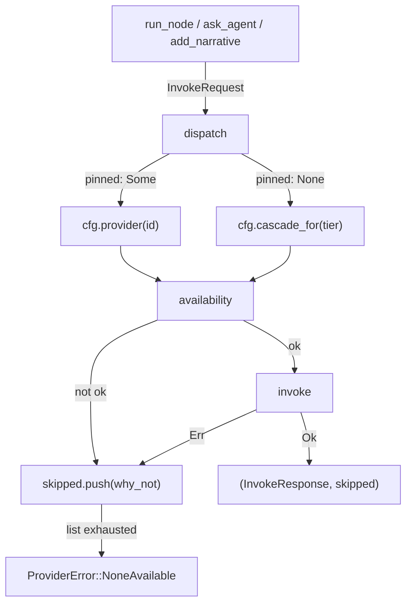

# Provider Integration

# Provider Integration (`loopsmith-provider`)

Every model call in loopsmith goes out through this crate. It is small on purpose: a provider is a *command template*, and the crate's job is to pick one, run it, and report honestly on what happened.

## The single design decision

There is no HTTP client here, no SDK, no per-vendor Rust module. A provider is a program you run with a prompt. Claude Code (`claude -p {prompt}`), Ollama (`ollama run {model}` with the prompt on stdin), an OpenAI-compatible endpoint (`curl` with a JSON body on stdin), a Grok CLI, an MCP server over stdio — they all reduce to the same shape, described by `loopsmith_core::ProviderSpec`.

Two consequences follow directly:

- **Adding a provider is a config edit.** No Rust change, no rebuild. BYOK is not a feature that had to be built; it falls out of the shape.
- **Secrets never enter this process.** `requires_env` names variables that must *exist*. `availability` checks `std::env::var_os(k).is_none()` and keeps only the names of the missing ones. Values are never read, never substituted into arguments, never logged. The `openai` starter spec passes the literal string `Authorization: Bearer $OPENAI_API_KEY` — `curl` expands it, so the key lives in the child's environment and nowhere else. The test `a_provider_with_missing_env_is_unavailable_and_names_only_the_key` asserts the diagnostic string contains no `=`, which is the leak that would happen if anyone ever changed `var_os` to `var`.

## The two entry points

Callers use `dispatch` almost always, and `invoke` when they already know which provider they want.

### `dispatch(cfg, req, pinned) -> Result<(InvokeResponse, Vec<String>), ProviderError>`

Walks a cascade. `pinned` short-circuits the whole thing to a single provider looked up by id (`cfg.provider(id)`); otherwise the tier in `req.tier` selects an ordered candidate list via `cfg.cascade_for`. For each candidate in order:

1. `availability(spec)` — is the binary on PATH and is every `requires_env` name present?
2. If not, push `"{id} ({why_not})"` onto `skipped` and continue.
3. `invoke(spec, req)` — on `Ok`, return immediately; on `Err`, push `"{id}: {e}"` and continue.

The returned `Vec<String>` is not decoration. It is *why* the call landed where it did, and the ledger records it. When the list is exhausted, `ProviderError::NoneAvailable` carries the same accumulated reasons joined with `; ` — so an exhausted cascade tells you every attempt, not just the last. If the tier had no providers declared at all, `tried` reads `"none declared"` rather than an empty string.

Note what `dispatch` does *not* do: there is no retry of a provider that already failed, and no reordering. The cascade is exactly the order in config.

### `invoke(spec, req) -> Result<InvokeResponse, ProviderError>`

Runs one provider. The mechanics, in order:

**Placeholder substitution.** `render` replaces `{prompt}`, `{system}`, `{model}`, `{tier}`, and `{node}` in each element of `spec.args`. Substitution is a plain `String::replace` per key — unknown placeholders are left in the string verbatim (`unknown_placeholders_are_left_alone`), which means a typo in a config template surfaces as a strange argument reaching the child rather than as a silent empty value. `{model}` renders to the empty string when `spec.model` is `None`. `{tier}` comes from `tier_name`, which is the lowercase spelling used in cascade config keys.

**Spawn.** `Command::new(&spec.command)` with the rendered args, `current_dir(&req.workdir)`, stdout and stderr piped. Stdin is piped when `spec.prompt_on_stdin` is set and `Stdio::null()` otherwise. In stdin mode the write is deliberately `let _ =` — a broken pipe means the child already exited, and the exit-code path below reports that far more usefully than an io error would.

**Timeout.** `std::process` has no timeout, so `invoke` polls `try_wait()` every 50 ms against `spec.timeout_seconds`. On expiry it kills and reaps the child and returns `ProviderError::Timeout`. This is the one place the crate accepts a busy-ish wait; the alternative was an async runtime for a single feature. If `timeout_seconds` is `None`, the loop waits forever — a provider that hangs with no configured timeout hangs the node.

**Failure is loud.** A non-zero exit is `ProviderError::Failed` carrying the *last line* of stderr, never a silent pass-through of partial output. `a_nonzero_exit_is_an_error_not_a_silent_pass` guards this.

## Accounting: tokens and cost

`InvokeResponse` carries `tokens`, `tokens_estimated`, and `cost_usd`. The resolution order after a successful run:

1. `parse_usage(spec, stdout)` — compile `spec.usage_regex`, prefer capture group 1, fall back to the whole match, strip `,` and `_`, parse `u64`.
2. If that yields nothing, `parse_usage(spec, stderr)`. Providers scatter usage across both streams; both get checked.
3. Otherwise `estimate_tokens(&req.prompt, &stdout)` — four characters per token, rounded up with `div_ceil`.

Every fallible step in `parse_usage` uses `?` or `.ok()`, so a malformed `usage_regex` does not error the call; it silently degrades to an estimate (`a_malformed_usage_regex_falls_back_to_estimating`). That is a deliberate trade: an approximate ceiling that fires beats an exact one that never does, which is what an unaccounted budget gate amounts to. `tokens_estimated` is the flag that keeps this honest — a budget report can say which number it is looking at.

`cost_usd` is `Some` only when both a token count and `spec.cost_per_1k_tokens` exist: `(tokens / 1000.0) * rate`. No rate configured means `None`, never a guessed price.

## Supporting pieces

| Item | Role |
|---|---|
| `Availability { on_path, missing_env }` | `ok()` is `on_path && missing_env.is_empty()`; `why_not()` renders the human-readable reason the cascade records |
| `which` | Re-exported from `loopsmith-util`. The implementation moved there after turning out to exist three times across the workspace in three states of correctness — this re-export keeps the old path working |
| `digest(s)` | 64-bit FNV-1a, hex-formatted. Not cryptographic. Its only job is letting the ledger say "same prompt as before" without storing the prompt twice. `run_node` calls it for prompt provenance |
| `starter_providers()` | The five specs `loopsmith init` writes into a fresh config, via `loopsmith-cli`'s `starter_config` |

### On the starter set

The five starters cover all three tiers (asserted by `starter_providers_cover_every_tier`), and unavailable ones are skipped rather than fatal — a fresh install works with whatever the user happens to have. Two specs encode a lesson worth keeping:

- **`ollama` is 120s, not 600s.** `ollama run <model>` pulls the model when it is absent, and from outside the process a 4.7 GB download is indistinguishable from slow generation. One observed run spent its entire 600-second budget downloading and produced nothing. A cheap tier exists to be abandoned quickly, so the timeout is tuned to fall through to the next provider rather than to accommodate a pull. Run `ollama pull llama3` first.
- **`openai` is the only starter with a `usage_regex` and a rate.** Its response body carries `total_tokens`, so its cost ceiling is measured rather than estimated.

## How it connects

Upstream, three call sites in the CLI build an `InvokeRequest` and call `dispatch`: `run_node` (`src/run/dispatch.rs`, the main node execution path, which also calls `digest`), `ask_agent` (`src/run/perturb.rs`), and `add_narrative` (`src/run/summary.rs`). `execute` in `src/cmd/providers.rs` calls `availability` directly — that is the `loopsmith providers` command reporting what is usable right now, and it is the flow that reaches down through `which` → `first_executable` → `is_executable`/`path_extensions` in `loopsmith-util` for platform-correct PATH resolution.

Downstream, this crate depends only on `loopsmith-core` for the config model (`LoopConfig`, `ProviderSpec`, `ProviderKind`, `Tier`, and the `provider`/`cascade_for` lookups) and `loopsmith-util` for `which`. It knows nothing about the gate, the graph, or memory.

That last point is the boundary that matters. **A model must not certify its own completion.** `goal_satisfied` is written by `loopsmith-gate` and by nothing else. This crate runs models and reports what they said; it has no path to the gate and no way to influence whether a goal is considered met. Keep it that way when extending it.

## Contributing notes

- **Adding a provider should not mean touching this file.** If a new provider needs a Rust change, that is a signal the `ProviderSpec` shape is missing something — extend the spec in `loopsmith-core`, not the dispatch logic here.
- **Never read an env var's value.** `availability` uses `var_os(...).is_none()` and keeps names only. Any change that reads a value puts a secret one `Debug` impl away from the ledger.
- **Tests are hermetic and use real binaries.** `echo`, `cat`, `false`, `sleep`, `sh` — no mocks and no network. `a_usage_regex_extracts_the_real_count` carries a note worth reading before you write another: its payload deliberately avoids double quotes, because embedding them in an argument makes the test depend on platform escaping, and Windows escapes differently. It failed there once for a reason unrelated to usage parsing.
- **`Cargo.toml` ships `src/` only.** The integration tests read `config/examples/` and `config/loop.schema.json` from the repository root, which no crate tarball can contain. Shipping them would hand a published crate tests that cannot pass.